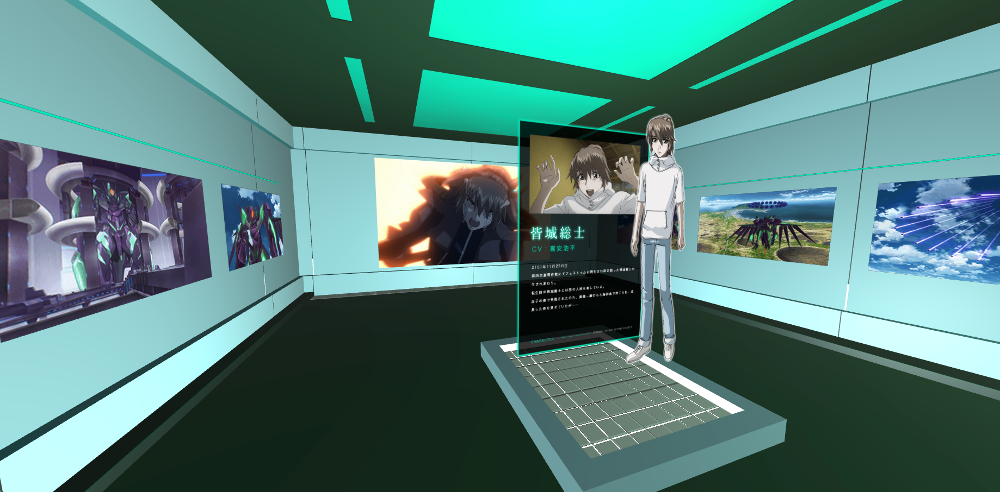
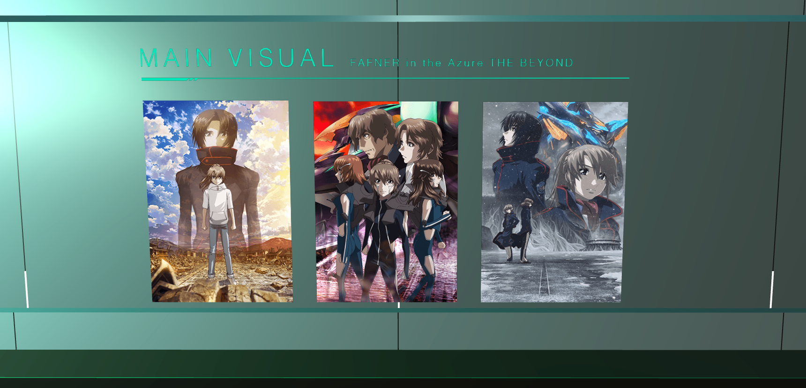
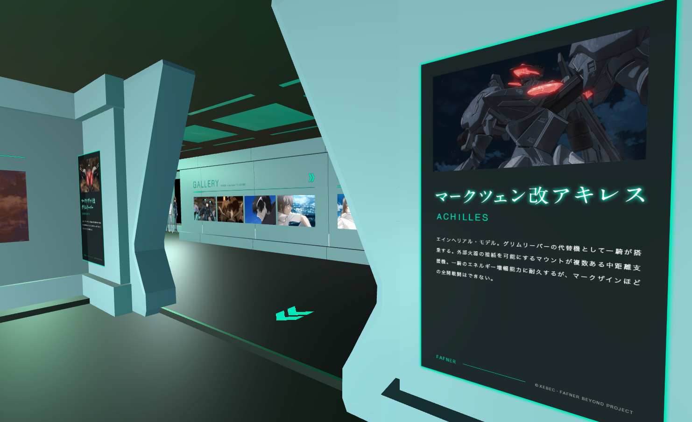
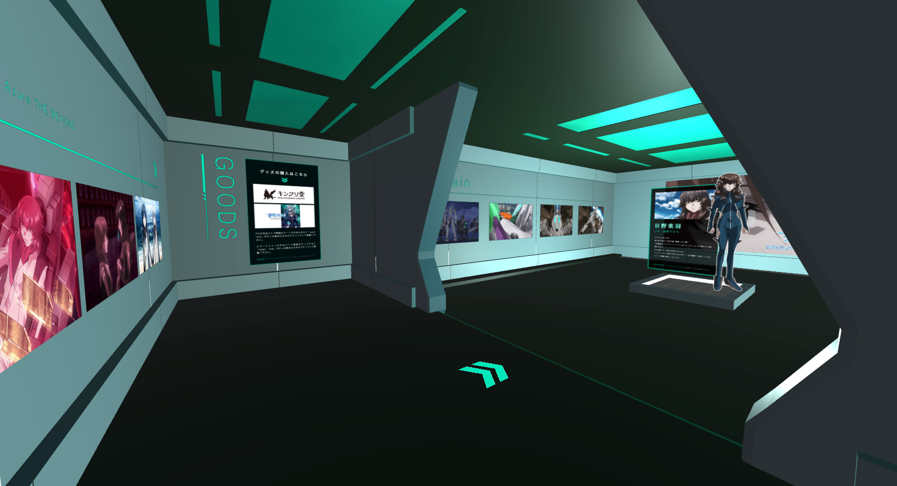
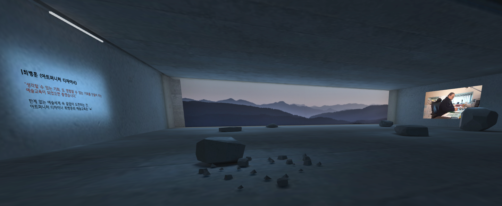
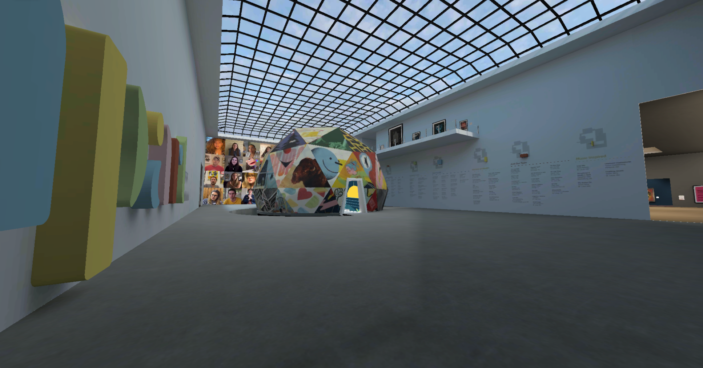
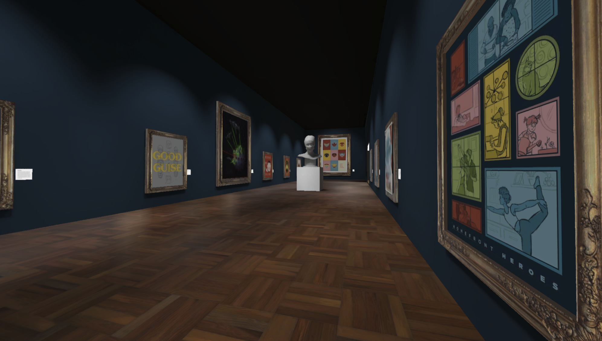

Whether you're an artist showcasing work for a global audience, amateur photographer, or a 3D modeler hosting live tours of your portfolio– Hubs is a great place to show off your art.

Galleries in Mozilla Hubs are unique because they:

- Allow artist to send links to a space accessible cross-platform without having to download any special software.
- Enable people to come together and celebrate art for live tours and opening parties.
- Are accessible 24/7 around the globe.
- Allow experienced artists and developers to customize the environment however they would like.

If you're just starting out with creating these kinds of spaces, you can check out the [Modular Art Gallery](https://hubs.mozilla.com/scenes/jOIjUE0/hubs-modular-art-gallery), a pre-built gallery you can customize in [Spoke](https://hubs.mozilla.com/spoke).

💡

For more advanced tooling to create spaces, check [here](__GHOST_URL__/hubs-friendly-tools/).

Below are some noteworthy examples of galleries and exhibitions from experienced artists, developers and designers.

## American Institute of Graphic Arts (AIGA) STL Design Show

Presented by [AIGA Saint Louis](https://stlouis.aiga.org/) and developed by [Paradowski Creative](https://paradowski.com/), the 25th annual AIGA Saint Louis Design show featured many works from the creative community.

0:00
/
1&#215;

Built on hubs-cloud, Paradowski's developers added this delightful switch to the gallery.

## Fafner Beyond Project

Impressive design and great showcase for fans of this anime built by [Gugenka](https://www.gugenka.net/). Flashing arrows guide visitors through this futuristic homage to the film.

0:00
/
1&#215;

Main Entry Hallway for Gugenka's Fafner Dead Aggressor Gallery ©XEBEC・FAFNER BEYOND PROJECT

©XEBEC・FAFNER BEYOND PROJECT

## Voice: VentaVR

Culture, art, and education stories from seven artists courtesy of the [Korea Arts and Culture Education Service](http://eng.arte.or.kr/).

0:00
/
1&#215;

Voice Gallery from VentaVR

VENTAVR

## Apart: Posters from a Social Distance

A virtual museum using art to help with processing the COVID-19 Pandemic, with 100% of the proceeds from print purchases going directly to the World Health Organization’s COVID-19 Solidarity Response Fund.

Created by [Paradowski Creative](https://paradowski.com/) back in 2020. An excellent write up on the work and the story behind the fundraiser [here](https://paradowski.com/work/apart).

Apart Poster Gallery by Paradowski Creative

## FREESTYLE:

### Architectural Adventures in Mass Media

The [Royal Institute of British Architects](https://www.architecture.com/knowledge-and-resources/) (RIBA)'s virtual reality exhibition by [Space Popular](http://www.spacepopular.com/), exploring key moments in the evolution of architectural styles over the last 500 years.

Space Popular's FREESTYLE gallery
Created or seen any inspiring galleries with Mozilla Hubs? Let us know on [Twitter](https://twitter.com/MozillaHubs) or [Discord](https://discord.gg/sBMqSjCndj).
