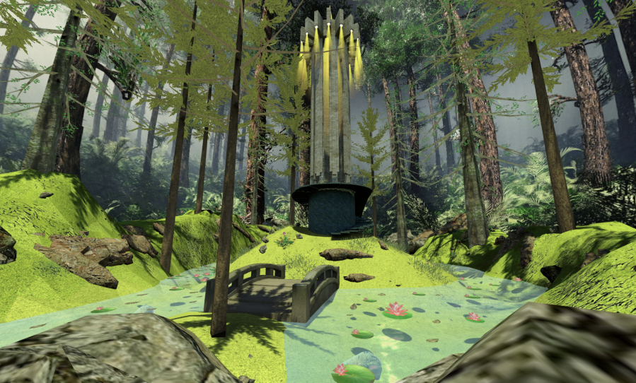
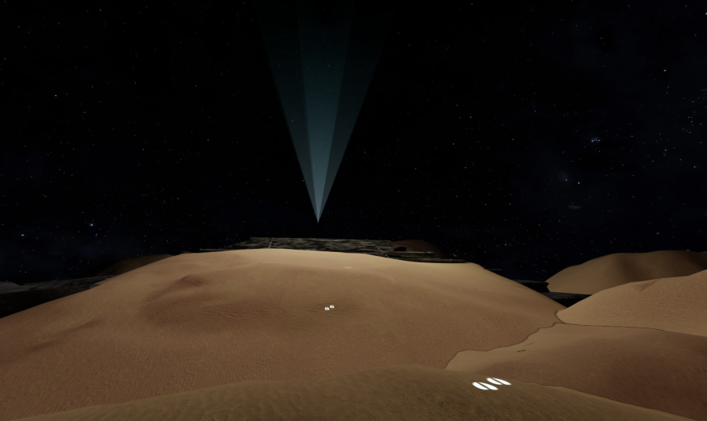
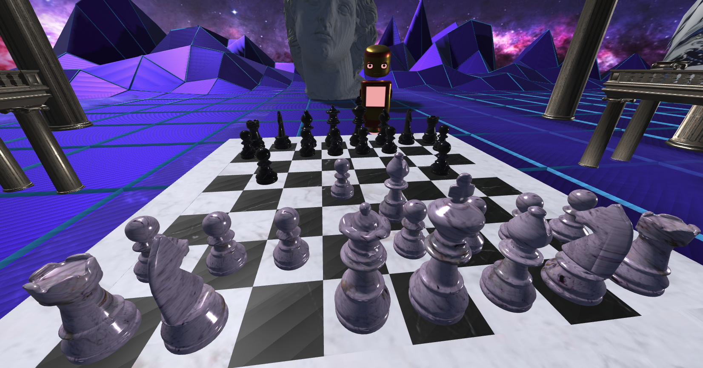
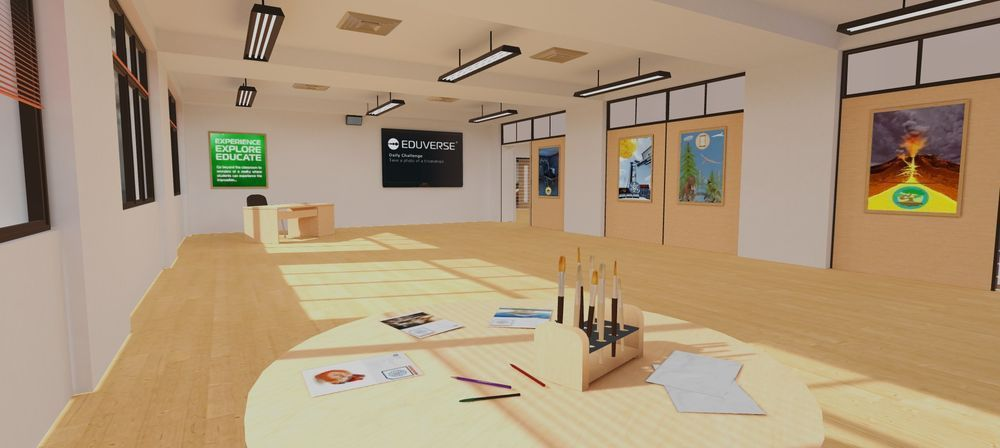
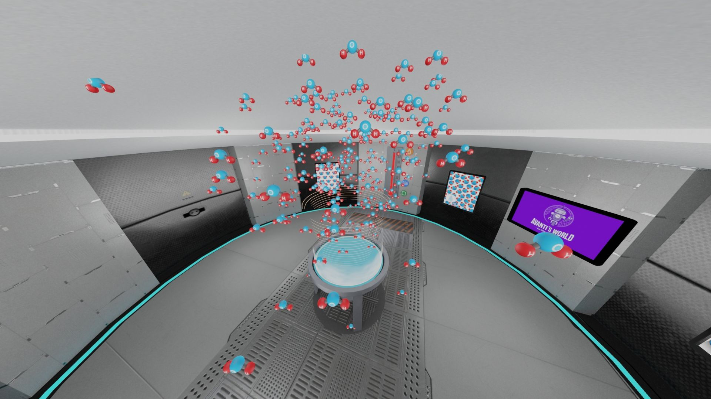

We have seen some impressive customizations of Mozilla Hubs with [Hubs Cloud](https://hubs.mozilla.com/cloud) by teams of developers and 3D artists all over the world.

Let's take a look at some examples how people have modified Hubs to fit their own design and use cases:

## Virgils

Virgils offers psychotherapy in virtual spaces. Calming yet awe-inspiring scenes and non-humanoid avatars designed to reduce self-consciousness are some of the core features of the experience.

credit: virgils

## Virtual Reign

Chess is the gymnasium of the mind and [Virtual Reign](https://hub.vreign.space/) allows you to play free live, chess matches with spectators across devices in this customized hubs-cloud by [Immers Space](https://web.immers.space/).  They even offer premium animated and variant chess sets and environments with web monetization.

https://hub.vreign.space/

## Estraad

[Estraad](https://www.estraad.com/), an immersive interaction platform, boasts a highly customized Hubs client and many extra features such as a custom UI and audio responsive name tags.

## Farvel

Founded by an undertaker and two creative technologists based in Berlin, [Farvel](https://farvel.space/en/) offers farewell rooms where mourners say goodbye to a loved one in specially designed virtual ceremonies.
farvel.space

## Gugenka Craftok

Remote digital craft fair with over 150 exhibitors. Custom features include a third person view and an internet speed health check.
"CRAFTOK" is an event hosted by [Gugenka](https://www.gugenka.net/craftok-guest), held on "DOOR™" which is offered by Japan Telegraph and Telephone Corporation(NTT)
Craftok Virtual exhibition

## Jacaranda FM Scavenger Hunt

South Africa's largest independent radio station hosted a live scavenger hunt that had folks gathering 3D objects for a cash prize while highlighting various landmarks across South Africa. Built by brand experience agency [Mannmade](https://mannmade.co.za/).

0:00
/
1&#215;

Jacaranda FM Scavenger Hunt

## imedu

[imedu.io,](imedu.io) an education tool with convenient lesson planning and organization features, lowers friction for teachers and students to make use of 3D spaces. Imedu has built-in teacher focused collaboration tooling and interactive learning-by- discovery solutions.

imedu.io features include dedicated class pages and scheduling tools, quizzes and working in web apps without leaving the space.

### TV Asahi: Shibuya Miyashita Park Powered by PARALLEL SITE

TV Asahi's art exhibition based on Virtual Miyashita Park in Shibuya.  Features jumping, custom avatar selection, scene selection, and custom reticle. Great audio touches, navigation based on player position and a snazzy animated ui. Two versions of this experience were built by [DNP](https://www.dnp.co.jp/), a browser hubs based version and one for VRChat.

### Eduverse/Avanti's World

[Eduverse](https://go.eduverse.com), from [Avantis Education](https://www.avantiseducation.com/), is an immersive virtual learning platform. The platform lets teachers and students explore 3D worlds individually or all together as a class. The first application on the Eduverse platform is [Avanti's World](https://www.avantisworld.com/), an educational VR theme park comprising of hundreds of educational spaces. Avantis uses Hubs Cloud to power it's on-demand virtual rooms.

Avantis Education

### Webspaces

When describing hubs extensibility,  [Webspaces](https://webspaces.space/introduction.html), an always-on avatar chat for 3D virtual spaces, pushes the limits. Not a hubs-cloud but a solid model of how to build off of hubs code while upholding [MPL](https://github.com/jel-app/jel-mpl).  This 'video game for work' features in-world voxel building, emoji blasters, powerful keyboard features and much [more](https://gfodor.medium.com/rebooting-the-web-in-3d-with-webspaces-9e58847e042c).  

Have you seen any other great examples of Mozilla Hubs extensibility? Let us know on [Twitter](https://twitter.com/MozillaHubs) or [Discord](https://discord.gg/sBMqSjCndj).
