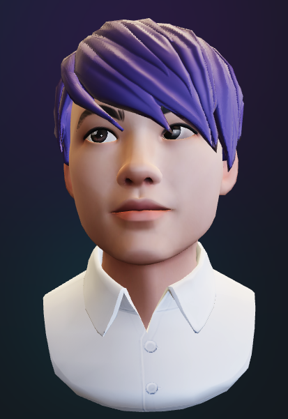

Looking to create your own custom avatar but not sure where to start? The following tools make it easy to create 3D models you can use in [Mozilla Hubs](hubs.mozilla.com).

Hubs is unique in that it lets you upload and use your own 3D assets -- but building them from scratch can be a bit challenging for new users (we'll cover this in a future Creator Labs post). The avatar makers highlighted below are helpful because they offer a range of avatars that can be personalized using easy-to-use interfaces.

To use your custom avatar, you can link to it in hubs or upload the .glb file exported from the avatar maker. You can find the specific steps to upload custom avatars here: [https://hubs.mozilla.com/docs/intro-avatars.html](https://www.google.com/url?q=https://hubs.mozilla.com/docs/intro-avatars.html&sa=D&source=docs&ust=1647546388630107&usg=AOvVaw2IQUlZYbYJoLfO-10hWJnN)

## [Hubs Hackweek Avatar Maker](https://mozilla.github.io/hackweek-avatar-maker/)

Avatars that perform very well in Hubs with customizable eyes, hair-styles, skin-tones, freckles, clothing, accessories and more.  Try it out [here](https://mozilla.github.io/hackweek-avatar-maker/).

💡

Interested in checking out the code behind the maker? Take a look at the [github repo](https://github.com/mozilla/hackweek-avatar-maker).

Mozilla Hubs HackWeek Avatar Maker

## [Rhiannan Berry Avatar Customizer](https://www.qt-mkr.com/)

Adorable avatars designed to work well with Mozilla Hubs by [Rhiannan](https://twitter.com/rhiannan_online). A lot of great customization options including the ability to upload your own logo to your avatar's top. Try it this avatar maker out [here](https://www.qt-mkr.com/).

💡

Check out the code here: [rhiannanberry/Avatar-Customizer](https://github.com/rhiannanberry/Avatar-Customizer)
Rhiannan encourages forks, adding cool stuff and sharing what you make!

## [Ready Player Me](https://readyplayer.me/)

Avatars generated from a real photo of yourself with many customization options. Ready Player Me can help you quickly generate a link to your avatar or the .glb file by following the instructions on their site. Major bonus of being cross-platform across many applications and definitely worth checking out.

❗

Hubs only supports the half-body avatars for now, so make sure you download the half-body version.

Ready Player Me
Do you know of any other quick and easy avatar makers that works well with Hubs? Let us know!

For more Mozilla Hubs updates Creator Labs content and announcements follow us on [Twitter](https://twitter.com/MozillaHubs), [LinkedIn](https://www.linkedin.com/showcase/mozilla-hubs/), or [Discord](https://discord.gg/sBMqSjCndj)
