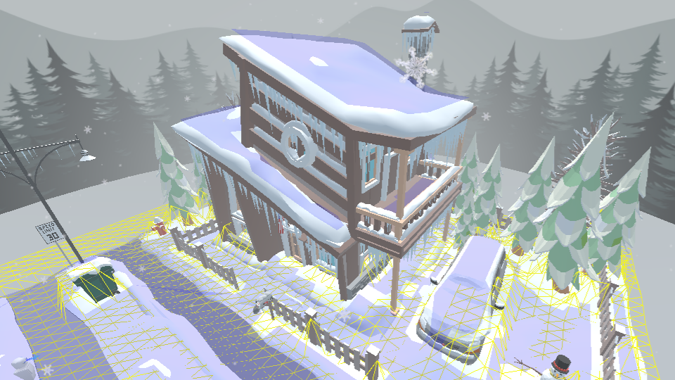

Making your scene easy to traverse is not always an easy process, especially when it contains unusual features like complicated slopes, medium-sized obstacles, and everyone’s dreaded element: stairs.

Even after adjusting all the Floor Plan settings in Spoke, it can feel like you can’t quite get it right.

0:00
/
1&#215;

Fortunately, you can't fall down in Hubs

💡

Not sure what a 'nav mesh' is or how it works? [Check out this article](what-is-a-nav-mesh) then come back here when you're ready.

In many cases, using Spoke’s built-in Floor Plan can yield pretty good results. But it is known for stumbling a bit when it encounters irregularities like gaps in the ground surfaces, separation between meshes, or areas that are particularly narrow. In some of the worst cases, the Floor Plan ends up producing _too much_ walkable area. In other words, you end up being able to traverse areas that you never intended, like the tops of trees or the background sky itself.
You might not want visitors to walk around on the roof or the car
This is usually a good time to take a step back to consider making your own custom nav mesh. Rather than trying to fight with an auto-generated floor plan through trial and error, creating your own nav mesh can take considerably less time with a little bit of understanding.

For this example, I’ve downloaded a model from [Sketchfab](https://sketchfab.com) that might be typical of one you might try to make into a Hubs scene.

[ Japanese Bridge Garden ](https://sketchfab.com/3d-models/japanese-bridge-garden-d122e17593eb4012913cde927486d15a?utm_medium=embed&utm_campaign=share-popup&utm_content=d122e17593eb4012913cde927486d15a) by [ kristenlee ](https://sketchfab.com/kristenlee?utm_medium=embed&utm_campaign=share-popup&utm_content=d122e17593eb4012913cde927486d15a) on [Sketchfab](https://sketchfab.com?utm_medium=embed&utm_campaign=share-popup&utm_content=d122e17593eb4012913cde927486d15a)

### Recognizing problem areas

Just looking at it, I can already tell what might go wrong with auto-generated nav mesh. The stylized trees, which are made with big blobby shapes, are likely to confuse the algorithm it uses to determine what can be walked upon. Unless you want users to teleport up onto the tree canopy, that’s going to be a problem.

Second, by looking at the way the ground was constructed, I can see that it was made with multiple separate pieces– the main ground, the bed of the pond, and the water surface are all individual meshes that are not connected to each other.

0:00
/
1&#215;

Selecting different parts of the floor mesh in a 3d application (Blender)
Even worse for the auto-generation would be the big slab underneath the ground. It helps to make the model look like a diorama, but it might automatically get its own nav mesh that would confuse Hubs’s teleportation mechanic. If you’ve ever found yourself halfway inside the floor of a scene, this kind of situation is often the culprit.

As I mentioned before, this is a notoriously problematic situation where you may end up with gaps you can only cross by teleporting. Not exactly the smooth, calming effect I want to give visitors to my Hubs room if they’re feeling like they’re hitting invisible walls as they move around.

Last, we may want to think about how the tree trunks and low rocks are handled. Should they act as obstacles or should visitors be able to walk through them? Every situation is different, so we may have to try out a couple different ways. The nice thing about making our own nav mesh is we have full control over these things since we’ll be making the paths exactly how we want.

### Getting Started

A good place to start is adding a single plane across the whole ground. This doesn’t need to be placed exactly on the visual ground–in fact, it helps to see it better if it’s resting just above the ground. We can always move it back down later once we figure out how it will all work. Just make sure it's not too far off the ground, otherwise your visitors will all appear much higher above the floor than you may want.

💡

The only thing this plane needs to work as a nav mesh is the **Nav Mesh** component from the [Hubs Blender Exporter](https://github.com/MozillaReality/hubs-blender-exporter) add-on for Blender. The **Visible** component is needed so that it doesn’t draw in Hubs, although this can be used as a handy way to debug the mesh while you’re testing. Note: If you’re only planning to export this mesh to use within Spoke, you don’t need to add any components here. Instead, you'll choose the _'Custom'_ option from Spoke's Floor Plan element.

0:00
/
1&#215;

Demonstration of applying the Nav Mesh and VIsible components in Blender
The result of a single plane across the whole scene is about what you’d expect. You can walk everywhere, but you kind of feel like a ghost. You are bound to the world but you simply pass through everything.

0:00
/
1&#215;

Navigating a basic plane of nav mesh in Hubs can make you feel like a ghost

### Some basic but essential mesh editing

The biggest issue is that you cannot walk up on the bridge. We’re going to need to start editing our plane to give us a more complex surface to walk on.

This can be done in any 3d software package, as long as it allows you a way to export or otherwise convert your mesh into the .glb file format.

For demonstration purposes, I’m using Blender’s various mesh editing operations such as _Subdivide_, _Loop Cut & Slide_, and the _Knife_ tool. I highly recommend reading [Blender’s documentation](https://docs.blender.org/manual/en/dev/modeling/meshes/tools/index.html#types) or following some simple [modeling tutorials](https://www.youtube.com/watch?v=jnj2BL4chaQ&list=PLn3ukorJv4vuU3ILv3g3xnUyEGOQR-D8J) to learn more. Since this isn’t strictly a modeling tutorial, I will show more of an overview instead of a step-by-step explanation of specific tools.

0:00
/
1&#215;

Adding loop cuts across the nav mesh plane

0:00
/
1&#215;

Blender's Knife tool lets you cut around things so you can delete unwanted faces
If we remove the face that’s under the bridge, we will no longer be able to walk right through it. That may be fine for trees and boulders, but this also means we won’t be able to walk up onto the bridge itself, which is not what we want.

The face removed from under the bridge means you cannot walk there in Hubs

### Bridging the gap

This is where things get a little trickier. You might be thinking, “_Can’t I just make a simple curved pathway and stick it onto the bridge?_”, and the answer would be ‘_Yes_… _sort of_.’
If we make a separate piece for the bridge, it will indeed be traversable. However, it will not be connected to the rest of the nav mesh. This means you would be required to teleport from the ground onto the bridge and vice versa. Not exactly a smooth experience for your visitors.

If you want **continuous movement**, you must have a **_contiguous_ nav mesh**.

There are many ways to do this part: Extruding edges, connecting separate pieces and welding the vertices, etc. etc. This will vary depending on what software you prefer.

To achieve this in Blender, I’m going to use a handy feature called ‘_Bridge Edge Loops_’. It has some really nice options for adding more segments. This could also be done afterward, but I like to save myself clicks.

Using the bridge as a guide, I raise up the edges to match the walkway. It doesn’t need to be perfect, but you may choose to add more segments depending on how complex your walkable area is.

💡

_Note: In order to have the bridged mesh remain disconnected along the edges, I first extruded the two sides a tiny bit first._

0:00
/
1&#215;

Bridge Edge Loops is often easier than extruding faces and welding vertices
In case you’re wondering, this is exactly the same way to do stairs. It’s often easier to bridge existing platforms together:

0:00
/
1&#215;

Bridge Edge Loops works great for stairs. A ramp is all you need for traversal.
For the other parts of the scene, you’ll have to make some decisions about where you want your visitors to be able to traverse. I could make the pond deeper by pushing parts of the ground down into it, but rather than having people wade, I’ve decided it might be best to simply block visitors from entering the water at all. For this, I’ll use Blender’s Knife tool to cut edges around the outside of the pond, then delete the face(s).

0:00
/
1&#215;

Using Blender's Knife Tool to cut out around the pond
The rest of the trees and rocks can be done using the same tools. You may find that thinner things are better left alone. If you’ve ever played a video game where you could collide with skinny poles or other items, you may have a good sense of what’s annoying to run into versus pass through.
Here’s what my nav mesh looks like after cutting out holes for trees and rocks.

0:00
/
1&#215;

A look at the finished custom nav mesh
And here’s what it feels like to move around the space in Hubs now that it’s all done:

0:00
/
1&#215;

A custom nav mesh means Hubs visitors can now move around how they might expect

### Final Thoughts

Remember that your scene may have more than one visitor at a time. That little walkway might feel good when you’re alone, but can it accommodate a crowd? Does it feel awkward to pass through a narrow doorway? You may need to ‘trim back’ some of your nav mesh away from walls or other obstacles to keep the camera from clipping through. If you ever find yourself hitting what feels like an invisible wall when you shouldn’t be, it’s likely that your nav mesh has a gap or unwelded (detached) vertices that are actually causing some faces to be disconnected from adjacent faces.

0:00
/
1&#215;

Even one detached vertex can make your nav mesh non-contiguous and difficult to traverse
There’s no substitute for proper testing and iterating to get the best results. But remember, all you need to do is send a friend a link to your Hubs room to get some much needed feedback. You could even have them use the Pen tool to mark problem areas. You might even invent some new ways to collaborate in the process.

Happy traversing!

0:00
/
1&#215;

Joanna Rohrback knows what fun traversal should feel like
