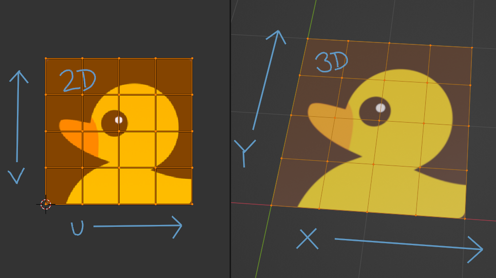
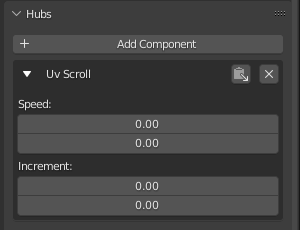
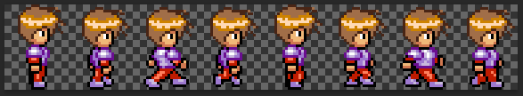

Have you ever wanted to make your textures move across a model? Maybe you wanted some scrolling text? Or maybe you saw some kind of flowing water effect in someone’s Hubs scene and wondered what sorcery made that happen. These sorts of effects are common in video games and we’re going to explain them here. Once you understand how they work, you can come up with all kinds of clever uses in Hubs–you may even invent your own.

We will mostly be focusing on one of the components that is part of the [Hubs Blender Exporter](https://hubs.mozilla.com/docs/creators-using-the-blender-gltf-exporter.html) called **UV Scroll**. The UV Scroll component is actually quite simple, as it only has a few parameters to adjust. But to understand what those parameters do, it’s important to first understand exactly what UV space is.

### UV Space: a quick explanation

In order for a 3d model to display a texture on its surface, it must contain information about *how *that texture should be wrapped around the model. There are lots of analogies for how UV space relates to a 3d model, but the one most people are familiar with is wrapped chocolates:
Once you understand UVs, you'll never see candy wrappers the same way again.
This image had to be drawn and printed this way in order to wrap around the chocolate and look like Santa. Notice how big the white top of his hat appears in the image versus how it looks on the 3d chocolate. The distortions that can occur here are very similar to how various maps of the earth need to be distorted when they are projected in only two dimensions.

There are names for these 2-dimensional coordinates: **_UV coordinates_** or just **_UVs._**

We can think of the horizontal direction as the U-direction while the vertical axis is the V-direction. Why U and V? Well, X and Y were already being used to describe the 3d space.
U & V in 2d space are direct relatives of X & Y from 3d space

💡

"_Then what about Z_", you (maybe) ask? Well, actually, textures _can_ have depth in some cases like procedural noise and wood grain, for example. But then we refer to the texture’s depth axis as…you guessed it: W (because Z was already taken)

So there’s UVW and XYZ.
But for this tutorial, all we care about is the U (horizontal) and V (vertical) directions of a 2-dimensional texture and how that relates to the 3-dimensional model.

In a 3d application like Blender, we can see the relationship of the 3d model to its 2d texture. It’s not always immediately obvious how a particular model was unwrapped, so sometimes checker patterns are used to understand them better:

0:00
/
1&#215;

Selecting faces of a 3d model shows the corresponding 2d selection in UV space
If we were to move around these ‘UV coordinates’ in a 2d view, we would see that movement reflected on the 3d model. In real life, this would be like sliding the Santa picture around the chocolate while it was still wrapped.

0:00
/
1&#215;

Sliding the 2d UVs around affects the texture of the 3d model
In a nutshell, that’s what the uv-scroll component does: it offsets the texture horizontally, vertically, or both (diagonally), depending on how you set it.

Let’s take a look at the **UV Scroll\*\***component**:
The UV Scroll component as seen in Blender
Both U and V have a ‘speed’ value. Zero means don’t scroll at all. The speed value is \***how much to offset the U or V space in 1 second\*\*\*. So, as you might expect, setting the speed to ‘1’ is pretty fast:

Here, the U speed is set to ‘1’. You see the whole texture go by in 1 second.

0:00
/
1&#215;

UV Scroll with U-Speed set to 1
So if we want it to go slower, we need to bring the speed down quite a bit. Let’s try it at one tenth the speed by setting the U speed to ‘0.1’:

0:00
/
1&#215;

UV Scroll with U-Speed set to 0.1
Jumping ahead, you can see what happens if you also set the V speed, except here we have it set to 0.2–double the U speed. The result is the texture scrolls vertically twice as fast as it scrolls horizontally._ And yes, you can use negative numbers to scroll the opposite direction(s)._

💡

Worth noting that 'horizontal' and 'vertical' direction is relative to how the UV space is laid out. In other words, "sideways" might look "up and down" on your own model depending on its setup. Just like how my cube being laid out in a cross shape makes the sides behave differently from the top and bottom.

0:00
/
1&#215;

UV Scroll with U-Speed at 0.1 & V-Speed at 0.2

### Multi-frame animation

Moving on to the other parameters called ‘Increment’, things get a little more interesting.
The ‘increment’ values work alongside the ‘Speed’ values to make the texture slide in larger steps than the default 1 pixel at a time.

A common usage is to create a sort of ‘flipbook’ effect using an image made up of smaller images.

You can find images like this by searching for terms like ‘flipbook animation sprite sheet’.
Here’s one such image:

Image licensed under CC-BY 4.0 by https://opengameart.org/users/arikel
The key is finding (or creating) sprite sheets where the image is divided into equally-sized pictures. Since the ‘Increment’ value is constant, this is key. If you don’t quite understand yet, keep reading…

In order to make this work, you’ll have to adjust your object’s UV coordinates so that it is displaying exactly 1 part of the flipbook image.
You can do this by eyeballing it, but since UV space is always defined as going from 0 to 1 in each direction (U & V), you can do a little simple math to figure out how to adjust the coordinates.

In Blender, I’m scaling the UVs around the 2d cursor in the UV Editor window. Since the image is made up of 8 parts, I simply divide 1 (the whole) by 8 (images) to get 0.125

That’s exactly how much I need to scale the UV coordinates in the U direction to fit one part onto a square plane.

💡

_Note how I type in ‘0.125’ after using the scale on X (s, x, 0.125)_

0:00
/
1&#215;

Scaling the 2d UV coordinates to put 1 frame of the image onto the plane
Good news! We already did the math to get 0.125, which is exactly the same value needed for the ‘Increment’ parameter. Since this sprite sheet is only laid out horizontally, we only need to change the first (U) increment value.
Setting the Speed is independent. Higher Speed means flipping through the images faster.
Here, I’ve set the U Speed to 0.5, which seems pretty good for a relatively choppy, 8-frame animation.

💡

_Note: Blender tends to cut off displaying extra digits after decimal points, so I grabbed a screenshot of the parameters while it was highlighted. Rest assured, it may look like 0.12 when in fact, it is exporting a value of 0.125._

0:00
/
1&#215;

Our walking sprite with a speed of 0.5

### What about those 'V' parameters?

Now, not every sprite sheet is laid out horizontally. Some have so many frames that they are organized into rows _and_ columns.

A handy way to get your mesh to display the texture at the correct size and aspect ratio is to apply the texture to the model, **then** split the model into even areas based on the whole texture. Then you can delete the unwanted faces and work from there. This clip will explain it far better than a paragraph. Here, I’m using Blender’s _Loop Cut & Slide_ tool, then selecting and deleting unwanted faces of the model, leaving a single panel displaying one frame of the sprite sheet.

0:00
/
1&#215;

It's often easier to apply the whole texture first, then split up the mesh to get the size correct
This is where the second ‘Increment’ (or Y Increment) comes into play. You need to do the same math to tell the component how fast to step through the sheet in the vertical direction.

In my case, the texture has four rows and two columns.

So the **X Increment** would be set to (whole sheet divided by 2 columns) **0.5**.
The **Y Increment** would be set to (whole sheet divided by 4 rows) **0.25**.

Now, when you have rows _and_ columns in your sprite sheet, the Speed values might not be immediately obvious. Think of it this way: As we move frame by frame through this particular sprite sheet, we must change columns more frequently than we change rows. This is another issue of ratios. With the ‘running cat’ animation, we must change columns four times as often as we change rows. So we can set the Speed to anything we want, as long as the ratio between U-speed and V-speed is 4:1. If the U-speed is set to 1, for example, then the V-speed must be set to ¼ that speed–or 0.25.

0:00
/
1&#215;

Running cat flipbook. Increment values look good, but the speed is too slow
The timing looks right frame to frame, but it’s definitely too slow since we can easily discern the individual frames. Let’s try speeding it up 5 times as fast– just remember, you have to set the V-speed to be one quarter of the U-speed. So a U-speed of 5 means a V-speed of 1.25.

0:00
/
1&#215;

A faster Speed looks much smoother– just remember to set both the U & V speed to the right ratio
If you ever notice your animation playing back strangely, like going back to the start too early, or appearing to play frames in the wrong order, you have set your UV Scroll parameters incorrectly. Take your time and recount your frames. It's probably an easy fix.

Stay tuned for the [next part](__GHOST_URL__/animating-textures-using-the-uv-scroll-component-part-2) of this tutorial series, where we’ll go over some more specific examples of UV Scroll.

0:00
/
1&#215;

UV Scroll was used to make one of my favorite avatars. She applauds you for making it through part 1 of this series...and wants to sell you a used car for some reason.
