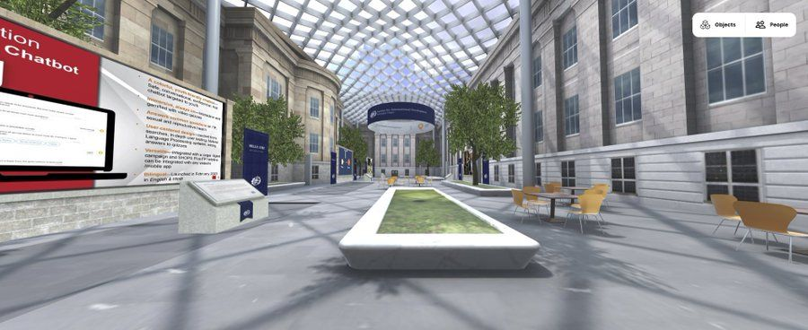
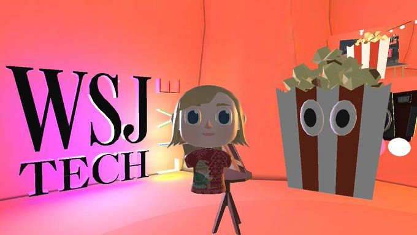
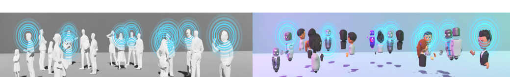
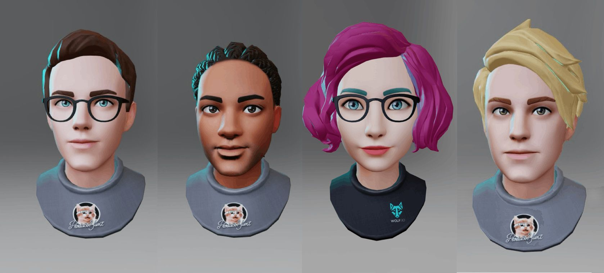

Creative, innovative and memorable virtual event experiences are difficult to create in a 2D world. These experiences are flat, and limit creativity to a filter or a digitally generated branded background. 3D social spaces, like **[Mozilla Hubs](http://hubs.mozilla.com)**, on the other hand can create not only a more interactive, social experience, but a more memorable experience for guests as well.

If you are tired of video-chat happy hours or your branded events need a boost, try **[Mozilla Hubs](http://hubs.mozilla.com)**. No fancy virtual reality headset needed, Hubs works well on any desktop or mobile device and is easily accessed from one click of a Hubs link.

We’ve seen some pretty incredible and innovative uses of Mozilla Hubs, and we are excited to share them with you.
[Smithsonian National Portrait Gallery Atrium Recreation](https://mobile.twitter.com/techchange/status/1396521987577679880) in Hubs via [TechChange](https://www.techchange.org/)
**Mozilla Hubs **is a virtual playground of the imagination for event hosts, you can create a “digital twin” of your real life venue in Hubs. Through the use of our **[Spoke](https://hubs.mozilla.com/spoke)** creator and digital scans ([photogrammetry](https://en.wikipedia.org/wiki/Photogrammetry)) of your venue you can create a near replica virtually of any building. Extend your reach geographically for people who can’t attend but still will get a feel of what it is like to be there (not to mention with less jet lag and a better carbon footprint!)
Tour of Wall Street Journal's Tech Live After-party in Hubs
**Looking for a way to create a unique, fun and memorable after party experience?\*\***[Wall Street Journal](https://www.wsj.com/)** did just this during their [**WSJ\***\*Tech Live**](https://techlive.wsj.com/)conference in 2020. They designed a [WSJ branded Hubs room](https://www.youtube.com/watch?v=Q4jWzdk1d8I) for their attendees. The [VIP party had just the right atmosphere](https://twitter.com/RogerWallstreet/status/1355145830580310017?s=20&t=HF_WwmZuGr4Bn1JrVJYGJw) you would expect for a party of this sort, a moonlit tropical luau at night themed event on a private island.

The event was hosted and created by Roger Kenny, Innovation and Tech Lead at WSJ and other employees who acted as greeters upon entrance into the virtual Hubs space, where they took you on a tour of the virtual island (but not before grabbing your first virtual cocktail) and featured interactive games such as tossing WSJ newspapers off a couch in space, that you had to flyup to find.

💡

Press "G" on your keyboard to fly in Hubs

Wall Street Journal Tech Live After Party in Hubs
Personally, I'll never forget sitting on a couch in space with co-workers and tossing newspapers through a hoop. People were joyfully taking selfies with other attendees to share their experience in Hubs. I found a few folks had found the secret bar as well and were well into their own conversations about the conference. **Giving event attendees activities and room for exploration, discovery, connection and socialization is key.**

Through the use of **spatial audio** in Hubs you can create a party or networking event like atmosphere, unlike many virtual event platforms where you can only speak one at a time. This type of socialization limits the true magic of networking during an event, those cherished hallway conversations where you overhear a topic or bump into someone you know and want to have a more private 1:1 conversation. In Hubs with spatial audio, voices get louder when you get closer to another attendee and quieter when you move away from them. Just like real life, you can enter a room, hear multiple conversations and choose which one to join.
**[Ready Player Me](http://readyplayer.me)** Avatars
You’ll never have nothing to wear to an event, avatars allow for freedom of expression and individuality. [Avatar creators that are easily uploaded into Hubs ](https://blog.readyplayer.me/we-added-personal-avatars-to-mozilla-hubs-and-this-is-what-happened/)like**[Ready Player Me](https://readyplayer.me/)**allow people to have almost an endless selection of who or what they want to be in a virtual space. No more rushing around to get those wrinkles out of your pants and forgetting your event badge in the hotel room.

💡

Press "I" on your keyboard to view your avatar in Hubs

We’ve also seen quite a few ways that brands, athletes, artists and musicians (and everyone in between!) are using Hubs to create interactive fan experiences to take an innovative and more intimate approach beyond just a chat box in a live stream with their fans and press.
Saint Motel Fan Meet and Greet in The New World
The band **[Saint Motel](http://saintmotel.com)** were presented at the beginning of 2020 with an interesting challenge; they had a new album launching but didn’t want to have a normal album launch party in our new fast changing world of virtual events. They decided to create [“The New World”](https://www.saintmotel.com/newworld) inside Hubs for their fans to experience the album via a highly detailed representation of their cover artwork from their album. Each “motel room” in the Hubs space was created and customized to reflect the mood and themes from each one of the songs on the album. Fans could enter the Hubs space whenever they wanted through a private link to experience the room on their own or at scheduled times to have meet and greet or question and answer times with the band members personally.
[Kruder and Dorfmeister Virtual Album Launch](https://electronicgroove.com/kruder-dorfmeister-premiere-new-album-1995-with-immersive-virtual-party/) in Hubs
Trip-hop DJ’s **[Kruder and Dorfmeister](https://kruderdorfmeister.com/)**also [created an atmospheric and interactive fan space for their fans](https://electronicgroove.com/kruder-dorfmeister-premiere-new-album-1995-with-immersive-virtual-party/) around the launch of their “1995” album. Hubs really allows artists especially to extend their artistic vision beyond the physical and move into new mediums and realities. We’ve seen a wide range of branded fan experiences in Hubs from anywhere to **[Baseball Hall of Fame Experiences](https://www.mlb.com/press-release/press-release-twins-xr-a-virtual-hall-of-fame-experience)**, [**Pre-Boxing Match Meet and Greets**](https://finance.yahoo.com/news/khabib-vs-holloway-first-ever-164800825.html)to virtual press Q&A rooms. Hubs is great for smaller, more intimate fan experiences or VIP experiences.
[Khabib vs. Holloway Fan Q&A in Mozilla Hubs](https://finance.yahoo.com/news/khabib-vs-holloway-first-ever-164800825.html)
Make more of a memorable experience sharing a customized virtual space with your fans, attendees or customers. No more crowded venues or questionable snacks from green rooms!
