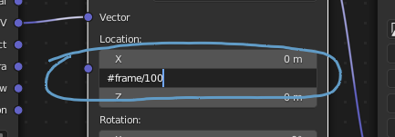
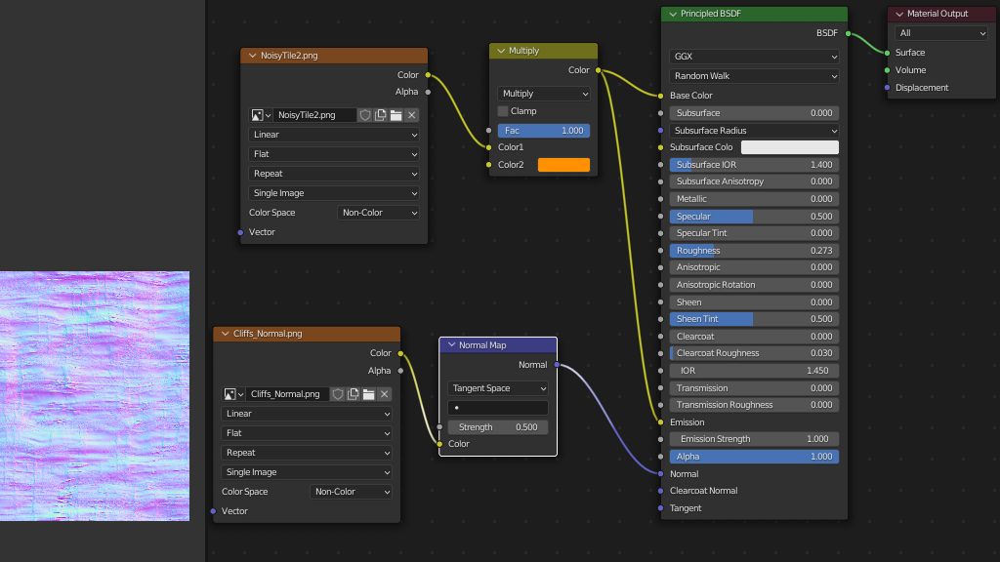

After reading [Part 1](__GHOST_URL__/animating-textures-with-the-uv-scroll-component-pt1/), you should now have a solid understanding of how UV space relates to a model in 3d space. We also covered how to do some basic texture scrolling as well as how to use textures as a sort of animated flip book where you see parts of the texture frame-by-frame.

Starting here in Part 2, we'll be taking a look at some practical applications. Some of these might seem more obvious than others, but within each example you’re sure to learn some techniques that you could use to enhance your Hubs scenes.

### The Floor is Lava

I was going to use water for this example, but lava is so much…  hotter. Regardless, you can apply this same idea for water by adjusting your materials for whatever look you want.

I don’t want to spend too much time going over the material itself, but it’s worth taking a moment to talk about tiling textures. Any texture we’re using for UV scrolling is going to wrap back around upon itself so the edges of the texture really matter. When setting up noisy looking textures for water or other organic surfaces, you’ll want to make sure those textures are **seamless. **In other words, if you were to lay that texture out as individual tiles next to each other, you want the seams between those tiles to be as invisible as possible.

0:00
/
1&#215;

Sometimes even procedural noise doesn’t tile properly, depending on how it was generated.
There are lots of tutorials on the web explaining ‘how to make seamless textures’, so I’ll keep this part simple. By using [Photoshop](https://www.adobe.com/products/photoshop.html)’s classic filters called ‘_Clouds_’ and ‘_Difference Clouds_’, you can get automatic tiling textures since both those filters generate seamless noise.

0:00
/
1&#215;

Good old Photoshop. Making seamless noise before it was cool.
By playing around with contrast and other adjustments, you can further enhance the look. Here, I adjusted the ‘Levels’ to increase contrast, and tried out the ‘Solarize’ filter to get rid of some of the brightest solid areas. Feel free to use whatever tools you want, but be careful with blurs or other filters that might cause you to inadvertently create seams. Otherwise you will have missed the whole point of this step! Here is my final **seamless **noise texture:

💡

Note: This texture is only 256 x 256 pixels. Because it will be tiled over larger areas, there's no need for a large, expensive texture.

Nothing too fancy, but a useful texture for all kinds of materials. Most importantly: It’s seamless!

0:00
/
1&#215;

Now that's more like it! A seamless noise textures produces a much better result when tiled across a surface.

### UVs now or later?

Now that we’ve got a nice seamless noise texture, we can talk about our lava flow. Remember from [Part 1](animating-textures-with-the-uv-scroll-component-pt1) how important it was that the texture flows in the correct direction? Well it’s also really important here so I’ll show a couple tips to make things easier.

Sometimes it’s easier to get the texture applied and adjust the UVs _first_ before modeling the rest of the object. This creates a basis for how the UVs are laid out so that any further additions or adjustments to the model become simpler as the new edges and faces generate UVs that are already in line with the existing ones. For example, slicing up a plane that already has UVs simply inserts new UV coordinates within the ones from the original plane. Wait...what? Illustration time:

0:00
/
1&#215;

Inserting edge loops on a mesh with existing UVs inserts new UVs in the right place.
You can also take advantage of most 3d software’s ability to edit the mesh **_with or without affecting the UVs. _**This ability varies from app to app, but in Blender for example, you can use the feature called ‘Correct Face Attributes’. When toggled, any edits to the 3d mesh will cause the corresponding UV coordinates to accommodate the change in topology. This is perfect for our use-case because we actually _do_ want the lava texture to stretch as it slides around bends. But while we’re modeling, we may want to toggle that behavior on and off so we don’t totally screw up the UVs.

0:00
/
1&#215;

Toggling ‘Correct Face Attributes’ shows how the UV coordinates are affected or not.
So we can freely scale the faces and vertices without altering the UVs, THEN we’re able to toggle that behavior off so the texture gets pulled around when we want it to.

0:00
/
1&#215;

Toggling 'Correct Face Attributes' in Blender changes the UV coordinate behavior while editing.
The same goes for other operations like ‘Extrude’ or ‘Bevel’...

💡

Note: For demonstration purposes, I increased the contrast of the noise texture in some examples.

0:00
/
1&#215;

Extruding faces with and without ‘Correct Face Attributes’ toggled.

### Scroll while modeling

While you’re shaping your mesh to match the terrain or otherwise flow around the scene, it sure would be useful to be able to see the movement _before_ exporting to Hubs. In your 3d application, there is likely a way to animate the UVs–not necessarily for exporting, but rather to visualize what’s going on.

In Blender, this can be done by adding some nodes to your shader graph– a ‘Texture Coordinate’ node and a ‘Mapping’ node–hooked up to your scrolling texture image.
'Texture Coordinate' & 'Mapping' nodes in Blender's Shader Editor. Those X & Y Locations are useful here.
Those two parameters in the ‘Mapping’ node, X & Y Location, can be used to slide the UV coordinates around. You could set animation keyframes on them, but it’s much easier to use a handy feature called ‘drivers’ to do this more or less automatically.

In our case, we need to play with the ‘Y Location’ value. You can highlight that field and type the following in it, followed by the ‘enter’ or ‘return’ key:

`#frame`
Typing `#frame` into a field adds a driver that changes the value each frame during playback.
That makes it turn purple, indicating that it is now controlled by what frame you’re on. However, that means it will go from 0 to 1, then 1 to 2, etc.. For UVs, we already learned that UV space is measured from 0 to 1. So we won’t actually see any changes since the texture will appear to slide one whole cycle each frame.
Instead, we need to slow it down by quite a bit. To do this, we need to type it again but this time it should read:

`#frame/100`
Dividing by 100 reduces the amount the texture slides each frame.
Now the texture is being told to slide 1/100th of its total size each frame.

💡

If your texture is scrolling the wrong direction, you can switch it by typing: `#-frame/100`
That little ‘minus’ before the expression tells it to move in the negative direction.

0:00
/
1&#215;

Previewing the scrolling texture makes editing a breeze.
This will allow you to make adjustments to the mesh and UVs while getting immediate feedback on how it’s flowing. It’s worth noting, once again, the relationship between the mesh and the UV coordinates. The less space a face takes up in UV space, the faster the texture scrolls past it. So if you want faster vertical drops in your flow, shrink down those UV distances.

0:00
/
1&#215;

The amount of coverage in UV space is inversely proportional to how fast the texture slides across each face.

### Wave hello

That reminds me– One of the simplest tricks to do with your UVs is to make them a little ‘wavy’. All we need to do is to add some more cuts across the mesh, then move those around in UV space a little bit. The result? Instant ‘waviness’:

0:00
/
1&#215;

Inserting some cuts in the 3d mesh gives you UVs to nudge around for ‘waviness’.
Using techniques like this, you’ll start to understand how you can make it look like the texture is flowing ‘around’ obstacles, or even splitting into multiple flows.

The last thing I need to make it actually look like lava is to adjust the material. Rather than go through each node in the graph, here’s a screenshot of my finished lava shader that is ready to be exported to glTF.
Added a MixRGB node set to ‘Multiply’ with an orange color. This is also plugged into the Emission channel so it appears more ‘lit up’ in Hubs. I added a normal map for some bumpy detail.

💡

Note: Once you're ready for export, you can disconnect or otherwise delete the #frame expression, or even just delete the nodes to the left of your image texture altogether.

Of course, don't forget to add the most important thing: the UV Scroll Component.

I set my U-Speed to 0.1. (Well, actually -0.1 so it flowed the right way.) After exporting as a .glb and bringing it into Hubs, we can finally see it flowing in all its hotness.

0:00
/
1&#215;

Final Lava in Hubs. Insert 'Lava' pun of your choice here. I'll go with 'I lava good scrolling texture'.
In the [final part](__GHOST_URL__/animating-textures-using-the-uv-scroll-component-part-3/) of this series, we'll go over some atypical uses for UV Scroll that might surprise you...
