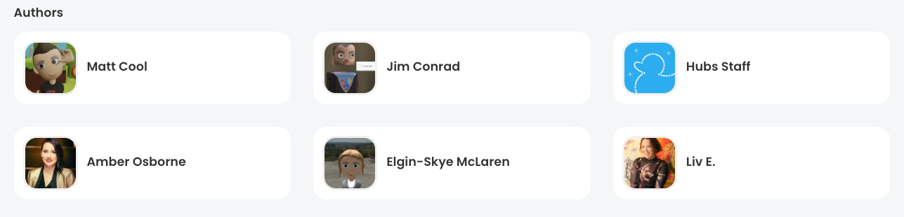
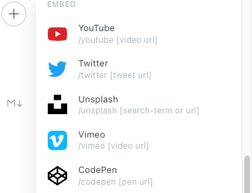

Would you like to become a contributor to Creator Labs? Maybe you have some helpful tips for the blender exporter, scene design best practices, or a useful how-to article. We can all grow faster when we collaborate and share our knowledge, so thank you for your interest in contributing!

We use an open submissions process to keep things as transparent and public as possible and avoid duplicate work. Check out the current proposals in the [discord](https://discord.gg/sBMqSjCndj) #creator-labs channel.

**Before you do any writing**, propose an article here:

[Propose Article](https://forms.gle/EgEnZhG3ucxbpkN5A)

Once your proposal has been submitted, we will aim to send you an approval or a rejection within one week. Proposals that are incomplete will be have to be resubmitted. For a successful proposal, please answer the questions on the form.

If approved, you will be invited to Creator Labs via email where you can set up your author profile and begin your draft post directly on the creator labs site. We will coordinate feedback and updates via a [discord](https://discord.gg/sBMqSjCndj) thread in #creator-labs.

We welcome contributors to include links to their socials, personal portfolios/websites on their author profile page.
Join us by contributing to Labs
Once you have completed your draft, let the team know and it will be reviewed by the Hubs team. We will endeavor to review it within 2 weeks from the draft completion date.  The draft may or may not require revisions.

The Hubs team will make the decision to deny and accept proposals. If your proposal and draft are accepted and published, you are under no obligation to actively update or maintain articles. The Hubs team might un-publish posts to keep content as accurate and timely as possible.

If at any point your proposal is rejected, we hope you will try again! The Hub's team may not be able to provide you with detailed feedback but we encourage multiple proposals.

You are welcome to use the content you write on Creator Labs on other platforms. We ask that  you include a courtesy link back to your Creator Labs article if you do so.

---

## Creator Labs Style Guide

### Components

There are several useful components we use when writing posts we would like to encourage you all to use freely as you see fit.  You can use the built in components inside your draft by using the `+` button you will see on new lines. Typing `/` on a new line will also trigger this menu.

### Images, Videos and Image Galleries

We want to be as visual as possible in Creator Labs so we encourage you to use many images and videos to help illustrate your point. Please ensure you appropriately credit and attribute any content you include in your post and you have the rights to use it.

You can upload videos and embed videos hosted on other sites as well.

#### Content Callouts

We like to use the callout component to break up certain important pieces of information.

💡

This is a callout box!

More tips and tricks for using the editor here: [https://ghost.org/help/using-the-editor/](https://ghost.org/help/using-the-editor/)

## Draft Submission Checklist

✅  Post has been reviewed for content accuracy, spelling and grammar

✅  Post has a feature image and visuals to help illustrate the post's content Feature image is less than 300kb. Use this [web app](https://squoosh.app/) to reduce your image size. Please embed large videos and keep video under 15MB.

## Terms of Use

By submitting your post for publication on Hubs Creator Labs you agree to[ Mozilla's Websites & Communications Terms of Use](https://www.mozilla.org/en-US/about/legal/terms/mozilla/).  Please note that this includes agreeing to publish your post under the[ Creative Commons Attribution Share-Alike 3.0 Unported license](https://www.mozilla.org/en-US/foundation/licensing/website-content/).

All contributor interactions and content, including author profiles, must abide by Mozilla's [Community Participation Guidelines](https://www.mozilla.org/en-US/about/governance/policies/participation/).
