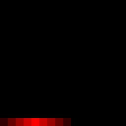

If you’ve arrived here from [part 1](__GHOST_URL__/animating-textures-with-the-uv-scroll-component-pt1/) or [part 2](__GHOST_URL__/animating-textures-using-the-uv-scroll-component-part-2/) of this series, you probably have a pretty solid understanding of how UV scrolling works. In this last part, we’re going to take a look at a few different examples that use Hubs’s UV Scroll component in less typical ways.

Rather than explain each step in full detail, I will instead focus on the overall concepts since these techniques can be applied in general ways to countless examples.

### Hey, Blinkin['](https://www.youtube.com/watch?v=wJcuYKyHEgs)

Animating a texture on and off isn’t particularly special when it comes to rendered animation, but for real-time game engines, it’s not often supported as a built-in feature. Knowing what we do about UVs, we can get around this limitation with a little clever forethought.

This is one of my favorite techniques because the textures we create can be really small and simple. In fact, since I’ll be working with plain patches of color, I can make these images a few pixels at a time.

Let’s start with a small square texture that’s only 16 x 16 pixels. I’m painting this texture within Blender’s Image Editor, but you could use [Photoshop](https://www.adobe.com/products/photoshop.html), [Krita](https://krita.org/en/), [Procreate](https://procreate.art/)… heck, even [MS Paint](https://support.microsoft.com/en-us/windows/get-microsoft-paint-a6b9578c-ed1c-5b09-0699-4ed8115f9aa9).

I’ll start by focusing on the bottom (horizontal) row of 16 pixels.
Ignore the image size you see here– the actual texture I'm using is only 16 by 16 tiny little pixels.
It's worth noting that working with pixel art can be tricky at first. Imaging software generally wants to smooth everything out and get rid of jagged lines and edges. So if you're saving an image that should remain blocky, you'll want to make sure to look for a setting called something like 'Interpolation' or 'Anti-aliasing' so you can choose the right option. For Blender, the setting is on the 'Image Texture' node.

0:00
/
1&#215;

In Blender, you must set the image ‘interpolation Type’ to ‘Closest’ if you want to see individual pixels.
If these pixels were to slide across a single face of a mesh, it would give the appearance of that mesh getting brighter and brighter red, then fading back down to black for a bit, then repeating as the texture wrapped back around to the start. If we use the UV Scroll Component’s ‘Increment’ parameter(s), we won’t see the hard edge of the pixels as they go by since they’ll ‘jump’ from one to the next.

0:00
/
1&#215;

A single line of pixels is enough to create a blinking element.

💡

The 0.0625 value for the X-Increment for the UV Scroll component comes from a pretty simple formula:
1 (whole texture) divided by 16 (pixels across). In other words, the texture must increment 1/16th of its width each step. Remember, the Speed is independent so it can go as fast or slow as you like.

Jumping way ahead here, but a texture with lots of colorful gradients makes for some pretty cool results if all the UVs of the mesh are randomly placed throughout the UV space. If your nerd senses aren’t tingling here at the thought of making a cool ‘matrix code’ effect, I’m not sure what else I can do to excite you.

0:00
/
1&#215;

Each face has its UVs randomly placed in the texture space
Don’t forget, you can also use the Y-increment to offset the texture vertically. This can further randomize the texture offset so you don’t see it loop as often. Finally, you may **not** want randomness at all, instead opting to strategically lay out your faces and UVs to make specific sequences of color like some [classic game art](http://www.effectgames.com/demos/canvascycle/).

0:00
/
1&#215;

Finally– a dance floor to go with all my uv-scrolling dancing avatars.
Now that you’ve reached this stage of understanding, I’ll leave it to you to figure out how this digital number display works. The sideways-scrolling texture is 8 x 16 pixels and each column of green pixels represents a number from 0 to 9. The red pixels should be a clue…

0:00
/
1&#215;

Don’t let the texture transparency fool you–those segments of the display are always there.

### What About Rotation?

While rotating textures is technically possible, it would require a code change to the UV Scroll component. However, you may find that it’s not really necessary if you know how to mess around with your mesh’s UVs. Just like we were able to distort the textures in the lava example from [Part 2](__GHOST_URL__/animating-textures-using-the-uv-scroll-component-part-2/), we can create the illusion of rotation just by planning ahead with our UV layout. Even a simple gradient can create interesting results just by first rotating the UVs on an angle.

0:00
/
1&#215;

Strategic placement of UVs can produce results that trick the eye into thinking textures are rotating when they’re actually just sliding.

### Animate those meshes

With all this fancy UV scrolling, it’s easy to forget that you can animate the mesh itself. By combining existing animation techniques with the UV Scroll component, the possibilities are endless. Be sure to review the [glTF specifications](https://www.khronos.org/registry/glTF/specs/2.0/glTF-2.0.html#animations) for what types of animation are supported, but we’re generally talking about things like skeletal animation and morphing of meshes.

Here, I’m combining a very simple vertical UV scroll while I animated the object morphing into a new shape:

0:00
/
1&#215;

The glTF file format supports morph animations. In Blender, they’re called ‘Shape Keys’.
With a little bit of transparency and emission, my ghost could be reused throughout a Hubs scene:

0:00
/
1&#215;

I ain’t afraid of no ghost–A few animated items can really bring your Hubs scene to life.
Remember those flipbook-style textures we were using in [part 1](__GHOST_URL__/animating-textures-with-the-uv-scroll-component-pt1/)? You could animate one of the meshes in a simple circle– in this example, I curved the mesh a little bit to get rid of some of the flatness.

0:00
/
1&#215;

This cartoon 2d cat is still more believable than the ones in the movie ‘Cats’... well, less disturbing anyway.

### Final Thoughts

If you made it all the way through this series on UV Scrolling, congratulations! You hopefully have gained a better understanding of how all this works and maybe picked up a few tricks along the way. I’m always excited to see cool new ideas so I encourage you to visit the [Hubs Discord](https://discord.com/invite/dFJncWwHun) and share your work-in-progress with our community.
