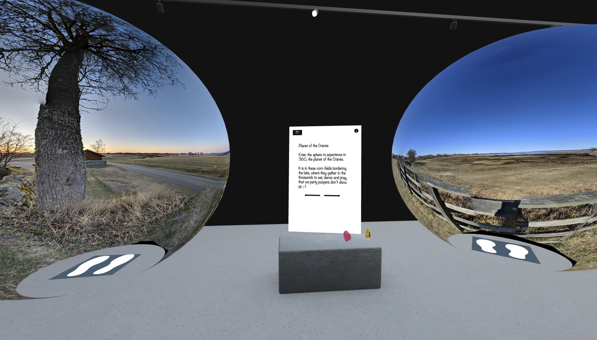
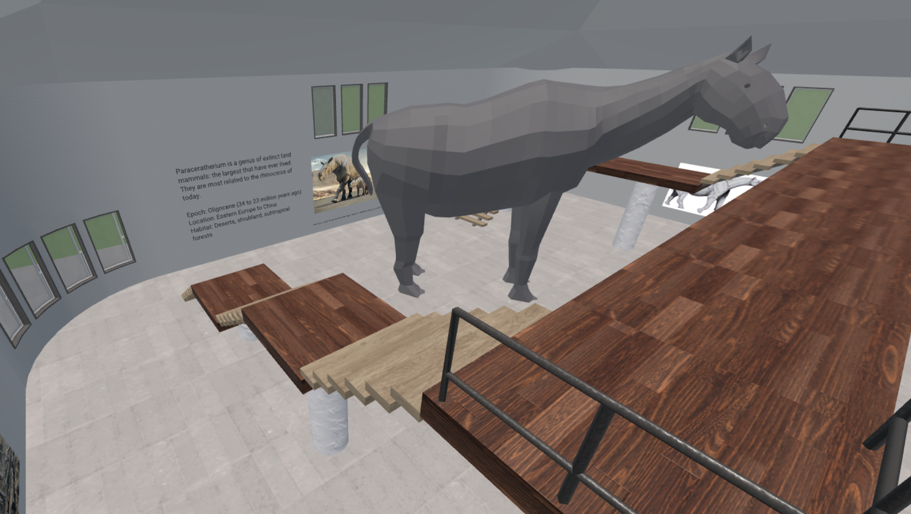
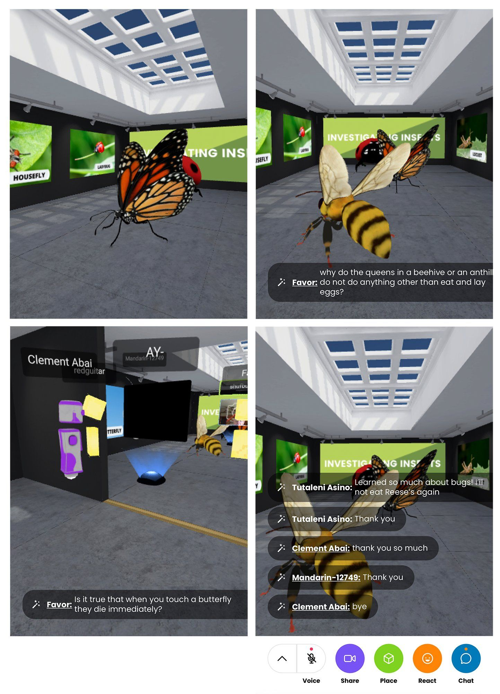
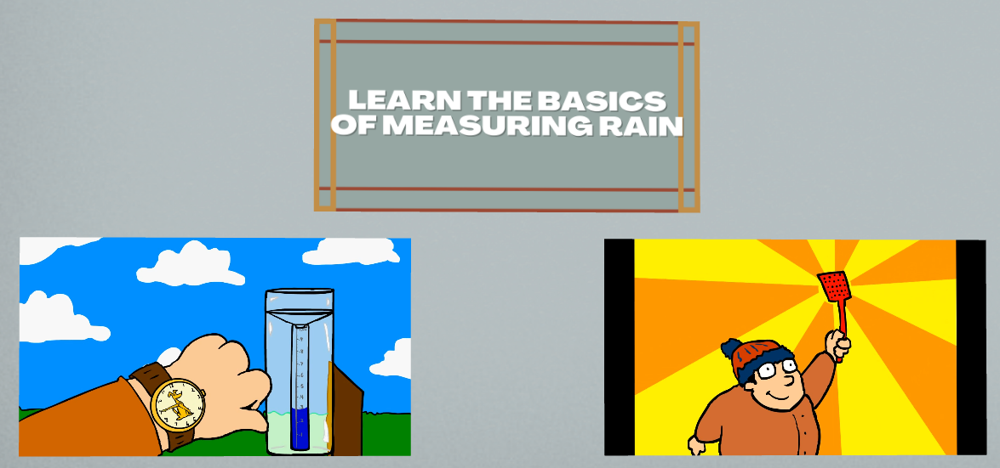
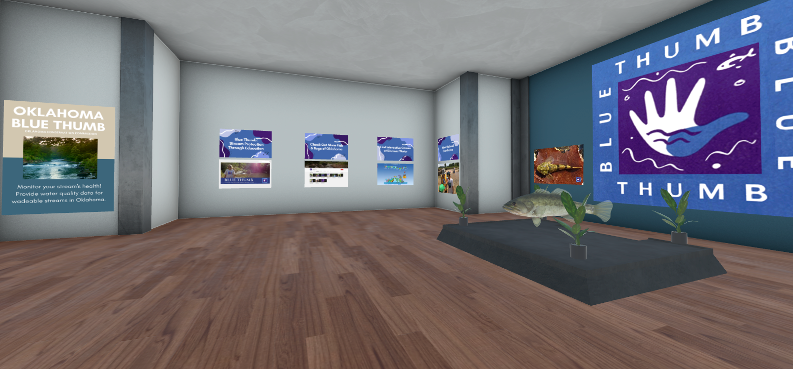
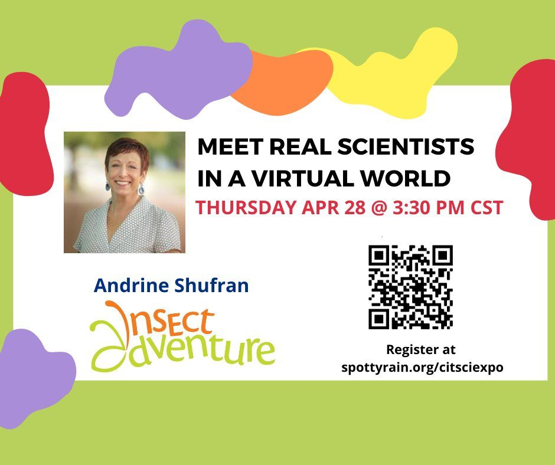
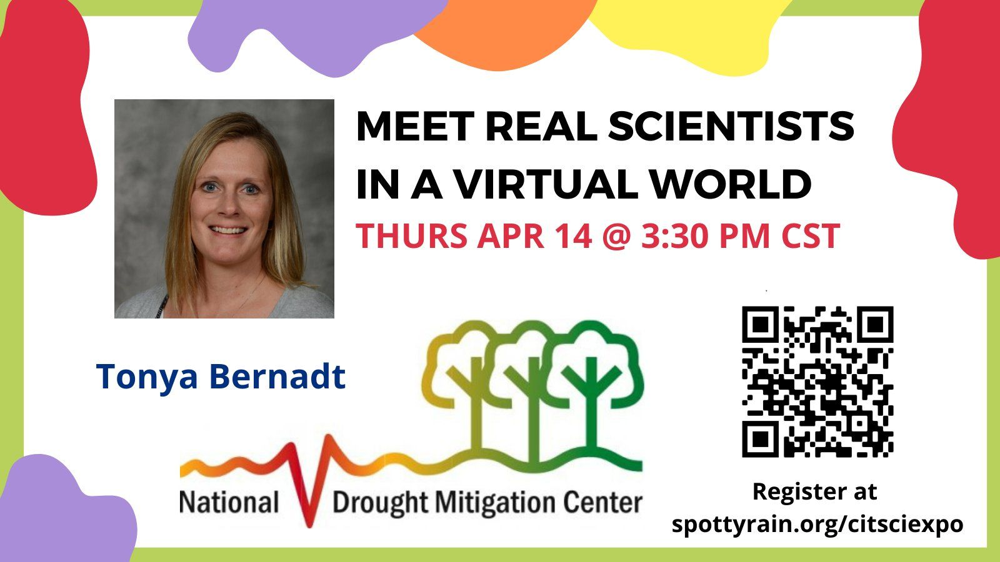
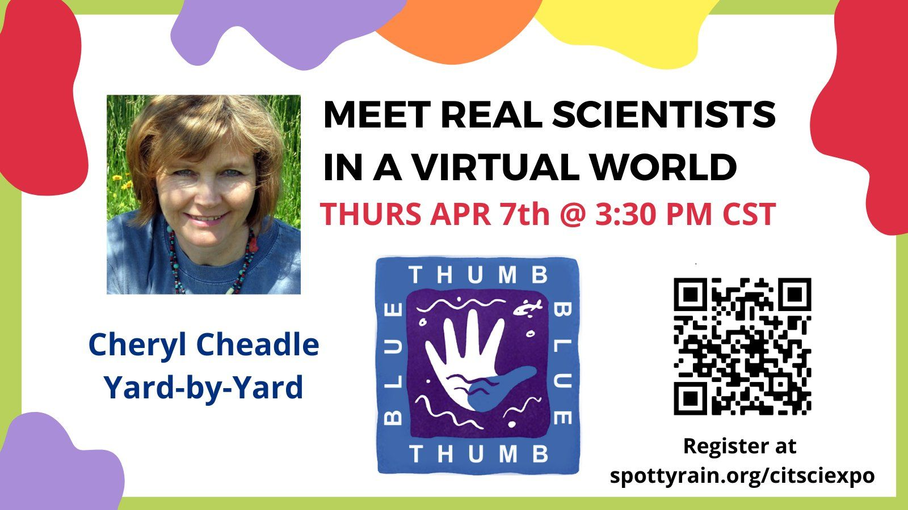

How can we leverage 3D spaces to create memorable educational experiences? Check out these educational spaces in Hubs. Some were built by single creators, while others were created by teams of artists, subject matter experts and technologists collaborating together. All of these spaces leave their visitors with a new experience, the gift of knowledge, and the potential to inspire and spark curiosity.

## Cranes of Hornborgasjon

_[Anand Ragav](https://twitter.com/anandVragav)_|[Scene Link](https://hubs.mozilla.com/scenes/CQBQBfB)

Learn more about these impressive, dancing Cranes with photographs of the common cranes that visit western Sweden each spring.

Gallery features 360° images that lets you ‘step’ right in the center of the Crane’s yearly migration.

Fun and informative signage can be easily viewed by guests because it uses the 'billboard' option found in [Spoke](https://hubs.mozilla.com/spoke) (it can also be done by attaching a billboard component with [Hubs Blender Exporter](https://github.com/MozillaReality/hubs-blender-exporter)) – this feature rotates the element so it is always facing the viewer This space also features interactive 3d emojis created with the "spawner element".

**Cranes of Hornborgasjon by Anand Raghav**

## Unfolding the Universe: A James Webb Space Telescope VR Experience

_[MetaxuStudio](https://twitter.com/MetaxuStudio), [Ashley Zelinskie](https://twitter.com/azelinskie)_

This beautiful space made of point clouds hosted a fascinating Question and Answer session with Paul Geithner, Deputy Project Manger of the James Webb Space Telescope. The space features audio-zones that allowed participants to listen to pre-recorded audio clips from people working on this incredible telescope. Featuring dreamy, soul-stirring music, animated sculptures reaching for the heavens, and artful, neon pink caricature outlines of some of the people working on the James Webb Telescope.

Check out this tour to get a better understanding of how audio-zones were used below:

0:00
/
1&#215;

##

Chonker Hall

[_Dr. Keith Chan_](https://twitter.com/chekeichan) | _[Scene Link](https://hubs.mozilla.com/scenes/xCGCqQ6)_

This space features a great use of scale to help visitors get a sense of how massive this extinct genus of hornless rhinoceros was when it walked the earth some 30 million years ago.  Visitors can walk around this giant animal on the surrounding catwalk, which helps to get a sense of the scale when you have many 1.6m tall avatars in the space. To help contextualize the space the creators have placed an excellent [short PBS film](https://www.youtube.com/watch?v=SDk1Ft50bsI) on the species into the scene.

0:00
/
1&#215;

Entry to Chonker HallCatwalk allows visitors to walk around and better appreciate the scale.

## Citizen Science

_[Clement Abai](https://twitter.com/clement_abai), [Ayodeji Ibukun](https://twitter.com/Ibukunaa), [Dr. Tutaleni Asino](https://twitter.com/tutaleni), [Dr. Nicole Colston](https://twitter.com/debatemamma), Spotty Rain Campaign, Oklahoma State University Emerging Technologies and Creativity Research Lab_

Virtual Citizen Science Expo with 5 rooms integrated into the main room. Great use of existing re-mixable scenes ([Art Gallery](https://hubs.mozilla.com/scenes/jOIjUE0/hubs-modular-art-gallery), [Gathering Hall](https://hubs.mozilla.com/scenes/KV6MwkU/gathering-hall)) to create environments. They held question and answer sessions in the spaces with scientists.  
Screenshots courtesy of Dr. Tutaleni Asino

Citizen Science: Participants meet with Scientists and ask questions across linked spaces.

##

Journey Through the Heart

_[Human Heart](https://sketchfab.com/3d-models/anatomical-heart-codominance-42d07ac1517748ea82bb05b0a362b298) adapted from Anna Sieban_ | _Experience and Design by [Greg Dorsainville](https://www.linkedin.com/in/greg-dorsainville-24913110), [Kristen Ramirez](https://www.linkedin.com/in/kristen-ramirez-5728a5150)_

This space allows visitors to take a trip through the human heart.  This scene makes use of waypoint links to allow guests to cruise through different parts of the heart and labels all the different components as you walk and fly through. The creators used the particle emitter to help show blood flow and oxygenation.

0:00
/
1&#215;

waypoints being used to teleport through the heart
At the end of the tour, visitors are encouraged to fly around the exterior of the heart.

0:00
/
1&#215;

Flying around the heartOne of several staging areas with posters and links to the next section.
Get the full story behind 'Journey Through the Heart' [here](https://nyulangone-immersive-classroom.glitch.me/hubs/). More information about the experience can also be found [here](https://nyulangone-immersive-classroom.glitch.me/experiences/heart01/).

---

These are just some of the great examples we have seen of people using Hubs for education. Have you seen any others?  Let us know!

For Mozilla Hubs updates and Creator Labs content, follow us on [Twitter](https://twitter.com/MozillaHubs) or in [Discord](https://discord.gg/sBMqSjCndj).

_Ready to get started with your own hub? Visit _[https://hubs.mozilla.com/#subscribe](https://hubs.mozilla.com/#subscribe)_today_!
