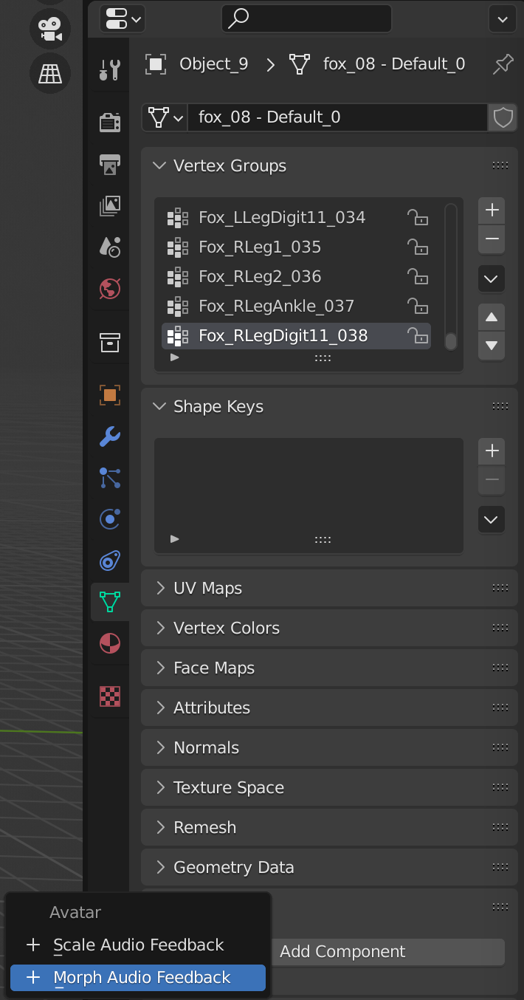
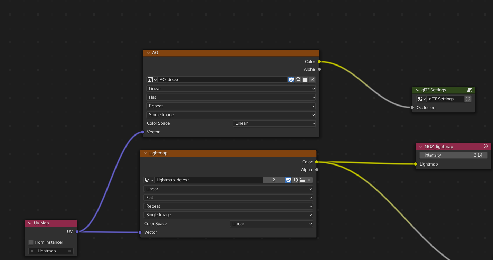
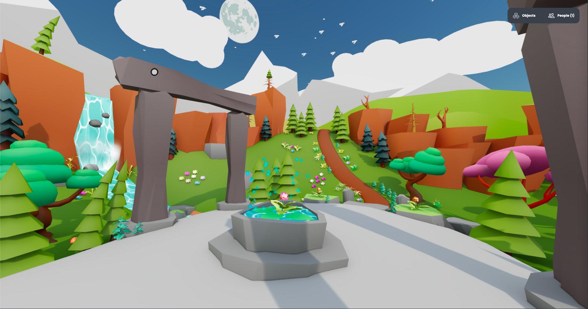
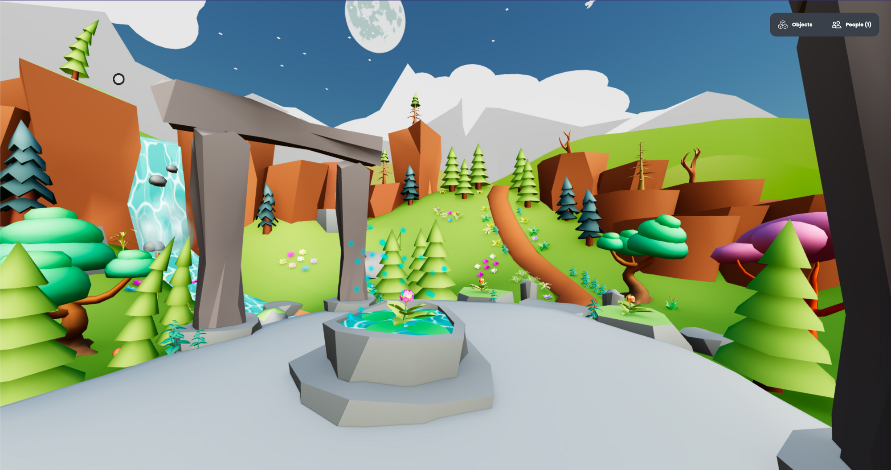

The [Hubs Blender Add-on](https://github.com/MozillaReality/hubs-blender-exporter) is a Blender plugin that can be added to the [Blender](https://blender.org) 3D editor. Once installed in Blender it will allow you to add Hubs features to Blender scenes. When you export the Blender scene as a glTF model those features will be added to the glTF file and Hubs will have access to them.

If you are familiar with Hubs you may have used [Spoke](https://hubs.mozilla.com/spoke/) for editing a Hubs scene. The Hubs Blender add-on adds all those Hubs specific components and features that Spoke has but inside Blender.

### Who is the Blender add-on for?

The Hubs Blender add-on doesn't add any further complexity to the regular Blender workflow. As long as you feel comfortable with Blender it doesn't really matter if you are a basic or advanced Blender user.

In case you are interested in learning Blender, there are tons of free tutorials and courses online. Blender is also open source and free so you can just go to the [Blender](https://www.blender.org/) website and download it to start learning.

### How do I install the add-on

To install the add-on first you need to download it. All the released versions are available in the add-on GitHub repository [here](https://github.com/MozillaReality/hubs-blender-exporter/releases). Download the zip file and go to Blender. In Edit → Preferences → Add-ons click on _Install_ and choose the zip file that you have just downloaded. You should immediately see the installed add-on and a new Hubs section should show up in some object panels.
The addon has been installed!
Now you are all set!

### Let's do something cool

So say you are browsing around the Internet and you come across a nice little fox model in [Sketchfab](__GHOST_URL__/optimizing-models-from-sketchfab/).

[ Fox ](https://sketchfab.com/3d-models/fox-39f97fe58f0b47ce80b6e02814001dd7?utm_medium=embed&utm_campaign=share-popup&utm_content=39f97fe58f0b47ce80b6e02814001dd7) by [ pxltiger ](https://sketchfab.com/pxltiger?utm_medium=embed&utm_campaign=share-popup&utm_content=39f97fe58f0b47ce80b6e02814001dd7) on [Sketchfab](https://sketchfab.com?utm_medium=embed&utm_campaign=share-popup&utm_content=39f97fe58f0b47ce80b6e02814001dd7)

> **Note**: Make sure that the model that you are going to use has a license that is compatible with the use you are going to make of it.

The fox is cute but you might want to add some extra cuteness by adding some bubbles to its tail to get something like this inside Hubs:

0:00
/
1&#215;

Resulting fox with animation and particles emitting from the tail
The first step would be to download the model from [Sketchfab](https://sketchfab.com/) website in glTF format and import it to Blender. If you have the [Sketchfab add-on](https://sketchfab.com/tags/blender-add-on) installed, that would be an even simpler process.
The fox is inside Blender
First you will need to add a particle emitter. It doesn't need to have geometry, so we will just use an empty for it.

The particles will be emitted from the position where the emitter element is located and we want the particles to be emitted from the fox's tail tip (so they swing with it) so the emitter object needs to follow the tip location. To do so we will parent the particle emitter to the fox's tail tip bone.

Let's see how we can do that:

0:00
/
1&#215;

Adding the particle emitter
Now we just need to add a Hubs Particle Emitter component to that object so it actually emits particles when inside Hubs.

❗

There is no support (yet) for previewing the Hubs Particle Emitter component inside Blender so you might need to try a few values for the particle emitter properties before getting the desired behavior but no worries, for this example we are going to give you a working preset 😉

Let's add the Hubs particle emitter component:

0:00
/
1&#215;

Adding the Hubs components to the emitter
Once the component is added set the following values:
These values will produce the particles in our example
You need to provide a URL as the particle emitter source. If you don't have access to a server to upload the image to, you can upload it to a Spoke scene and grab the URL from there. Paste the URL in the _Source(Src)_ property and copy the rest of the values from the above screenshot.

In this example we have used the following image:
[Energy Orb](https://www.deviantart.com/venjix5/art/Energy-Orb-redesign-761445149) (by [Venjix5](https://www.deviantart.com/venjix5))

> **Note**: Make sure that the image that you are going to use has a license that is compatible with the way you intend to use it.

Good news, we are done with the hard work! Now the model is ready to emit particles inside Hubs. Simple, right? Now we just need to export the model to upload it to Hubs.

To export the scene just go to File → Export → glTF 2.0. Then just make sure that the _Hubs Component_ extension is enabled before exporting (it should by default). Click on the _Export_ and voilà you should now have a GLB file in the output folder.

0:00
/
1&#215;

Exporting the fox
Now you can go to Hubs and place the exported object in the scene:

0:00
/
1&#215;

The fox is in the house

### What else can I do now that I know the basics?

That was a simple example but the process is the same for any other Hubs supported content: create/import content, add Hubs components, and export.

With the Hubs Blender add-on you can export three types of content:

- Scenes
- Avatars
- Objects

They are all just Blender scenes that you export as GLB but they all serve different purposes.

Scenes are the models used to create a Hubs scene, they are usually composed by different objects and can have some special features like scene level environment and audio settings or fog.

The scene components can be found in the _Scene Properties_ panel. This components affect the whole scene not specific objects:
Scene Components
Exported scene models usually include some special type of objects like [nav-meshes](__GHOST_URL__/what-is-a-nav-mesh/) to help avatars navigate around, skyboxes to show a textured cube as background, or physics shapes. You can add those as regular objects and attach components to them. You can find scene components in the _Scene_ category inside the component menu.

Avatar models usually have an armature with a specific bone structure as well as animations and components that add some other features like head scaling or shape keys that morph vertices as you speak. You can find avatar components in the _Avatar_ category inside the component menu.

The object and avatar components can be found in the _Object Properties_ panel, the _Object Data_ panel and the _Material_ panel.

Object, Data and Material components

### Special elements

Other than the Hubs components that you can attach to an object, material or a scene, the Hubs Blender add-on also includes a material node that you can use to add a [lightmap](https://en.wikipedia.org/wiki/Lightmap) channel to the exported material.

To add the lightmap node you need to go to the shader editor, then _Add_ (_Shift + a)_ and in the Hubs sub-menu choose the _Moz_lightmap settings_ node and attach a texture to its input.

Adding a lightmap can have a huge impact in the scene's visual quality inside Hubs as it adds bounced light and soft shadows with little overhead that would be quite expensive to achieve with real-time lighting. Using lightmaps inside Hubs is **highly** recommended.

See the difference in the same scene with and without a lightmap:

Lightmapped (Left) Vs Not Lightmapped (Right) environment inside Hubs
Now that you know the basics you can start adding components to your models in Blender. Make sure that you check out the [Hubs Blender exporter Docs](https://github.com/MozillaReality/hubs-blender-exporter) for more components information.

Happy Blending!
