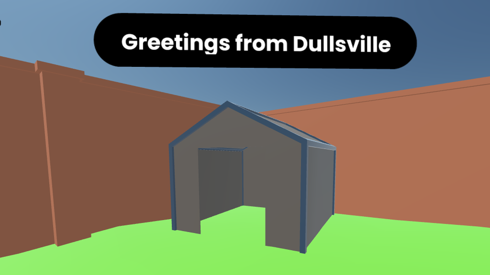
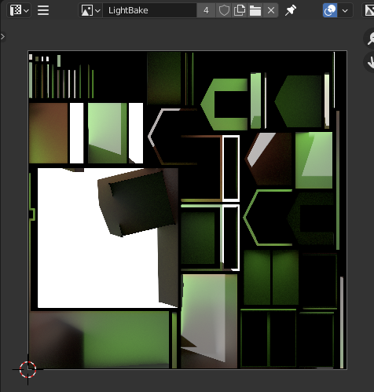
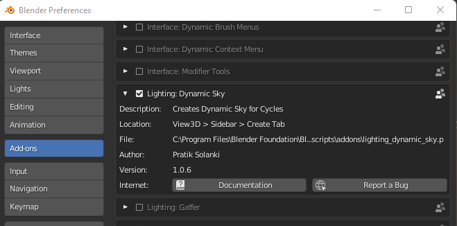
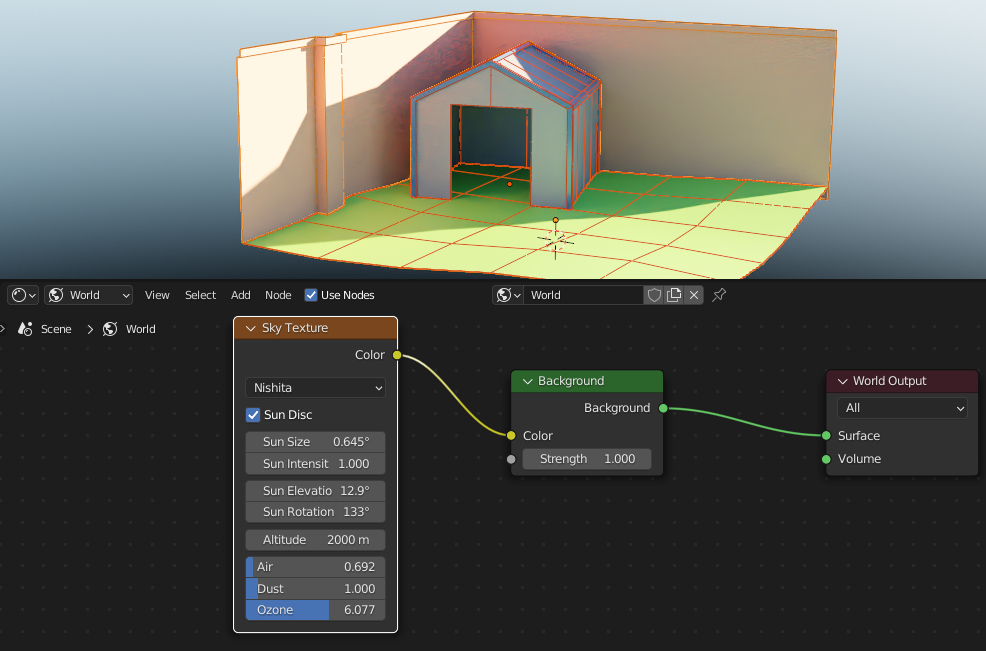
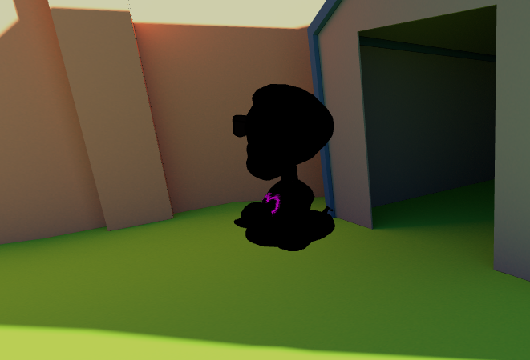
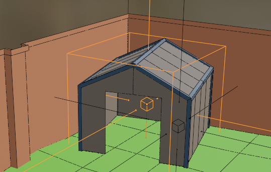

Many creators that are relatively new to making content for virtual platforms have struggled with getting things to run smoothly, especially in VR headsets. Most of the challenges have to do with hardware limitations and how much effort it takes for devices to display so much with such relatively underpowered chipsets. While this will [inevitably improve as time goes on](https://en.wikipedia.org/wiki/Moore%27s_law), there are some clear steps you can take today that will make your scenes run more smoothly on all devices.

In this tutorial, we’ll be looking to eliminate the biggest enemy of smooth real-time graphics: dynamic lights. <cue crash of thunder and lightning> (Actually, don't. That would be another dynamic light.)

📱

If you're viewing this tutorial on a phone, you'll have a better experience holding it in landscape (horizontal) orientation.

### What is a dynamic light?

Any light that is placed in a scene and generates light onto the environment and avatars is considered to be dynamic in that, in theory, you could move it around, change its color or brightness, or even delete it and you’d see the scene change in response.

We can illustrate this by attaching a light to an animated object or even an avatar. The results can be quite compelling, but don’t get too excited–even one dynamic light can make your scene too complex to run on certain devices.

0:00
/
1&#215;

Oooooh... Look at that dynamic, shadow-casting light! Mobile device and VR headset users might not be as enthusiastic since they kill performance.
You might be thinking, _“But none of my lights are moving around? Shouldn’t that be ok?”_. The fact is, those lights are still being calculated in real time despite them sitting in one location. Therefore, we are still incurring a rendering cost and it gets worse with each light that’s added to the scene. Sure, it may run just fine on a desktop computer with a fancy graphics card. But it’s important to remember that people join [Hubs rooms from all over the world](__GHOST_URL__/extending-hubs-with-hubs-cloud/) using all kinds of devices, including mobile phones. Ensuring everyone has access to virtual spaces should be important to anyone who cares about [maximizing the reach of their work](https://jessica-outlaw.medium.com/who-is-this-space-for-937acc3f5f51).

0:00
/
1&#215;

Even this non-moving light source is still being calculated in real-time, making it expensive to render.

### So what's the alternative to dynamic lights?

The good news is that we can achieve similar results with baked lighting combined with reflection probes and we won’t need any dynamic lights whatsoever. The extra good news is that this means we can make scenes that actually look even better than their dynamically-lit versions since we can harness the power of bounced lighting. And then the extra extra (_I promise I’ll stop_) good news is that these even-better looking scenes can run on mobile phones and VR headsets.

### What's the bad news then?

Well, like most things that look good, it’s going to require some work. But I think you’ll find the end result is so good that you’ll want to redo all your scenes.

Don’t believe me? Here’s a scene with zero dynamic lights:

0:00
/
1&#215;

Despite the complex look, there are no dynamic lights used in this Hubs scene.
Baking lighting can be a complicated topic to cover so I’m going to do my best to explain things step-by-step. You may find it easier to read through the whole thing first before attempting it yourself, but I’ll leave that up to you. I’m trying a new format where I have chapter headings alongside this article, so it should be easier to return to a step later in case you missed something.

### Step 1: Setting up the scene for success

Whenever you’re starting out with something new like light baking, it’s often best to use a scene you don’t mind throwing away at the end. That way, you won’t feel too frustrated if it doesn’t work out exactly how you planned. I’ve made a very rough model as a starting point. It consists of just a few objects– Walls, Ground, and a sad little shed.
Each object has only the most basic materials on it–just some base color and the overall roughness adjusted a bit so that some things are slightly shinier than others.

0:00
/
1&#215;

Just three objects and four materials. (The shed has two materials.)
There’s certainly not much detail, but let’s see what happens when we export it as a .glb, import it into Spoke, leave the default lighting (1 directional ‘sun’), then publish our scene and visit it in Hubs:
1997 called, it wants its graphics back.
Ouch. Not exactly what I had hoped it would look like. Unfortunately, we can’t really expect much from Hubs’s renderer when we’ve provided it with so little. Most beginners will recognize that something’s not quite right, but they don’t quite know what’s missing.

Without going into a lecture on computer graphics, a quick way to describe this scene would be to say it looks “flat”. Almost all the surfaces appear to be one uniform color across their whole area. Without the subtle changes in color (hue) and value (brightness), it’s impossible to make out any detail. Sure, there’s not much detail in the geometry to begin with, but we would still hope to see that the ground is wavy or that the left wall has that small column sticking out. But both of those things are being obscured by the lack of lighting information.

Turning on shadows would help, but only very slightly. Those real-time shadows would also hurt our framerate as we discussed earlier.

Don’t quite believe me about those shadows? Judge for yourself:
The same model with ‘cast’ and ‘receive’ shadows turned on. Still sad, just more shade.

### Lighting the Scene

If you’re looking to add lighting to the scene, we can do all of this ahead of time in our 3d application, in my case, Blender. Applications like Blender have all kinds of sophisticated ways of adding lighting. There are many videos out there explaining [how to do lighting](https://www.youtube.com/watch?v=_DLabt0anY4), so I’ll keep this part brief. I’m going to be adding one main light source for the sun since this is an outdoor scene that I’d like to look like mid-afternoon on a sunny day. Sometimes I achieve this with a simple ‘Sun’ (directional) light. Other times, I use a high dynamic range (HDR) 360-degree background image that lights up the whole scene. I’ll show that technique a little later, but for this, I’ll stick with a single light for simplicity’s sake.

0:00
/
1&#215;

Note how you can’t see shadows until you turn on the ‘Rendered’ view mode. In this clip, I’m using Blender’s Eevee renderer so I can’t see any bounced light yet.

💡

The names and settings for lights can vary in different 3d apps. ‘Sun’ gets used sometimes, but most use the term ‘Direct’ or ‘Directional’ to describe a light where all the light rays are essentially parallel, similar to how the sun’s rays appear by the time they reach distant planets.

From the clip above, you can see that the scene doesn’t look much better than it did in Spoke or Hubs. But everything changes when you switch from Blender’s ‘Eevee’ renderer to the more realistic ‘Cycles’ renderer. That can be found at the top of the ‘Render Properties’’ tab:

0:00
/
1&#215;

Switching to the Cycles renderer immediately shows the difference having bounced lighting makes. Notice how the areas behind the shed get much more realistic shading and the front of the shed turns greenish from the light bouncing off the ground.

🏃

It’s worth noting that I have a relatively fast computer so the speed at which it renders might be much higher (or lower) than yours. If you _do_ have a fast graphics processor, you can switch the Cycles renderer to use your [GPU instead of your CPU](https://docs.blender.org/manual/en/dev/render/cycles/gpu_rendering.html) and the render times can drop dramatically. Not all graphics cards are the same, so you may want to do a little research on the best option for you.

### We Need a 2nd UV Layer

This is often the most misunderstood part of light baking so don’t be surprised if you need to go through this section a few times. It’s actually more difficult to explain so I would first highly recommend reading the [beginning of this other Creator Labs article](__GHOST_URL__/animating-textures-with-the-uv-scroll-component-pt1/) to get a grasp on what UVs are.

If we wanted to store the light and shadow information and put it onto the surfaces of the scene, how would we know where to put them? This is where a 2nd layer of UVs comes into play. We need to unwrap all the surfaces of all the objects and make sure that none of the faces overlap. This is quite different from how we might unwrap them for regular texturing (like adding bricks to the wall, for example). In regular texture unwrapping, it’s often desirable to have parts overlapping so that you can reuse parts of the texture or have repeating textures that tile horizontally or vertically. But with light mapping, every single surface is getting unique lighting so they need their own unique spot on the UV layout. Go ahead and read this whole paragraph again because it’s very important.

Each object in the scene will require a new UV layer that is set up specifically for light baking.

There are many ways to accomplish this. I’m going to show you how I like to do it, but bear in mind that every situation and project is different so you may choose to experiment once you know how it all works.

The basic steps are:

1. Duplicate the existing UV layer
2. Re-unwrap the object

Step 1 looks like this:

0:00
/
1&#215;

Selecting each object and adding a new (duplicate) UV Layer
**It’s important from this point forward that we keep that new UV layer selected on all the objects.** If you’re not sure what I mean, I’m talking about keeping that newly created layer called ‘**UVMap.001**’ highlighted:
Each object will have a UVMap.001 layer. Keep them highlighted when baking.
When we do our light baking, this is how Blender knows which layer to operate on. We don’t want to accidentally render over any textures our objects may already have on the first UV layer.

### Unwrap the 2nd UV Layer

Step 2 is the unwrapping part. One cool thing about Blender is that it allows you to unwrap all your objects at once. The benefit of this method is that you can pack all those UV islands into one single texture if you wish. The other benefit is that a single lightmap texture can be faster to download (remember, Hubs runs in a browser). Also, if your objects all share the same material(s) already, having 1 lightmap texture is less work on your graphics card when running Hubs.

I like to do a sort of hybrid approach where I unwrap each object separately, but then pack them all together at the end. The benefit of unwrapping each object individually is that it’s often easier to understand what you’re looking at and you can optimize each object’s UVs without the clutter of all the other objects confusing things.

Ok, too much explanation– videos are so much easier to follow sometimes:

0:00
/
1&#215;

I’ve found Blender’s ‘Smart Project’ to have the best looking results of the various unwrap types. Don’t hesitate to experiment– other methods may work better for certain objects.
Notice how I didn’t even bother adjusting those unwrap settings (margins, etc.). That’s because I’m going to do all that when I pack all the objects at the same time. The only option that I sometimes adjust is the ‘Angle Limit’. Lower numbers cause the unwrap to make more islands, whereas higher numbers produce fewer islands but with less distortion. Once again, experimentation is key.

### Pack it Up, Pack it In

Let me begin by saying that Blender’s UV packing algorithm (as of this writing anyway) is, shall we say, lackluster. I’ll show you what I mean.

All we have to do now is select ALL the objects, go into Edit Mode, select all their faces, then do a ‘Pack Islands’ operation:

0:00
/
1&#215;

Blender’s 'Pack Islands' gets the job done, just not very efficiently. Look at all that wasted space.
If that’s good enough, we can certainly move on. So feel free to skip past this next section and revisit it later.

### Less Empty Space = Better Looking Textures

What are the alternatives to Blender’s ‘Pack Islands’? Well, there are lots of add-ons out there (both free and paid) that attempt to solve this packing challenge. Of course, you could also manually move, rotate, and scale each island just how you like. The promise of computers hasn’t quite delivered on a work-free lifestyle quite yet, but they can certainly handle a task like this.

Admittedly, I haven’t used all of them, but I highly recommend this one called [UV Packer](https://www.uv-packer.com/blender/).

The website pretty much speaks for itself so I’ll spare you the free advertisement, except to say that it’s the easiest one I’ve come across in terms of interface and understanding. The biggest drawback (as of this writing) is that the core application only runs on Windows. A few of the other solutions also have this limitation, unfortunately. _Sorry Mac users._ :’(

Here’s a comparison of Blender’s Pack Islands vs. UV Packer:
Notice all the negative space being wasted on the left. UV Packer does a much better job of filling in holes and small gaps.
Having faces take up more UV space means that the resolution of the texture will be higher on those areas. It also means you can make room for more objects.

One last thing I do is to manually detach any faces that might make the pack less efficient. For example, there’s a large ‘L-shaped’ piece of the wall that could take up far less room if it were broken apart. (It happens to be causing that giant square of negative space on the left image above.)

I also will manually rotate some islands so they are not oriented at weird angles. This often reduces jagged shadows and other glitchy-looking parts of the baked lighting. Repacking after these manual tweaks will sometimes improve the pack dramatically.

Don’t be surprised if you find yourself spending lots of time iterating on this step. A [well-packed UV layout](https://www.uv-packer.com/wp-content/uploads/2021/02/UV-Packer_Blender_UV-Tiles_UDIM_control_1080px.jpg) is a thing of beauty and it’s not something you want to have to redo once you’ve moved on to other tasks.

### Material Setup

This is the last big step before we actually perform the light bake, but it’s a very important one. We need to tell Blender exactly what and where we’d like the lighting to be baked. This involves going into each material and setting up a target texture. I’ll set it up on one material, then copy it to the others.

In Blender’s Shader Editor, we need to add an Image Texture node and create a new blank image while leaving it unhooked from the graph. The setup of that image is crucial. The size of the image will determine how detailed the light and shadows appear, but bear in mind that you can often get away with lower resolution lightmaps than you might think. I like to use a fairly large texture (2048 or even 4096) because I can easily scale it down later.

The other crucial step is checking that ‘**32-bit**’ checkbox. We need this lightmap texture to have a [high dynamic range](https://en.wikipedia.org/wiki/High-dynamic-range_rendering). In other words, we need the pixel values (brightness) to be able to go above and beyond what they normally can reach (0-255). That’s essentially what will make the lighting look realistic, especially when you have bright sunlight.

0:00
/
1&#215;

You can’t see me copying ('CTRL+c') that first Image Texture node, but I paste ('CTRL+v') the same one into every material.

💥

I forgot to show it in the video, but that shed actually has 2 materials on it. I need to make sure to paste that 'Image Texture' node in ALL materials I wish to bake. You can check to see if you have multiple materials on an object by using the dropdown that says ‘**Slot 1**’. Each slot can hold a material.

### Bake It Till You Make It

This is the part where we need to make sure we’ve got everything ready. I go through a mental checklist:

- Are all my lights set up the way I want?
- Are there any hidden objects that might interfere with my lighting?
- Do all my objects have a 2nd UV channel?
- Are all my objects unwrapped and have non-overlapping UVs?
- Are all the objects I’m baking selected?
- Do my selected objects have a target texture for baking?
- Is the target texture node selected in all the materials I’m baking?

If you answered ‘Yes’ to all of these questions, you’re ready to bake.

So now we venture into the Render Properties tab which is where baking is started.We need to make sure we’re using the ‘Cycles’ renderer, otherwise we won’t get all that nice bounced lighting and everything that makes the lighting look so good.

Now, the settings for rendering can be daunting to look at, but we don’t need to worry about most of the settings as the defaults are generally pretty close to what we’ll be using. The only caveat here is that it’s sometimes helpful to bake with lower quality at first while testing. Then, once you know things are working, you can turn up the quality level for a final bake.

Under the ‘Sampling’-->’Render’ section, I usually set the ‘Max Samples’ to a lower number like 1024. I leave the rest of the values alone for now.

0:00
/
1&#215;

Blender’s Render Properties. Start with lower samples and increase them as needed.

💡

Make sure you’re adjusting the ‘Render’ samples. It’s easy to confuse them with the ‘Viewport’ samples right above them. Those ‘Viewport’ settings only affect the 3d viewport inside Blender and have no effect on your bake.

Still in the ‘Render Properties’ tab, now we can scroll down to the ‘Bake’ section. From here, we change the ‘Bake Type’ to ‘Diffuse’. We don’t actually want the color of the surface textures to get baked into our lighting, so we **un**check ‘Color’ but leave ‘Direct’ and ‘Indirect’ lighting contributions on.

Second, under ‘Margin’, we adjust the ‘Size’ value to be a little lower. This parameter adds extra pixels around the perimeter of each UV island. That way, if an island is right on the edge of a rendered pixel and the background, those extra pixels will keep the model from having visible seams. You can always adjust this value after baking if it’s too high or too low. My UV islands are pretty tightly packed so I lower it quite a bit.

Last, we press the big ‘Bake’ button and wait…

0:00
/
1&#215;

Baking the Diffuse with no color contribution. This will capture just light and shadow information and render it into our target texture.
The status bar at the very bottom of Blender will display the progress. Depending on the complexity of the scene, lighting, texture resolution, and render samples, this baking process can take a long time. Don’t be surprised if it takes many minutes–even hours.

For this particular scene, it’s a few minutes. If I first switch the renderer to use my GPU, it drops to mere seconds.
Blender’s Texture Bake progress meter shown in the status bar. Mousing over it will display the Time Remaining estimate and the Time Elapsed.
As soon as it’s finished baking, that status bar displays a message that reads:

`“Baking map saved to internal image, save it externally or pack it”`
Sometimes I wish this warning were more prominent.
This is a reminder that you must explicitly save the rendered image or else it will get purged when you exit Blender.

If you have an Image Editor window visible, you should see the rendered result appear when it’s done. Here’s how mine turned out:
The baked lightmap with 1024 samples. It’s much more detailed if I zoom into this 2048x2048 texture, but it’s still a bit grainy.
At the top of the Image Editor window (shown above), you will need to use that hamburger menu (three horizontal lines) and choose ‘Image’--> ‘Save As…’

In the Save dialog that appears, we’ll save our image as a ‘**Radiance .HDR**’ file.

I like to save that image into whatever folder I use to store textures for this project.

0:00
/
1&#215;

Lightmaps need to have high dynamic range. If you choose some other format (jpg, png, etc.), it will strip the image of all that important lighting information that makes it look realistic.
If your baked lightmap image turns out kind of grainy or noisy, you can turn up the Renderer’s ‘Max Samples’ value a bit and re-bake it. I will probably raise mine to 4096. The other helpful option you can try is that ‘Denoise’ checkbox. It uses the ‘Noise Threshold’ value above to determine how much to reduce that graininess. Just bear in mind that setting the threshold too low can increase render times significantly. It can also potentially remove detail that you might otherwise want to keep, such as when you have small bumps or other details in the geometry. Like most settings, you’ll have to iterate a bit. I’ve had good results when the Noise Threshold was set to ‘0.001’. A general tip is to try to find settings that give you the best looking results you can without taking too long.

💡

Darker scenes tend to produce noisier renders. You may find that you really have to turn down the noise threshold to get rid of all that grain. If it’s taking too long, you might consider trying to reduce the noise using your image editor of choice. Just don’t change it from an .HDR in the process!

If I zoom into these lightmaps, it’s easy to see the effect of denoising:
A zoomed-in view of part of the lightmaps. On the left is the one rendered with 1024 Max Samples. On the right is the same part, but rendered with 4096 Max Samples and denoised with a Noise Threshold of 0.001. The right side took several minutes longer but was worth the wait.

### Preparing for Export

We’ve made it to the home stretch (_of lighting anyway_)! The last step is to get these lightmaps exported properly with our scene. For this, we’ll need to make sure we’re using the [Hubs Blender Add-on](__GHOST_URL__/what-is-the-blender-add-on/).

I’ve provided a link above in case you need to install it. There’s only one thing we need from it and it’s available inside the Shader Editor.

For each material that has baked lighting, we need to add the node called ‘**MOZ_lightmap**’. Our Image Texture node with the lightmap on it will have it’s output connected to this new node.

We must also tell our ‘Image Texture’ node which UV layer to use. For this, we add a ‘UV Map’ node and pick our ‘UVMap.001’ from its dropdown menu. The output of the ‘UV Map’ node will get connected to the ‘Vector’ input of the ‘Image Texture’ node.

Once this has been set up for one material, we can simply copy those three connected nodes to all the other materials.

0:00
/
1&#215;

Setting up each material with lightmap settings for export. Copying & pasting to each graph works since they all share the same **_UVMap.001_** name and use the same lightmap texture.
To see these lightmaps in all their glory, we need to export the scene. Remember, there’s no need to export any lights since they are only used in Blender and we’ve already gotten what we need from them. I like to keep my lights in their own Collection in case I need to re-bake things at some point.

I’m exporting the whole scene as one big .glb file. Don’t be shocked if the file is larger than you expected. Those .HDR files can get pretty huge, which is why I often reduce their resolution. Unfortunately, we cannot compress the .HDR without losing all the important information it contains. Perhaps in the future, there will be ways of handling it.

### To Hubs!... (with a quick pit stop at Spoke)

This part may change in the future, but the way we’re going to publish our scene is through Spoke–but not using the typical 3d editor part. Spoke will merely act as an intermediary between our .glb and Hubs.

When you are in the main [Spoke](https://hubs.mozilla.com/spoke) Projects page, you’ll choose ‘**New Project**’ as usual. However, instead of selecting a template or blank scene, we’ll use that little ‘**Import From Blender**’ button near the top.
Spoke’s New Project dialog has an ‘Import From Blender’ button. That’s where you’ll choose your .glb you exported from Blender.
A new dialog appears and here’s where you’ll set the name of your scene, add a thumbnail image, and attribution.

0:00
/
1&#215;

Publishing dialog from Spoke. _Make sure you credit any models you need to in the Attribution field._
Once published, you may create a room from your scene to check it out.

Right away, I can see how much the light maps add to the look of my scene. The surfaces no longer have flat lighting across them. And this whole thing doesn’t have one single dynamic light:

0:00
/
1&#215;

The lighting sure helps, but it’s a bit darker than I’d hoped. That’s because of the lack of background and reflected light.
As much as I’ve improved the overall look, it’s still much darker than I want. We can improve this by going back to Blender and adding some background lighting information.

### Setting up the Background Environment

One thing that may not be immediately obvious is that Blender’s background has an effect on the lighting. If you go to the ‘World Properties’ tab, you’ll see there’s a default background color that is used in Blender’s 3d viewports. By changing that color swatch, you can actually see it affect the rendering of the scene. Guess what? It affects the light bake too.

0:00
/
1&#215;

Blender’s background color affects the overall scene lighting when rendering or baking.
I haven’t given much thought to what the background should look like in Hubs, but even a light blue sky would be better than the default black background I have now. But there’s yet another way to use this background to our advantage. We can use a 360-degree panoramic HDR image as a background and it will emit light in all directions based on its values and hues. This may be done instead of using Blender lights OR in conjunction with them. Just be aware that the look of the HDR image could interfere with your Blender lighting. For example, if the image has a bright sun in it, that may give the appearance of an extra sun since it gets doubled with your Blender light. Choosing a good HDR image can be tricky, but you can find lots of them for free at [Polyhaven.com](https://polyhaven.com/) where people have kindly donated many different assets with Creative Commons licenses.

Here’s how we can add one to our background:

In the Shader Editor, we’ll switch the view from ‘Object’ to ‘World’. Then, we can add a new ‘Environment Texture’ node, and drop in our new HDR image into it. Last, we’ll hook it up to the existing ‘Background’ node:

0:00
/
1&#215;

Using a downloaded HDR image from [Polyhaven.com](https://polyhaven.com/). This is one of the quickest ways to light a scene and requires no actual lights before baking.
One of the first things you might notice is that light is coming from _every_ direction now, including the ground. The effect of this phenomenon is that we see more light inside the shed and other downward facing surfaces. This accurately mimics real life in a way that is quite convincing. If you want, you could try disabling the sun light from the render/bake. The background image may be sufficient for the look you want.

Try an HDR image that has a more prominent bright sun in it and you’ll even see crisp shadows. The resolution of these HDR images doesn’t need to be super high, but they do need to have high dynamic range so any old image isn’t going to work. I usually download the 2k version and it’s plenty.

0:00
/
1&#215;

Adding a ‘Texture Coordinate’ and ‘Mapping’ node allows you to play with the background image’s Z-Rotation, affecting the whole scene’s lighting, including that crisp shadow.

### The Sky’s the Limit

But wait, there’s more! If you can’t find an appropriate background image, or otherwise just want something simpler, you can use another method where we let Blender generate a simulated sky surrounding the scene. You’ll need to enable an add-on in your Preferences called ‘[Dynamic Sky](https://docs.blender.org/manual/en/3.1/addons/lighting/dynamic_sky.html)’:
Dynamic Sky is just one of many useful add-ons that you can enable in Blender.
This gives you a new node you can add inside that ‘World’ section of the ‘Shader Editor’.

It works a lot like using an HDR image, but has its own parameters for Sun size, elevation, rotation, and even dust and ozone in the atmosphere. It doesn’t have clouds or anything too complicated but I highly recommend playing around with it to achieve different results.
The ‘Dynamic Sky’ add-on ships with Blender but needs to be enabled in Preferences. You add it to the 'World' section of the Shader Editor.
Once you dial in a look you like, you can repeat the steps you took to re-bake the lightmap texture(s). You just have to make sure you’ve selected the objects, their Image Texture nodes, and hit ‘Bake’. **Remember to save over the old image when it’s done baking.**

### Exporting a Background

With the Hubs Blender Add-on, you now have a way to export your scene with the addition of a background. This can be found in the ‘Scene Properties’ tab. There will be a ‘Hubs’ section where you can add an ‘Environment Settings’ component:

0:00
/
1&#215;

The Environment Settings component can be used to add a background color, image, and even adjust the overall exposure. I’m only setting the color here.
When we export the scene again, we overwrite the old .glb. But now we must update our Hubs scene by returning to Spoke. After clicking on the project thumbnail, we now see the same dialog as before, except now it’s titled ‘Update Blender Scene’. We just need to replace the .glb and hit ‘Update’.

The cool thing is if you still have your Hubs room open, you can simply refresh the page to see the changes. Otherwise, just click the ‘Open in Hubs’ button to create a new room.

Let’s take a look at our updated scene with improved lighting and background color:

0:00
/
1&#215;

The subtle details of bounced lighting add so much warmth to the overall feeling. Even the dark shed is getting bounced light inside.
If we actually want the detailed background–whether it’s an HDR image or made with the Sky add-on, we can add it inside the Scene Properties tab where we set the background color.

But I’ll save that for the next section where we talk about…

### Reflections

The scene is really looking good now, but there’s still something missing. You may not have realized it if you visited your room alone. But if you press `i` in Hubs, or if you drag/drop a 3d model into your browser window, you’ll soon see a problem. None of the avatars or objects have any lighting on them!
With no dynamic lights in the scene, things run smoothly– but objects and avatars are completely dark! Only the emissive texture (the heart on my shirt) is lit up.
To remedy this situation, I’m heading back into Blender. We’ll be adding something called a ‘Reflection Cubemap’ to our scene. Using the Hubs Blender Add-on tooling, we can render our own 360-degree HDR image that may be used as a background image and/or used as something to create reflections.

From the ‘Add’ menu, we’ll choose ‘Lighting’-->’Reflection Cubemap’. Then we’ll move it around so the center is sitting roughly at eye-level in the center of our scene. We’ll be adjusting its ‘Size’ parameter to encompass the geometry, but you can also use the scale tool for non-uniform shapes. The size of the reflection cubemap is important because it needs to cover any geometry you want affected by its reflection.

0:00
/
1&#215;

Blender’s Reflection Cubemaps can be used to generate our own 360-degree HDR images. The center is where the panorama will originate so keep it from being stuck inside a wall or other geometry. We'll be using some special operations from the Hubs Blender Add-on to make it work.
We’re going to use this reflection cubemap as a quick way to render a 360-degree panorama from that spot. The resulting image can be used to reflect on the surfaces of anything inside that cube. What’s extra cool is that we’ll see subtle reflections on background models too, adding an extra layer of realism to our lighting. The shinier (less rough) a model is, the clearer the reflection will appear. A fully metallic, zero-roughness object will look like a reflective chrome material.

We need to go to the reflection cubemap’s Object Properties tab and add the Hubs component called ‘Reflection Probe’. This will show a dropdown menu where you may set the resolution of the reflection image it will create. The default works fine. You might be tempted to set this very large, but trust me, unless your scene is full of mirror-like surfaces, stick with a low resolution and it will still look good while not requiring users to load a giant texture they only see in reflections.
The ‘Reflection Probe’ component that’s part of the Hubs Blender Add-on. This is how we’ll generate quick 360-panoramic images to be seen in our reflections.

🦆

The Hubs team made this component for quick reflection textures, but it’s a useful tool for any Blender project where you need to render a 360-degree panorama. Sure, you can do it with Blender’s 360-equirectangular camera type, but this component eliminates a few steps.

When you press the big ‘Bake’ button and wait a moment, it generates the 360-degree [equirectangular](https://en.wikipedia.org/wiki/Equirectangular_projection) image and automatically saves it in a subfolder called ‘_generated_cubemaps_’.

It’s a bit of a ‘set it and forget it’ tool, but you must remember to re-bake any and all reflection cubemaps if your scene changes in any meaningful way.

Opening an ‘Image Editor’ window and using the dropdown menu, you can find the image called something like ‘_generated_cubemap-ReflectionCubemap_’. (The name matches the object name.)

Here’s how mine turned out:
My generated reflection cubemap image. These are also .HDR images–another good reason to keep them as small as possible.
To have the reflection image export to Hubs, we’ll need to add it to part of our ‘Environment Settings’ component we made earlier. It’s in the ‘Scene Properties’ tab, in case you forgot.

0:00
/
1&#215;

Adding our newly made reflection cubemap to the ‘Environment Settings’ before export.
Export the scene again, update it as we did before in Spoke, and check the result:

0:00
/
1&#215;

Reflections suddenly make every surface reflect the cubemap texture, including my avatar. Some may be a little too reflective now…
I can immediately see the difference, especially in the metallic trim of the shed. But I can also see the grass and other surfaces reflecting the blue sky a little more than I like. This can be remedied by adjusting the ‘Roughness’ property of their materials. Higher roughness will make reflections less prominent.

The other, more obvious problem is that my once-dark shed is now quite bright inside. That’s because it’s also reflecting the sky and surrounding scene without any regard to it being ‘indoors’. To fix this, we’ll be adding a second reflection cubemap that’s just for the inside of the shed.
A second Reflection Cubemap is added inside the shed. Don’t forget to give this one the ‘Reflection Probe’ component and bake it.
The result of baking the second cubemap:
Notice how much darker the interior cubemap looks. This will help it not look so bright inside.
This time, because we already have a cubemap set up in our ‘Environment Settings’ component, It treats this one as the default, while any additional Reflection Cubemaps will simply get added during export. They will affect any geometry that they detect inside their bounds.

Let’s see how it affects my avatar now:

0:00
/
1&#215;

My avatar gets darker when entering the bounds of the second reflection cubemap. If I throw an object in there, it also is affected.
That’s really cool because it means we can make scenes with varying brightness and avatars will look much more grounded based on where they’re standing.

The last problem I’d like to fix is the interior of the shed **still** looks too bright. The reason for this is that the interior of the shed is attached to the exterior of the shed. Since it’s one object, it doesn’t understand that part of it is inside while the rest is outside. If we really want to make it look good, we can detach the interior as its own object. We’ll likely need to adjust these objects’ centers (pivot points) to help define where exactly they are.

In Blender, I’m going to select the interior faces of the shed and detach them (`p`) into a new object:

0:00
/
1&#215;

Selecting then separating the interior faces into a new object. This will allow the interior to be affected by the ‘interior’ cubemap reflections while the exterior remains bright from the first cubemap.
Then I’ll make sure the center (pivot point) of this shed interior is, in fact, inside my second reflection cubemap:

0:00
/
1&#215;

Using Blender’s ‘Affect Only Origins’ checkbox, then the ‘Move’ tool so I can get the exterior shed’s pivot point outside the interior reflection cubemap.
After adjusting the roughness values of my various materials and re-exporting everything, we can see how much darker the interior has become, matching the avatar a little better.
With a separate reflection cubemap inside the shed, we can achieve a better match between the avatars and the environment. I should probably do the same for the metallic trim, but their faces extend both inside and outside the shed and this tutorial is long enough as it is.

### A Final Note on Reflection Probes

In case you were wondering what those 6 ‘sticks’ pointing out of the Reflection Cubemap objects are, they serve a very important purpose. To see them, go to the Reflection Cubemap’s ‘Object Data Properties’ tab→ ‘Viewport Display’→ ‘Clipping’.

These lines indicate how far the camera will reach when generating the reflection image. Why would you need this? Well, sometimes you need to place the probe on one side of a room and you need to make sure it renders (or doesn't render) things that are far away. In this case, you’d adjust the ‘Clipping End’ value so the lines reach as far as you need:
If that Clipping End value didn’t reach those cylinders, they would not appear in the generated reflection image.
In other cases, you may need to put the probe _inside_ an object, like a statue at the center of a room. Here, you wouldn’t want the statue to be captured in the reflection so you’d increase the ‘Clipping Start’ value so it was starting beyond the bounds of the statue:
Raising the Clipping Start value so it lies outside the bounds of the center statue means that the statue will NOT appear in the generated reflection image. You wouldn’t want to see a reflection of the statue in the statue itself!
There may be times where it’s simpler to just hide certain objects so they don’t get captured in any reflections. You can turn off Blender’s render ‘eye’ icon when you need to.

If you have lots of reflection probes in a scene, that’s all the more reason to keep those generated cubemap images as small as possible since they will start to add up quickly.

At the time of this writing, Hubs does not support rotating the reflection cubemaps at all. Unfortunately for my shed, which is on a slight diagonal, it will not be possible to align its interior cubemap exactly. But you’ll discover that Hubs blends between those reflection probes as you move between them–cross-fading the images, minimizing any obvious transition between them. You may find it better to have them overlap a bit for this reason.

### You made it!

This is one of the more difficult endeavors you can take when making a virtual environment for Hubs, and if you made it all the way through, I applaud your perseverance. The reward for your hard work is a much better looking scene than you started with. But the larger payoff will be on any future scenes you make–which, by the way, would be great to share in our [Hubs Discord](https://discord.gg/dFJncWwHun). I’m personally excited to see what clever ideas and techniques you come up with along the way.
