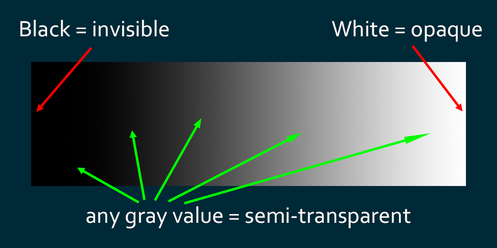
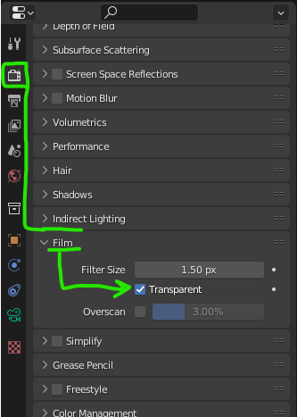
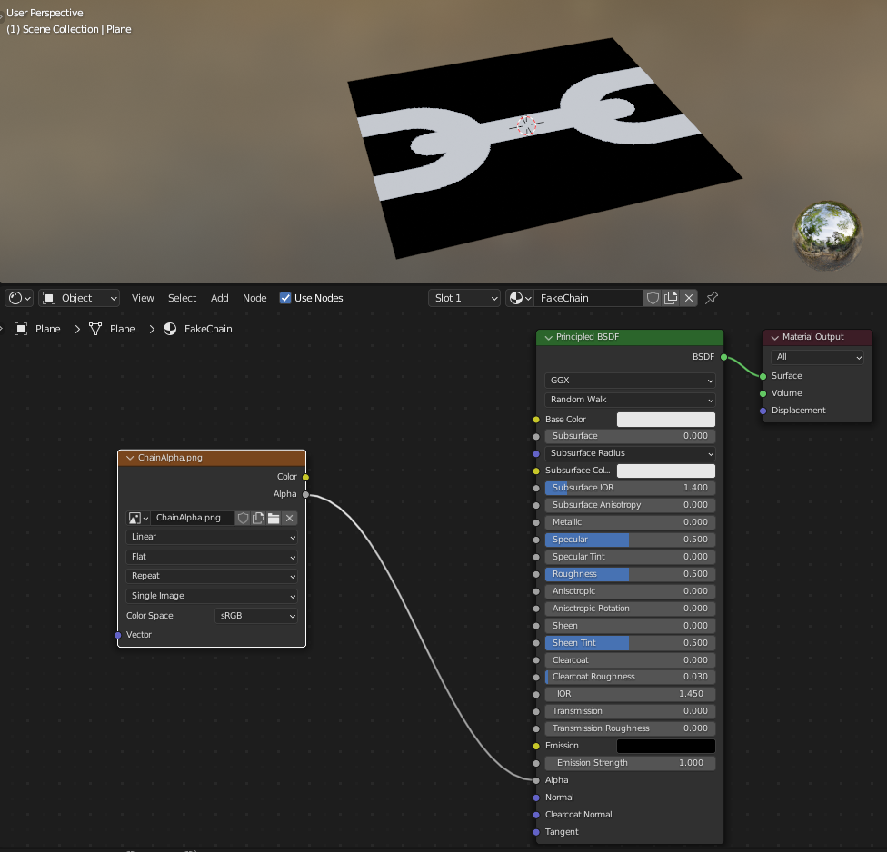
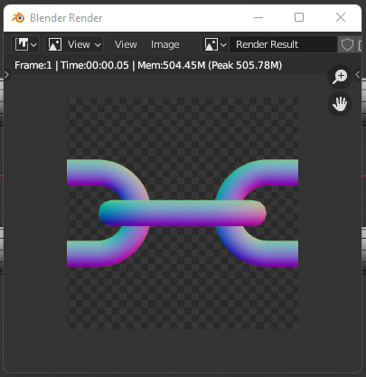
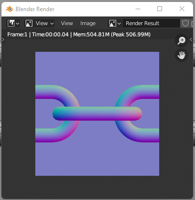
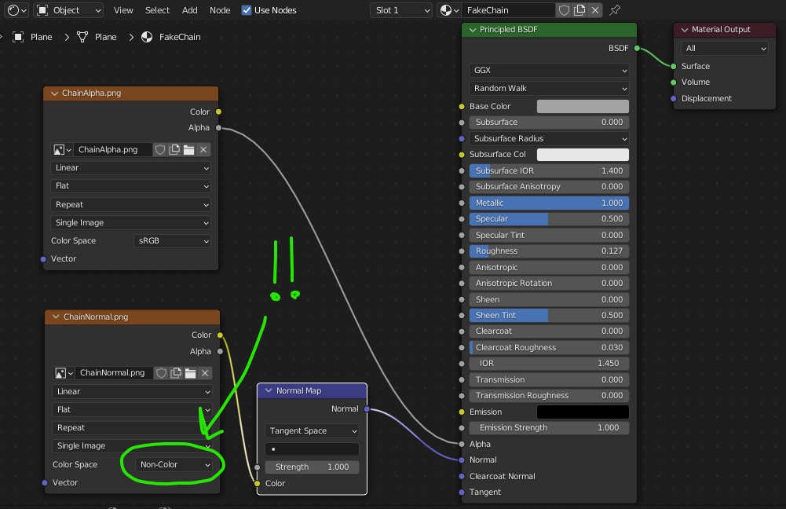
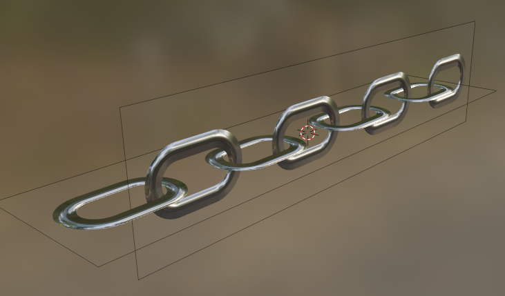

Just when you thought you understood how to make cool scenes for Hubs, inevitably you run into a challenge when trying to make something look like glass or otherwise be partially see-through.

In order to know how to fix common problems with transparency, it helps to first understand the different types of transparency in computer graphics. So buckle up and hopefully this will make things more...transparent.

### Alpha _what_?

The terms ‘Alpha Channel’, ‘Image Alpha’, or just ‘Alpha’ are commonly used when talking about transparency. The good news is that they all refer to the same exact thing. Here’s a quick overview of some fundamentals in case you never learned anything about it. _(shhh… I won’t tell anyone you don’t know.)_

Color images (on a computer–not print, that’s a different topic, although not too different.) typically contain three layers of information, often referred to as ‘channels’. Those three channels are Red, Green, and Blue. Those three basic hues, with all their possible values (aka, brightness) and saturation (aka ‘how much color’) values, can create around 16 million colors when combined in different amounts. I’m not going to get deep into the topic of additive vs. subtractive color; the point is that those three color channels can do quite a bit, but they contain absolutely no information about transparency. This is where a fourth channel comes into play: **_The alpha channel_**

💡

If you ever wondered why it’s called ‘alpha’, it’s been explained by [Alvy Ray Smith](https://en.wikipedia.org/wiki/Alvy_Ray_Smith), cofounder of [Lucasfilm](https://www.lucasfilm.com/)’s Computer Division and [Pixar](https://www.pixar.com/) who was one of its inventors:
“_We called it that because of the_[_ classic linear interpolation formula_](https://en.wikipedia.org/wiki/Convex_combination)_ α **A + ( 1 − α ) B** that uses the Greek letter **α** (alpha) to control the amount of interpolation between, in this case, two images A and B._"

The alpha channel, when viewed by itself, looks just like the R, G, & B channels, except that the brightness of each pixel determines just how transparent or opaque that part of the image should be. So a completely white pixel would be opaque whereas a completely black pixel would be invisible. Any values in-between are some amount of semi-transparency.
Black is fully invisible, White is fully opaque. Anything in between is semi-transparent.

### _"Ok! Alpha = transparency. Got it. Let’s go!"_

Not so fast there, friend. Not every file type can support an alpha channel. This is the first important thing to remember. So if you see a **.JPG** (jpeg), for example, you can automatically assume it does **not** have any transparency information.

For our purposes of making content for Hubs, we’re generally going to be using the **.PNG** file format for most things. There are [tradeoffs for using one type of format over another](https://developer.mozilla.org/en-US/docs/Web/Media/Formats/Image_types) and .PNG is no exception, but because it supports having transparency, it will serve us well for most materials and textures we will make.

🤓

**Nerd trivia alert:**[.PNG](https://en.wikipedia.org/wiki/Portable_Network_Graphics) got its original (dumb recursive) name more for what it _isn’t_ than for what it is. It originally (unofficially) stood for “**P**NG’s **N**ot **G**if”, trying to distance itself from the inferior .GIF format. It’s now known to stand for “Portable Network Graphics”.

There’s a lot more technical information about .PNGs if you care to read about it, but let’s move on to something more immediately useful.

### Working with Transparency

Not every .PNG contains alpha (transparency) information. The author of the image needs to have explicitly added it. Fortunately, it’s not that difficult to do with any modern image editing software. Let’s look at [Photoshop](https://www.adobe.com/products/photoshop.html) first:

It all starts with your initial ‘New Document’. You need to select ‘Transparent Background’. If you see a checkerboard pattern afterward, you’re on the right track.

0:00
/
1&#215;

Photoshop's 'New Document' dialog. 'Background Contents' should be set to 'Transparent'.
Similarly, the free and open source app, [Krita](https://krita.org), has a setting for transparency under its ‘Content’ tab:

0:00
/
1&#215;

The free and open source Krita app's 'Create new document' dialog. The transparent background gets set in the 'Content' sub-tab.
Lastly, [GIMP](https://www.gimp.org/downloads/), another free and open source app has an almost identical way of starting with transparency:

0:00
/
1&#215;

GIMP may be a problematic name, but its 'New Image' dialog has a 'Fill With' parameter where you can select a transparent background.
So we’ve established that a checkerboard pattern seems to be a universal depiction of a transparent background. From there, the key is making sure that background remains clear if you want those pixels invisible in your final image.

Finally, within any of these apps, you’ll need to make sure that the alpha transparency gets saved when you export your image. All three of the apps listed above have a similar workflow where you must ‘Export’ the image and make sure that the ‘background’ or ‘transparency’ checkboxes are turned ON. Otherwise, that alpha information will be ignored and you’ll end up with a plain color background with no transparency.

🕑

To save some time, I’m not showing the export process for these apps. For more detailed information, you can always consult the manual for your image editing app of choice.

### Testing 1, 2, 3…

If you’re not sure if the transparency information is there for your image, you can always do a very simple drag and drop right into a [Hubs](https://hubs.mozilla.com) room. Hubs automatically assumes images have alpha information so if it’s there, you should see the effect right away because part of your image will be completely transparent.

0:00
/
1&#215;

Did you know you can simply drag and drop things right into a Hubs session?

### Living in a Material World

Now that the basics of image transparency are out of the way, we can talk about how we can use transparent images to enhance the materials and textures of our 3d elements.

One of the most useful techniques for transparency is to use a texture as a substitute for a bunch of geometry that would normally be extremely time-consuming and difficult to model. For example, imagine a scene where you need something with lots of holes in it, like a chain.
Chains are a great example of a simple repeating pattern. Those holes could be better represented by a texture than a model, especially if you have lots of them.
If you take a purist’s approach, you might try modeling it. Since it’s a repeating pattern, it’s not that difficult once you understand you can make one chain link and duplicate it. However, the sheer number of triangles you’d need to represent a whole chain of links could quickly blow your entire [geometry budget](https://hubs.mozilla.com/docs/spoke-optimization.html#reduce-number-of-triangles).
Twenty of these simple links adds up to almost 25,000 triangles! I’ve seen whole Hubs scenes with much fewer.
Of course, you could definitely improve it by simplifying each link to have fewer triangles, but no matter how low you manage to get them, it’s still going to be a ton of triangles when duplicated that many times.

### Don’t make it–fake it.

Don’t throw away that model just yet though. We can use a model like this to generate a texture that could be used to ‘fake’ the look of a chain. I’m going to use Blender to render out an image of the chain (or at least _part_ of the chain, since it repeats). That new texture could be applied to much simpler geometry and most people will never even notice.

Without going through every step, since you might be using some other software, I’ll explain the basic idea.

I set up a new camera and point it toward the model where I want to capture an image. In my case, I point it directly downward and move it into a position where it’s capturing the smallest amount of the chain that I need for the image to repeat. Opening a second 3d view and looking through the camera is important for proper alignment.

0:00
/
1&#215;

Setting up a camera to render a portion of the chain. The rendered image will be used as a texture for a much simpler model.
Another important step is making sure the camera is set to ‘Orthographic’. This will ensure that the captured image doesn’t contain any perspective. We need this image to appear flat so that it repeats seamlessly. With the camera selected, in the Object Data Properties tab, you can find a dropdown to change the camera from the default ‘Perspective’ to ‘Orthographic’. You’ll also need to go to the Output Properties tab and set the Resolution X & Y to values that will make the image square. You’ll want powers of 2 here, like 128, 256, 512, 1024, etc. I’m making this texture pretty small and light, so 256 by 256 will work just fine.

0:00
/
1&#215;

Setting up the camera to be Orthographic. Cameras have lots of parameters so consult your 3d app's manual if you're not sure where things are located.
A couple more things to check. You may find you need to adjust the camera’s ‘Orthographic Scale’ so that we're not rendering too large an area. The most important thing, however, (and the whole point of this exercise) is to make sure that the rendered image comes out with a transparent background. This will vary from app to app, but in Blender, the parameter you’re looking for is in the Render Properties tab under ‘Film’. It’s called ‘Transparent’.
Blender's way of rendering a transparent background. I think I've seen this question asked on Blender forums more than any other.
Now when we render what the camera sees, (Render→Render Image), we get an image of part of the chain with a transparent background.

0:00
/
1&#215;

Rendering what the camera sees, complete with a transparent background. This image will be the basis for our 'faked' chain.
Notice when we show the alpha channel by itself, we can clearly see that the chain parts are white (opaque) and the background remains black (transparent). This is exactly what we need.

💡

If you’re thinking, _“Couldn’t I just draw something like this in Photoshop or Krita or whatever?”_, the answer is yes, absolutely. The advantage of this method is that we can easily try different views or zoom levels just by moving the camera around. Plus, the render will respect partially transparent things and render the alpha as various levels of gray.

So now we can save that rendered image and use it as a texture. Let’s make sure that we save it as a .PNG so we don’t discard the alpha transparency. You can save right from the rendered image window using ‘Image→Save As…’. Note the options that appear for saving RGB**A**. That **A** is for the alpha channel and we definitely need it.

### Faking it with texture

Now that we’re ready to apply this newly rendered texture, we can go ahead and hide all that high-polygon chain and camera stuff. I wouldn’t recommend deleting it entirely–we may still need to revisit it for future work. In Blender, I make a habit of putting my ‘setup’ stuff in its own Collection so I can keep things organized. Use whatever organization method(s) you like; a little extra time cleaning things up is always a good idea and you’ll thank yourself later.

All we need to try out this new texture is a simple plane. We’ll apply a new material to it and bring in our rendered-out chain image, complete with alpha channel. From here, I connect the ‘Alpha’ output of the Image Texture node and connect it to the ‘Alpha’ input of the Principled BSDF node. My material setup looks like this:
The ‘Alpha’ output of the chain texture node gets plugged into the ‘Alpha’ input of the Principled BSDF node. Note that the plane doesn’t show any transparency yet.
You probably noticed that the plane object itself isn’t displaying any actual transparency yet. That’s because we need to explicitly tell the material that we want transparency. This can be done in a few spots, but I like to go to the Material tab and scroll down to the section called ‘Settings’. In there, you will set the  ‘Blend Mode’ parameter to ‘Alpha Clip’.
The Blend Mode in Blender can be tricky to find. I personally would never think to look in a section called 'Settings' but I guess it had to go somewhere...
As soon as you set it to ‘Alpha Clip’, you’ll see the plane object change to display the texture with all its transparency working.

0:00
/
1&#215;

Setting the 'Blend Mode' to 'Alpha Clip' immediately shows the result in the 3d view. If we hadn't put the texture on it first, you wouldn't see any change.
So now we’re getting somewhere, but I’m still only seeing part of the chain. There are many ways to adjust this, but for demonstration purposes, I’ll use a quick trick. If I simply scale the plane while in Edit Mode, the texture is just going to stretch with the mesh. However, Blender has a nice function called ‘Correct Face Attributes’ that will automatically adjust the UVs of the mesh as I scale it. Check it out:

0:00
/
1&#215;

Blender's 'Correct Face Attributes' checkbox only appears while in Edit Mode. It may be hard to find, but it can save you a ton of trouble with correcting UVs.
From here, we can play around with the Base Color, Metallic, and Roughness parameters until we get something a little more like metal. You’ll soon discover, however, that this chain looks flat and no amount of tweaking can fake the look of it being a true 3d object.

0:00
/
1&#215;

Tweaking the material to look more like metal. We can make it shiny and metallic, but it still looks flat.

### Make it Normal

⏩

Feel free to skip this section or return to it later if you’d rather strictly stay on the topic of transparency.

This tutorial is supposed to be all about transparency, but sometimes we need to stray a bit to get the look we want. This flat-looking chain is in desperate need of something to make it look 3-dimensional. Here’s where a [normal map](https://en.wikipedia.org/wiki/Normal_mapping) comes into play.

Good thing we didn’t get rid of that original 3d chain we made. We can use a similar rendering technique to generate a normal map– a special texture that’s used to simulate the illusion of having bumpy parts, often with way more detail than the geometry itself.

The only thing is, in Blender, trying to render out the surface normal information can be tricky because of how surface directions are calculated. But by switching the renderer from Eevee or Cycles to a third, often overlooked option called ‘Workbench’, we can do this really easily.

We’ll also switch the Lighting Method to ‘Matcap’ and choose the matcap material that looks like some pastel rainbow colors. The clip below will make things easier to understand:

0:00
/
1&#215;

Using the 'Workbench' renderer in Blender. Workbench can capture normals from a camera view really quickly and easily with minimal effort on your part.
Now when we go to Render→Render Image, we get a different look:
The rendered image that can be used as a normal map. Any time you see this type of color palette, you'll know it's a normal map texture.
That’s almost perfect, but normal maps work best when they don’t have transparency. This step might seem weird, but trust me on this one. Just add a temporary plane that fills the camera view and is behind the chain. Doing so and re-rendering will produce an image like this:
That's more like it. We don't need any alpha transparency in a normal map texture. That plain lavender color means that surface is perpendicular to the camera.

📷

If your new rendered images are being photobombed by your chain plane or other geometry, you can turn off the little camera ‘render’ icons in the Outliner window for any objects you don’t want to show up in the rendered image. You could also just move things out of the way if that’s easier.

We need to save this new image. I’m calling it ‘ChainNormal’. It can be saved as a .PNG without the alpha channel since we don’t care about this texture’s transparency or lack thereof.

We also must set the renderer back to ‘Eevee’ (instead of ‘Workbench’) so we can see our materials again. In case you forgot, or are too lazy to scroll up a paragraph or two, it can be found in the Render Properties tab.

Now, for the ‘feels like magic’ part. We can add our new ‘ChainNormal’ image into our chain material and hook it up to a Normal Map node, then to the ‘Normal’ input of the Principled BSDF node. We also must change the Image Texture node to have a Color Space set to ‘Non-Color’. Normal maps always need this setting to look right. Here’s my material setup:
Adding the ChainNormal texture to our material setup. That 'Non-Color' setting is extremely important for it to look right.
As soon as we hook up the normal map texture, the plane object changes to show an apparent ‘bumpiness’ to the surface. This is the magic of normal maps at work. With a simple texture, we have created the illusion of a 3-dimensional surface, even though our geometry is completely flat.

0:00
/
1&#215;

A normal map applied to this flat plane gives the illusion of depth.
Of course, normal maps have their limitations. For example, you can only rotate your view so far before the illusion is broken and you notice just how flat the surface truly is. But we’ve effectively reduced our original chain of around 25,000 triangles down to just 2 triangles!

If you want to finish out this chain, you’ll probably want to duplicate the mesh and rotate it so it’s visible from a side angle too. There are two problems to tackle though. First, the side view of the chain links won’t look right. Second, the normal map’s bumpiness will appear backwards when viewed from the back side of the mesh.

This ‘side of the chain’ problem can be solved by first removing every other chain link and re-rendering our alpha and normal textures. After applying the new textures, (or reloading them if you saved over the old ones), that will get you something like this:
It turns out we only need to render one chain link. This could have been centered instead of split across the edge of the texture, but since it tiles seamlessly (and to simplify this tutorial) it's okay like this.
Now we can duplicate the mesh, rotate it 90 degrees, and offset it a bit to get this:
Two intersecting planes with our new chain material. Since the material is double-sided, the normal map texture will look inverted (and wrong) on the back sides.
To fix the second problem, where the normal map looks backwards from the reverse side, we can duplicate the existing faces, flip (invert) their normals, and turn ‘Backface Culling’ ON.

0:00
/
1&#215;

Duplicating both planes, flipping their normals, and culling all backfaces of the material.
The end result is that we only see the front faces, but each plane has the texture facing forward so the normals are facing the correct direction. Sure, the chain will still look flat if you catch the perfect side view, but depending on the size of the chain, it won’t be that noticeable at a glance.

We can now duplicate this chain over and over with very little rendering cost, leaving more space for other geometry and more complex avatars. If the chain mesh had more subdivisions, you could even deform it (manually or along a curve) so it doesn’t need to be in a straight line.

0:00
/
1&#215;

I added some subdivisions along the plane so I could bend the chain. Check out how lighting reveals the normal map's 3d effect.

### Alpha Clip vs. Alpha Blend

Another important part of understanding transparency is knowing the difference between Alpha Clip and Alpha Blend modes. We’ve seen Alpha Clip in action with our chain. Alpha Clip is used when you need pure opacity and pure transparency. In other words, a pixel can either be ON or OFF. There is no in-between. As a result, Alpha Clip is super cheap in terms of rendering cost. The renderer simply discards any pixels below a certain threshold. You may have noticed that Blender has a slider to adjust this threshold. It’s in the same place as where you set the Blend Mode itself.

0:00
/
1&#215;

Despite this image having an edge with soft transparency (shades of gray), Alpha Clip mode restricts the transparency to be either visible or invisible, with no in-between values.

💡

In some software, Alpha Clip is sometimes referred to as Alpha Test or Stencil Alpha. Regardless of the name, the tech behind it is usually the same.

The other type we can use in Hubs is called Alpha Blend. I say this with some trepidation because not only is Alpha Blend trickier to work with, it’s also more expensive to render.

Alpha Blend looks at the entire range of values in your Alpha texture and applies the corresponding amount of transparency. So, for example, black and white pixels are still ON or OFF, but in-between values (shades of gray) are semi-transparent. This is how you can achieve the look of things like glass or clear plastics.

The same material set to Alpha Blend achieves the look of semi-transparency since that mode can display the full range of alpha channel values.

0:00
/
1&#215;

Alpha Blend recognizes those in-between grayscale values and makes the corresponding pixels of our texture semi-transparent.
But that nice soft transparency has its downsides too. Take a look at what happens when you have two surfaces with Alpha Blend on them. As soon as they overlap, depending on their distance, renderers can get confused about which one is in front.

0:00
/
1&#215;

A common problem with Alpha Blend transparency. Surfaces near each other can confuse renderers about which one should be displayed in front. This can be seen in games and applications like Hubs--even Blender itself.
This doesn’t necessarily mean you should never use Alpha Blend. But it’s good to be aware of the potential problems you might run into, especially if you know you intend to have multiple semi-transparent surfaces that will overlap when viewed at certain angles. This is often referred to as an ‘alpha sorting problem’. The renderer doesn’t know what order to sort each surface so it can’t render them consistently.

This can also be seen when using no alpha texture at all but setting the Alpha slider to an in-between value. Alpha Blend will make the surfaces semi-transparent, but renderers can have a heck of a time trying to figure out what faces are in front.

0:00
/
1&#215;

A single object can suffer from transparency sorting problems caused by Alpha Blend. It's a confusing thing to diagnose sometimes. Backface Culling can sometimes improve the end result.
But if you proceed with caution, and think about your scene as a whole, you can still use Alpha Blend without too much trouble. For example, in this scene, the window is the only item that has semi-transparency (alpha blend) so there are no issues with sorting to worry about.

0:00
/
1&#215;

This window has its material set to Alpha Blend, but it looks just fine since we're not trying to view any other alpha blend materials through it.
So if you come away from this tutorial with only one thing, it should be that Alpha Clip is cheap and worry-free, whereas Alpha Blend can be slightly more expensive and may have sorting issues. Fortunately, you now know a few different ways to work around the problem.

Now, the next time you see someone struggling with transparency, you can use your newfound knowledge to help them out. As always, feel free to stop by our [Hubs Discord](https://discord.gg/dFJncWwHun) to show your work-in-progress and join in the discussion to share any tips and tricks you may have learned along the way.

0:00
/
1&#215;
