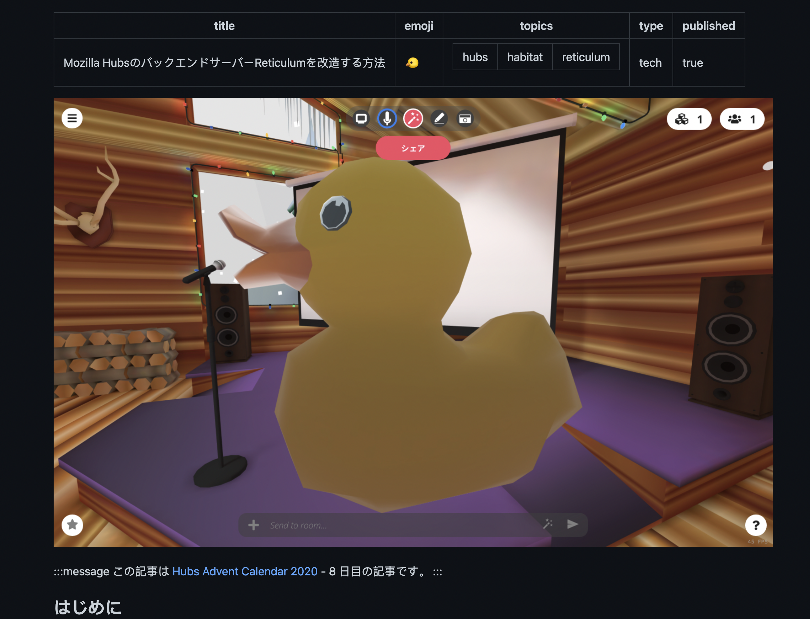

In the past few months, we have seen an increasing number of people and groups forking Mozilla Hubs, making modifications and [extending Hubs](__GHOST_URL__/extending-hubs-with-hubs-cloud/) in various ways. I asked some of our community developers what tips they wish they were given before diving into the Mozilla Hubs code base?

For example did you know you can use the chat command `/duck` to quickly bring in a 3D object in the scene for testing and debugging?

0:00
/
1&#215;

'/duck' for a quick test object
If you are just getting started, check out these bits of advice and tips from developers in the Hubs community:

**Rupert Rawnsely | **CTO [Avantis](https://twitter.com/AvantisEd)
You can pull the client code and run against the dev server with no need to spin up a Hubs Cloud.

**Louis Blesch**
Understand the difference between [running the local client](https://github.com/mozilla/hubs#quick-start) against hubs dev servers `npm run dev` and [a hubs cloud instance](https://hubs.mozilla.com/docs/hubs-cloud-custom-clients.html) with `npm run start`

**Micheal Morran | **Mozilla Hubs |[OnboardXR](https://twitter.com/onboardxr)
Fabien Benetou's [tools for prototyping and debugging](https://fabien.benetou.fr/Tools/Hubs) helped me get started a year and a half ago.

**Justin Colangelo | **[StandardMagic](https://standardmagic.com/)
Following along in that [deploy.js file](https://github.dev/mozilla/hubs/blob/93edcf2ad1a8089732d70c0d354a09b5aea6bdde/scripts/deploy.js#L1) was helpful. We've customized that to post to Discord/Slack/whatever kind of deploy channels we've set up.

The admin area server settings advanced tab can be tricky (it is called Advanced for a reason).
The advanced server settings of the admin panel allows you to set csp's, CORS and HTTP headers.
**Chris Calef**
If you need additional backend functionality or data storage but don't want to get into customizing reticulum, try looking at [lamdba functions](https://aws.amazon.com/lambda/) and connecting to services that way.

**Markus Traber**
These docs: [best practices](https://github.com/mozilla/hubs/blob/master/doc/best-practices.md) and [UI best practices](https://github.com/mozilla/hubs/blob/master/doc/ui-best-practices.md)
This diagram is also helpful to get an overview: [System Overview](https://github.com/albirrkarim/mozilla-hubs-installation-detailed/blob/main/docs_img/System_Overview.png)
System Overview by [Al Birr Karim](https://albirrkarim.github.io/)

💡

Markus also created [Awesome Mozilla Hubs](https://github.com/hubs-creators/awesome-mozilla-hubs) ⭐️ A fantastic list of resources.

**Meng Zhang**
I found [this article](https://github.com/kou029w/zenn.dev/blob/master/articles/hubs-custom-reticulum.md) on reticulum customization very helpful.
Reticulum customization resource by [Kohei Watanabe](https://github.com/kou029w)
Thanks so much to the many community devs who participated in the survey and offered their sage advice. You can get more information by following Mozilla Hubs on [Twitter](https://twitter.com/MozillaHubs) or joining us in [Discord](https://discord.gg/sBMqSjCndj).

_Ready to get started with your own hub? Visit _[https://hubs.mozilla.com/#subscribe](https://hubs.mozilla.com/#subscribe)_today_!
