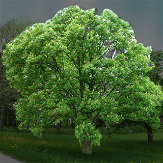
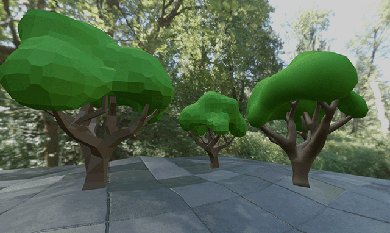

When someone says ‘virtual space’, you probably think of typical scenes you’ve experienced–the most common ones tend to have similar aesthetics like walls, floors, maybe a floating platform or two. But it’s much less common to encounter more organic elements like trees and plants. Despite these things being all around us in real life, trees, flowers, and other foliage are pretty scarce in the virtual realm. Anyone who’s attempted to create something organic in a 3d application would probably cite two main reasons:

1. Trees and plants are somewhat difficult to create (especially for something considered ‘decorative’)
2. Adding them tends to ruin performance, especially on lower-end devices.

It’s basically a lose-lose situation for most creators, but that doesn’t mean it has to be. If the idea of painstakingly building a tree from scratch sounds terrible, don’t panic just yet. There are some really cool techniques we can use to generate foliage. What’s even better is that these same techniques can be applied to lots of other 3d objects, including avatars. This is definitely one of those tutorials that could unlock new ways of doing things.

### First things First

If you’ve already gone down this road before, you’ve likely discovered solutions to making trees after searching the web a bit. There are several third-party applications and add-ons for generating trees–some paid, others free. From my personal experience, I have yet to find a solution that gives me the results I’m looking for. Sure, you may find ones that produce nice looking trees–even very realistic ones. But most of the time, the end result is something that simply will not perform well in Hubs (or in most realtime applications). Many times, third-party tree solutions actually require installing supplemental components and special code in the game engine itself, usually to handle ways of improving runtime efficiency like levels of detail (LODs) or instancing geometry.

So my advice would be to explore those options but to not spend too much time looking for a magic bullet to solve all your tree needs. You might eventually find something that works, but in the meantime, it wouldn’t hurt to learn some alternatives. As you make progress becoming better at 3d asset creation, you may even come up with ways of automating these processes or ways of adding more variety.

### Structure of a Tree

Just like when modeling any object, understanding a tree’s form and structure is essential to recreating one. Of course, we all know what a tree looks like, but there’s a big difference between how a tree is built versus how it appears. For example, a tree has a trunk and progressively smaller branches as you go up and out, then usually some leaves at the tips of the smallest twigs. But that doesn’t mean you perceive all those details most of the time.
Observing a tree's silhouette can help you focus on the largest forms while ignoring the smaller details.
Impressionist painters know this better than anyone–the leaves, when seen from afar, end up looking like massive shapes–or even one massive shape where you can’t quite distinguish between individual leaves. Sometimes a tree canopy is so dense that you can barely see the branches holding it up. Coniferous trees are often depicted as a giant cone of green–individual branches and needles aren’t even considered.

So the key here is trying to depict what a tree *looks like–*not necessarily trying to replicate its exact structure.

The type of tree I’m going to attempt will be a typical deciduous tree like a maple or oak– something with large clumps of leaves. I like to use [reference](https://www.progardentips.com/types-of-hardwood-trees/) whenever possible. I’ll definitely end up straying from the reference images, but it can be helpful to return to them whenever you feel unsure of where things should be headed.
This tree has the sort of shape I’m looking to recreate: Dense clumps of leaves that hide the smaller branches. I’ll likely deviate from this design but it’s a good reference to start with.

### Blocking in the Canopy Shape

There are countless ways to create the overall form and shape of a tree, and the type of tree you’re going for will ultimately determine the best method to use so bear this in mind while reading. You might know a better way to accomplish something shown here, but just know that any method is fine. We mostly just care about the end result.

I tend to think of the canopy of a tree as its defining feature, often more so than the trunk and branches. For this reason, I often start with the canopy first, then use those shapes as a guide for where the branches belong. This may seem backwards to you, but feel free to do things your way if you prefer.

In Blender, I’m taking advantage of the organic nature of its ‘Metaball’ system of modeling. Metaballs (no, not **meat**balls) are predefined primitive shapes that sort of ‘melt’ together to form larger shapes. They can be created from Blender’s ‘Add` menu–they have their own category. Once you make one metaball shape, you enter ‘Edit Mode’ and simply duplicate it to form the next shape:

0:00
/
1&#215;

Duplicating and moving the metaball shapes in ‘Edit Mode’ causes them to form blobby surfaces depending on their ‘Radius’ and ‘Stiffness’ parameters, as well as their proximity to each other.

☠️

Be careful renaming Metaball objects. Blender is very particular about their names, so changing them can cause them to stop functioning properly. I spent the better part of an afternoon trying to figure out why. Key takeaway: leave metaball names alone.

You’re not limited to spherical shapes. Here, I’m demonstrating a metaball ‘Plane’ in conjunction with a ‘Ball’. By using the ‘Negative’ checkbox, I can make the ball shape subtract geometry from the plane shape.

0:00
/
1&#215;

Setting a metaball’s ‘Negative’ parameter treats it like a cutting tool.
Back to my tree shapes, I’m continuing to duplicate and move various metaball shapes, looking at the whole thing from different angles so it looks good from all around.

0:00
/
1&#215;

Duplicating, moving, and scaling metaball shapes to form a rough tree canopy. I’m even using some negative shapes to form an interior underneath.
When it starts to look closer to what I want (or when I get tired of playing with blobs), I convert the entire metaball object to a basic mesh. This causes me to lose the ability to adjust the metaballs anymore, but from here I don’t really need them. Besides, I could always duplicate the object first before converting it in case I think I’ll really want to go back to it. Keeping it around can be useful if you want to make different shapes for new trees.

0:00
/
1&#215;

Converting the metaball object into a regular mesh. The convert menu got cut off at the bottom of the screen, but it’s just ‘Object→Convert→Mesh’ while in Object Mode.
You might notice that the resulting mesh’s topology looks a bit strange. That’s because of how the metaballs get calculated–you can kind of make out the concentric circles among the grid lines. It’s actually not that important what this mesh’s structure looks like since we’ll soon be covering it with leaves. But if you want to continue to sculpt or otherwise adjust it, now’s a good time to make it look more reasonable. I apply a ‘Remesh’ modifier and adjust various parameters until I get something with more evenly-spaced geometry.

0:00
/
1&#215;

The ‘Remesh’ modifier can be a quick way to get more evenly-spaced geometry across an object. If you plan on using Blender’s sculpting tools, remeshing can give you a better starting point.
You could continue pushing and pulling the mesh around, and for that I’d recommend getting to know [Blender’s ‘Sculpt Mode’](https://docs.blender.org/manual/en/dev/sculpt_paint/sculpting/introduction.html). Because there are so many sculpting tools to cover and because there are so many [sculpting tutorials already on the web](https://www.youtube.com/c/GrantAbbitt/search?query=sculpt), I’ll skip doing it. Just remember to save along the way in case you stray too far from your initial starting shape. I also recommend saving an extra copy of the mesh before going too deep into sculpting.

### Rough Trunk and Branches

I was going to get into the leaves, but I think it’s important to first get the overall tree shape figured out. Making the trunk and branches will get us set up for the second part of this tutorial series which can be a bit more complicated.

I like to move the canopy mesh up along the Z-axis, high enough to make room for the part that’s actually holding it up. I’ll be focusing on the trunk and larger branches while avoiding making branches that are particularly small like twigs. For this, I’ve got a really quick method.

I start with a plane, collapse it down into a single vertex, then extrude (e) it as if I were constructing the tree out of thin wires. Along the way I’ll be using the ‘Subdivide’ operation to insert more vertices and using general move/rotate/scale tools as needed. It’s important to keep viewing the branches from different angles to make sure that it makes sense from a structural standpoint. You may also want to ensure that the tree is aesthetically pleasing when viewed from other spots. I’m basically forking the structure and having the branches reach toward the larger clumps of my canopy mesh, splitting smaller along the way.

0:00
/
1&#215;

Building a basic tree structure with vertices and edges. There’s something nice about starting with such a simple model. We’ll soon add structure with a ‘Skin’ modifier.
Once the main branches are roughed in, we’ll add a ‘Skin’ modifier. It will start out kind of rough, but we are able to continue editing and extruding more branches while the ‘Skin’ modifier shows us the model with more dimension.

❗

If you encounter visible errors with the model, it’s often because of the ‘Skin’ modifier not knowing exactly how to handle certain intersections of edges and vertices. It’s usually caused by two vertices being too close together. You can select a vertex, press ‘g’ twice, then slide the vertex along an edge until the model ‘corrects’ itself. This is a bit of a balancing act, but most problems can be fixed with simple tweaks like this.

0:00
/
1&#215;

Adding a ‘Skin’ modifier instantly gives the edges thickness. It starts out too thick by default though…
From here, we can go into ‘Edit Mode’, select all the vertices, and use an operation called ‘Skin Resize’ (CTRL+a) to reduce the ‘fatness’ of the ‘Skin’ around each vertex.

By doing this strategically, we can adjust each limb’s overall shape. My favorite technique is using Blender’s ‘Proportional Editing’ (o) feature, using the option ‘Connected Only’ and shrinking down the tips of each branch. By spinning my mouse wheel, I can adjust how far the ‘Skin Resize’ creeps down each limb. You could do a similar thing starting at the trunk. Play around with the different curve options in ‘Proportional Editing’--the random looking curve could be used to make a gnarly tree that has limbs of varying thickness.

0:00
/
1&#215;

Using Blender’s ‘Skin Resize’ tool to adjust the thickness of the mesh around each vertex. This is a special tool that only works when using a ‘Skin’ modifier.
Depending on the type of tree, sometimes I’ll extrude vertices from the trunk to create roots. I tend to make them snake in and out of the ground but you can really customize their look to appear as if they have grown around or through other parts of your scene. Giving objects ‘history’ like this can greatly enhance the natural feeling of a scene. Just be aware that a unique-looking tree might not be so useful for duplicating if it’s too unique and recognizable.
Extruding the trunk into roots gives opportunities to match the terrain. It may not be the most reusable tree though.
I continue extruding, subdividing, and adjusting the skin thickness to progressively add more detail. Real branches tend to twist and turn as they reach for more sunlight so I try to mimic this behavior. I find this process relatively relaxing–not unlike [trimming a real bonsai tree](https://youtu.be/jBhKKI3h52Y?t=88). There’s not really a right or wrong way and it’s easy to change as you go.

0:00
/
1&#215;

Adding more vertices along the branches allows you to make smaller details and gives you new places to extrude new branches. Notice how the thickness tapers gradually as each branch reaches its end.

### A Good Place to Leave[.](http://https://www.youtube.com/watch?v=gBlfqgmmS_Q)

We’ll continue this tutorial in the next part, but it’s worth noting that this tree _could_ be considered finished. By applying some simple materials, this would make a nice stylized tree.

If I were stopping here, I would probably duplicate both the canopy and branches so I could continue editing later. It might be worth trying out a ‘Subdivision Surface’ modifier on the trunk/branches model. It smooths out the overall geometry, but you may decide you like the lower-polygon style instead. Also keep a close eye on the overall triangle count– one subdivision level too far can spend your whole geometry budget in one click! Then I would Apply any modifiers so that the meshes are as simple as they can be.

We can see what that tree looks like duplicated a few times, then rotated and scaled throughout a Hubs scene:
The simple version of our tree as seen in Hubs. The one on the right was exported with smooth shading just to show the difference it can make in the overall style. Note that there’s no fancy lighting or textures quite yet.
In the next part of this series, we’ll be using some clever techniques to add leaves to our tree canopy. Until next time, [join us on Discord](https://discord.gg/dFJncWwHun) and become involved in our community. We’d love to see what cool Hubs scenes you’re working on.
