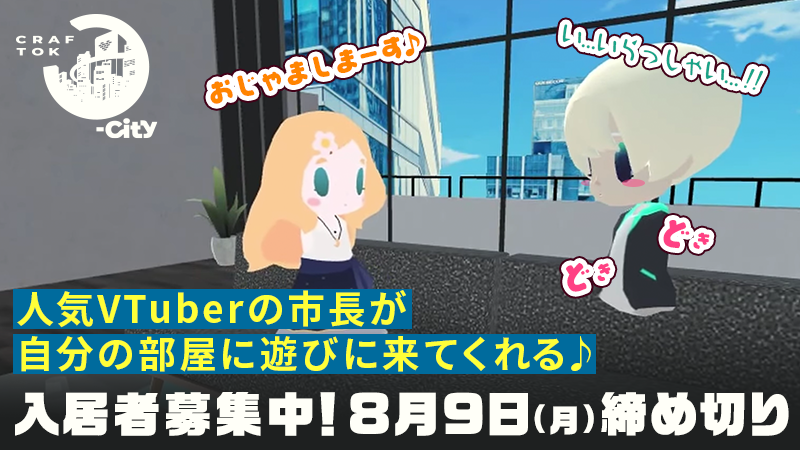

_This article is a Spotlight ✨ – part of a series of interviews with innovative Hubs creators highlighting their work. Have a creator in mind that you would like us to showcase? Let us know in the #creator-labs channel on [Discord](https://discord.gg/sBMqSjCndj)._

[Gugenka](https://gugenka.jp/), Japan based XR creative studio specializing in 3d spaces, is doing some exciting work building on top of Hubs. We will take a look at some of their successful projects partnering with brands like [Sanrio](https://v-fes.sanrio.co.jp/en.html#), popular anime properties and large telecomm companies.

What is DOOR? Could you tell us a bit more about it?

\*_minor edits to translations made for clarity_

> "DOOR" is an XR space platform provided by NTT, launched in November 2020 as Japan's first 3D space-based owned media.  It is a platform that enables free and open communication and information dissemination that only NTT can provide. Since its launch, it has been used by many people from individuals to companies.
> In response to the difficulty of communication between people due to the new coronavirus, we started development around June 2020 and We launched the service in November 2020. Our goal was to achieve both social distance and economic revitalization.

**Why choose Hubs for the DOOR project?**

> Because we wanted to realize a multi-device platform in the browser.  Also, because we felt it was a scalable and future-proof platform.

> - No application installation required.
> - Original rooms can be created.
> - Compatible with multiple devices including PCs, smartphones, and VR devices.

> We use Blender to create the underlying buildings and use the SPOKE function to place image links, etc.

**What  advantages do you see designing 3D spaces?**

> Since sound attenuation depends on the distance, the sound when people gather together is closer to the real experience.
> The advantage of this system is that, unlike web calls where people take turns exchanging words with each other, people can visit the venue and have a "face-to-face" experience with body gesture.

## TV Animation "86 EIGHTY-SIX" Online Exhibition

[More info](https://gugenka.inc/anime-86)

> Visitors can enjoy the world of the TV animation "86 EIGHTY-SIX" virtually. Panels featuring characters and scene photos were set up to allow visitors to experience the world of the anime. 35,000 unique visitors to the exhibition in a five week period.

## Craftok O-City

[More info](https://craftok.jp/ocity)

> The "Craftok O-City" opened in September 2021 with the concept of a virtual virtual city where you can live with your guest. Cities were created with 10 virtual celebrities as mayors, and tenants were invited to live in each city.  At the opening event held on September 12, the mayors visited the residents' rooms and enjoyed conversation with them.

## Anime "Hanma Baki" VR exhibition

[More Info](https://door.ntt/web/event_detail/index.html?id=49)

## SANRIO: Virtual Fest Sanrio Puroland

[More Info](https://v-fes.sanrio.co.jp/#)

> "SANRIO Virtual Fest in Sanrio Puroland" is a music festival in which artists, virtual artists, and Sanrio characters will perform in a huge space on the 5th basement floor of "Virtual Sanrio Puroland.

## Zegapain 15th Anniversary Virtual Exhibition

[More Info](https://ja.xrshop.jp/zegapain)

> To commemorate the 15th anniversary of the broadcast of the "Zegapain" anime, "Zegapain 15th Anniversary Virtual Exhibition" was held from August 6 (Mon.) to September 5 (Sun.), 2021, where visitors could experience not only the original drawings and settings but also as if they had entered the world of the work. Visitors can enjoy the world view and charm of "Zegapain" through the unique virtual exhibition expressions such as floating exhibition panels and moving effects.

## Knights of Sidonia - Virtual Reality Exhibition

[More Info](https://ja.xrshop.jp/sidonia-vr)

> In commemoration of the theatrical release of "Knights of Sidonia: Itsukumu Hoshi," an exhibition of famous scenes and videos from the past will be held in a virtual space. A large and powerful kekkei will also be on display as you proceed to the back of the building.

## Virtual Ocean Project

> We created the "Ocean Classroom" with the motif of an undersea base in order to create an environment where anyone can experience and learn about the ocean at any time. A number of ocean-related events are scheduled to be held. Just listening to the sound of the ocean flowing through the space will be a comforting experience.

## Nagaoka National College of Technology WHITE LAB

## Client Customizations

> At first, we localized UI in 3D spaces to Japanese. It used custom font images. This is important for many users in Japan. Other changes included adding UI to allow for a third person view and first person, and our own mirror component. These were based on requests from users of other VR platforms (e.g. VRChat) and achieved by using experimental features of hubs.

Custom Mirror Component3rd Person View

## Social Testimony

Selected Translations:

> I myself could not do it because I did not have the skills, but I felt it was a wonderful experiment to be able to see the room I had created and to talk about it with my supporters there.

> Unlike a typical 1-on-1 conversation event, the creation of rooms and the concept of a town connected to each room was appealing because it allowed the participants to feel as if they were part of the town and living together.

> It was great to be able to interact with the other fans, which was hard to do since the real events were cancelled all over the place. The mayor's avatar was also very cute.

> I was able to talk to my guests, of course, but I was also able to interact with the same fans that I had always only seen in the comments section or Twitter reps.

> Also, it was refreshing to be able to see the enthusiasm of other fans through the open Discord, and to feel the excitement of the event as a whole.

> I thought it was great that I could participate on multiple platforms, whether on a PC or a smartphone, and that there was no need to install a separate application.

> This event was my first experience with creating a VR space, and it was more fun than I had imagined. It was also a great pleasure to see my guests come to see the rooms I created.

> The room templates and assets were well prepared and beginner-friendly, and the event was a good opportunity for me to get in touch with VR.

> I was very happy to be able to talk with them while directly introducing what I had created. This is an experience that is not often possible at regular events, and I was happy to hear the reactions of the vtubers who spoke to us. It was my first experience to prepare a room, and there were some technical difficulties, but I really enjoyed the process of creating the room and worrying about it, thinking that I could directly introduce the space I had created for my guests and have them spend time in it.

Thank you Gugenka for sharing your inspiring work and experience with us in this Creator Labs Spotlight post!

For more Mozilla Hubs updates and Creator Labs content, follow us on [Twitter](https://twitter.com/MozillaHubs) or [Discord](https://discord.gg/sBMqSjCndj)
