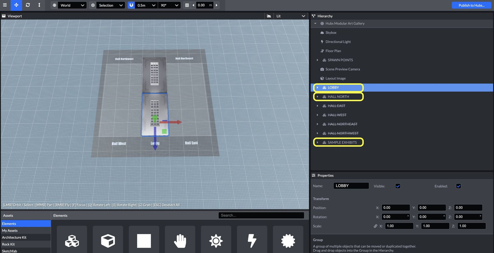
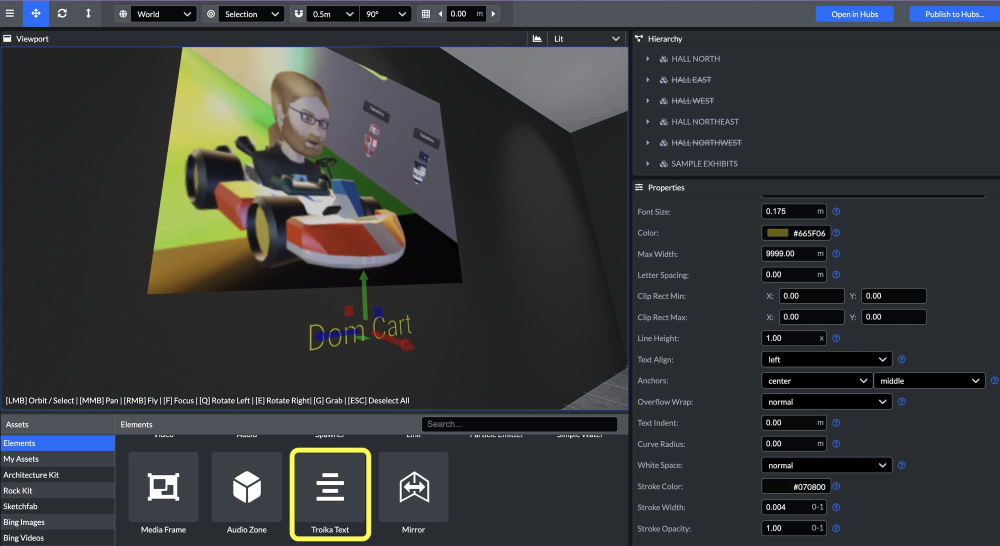

Looking for a unique way to share your photo's and art in a virtual meetup? This post will guide you to creating your own customized gallery for free with [Mozilla Hubs](Mozilla Hubs)

Galleries in Mozilla Hubs are unique because they:

- Allow artists to send links to a cross-platform accessible space without having to download any special software.
- Enable people to come together and celebrate art/photos for online events in interesting ways.
- Are accessible 24/7 around the globe.
- [Allow experienced artists and developers to customize the environment](__GHOST_URL__/5-incredible-art-galleries/) however they would like.

You don't need years of 3d art experience to build your first gallery! Let's get started with the [modular art gallery](https://hubs.mozilla.com/scenes/jOIjUE0/hubs-modular-art-gallery), a scene where you can easily customize the layout and content in [Spoke](https://hubs.mozilla.com/spoke/), a free and open-source scene editor that works right in your browser.

You can start by creating a new project and searching for the modular art gallery or by clicking 'Remix in Spoke' using the [modular art gallery scene link](https://hubs.mozilla.com/scenes/jOIjUE0/hubs-modular-art-gallery).

0:00
/
1&#215;

You can pause before jumping in and take the tutorial from the help menu. I'll walk you through some basics here, as well if you would rather dive right in.

0:00
/
1&#215;

You can try the Spoke tutorial and come back to the art gallery when you are finished.
Give yourself a moment to learn more about controls in Spoke. Hold right click and move your cursor to 'look' and you can use the ` W``A``S``D ` keys to move while holding `right-click`.

0:00
/
1&#215;

While holding right-click in the viewport you can get around your scene with the WASD keys. With some practice, you will be whipping around that webpage! Hold shift to go faster.
Starting from a new modular art gallery project in Spoke, notice the Hierarchy panel in the upper right? This panel will have all your scene elements and it's very helpful to organize your scene.

💡

You can center your camera to specific elements from the Hierarchy panel by double clicking a directory or element.

Note the items without a strike through are enabled. Items with a strike through them are disabled. Try expanding the 'Sample Exhibits' and double clicking on some items in that directory.
Need a new wing to explore? Enable the west hall, disable the walls, and regenerate the floor plan. The [nav-mesh](__GHOST_URL__/what-is-a-nav-mesh/) is what determines movement in a space, if you forget to update the floor-plan, people won't be able to navigate to your new wing.

0:00
/
1&#215;

Enable different sections from the scene hierarchy, disable the walls and regenerate the floor plan so folks can navigate there. If you forget the nav-mesh, they won't be able to get there without flying!
Now that you can customize the rooms, let's swap out some of the exhibits with your own photos.

0:00
/
1&#215;

Drag and drop images into your assets or directly onto the image element URL. Note you can transform properties by clicking and moving your cursor to the left or right directly on the properties for scale, rotation and position.

💡

Large images will hurt performance. Be sure you optimize your larger images for the web with tools like [squoosh](https://squoosh.app/). This can make a dramatic difference for visitors with slower internet speeds and older devices.

Adding labels with Troika Text
Hopefully now you are well on your way to publishing your own galleries. Once your gallery is set up, it's time to publish and share the [room link](__GHOST_URL__/what-is-a-scene/). With the room link, you will be able to invite people to your gallery and they can join with a mobile phone, tablet, desktop computer, or in VR!

For more Mozilla Hubs updates and Creator Labs content, follow us on [Twitter](https://twitter.com/MozillaHubs) or [Discord](https://discord.gg/sBMqSjCndj).
