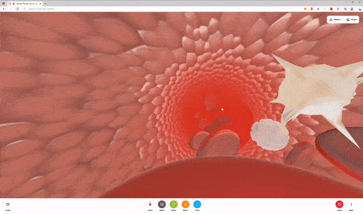

> _The following is a community-authored post. Have a post idea? We are accepting proposals [here](__GHOST_URL__/how-to-contribute-to-labs/)._

For all the breathless hype, "the metaverse" remains misunderstood. The broadest-possible interpretations of the word (i.e. that games like Fortnite or Roblox constitute one) are reductionist at best, and neither do the walled-off app stores of corporate tech giants approach science fiction's vision of an infinite, interconnected universe of limitless possibility.

Instead, as a technical director working on immersive experiences with Fortune 500 brands, I often cite former Unity XR VP Tony Parisi's *[Seven Rules of the Metaverse](https://medium.com/meta-verses/the-seven-rules-of-the-metaverse-7d4e06fa864c)*as a primer (or his [conversation with journalist Kent Bye](https://voicesofvr.com/parisis-metaverse-manifesto-unpacking-his-seven-rules-for-the-metaverse/) post-publication). Tldr? The metaverse ought to be accessible, open source with open standards, immersive-first yet multi-modal, and based on the already-very-real internet.

In these ambitious terms, only one metaverse exists in the world today, and that's the 3D open web. So far the paragon of this movement–the best expression of its ideals–is Mozilla Hubs. Based on years of research and competitive analysis on behalf of agencies and clients, in this post I'll make the case for why brands leading in "the metaverse" should look to Hubs.

## The immersive world as it is

First consider the competition. Across both native and web-based apps, here are some key features to look for in immersive platforms:
Also considered but not listed: Croquet.io, Rogue Engine, Wonderland Engine, and more.
My takeaways:

- Only web-based platforms can target billions of existing consumer devices with minimal friction, requiring neither download, app store nor install.
- No Hubs competitor offers a completely open source stack to allow total customization to meet your brand's exacting design and UX standards.
- No Hubs competitor offers secure, privacy-first, auto-scaling networking via AWS with minimal setup.
- A 3D content management layer is key to easily update scenes and experiences.
- Low-level graphics and shader APIs should be exposed to enable custom rendering, VFX and post-processing techniques, thereby expanding the range of creative possibilities.
- Hubs boasts incredible developer support communities extending from WebGL, three.js, A-Frame, WebXR and Mozilla.

These advantages add up to a fully-functional, ownable metaverse _now_, so how best can brands and agency teams convey their messages via Hubs?

## To center the brand, explore the impossible

When asked by colleagues or clients, "why XR" or "why Hubs," I point to _The Magic School Bus_. Therein our beloved Mrs. Frizzle can do impossible things, transporting your in-group to any place, at any time, at any size/scale, toward any given educational goal. As the trope goes, "VR can take you anywhere, AR can bring anything to you." Never has that been more valuable to people and business than in the last few years, and the possibilities are legitimately endless. Our team at [Paradowski Creative](https://paradowski.com) put these super powers to the test in this prototype for a multinational healthcare organization:

> [@paracreative](https://twitter.com/paracreative?ref_src=twsrc%5Etfw)&#39;s immersive team is exploring dramatic scene transitions in [@MozillaHubs](https://twitter.com/MozillaHubs?ref_src=twsrc%5Etfw), blending b/w unique settings w/ custom VFX & sound design:
>
> - central meeting place 🏝️🏛️
> - human blood stream 🔴🔴 ⚪
> - earth&#39;s orbit 🌎🛰️✨
> - stormy cornfield 🌽⛈️
> - sunny campground 🏕️🌤️ [pic.twitter.com/IxwNHVCeg5](https://t.co/IxwNHVCeg5) > &mdash; jamesckane (@jamesckane) [January 25, 2022](https://twitter.com/jamesckane/status/1486030526423121930?ref_src=twsrc%5Etfw)

Scale from the human bloodstream to near-earth orbit by scripting visual effects and audio.From orbit through the stormfront, into a rainy cornfield. Cue the thunder.
No matter your story or audience, there's a uniquely memorable, engaging way to bring it to life on Hubs. Seek out production teams who are experts at translating brand messages into compelling 3D content–what kind of talent does that require, anyway?

## It takes a village

Hubs and the 3D open web present technical, design and UX challenges best addressed in tandem by high-trust, interdisciplinary teams. Depending on the needs of your project, you may require one or more of the following:

- Concept artists (3D and/or 2D)
- UX/UI designers (3D and/or 2D)
- Art directors and/or texture artists
- Copywriters
- Animators and/or riggers
- Audio designers
- 3D technical artists skilled in the gltf pipeline
- Interactive developers
- VFX and shader developers
- Systems/backend/ops developers
- Project/product managers and/or account teams
- Media strategists/social promoters
- Voice or mo-cap actors
- Creative directors or executive producers

It's rare for agencies to retain such diverse talent in-house, but brands should value those who do. You're better off working collaboratively with teams of domain experts than over-relying on solo practitioner unicorns trying to work end-to-end across so many wide-and-deep disciplines.

## Understanding performance budget is critical

One disadvantage of the 3D web is, broadly speaking, that browser-based apps have lower processing headroom and memory limits than natively-installed apps. However, this is a navigable challenge for skilled teams practicing smart performance budget management.

The first step is to determine a minimum spec device based on your audience makeup. Is your target market a group of tech executives who will be running the latest Apple M2 chipset or 3090 PC VR rigs? Sure, lean into performance-heavy VFX. But if your experience needs to run on any low-end smartphone in a freshman biology class? Totally doable, but it means you'll need to consider creative alternatives to expensive high-end visuals. There's a universe of possibility across this spectrum, but it's important to set a target early.

Once min spec is decided, most any creative decision can be effectively thought of as a portion of your memory and processing budgets (which should be considered separately as devices can bottleneck on either).

That said, without deep experience in 3D technical art or development, it's rarely clear which design choices are "easy" and which will completely tank your app. Even *with *that experience, I'll admit the distinctions can seem arbitrary, and covering them is certainly out-of-scope for this post (for starters, see [Meta's post on art direction for standalone VR](https://developer.oculus.com/blog/art-direction-for-all-in-one-vr-performance/) which is not exhaustive but applies broadly). But by and large, brands should favor production teams whose creatives understand the performance implications of their decisions and whose technical teams will backstop and double-check those choices ad hoc to ensure a performant experience for all users. Such teams will also know when and how to push boundaries to deliver truly breakthrough, original work and ideas.

> 60 FPS on iPhone 12 Pro Safari [pic.twitter.com/LSjwnYMJ3S](https://t.co/LSjwnYMJ3S) > &mdash; jamesckane (@jamesckane) [March 12, 2022](https://twitter.com/jamesckane/status/1502437850721230853?ref_src=twsrc%5Etfw)

## 3D content management

Another big advantage of Mozilla's platform is Spoke, its 3D content management and scene composition layer. I'd describe the editor as "Unity-like," but a good analog from the traditional web might be the WordPress admin panel, where site content is authored to later be parsed into templates. Such CMS tooling is equally helpful on the 3D open web, allowing administration of multiple scenes for different use cases, and ensuring experiences remain modular and easy-to-update.

That's one reason why, in the spirit of the open web, Paradowski open sourced our Hubs-and-Spoke implementation of the amazing troika-three-text rendering library earlier this year, allowing greater support for non-English languages, unprecedented styling and content management of 3D text, and performant SDF glyph rendering, saving time and performance budget for Hubs artists and developers throughout the community.

> Thanks for contributing to Hubs and Spoke! Troika-three-text is a great and welcome addition! 🎊 [https://t.co/iIa4K0oZGA](https://t.co/iIa4K0oZGA) > &mdash; Mozilla Hubs (@MozillaHubs) [March 18, 2022](https://twitter.com/MozillaHubs/status/1504879040859045890?ref_src=twsrc%5Etfw)

## "Spatialytics" on the horizon

A recurring question from clients has been, "How do I understand user behavior in these experiences?" It's immediately clear in this context that page views and Tag Manager events no longer tell the whole story. How do we review and analyze what are users actually doing in virtual spaces?

At Paradowski, we're creating tools that allow us to peer into these 3D worlds with near-perfect records of user behavior, allowing for a level of spatial analytics rarely seen in the physical world, let alone the virtual. Such technologies will be invaluable as designers and technologists iterate on their work, providing a clearer picture of what content is functioning as intended and what isn't.

> Building "spatial analytics" for the (_gulp_) metaverse (read: the 3D open web) to help understand user behavior in immersive 3D worlds where Google Analytics can&#39;t go. Integrating w/ [@MozillaHubs](https://twitter.com/MozillaHubs?ref_src=twsrc%5Etfw) & [@aframevr](https://twitter.com/aframevr?ref_src=twsrc%5Etfw) first. Apart data playback at "Flight of 🐝" speed, s/o [@colinfizgig](https://twitter.com/colinfizgig?ref_src=twsrc%5Etfw)! [pic.twitter.com/JDxJcq7Kwr](https://t.co/JDxJcq7Kwr) > &mdash; jamesckane (@jamesckane) [February 1, 2022](https://twitter.com/jamesckane/status/1488540903434297345?ref_src=twsrc%5Etfw)

## Looking forward

While Hubs is the best expression of the metaverse we've got, it's still early days, and there's a lot of room for improvement. My top three asks?

**Customizable networking. **The Hubs Cloud architecture on AWS is amazing, but inflexible. More options for custom signaling across clients would increase the range of possibility for networked interaction, tools and even games within Hubs.

**An easy-to-use plug-in system. **The current workflow of publishing a custom Hubs client via Hubs Cloud and loading in fresh A-Frame components works, but Hubs still lacks a graceful plug-in architecture like WordPress or Unity.

**Drive up room capacity. **The amount of users who can join a single room before performance degrades depends on what device they're using, but over time, the average effective maximum should rise for everyone.

The positive news is, the Mozilla team is already making big strides in these directions, and their platform has a great chance to lead the 3D open web for years to come. Brands and businesses pioneering the metaverse should get onboard now.

---

[_James C. Kane_](https://jamesckane.com)_ is Director of Emerging Technology at [Paradowski Creative](https://paradowski.com)— currently focused on the intersection of spatial computing, 3D technical art, machine learning, and web/app development._
