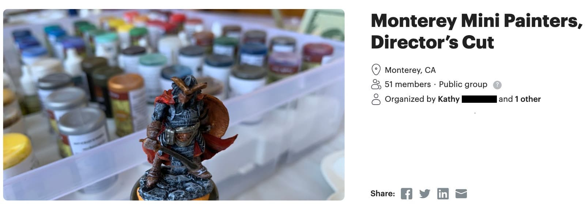
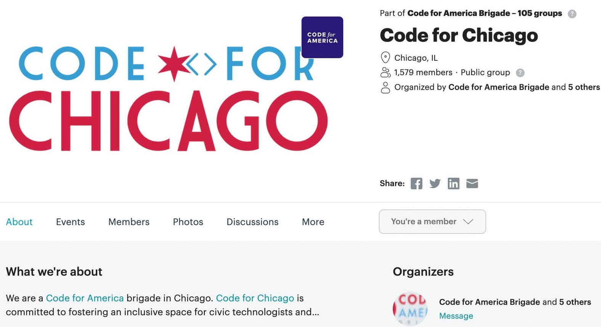
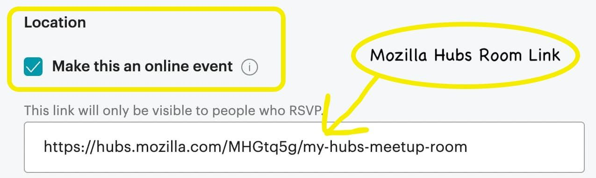
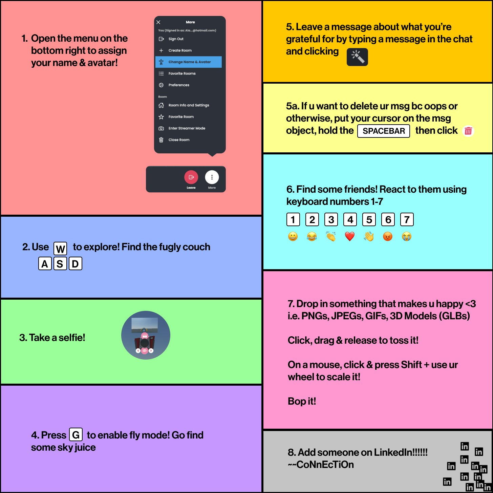
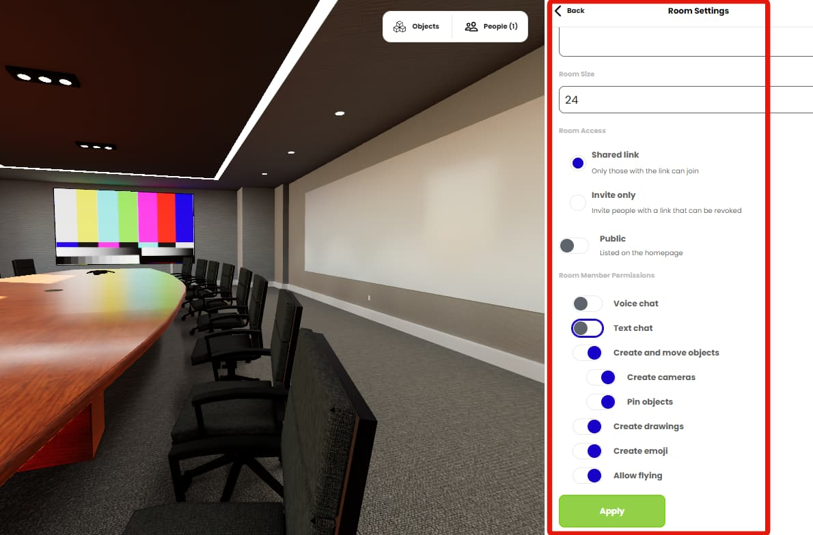

[Meetup](https://www.meetup.com/) is an online platform for finding and building local communities. You can find events for just about any topic you can think of – even groups where you can learn about pet poultry! 🦆

Events spanning all kinds of topics abound on meetup.com
Although meetup.com is primarily geared for IRL events, it also offers support for online events and allows you to list Mozilla Hubs rooms as event locations.
Hubs room links can be used for online events when organizing a new event on meetup.com

Not every online meetup belongs in 3d spaces. Consider what features might be beneficial to your meetup before jumping in. Meeting in Hubs is free, will work across many devices with modern browsers, requires no downloads, and respects your privacy.

Hubs is an open-source project from [Mozilla](https://www.mozilla.org/en-US/about/). Thousands have contributed 3d art, scenes, code, designs, bug reports, and translations to make Hubs what it is today.

Read on to help decide if a 3d space will serve your meetup community well and some tips for getting started.

**Room Capacity and Devices:**

Room capacity is a question that often comes up in the Hubs [Discord](https://discord.gg/sBMqSjCndj). We recommend a maximum of 25 people per room for the best performance on [hubs.mozilla.com](http://hubs.mozilla.com/).

Phones, tablets, desktops, and VR headsets with a modern browser will generally be compatible. [More details on controls here](https://hubs.mozilla.com/docs/hubs-controls.html).

**Designing and Choosing a Space: **
You can create and remix rooms from [scene links](__GHOST_URL__/what-is-a-scene/).

If you don't have time or a budget to design and build [customized spaces](__GHOST_URL__/5-incredible-art-galleries/), you can grab scene links and 'remix' them if the creator allows you to.

0:00
/
1&#215;

Getting to the scene link. _Neo-eden by [Mauricio López](https://twitter.com/elmau)_
[Gathering Hall](https://hubs.mozilla.com/scenes/KV6MwkU/gathering-hall) is the current default scene used when creating rooms from [hubs.mozilla.com](https://www.hubs.mozilla.com).

You can quickly swap out the duck posters with your other images in Spoke, Mozilla's web-based scene editor, by clicking 'Remix in Spoke' from the [scene page](https://hubs.mozilla.com/scenes/KV6MwkU/gathering-hall).

0:00
/
1&#215;

Dragging and dropping the image right onto the url after selecting the object in Spoke
**Onboarding your Participants**

**Controls:**
Plan for some extra time to get people comfortable with [controls](https://hubs.mozilla.com/docs/hubs-controls.html). Make sure they know how to move and look around, toggle their microphone and adjust their audio settings.

**Feature Discovery:**
Refer to the example onboarding poster created by [Alanah Lam](https://www.alanahlam.com/) for a casual networking meetup. Participants may or may not follow all the directions but at least you have something to fall back on. In this case, they [pretty much dropped everything](https://twitter.com/alanahlam/status/1486748051884568582) and ignored the hints once they learned they could fly around the space. Flying... weeeeeee!!        
Some clever prompts from Alanah Lam who [hosted a networking mixer event](https://twitter.com/alanahlam/status/1486747155779907589) in Mozilla Hubs.
**Avatars**

Encourage your participants to express themselves through their avatars. You can give participants the [option of making custom avatars](__GHOST_URL__/quick-customized-avatars-in-hubs/) before the event.

💡

Use the `i` key to toggle an inspection camera and quickly view your avatar.

**Moderation**

If you're a room owner, you will have the ability to mute others. This comes in handy in case of audio feedback, background sounds, or with some people that just… well… need to be silenced. 😶

0:00
/
1&#215;

Participant's device icon, name and sound indicator can all be found in the People menu with moderation options for room owners. Room owners have a star by their name.
You can also make adjustments from the freeze menu (space bar on desktop). There is an option to 'Hide' the person (this is not room-wide, just hides from you) and you can adjust the individual volume as well.

0:00
/
1&#215;

Hide from the in-room menu (spacebar) will hide the avatar and block their sounds. Individual volume adjustment is also possible from this menu.

Room admins also have options to disable chat and voice in the room. This can be very useful if you would like to keep the space 'open' and you cant be in the space to moderate. You should also consider disabling the pen tool and object creation as you see fit.
Don't forget to apply your room settings. You can access these settings as a logged in admin from the More menu --> Room Info and Settings --> Edit

There is a lot to think about when setting up events and virtual spaces are no exception! There are even groups of artists, developers, and specialists you can hire to help with organizing and hosting more customized meetups. Follow us on [Twitter](https://twitter.com/MozillaHubs) or ask in [Discord](https://discord.gg/sBMqSjCndj) for more information and let us know how your event goes!
