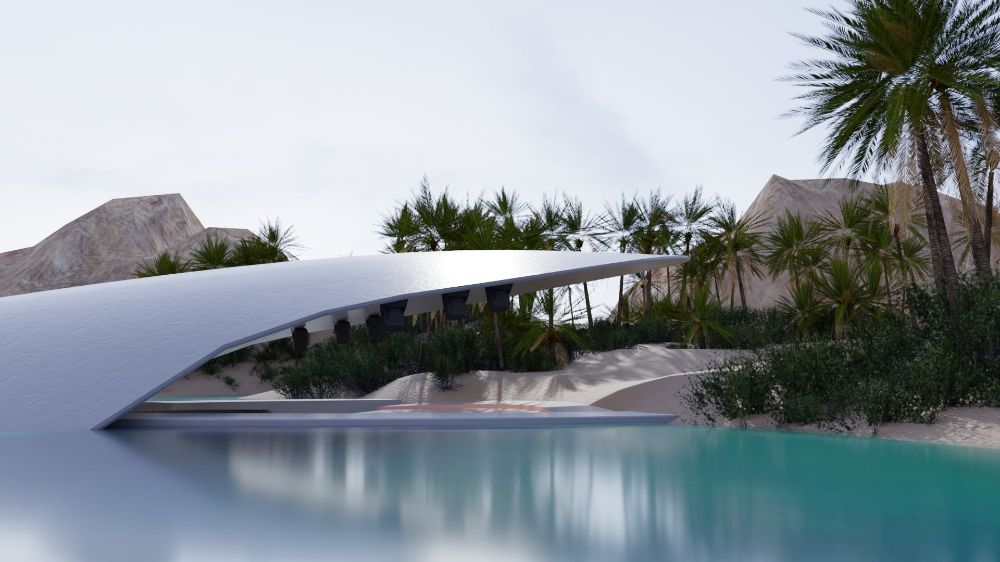

_This article is a Spotlight ✨ – part of a series of interviews with innovative Hubs creators highlighting their work. Have a creator in mind that you would like us to showcase? Let us know in the #creator-labs channel on [Discord](https://discord.gg/sBMqSjCndj)._

**1. What is Standard Magic? How did it come about? Why choose Hubs as a platform to build on/extend/find solutions with?**

> Standard Magic is an extended reality focused company that encourages exploration and learning of immersive technologies to create quality software and happy people. We're a remote-first team comprised of gaming industry veterans that helped to create popular games such as Myst, Command & Conquer, God of War, Kerbal Space Program, Monopoly, Blade Runner, Neverwinter Nights, and have worked with many other notable IPs at studios like Activision Blizzard, Sony, Microsoft, and Electronic Arts. We discovered Hubs when the University of Maine VEMI Lab approached us for help with setting up Hubs Cloud and have since adopted it for our go to platform for WebXR immersive content creation.

Standard Magic "Virtual Office"
**2. What are your clients typically looking for? What are some of Standards Magic's main strengths in meeting those client needs?**

> Our clients look to us for innovative solutions to their modern tech service and web3 / XR needs. Through our creativity-first company culture, we draw from our brain trust of UX, Game design, 3D art, and many other media industry experiences to deliver high wow-factor and high satisfaction results. From start to finish, Standard Magic is a company built from and by experts in their fields.

Standard Magic, Space Metaverse, and UMass Chan Medical School CoLabo
**3. What are some of the customizations and spaces you have made for your clients? How did you build those? What was the response like?**

> We’ve made many unique spaces including our Rococo Ballroom and Fantasy Hedge Maze, both of which set high standards by utilizing the full potential of Hubs’ HDR / IBL features. We have a battle-tested Blender to Hubs pipeline that leverages light mapping/baking and HDR whenever possible. We’ve also designed custom UI and interactive elements like access to stores to buy and sell your wares in each space, and new ways to learn and gather information.  Our clients love what we’ve done and are working with us to build up even more spaces and expand the customer experience.

Standard Magic UI and custom integrationsStandard Magic "The Ballroom" Blender render.
**4. Anything else you would like to share?**

> As Hubs continues to evolve, we’re here for the Hubs community to collaborate on pushing the visual fidelity and user experience beyond what we believed to be possible. Whether that’s building blockchain into your Hubs site, building new interactions, a custom backend, or creating hyper-realistic scenes we’re here to help.

Thank you Standard Magic for helping us create this Spotlight post!
For more Mozilla Hubs updates Creator Labs content, follow us on [Twitter](https://twitter.com/MozillaHubs) or [Discord](https://discord.gg/sBMqSjCndj)
