Optimization is important! It's what makes a 3D professional a professional. Here's how to do it, along with some theory that will help you understand _why_ we're doing it.

## The Performance Check

Image of Hub's Performance Check dialogue box.

#### High number of lights, materials or polygons

Your scene will run poorly on a device with a low end GPU.

#### Large file size.

Your scene will run poorly on a device with a small or slow hard drive.

#### Large Textures

Your scene will run poorly on a device with a small amount of RAM or a GPU with a small amount of VRAM.

For _why_ this happens and how to fix it, read on!

## Parts of a Computer

[ Parts of a Computer ](https://sketchfab.com/3d-models/parts-of-a-computer-e1c0e3cdf8744423b71d1737949efd47?utm_medium=embed&utm_campaign=share-popup&utm_content=e1c0e3cdf8744423b71d1737949efd47) by [ Jordan Elevons ](https://sketchfab.com/jordan.elevons?utm_medium=embed&utm_campaign=share-popup&utm_content=e1c0e3cdf8744423b71d1737949efd47) on [Sketchfab](https://sketchfab.com?utm_medium=embed&utm_campaign=share-popup&utm_content=e1c0e3cdf8744423b71d1737949efd47)

Before we get much further, it's important to have an idea of what all the parts in a computer do. This is because optimization is directly linked to how a device does what it does to display images on your screen.

## How Hubs Scenes are Displayed

Here's how your device loads and runs a 3D scene like Hubs;

#### Load Order

- Your device downloads the scene file from your Web Browser to a temporary folder on your hard drive.
- Your CPU instructs your operating system to load the files for the scene from your hard drive to your RAM for quick access.
- Then the CPU starts to send data from the RAM to your GPU.
- Your GPU loads that data into it's onboard VRAM (Video RAM) for faster access.
- The GPU calculates the lighting, polygon transformation, etc. and displays the result on your screen as pixels.
- The CPU will handle the physics, interface and almost everything not graphics-related.

### Target Device

The knowledge above will help you design for a **target device**, or what you want your 3D scene to run smoothly on. If you are aiming for a desktop computer with a graphics chip made in the last 6 years you can probably exceed the Performance Check by quite a lot.

However, if you expect your scene to run on a mobile device or Oculus Quest 2 then you need to be _extra_ careful to stay within the limits as these devices have a much lower processing capability.

## Optimizing Polycount

Reducing the number of polygons in your scene will free up any bottlenecks your GPU will have in trying to process them.

### Remove Unseen Polygons

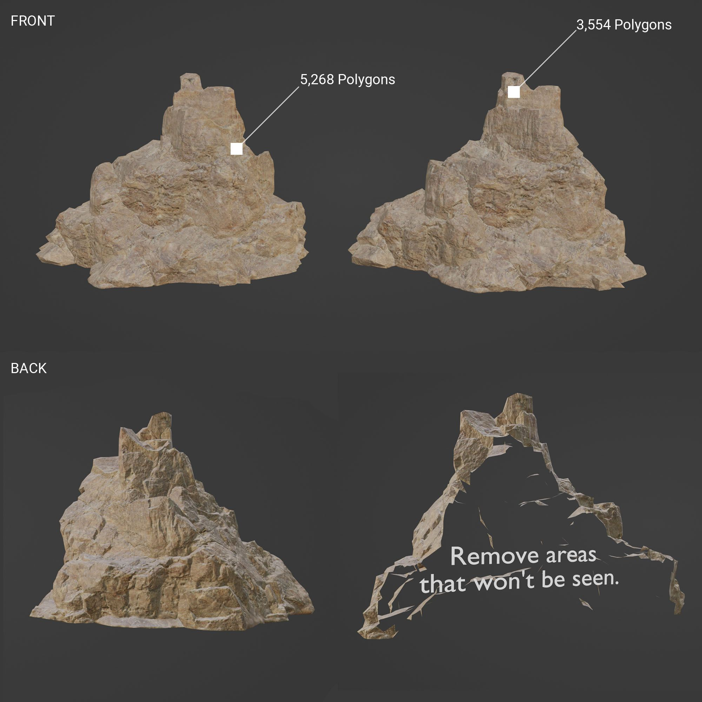Remove polygons from areas that won't be seen, like the back of background objects.

### Remove Unnecessary Polygons

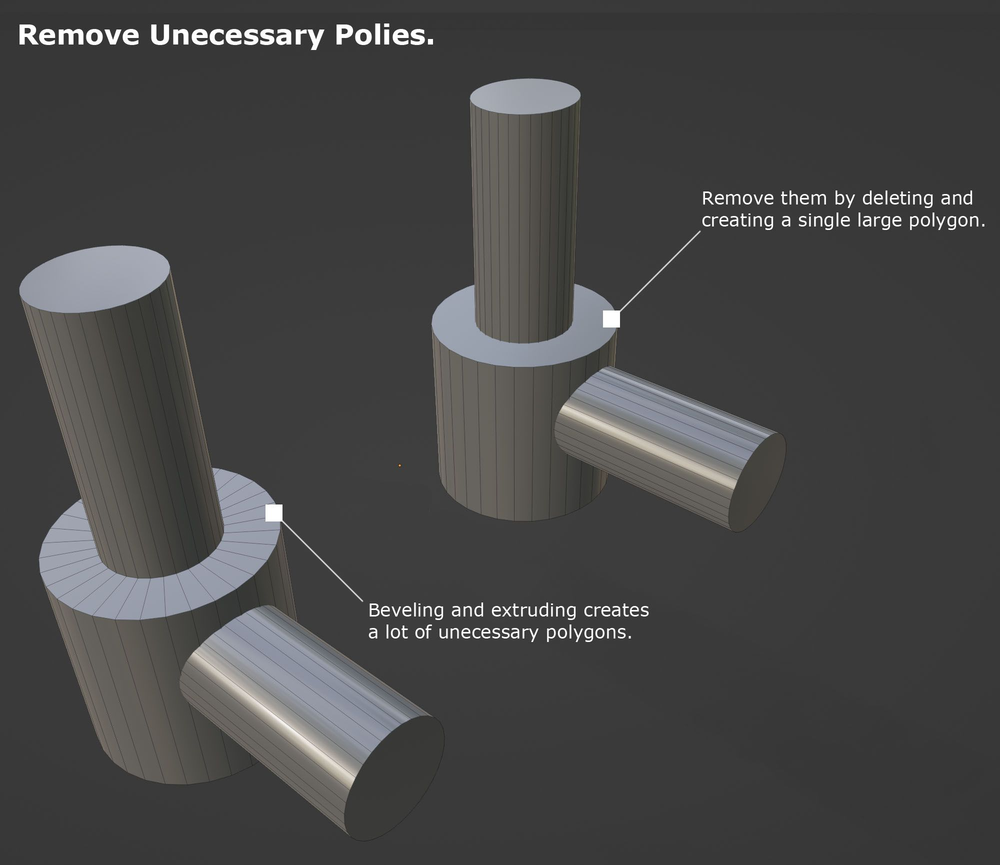The fastest way to model isn't the best way to optimize. Remove unnecessary polygons before export.

### Don't Join Unless Necessary

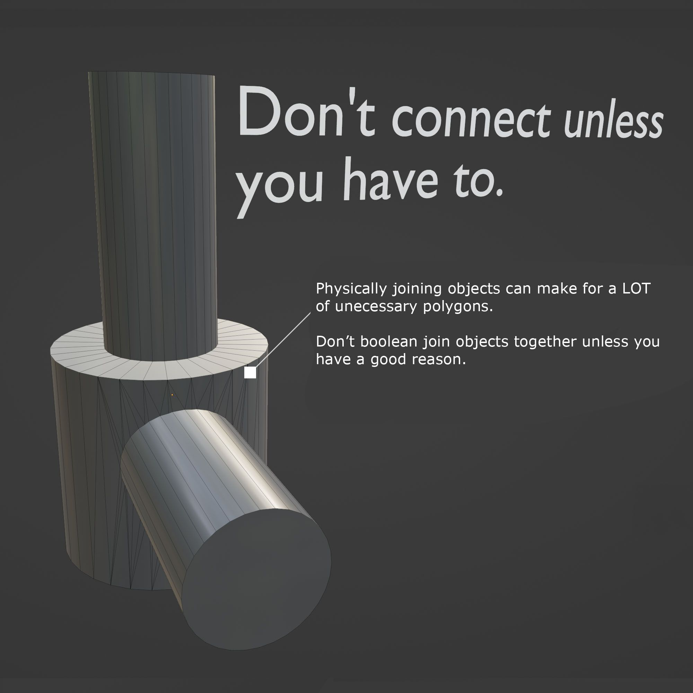Physically joining objects that don't have to be joined adds a lot of unneeded polygons.

### Avoid Cylinders with Smoothing Groups

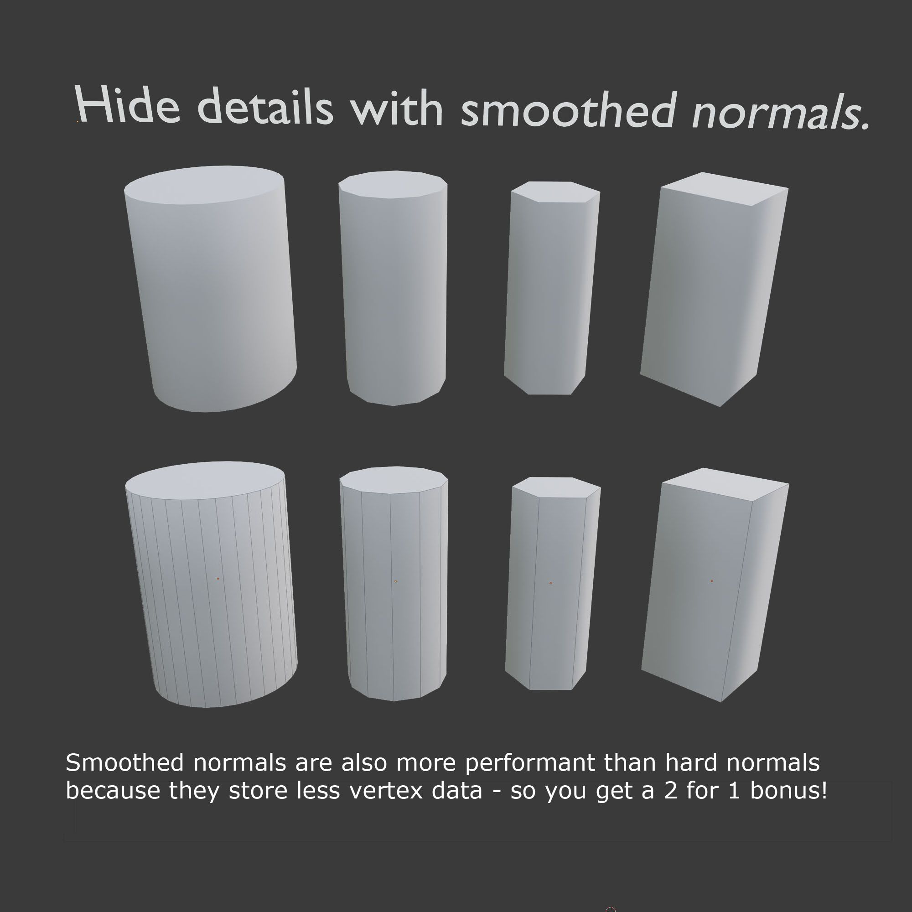Cylinders and other smooth objects can use a lot of polygons. This can be avoided by using smoothed normals to replicate the effect. Smooth normals are also more performant than hard normals.

### Using Materials & Textures for Text

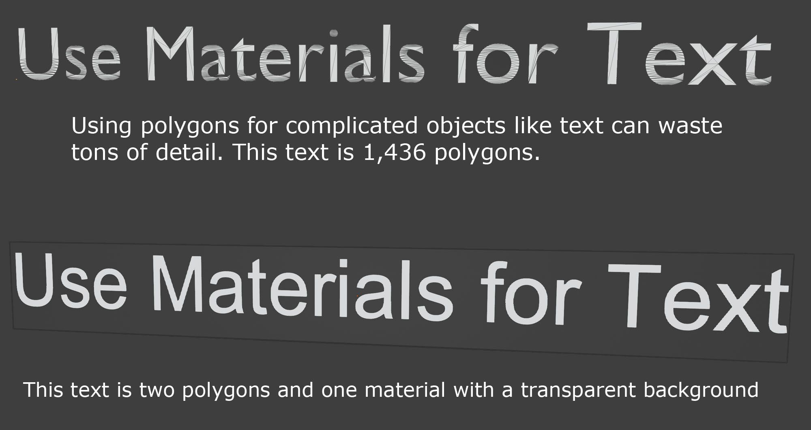By using materials instead of geo-based text objects you can save a _lot_ of polygons.

### Create Clean Geometry

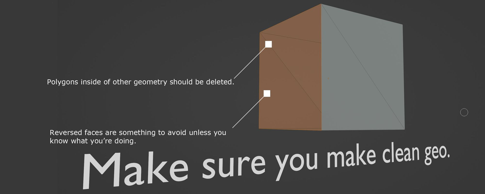By keeping your geometry clean, free of errors and internal polygons you can save a lot of render time.

### Avoid Long & Thin Polygons

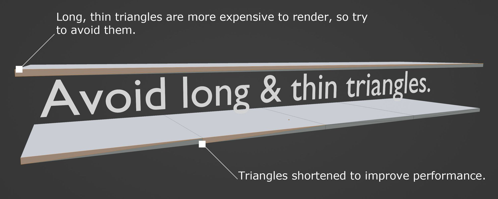This is less of an issue nowadays but long and thin polygons are more expensive to render so try to split them up if possible.

### Check out the Decimate Modifier

Blender has an amazing decimation modifier that will do a good job reducing the polygon count of your models. It's accessible in the modifier panel of your selected object. Check out the **[Blender Manual](https://docs.blender.org/manual/en/latest/modeling/modifiers/generate/decimate.html)** for more information on this great tool.

## Optimizing File Size & RAM Usage

There are two types of "file size" that you will want to reduce - the file size on disc (what you see on your computer) and the file size in RAM. Luckily optimizing for one also optimizes for the other. Making your file size smaller also helps users download and load your scene a lot faster!

When a device stores data in long term memory on the hard drive, that data is compressed to save space. When the device needs that data to do something, it loads it into RAM where it has to be uncompressed to be useable.

That's why the "Performance Check" in Hubs can show a small file size, like 4MB but a larger Texture Size - like 48MB. Textures are usually the biggest contributor to large RAM usage.

### Use Textures that are Powers of 2

A power of 2 texture is any texture with both dimensions as a power of 2.
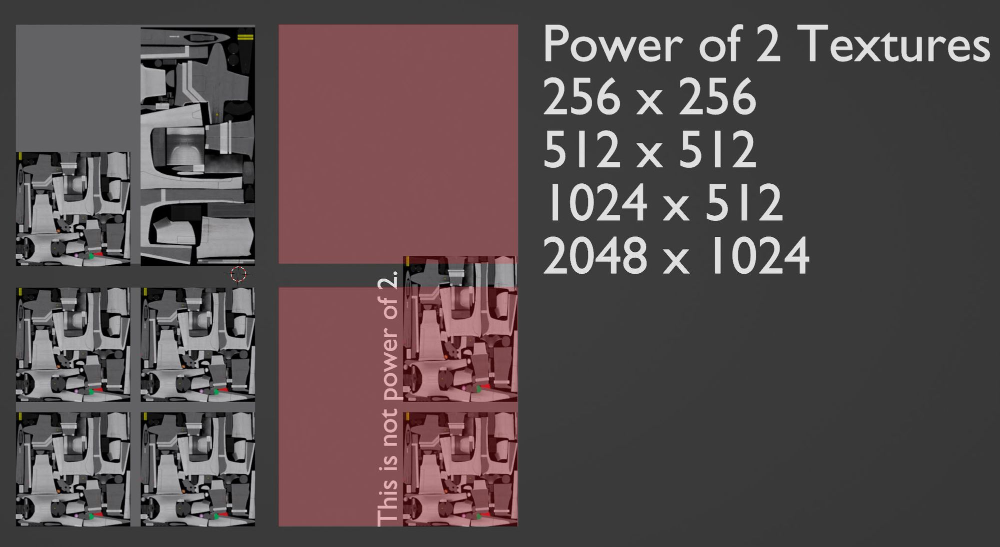Acceptable power of 2 textures include 256 x 256, 1024 x 512, etc.
If you have 1 gigabyte of RAM, it is split up into smaller blocks of bits. Each of these blocks are multiples of 2 - 2 x 2 bits, 128 x 128 bits, etc.

If your textures are ^2, then they will fit neatly into these memory blocks and save memory space and load time. However, if they are not a ^2 dimension, such as 1023 x 513 then your CPU will need to allocate them into more memory blocks to contain the odd number. In the example above we have a non-power-of-2 texture that has "spilled over" into the next memory block.

That block cannot be used for anything else, so we have essentially filled it up with nothing, increasing our memory footprint for no reason. Always make sure your texture's dimensions are a power of 2 for efficient RAM usage.

### Always Convert to JPG or PNG

The actual size of your image texture matters! Make sure to always convert from a native format to one of these web-optimized formats.
PNGs for normal maps and JPGs for all other maps are preferable.
JPG is almost always preferable - _except_ when it comes to normal maps and images that need transparency. These latter types of textures should _always_ be PNG; the color compression of the JPG file format will mess up your normal maps and introduce shading artifacts, and the JPG format does not support transparent images. So put simply; **keep your normal maps and textures with transparency as PNG. Convert everything else to JPG.**

### Reuse Your Textures

Reusing textures can really help you save memory and drive space. Use your roughness map as a diffuse, diffuse as specular, etc.
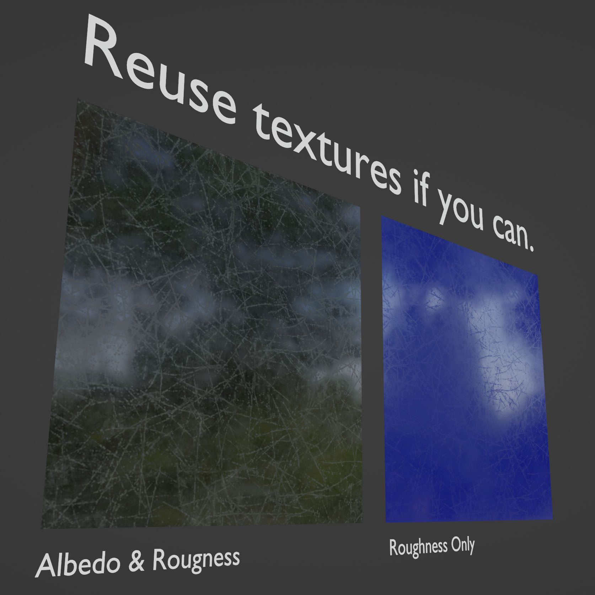Reusing textures for different materials and effects can save a lot of space.

### Minimize Texture Dimensions & Use Tiling

The smaller the texture the better. By using tiling (the repetition of a texture over a surface) you can make very small textures seem very detailed. Even textures as small as 256 x 256 can look fine on-screen if they are tiled enough.
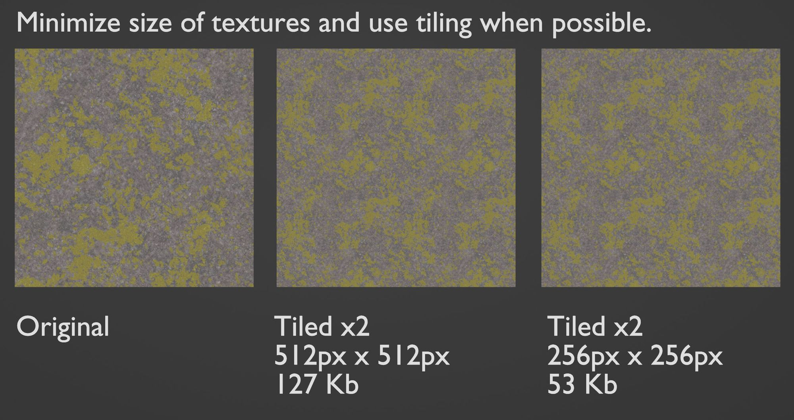By tiling textures there is virtually no visual difference between a high resolution texture and a low one.

### The glTF ORM Texture

glTF is the standard interchange format for web-based 3D and is of course what we use for Mozilla Hubs. It is specially designed to minimize file size as much as possible. One of the ways it does this is to pack three different material properties into a single texture using different colors of the RGB spectrum.
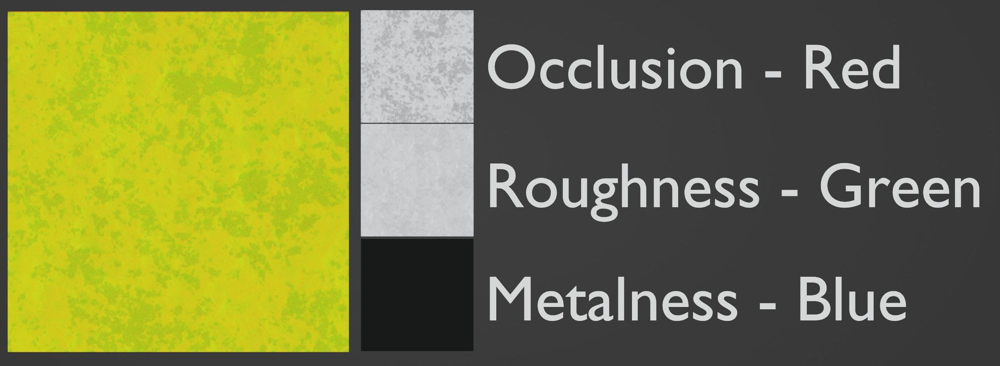Occlusion: Red, Roughness: Green, Metalness: Blue
This texture is created automatically via exporters from most 3D packages. However, one important thing to note: your ORM texture will be the size of the largest texture map. If your Occlusion and Roughness textures are 256 x 256 but your Metalness texture is 1024 x 1024, then the ORM texture will be 1024 x 1024. This can sometimes double or triple the size of that particular image file - so plan ahead and make sure your ORM files are all the same size that you want the final result to be.

## Optimizing Materials & Draw Calls

This is probably the most impactful metric for scene performance. A "Draw Call" is when the CPU tells the GPU to render (aka draw) something on the screen.

To save resources, these draw calls are batched by material - so if you have 30 trees that are all using the same material they are all rendered at the same time. This is why the number of materials used in your scene is _so important_. The more materials you have, the more this has to happen, which means slower GPUs will suffer a _lot_.
This video demonstrates draw calls. Credit: [Roman Marchenko](https://www.youtube.com/user/TheRomanMarchenko)
There are more advanced techniques to improve draw performance in other graphics engines, but on Hubs, we can focus on calls based on materials. Fewer materials = fewer draw calls = better performance.

### Minimizing Materials

1. The easiest way to increase performance is to reuse materials several times. If you have two red objects use the same material for each.
2. Hubs treats every imported object's material as a new material. If you import a red car and a red vase separately then Hubs will count that as two materials even if in Blender they are using the same one - so batch your GLB's intelligently.
3. Use a UV-mapped material across multiple objects. In the example image below several different kinds of plants are mapped to a single texture in a single material, then shared across multiple objects.

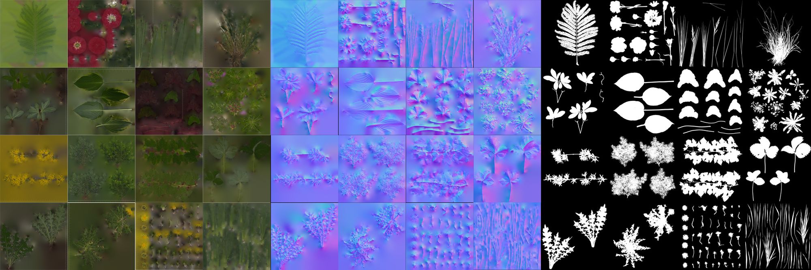By sharing one material across multiple UV mapped objects we can have many different kinds of objects use just one material! 4. Change the shape of posterboard objects rather than using different materials. In the example below I have the same material for these three trees but I have cut out parts of the polygon that they're mapped to. This lets me quickly get multiple tree shapes with only one material.
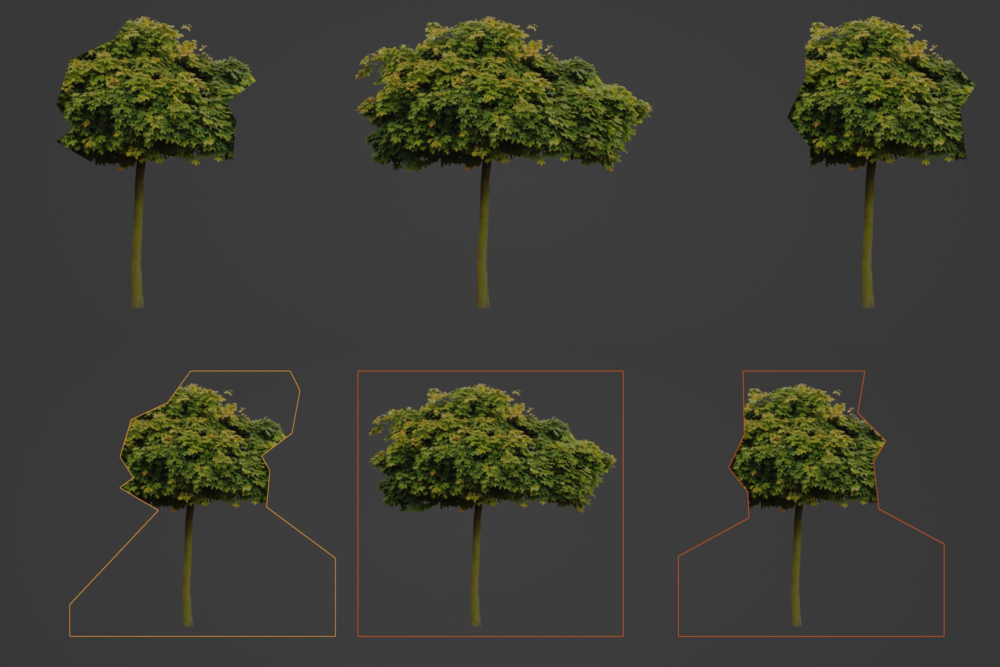One material can provide multiple cutout shapes.

## Hard Limits vs. Soft Limits

While implementing all of these techniques will yield the best results; optimization is a balancing act. If you have too many polygons you can trade some of that detail out for higher resolution textures - but you might increase your texture budget. So can you reduce the polygon count somewhere else or make other textures smaller? Etc. etc.

In terms of limits, "Hard" limits for Hubs are limits that are very important to keep as "medium" or "low" resource usage (yellow or green). "Soft" limits let you get away with a little more excess (red).

**Hard Limits:**

1. Material Count
2. VRAM Usage
3. Light Count

**Soft Limits:**

1. Polycount: most modern devices are able to push a lot of polygons with no problem.
2. File Size

## Closing

That's a wrap! For more reading on the rendering pipeline, I _highly_ recommend **[Render Hell 2.0](http://simonschreibt.de/gat/renderhell/)** by Simon Schreibt. For a vast wiki of computer graphics knowledge and a great game modeling community, check out **[Polycount](http://polycount.com/)**. If you have any questions or something is unclear in this article, please feel free to reach out - and happy modeling!
