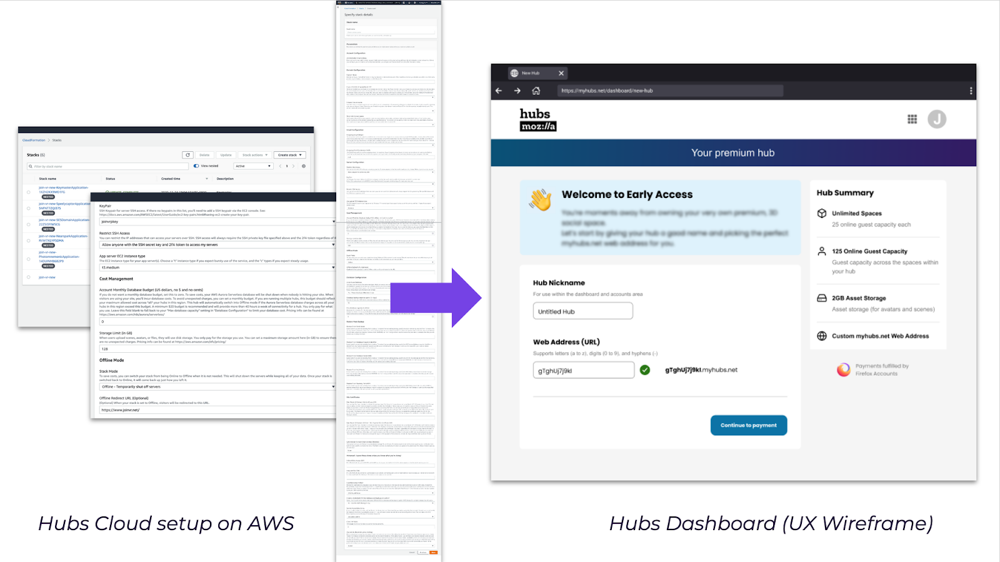
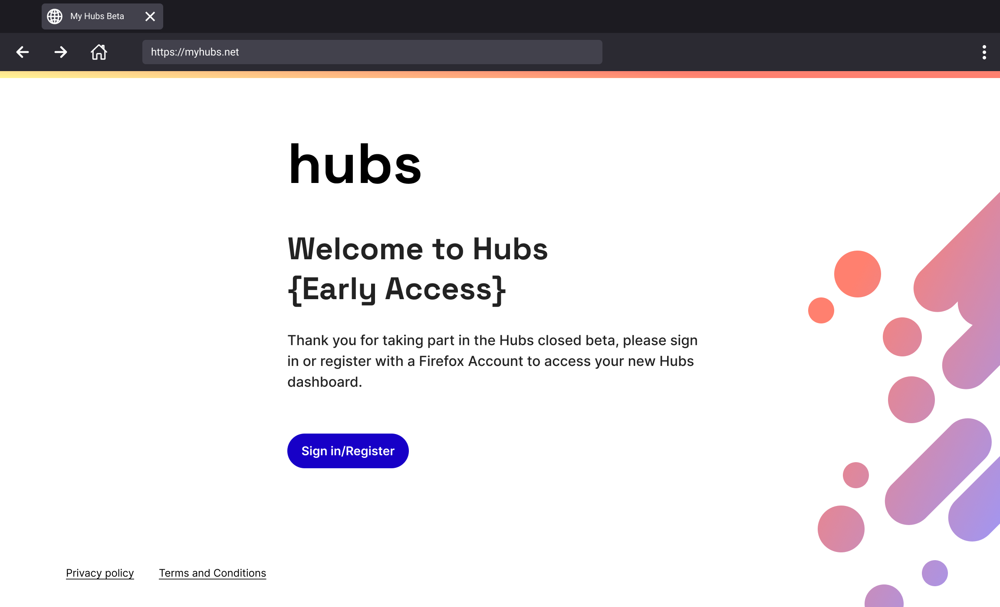

Hello, Hubs community!

If you’ve had a chance to hang out at a community meetup recently or spent time in our Discord server, you might have been hearing mentions of Turkey. No, we’re not replacing our beloved duck Penelope as the Hubs mascot or planning far in advance for holiday meals - we’ve been working on adding a new turn-key subscription service (code name: “Project Turkey”) that will make it easier to deploy and manage a Hub.

Since we launched Hubs Cloud back in 2020, you have proven that the growing community of creators and developers would benefit from having greater access to the features and capabilities as administrators of your own Hub. We have seen your variety of approaches, your plethora of improvements, and amazing new features you’ve built. Across the board, our team continues to be blown away by the work that you, our creative community, have accomplished. As you have demonstrated there’s no one-size-fits-all use case for Hubs. That’s what we love about the platform: everyone can really make it their own, and the Hubs Cloud model doesn't work for everyone… so with that, we’d like for you to have a sneak peek into “Project Turkey”.

In the next few months, we’re going to be rolling out the first publicly available paid version of “Project Turkey”, but we’re here today because we want your feedback as we shape our offerings! In particular, we’re looking for pilot program testers who have an interest in Hubs Cloud, but for whatever reason (cost, complexity, fear of the unknown, etc.) haven’t set up their own Hub.

**If you are interested in joining our pilot program, send us an email [hubs@mozilla.com](mailto:hubs@mozilla.com) or join the #hubs-pilots channel in [Discord](https://discord.com/invite/sBMqSjCndj)!! **

---

Q: Will I still have access to my Buffy the Vampire Slayer tribute room on hubs.mozilla.com?

Don’t worry, we wouldn’t take that away from you! For the time being, we don’t have plans to change the way that hubs.mozilla.com operates, and your tribute room is safe. However, we are thinking about how we can offer a migration plan from individual _rooms_ on hubs.mozilla.com over to our new offering for _hubs_, so that you’ll have more control over the experience you’ve made. Keep an eye out for more information in the coming months - we’ll aim to give you a significant heads up if we make any changes to this plan.

Q: What will happen to Hubs Cloud?

Hubs Cloud remains available on AWS. In the future, we are looking to make it simpler to deploy Hubs on different cloud providers.
