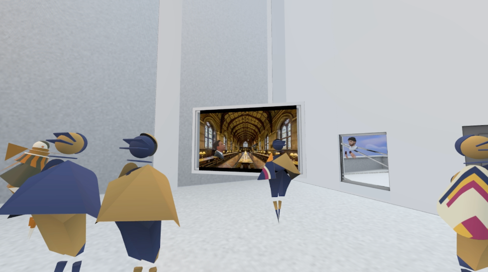
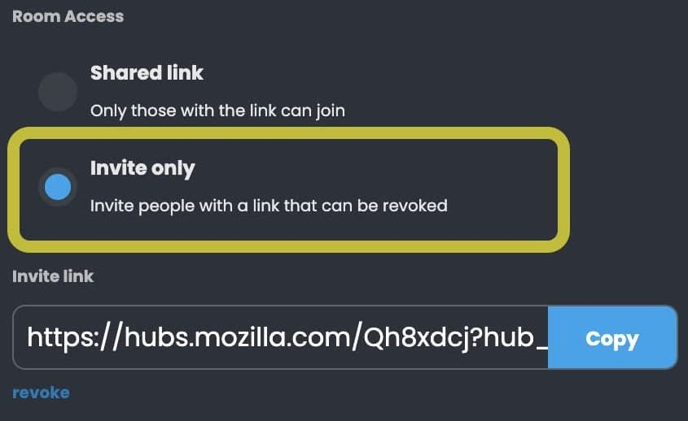
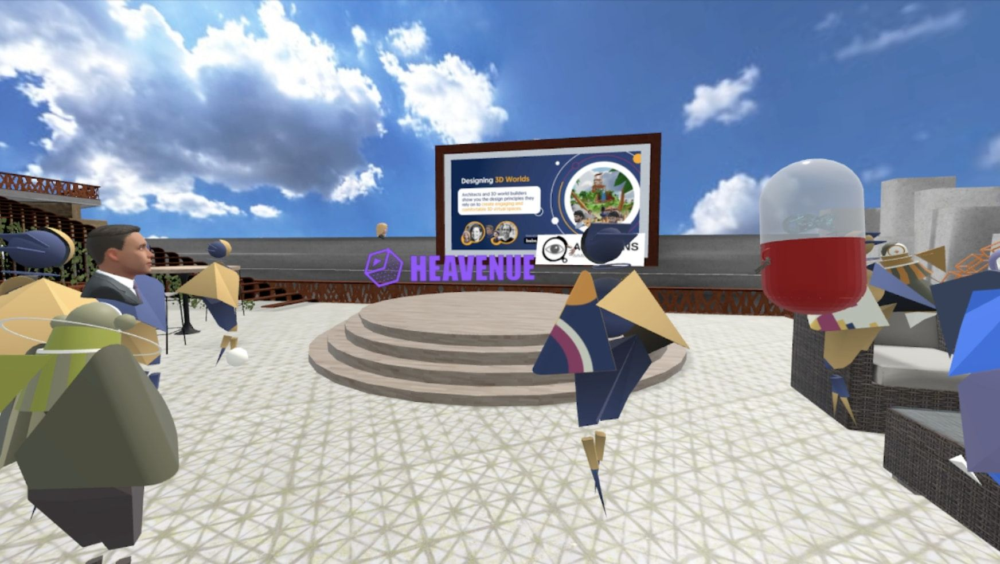
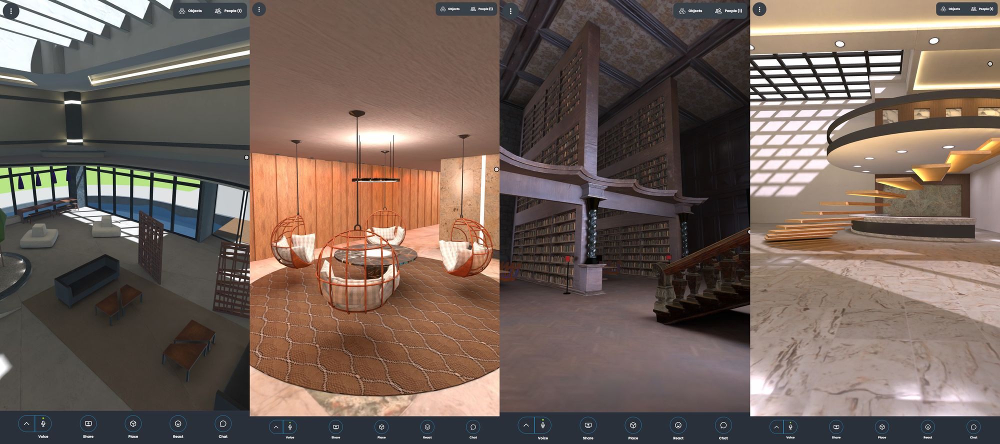

With any kind of event, one thing to consider is how your attendees will access the spaces you create. Virtual events are no exception - so today, we’re going to talk a bit about access configurations for Hubs.
[Active Replica's](https://twitter.com/ActiveReplica) Designing 3d Worlds Event
To start, it’s important to understand the way that access to a Hubs room works. By default, Hubs rooms are private. We don’t have a directory of discoverable rooms. The only person who knows your room’s URL when it’s created is you. If you share the URL with someone, they’ll also be able to join (like how you might use a Google Hangout). This works well when you have a small group that you can directly message, but for larger events protecting the URL can be a challenge.  In Hubs, there are a few different options for securing your room:

### Invite Link

The default setting to invite users to a Hubs room is to share the URL to the room. This is known as ‘Shared Link’ access. It’s good for meetings with known groups. One problem than can arise is that anyone could share it - and once it’s shared, there’s no way to lock the room back down. This means that if the URL is sent to people who you don’t want at your event, you won’t have an easy way to keep them out of the room.

To add a layer of protection, you can switch the room to be ‘Invite only.’ This adds a special access code to the end of the URL. If the URL is leaked, you can revoke the code at any time. Those who are in the room will be unaffected, but new guests (or anyone you kicked out) would need the updated access code to enter. This helps to keep the room safe and private.

To enable ‘Invite only’ mode for your room, go to More > Room Info and Settings > Edit > Room Access and select the ‘Invite only’ option. You can switch back to the shared link option at any time.

### Hubs Discord Bot

If you already have a Discord community (or are setting one up for your event)you can use the Hubs Discord Bot to create rooms that are only accessible to your server members. With the Hubs Discord Bot, you can use the bot to create rooms that are linked to individual channels. These rooms inherit the permissions of the server channel. Users will need to log into Hubs with the same email they use for the Discord server. Members can only join Hubs rooms that are linked to Discord channels they have access to.

Note that the Discord Bot does not work with Hubs Cloud.

### Securing Hubs Cloud Instances

If you want to keep your Hubs rooms completely private you might consider using Hubs Cloud. With Hubs Cloud, you can add a list of verified user accounts to an authorized list in the administrator console, and can turn on a setting to require sign-in to access your rooms.

This setting can be enabled by logging into your Hubs Cloud admin panel with an administrator account and going into the Accounts menu. From there, you can add a list of accounts with approved email addresses (and optional “identities”, such as a first and last name or a screen name) or add emails individually.

The optional “identity” allows you to identify an account. Hubs does not store email addresses in text form, so this makes it easier to find a particular user. You _can_, however, look up an email address to find the account associated with it.

If you want to remove an account from having access to your Hubs instance, you can edit the account and move it into a ‘disabled’ state. We are working on adding the ability to delete accounts fully from this panel.

If you are hosting an event and have a list of ticket holders, you can use this list to populate the approved accounts list. By using a Hubs Cloud instance  for your event, you will have more control over access (and get additional features, such as custom branding). While today’s Hubs Cloud offering currently requires AWS knowledge to set up, we’re working on a solution that will make this easier.
[Active Replica](https://twitter.com/ActiveReplica) used an additional third party ticketing service for this event.

### The Allow List vs. Block List Approach

Hubs aims to minimize the amount of personal data that we collect about individuals, which is why we use a magic link sign-in method over a traditional email address + password for authenticating users to a hub. While we’ll likely introduce flexible and configurable authentication methods for setting up hubs in the future, for the time being, we’ve gone with an “Allow list” approach over a “Block list”.

An “Allow list” ensures that administrators of a hub know exactly who will be accessing their spaces. This is great for events like conferences, where the “allowed” users are people who are registered for an event or who have bought a ticket. The combination of having an email log in and the allow list enables an event to have guests and visitors added to the Hub before the event starts, without requiring their visitors to create accounts or give up additional personal information.
Event spaces by [Virtuatos](https://www.linkedin.com/company/virtuatos). | [Instagram](https://www.instagram.com/virtuatos/)
Of course, there are many other authentication models and systems that do things like enable organizational access - so that anyone with an @mozilla.com email, for example, would be able to access a space. These are avenues we’re thinking about as we consider identity across the board with Hubs, so if you have any thoughts or feedback on the topic, we’d love to hear them!

_Ready to get started with your own hub? Visit _[https://hubs.mozilla.com/#subscribe](https://hubs.mozilla.com/#subscribe)_today_!
