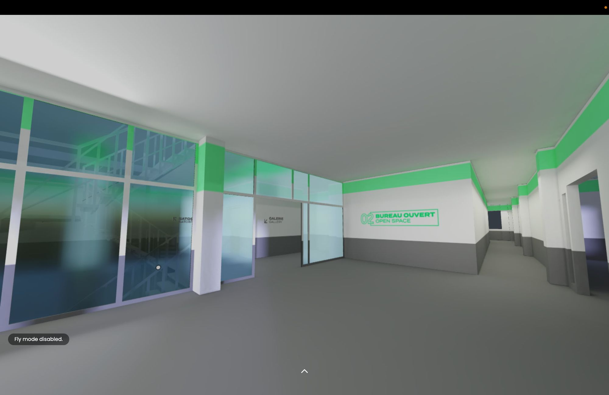
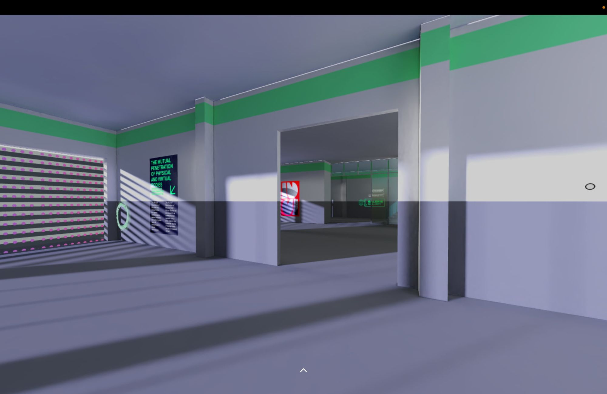
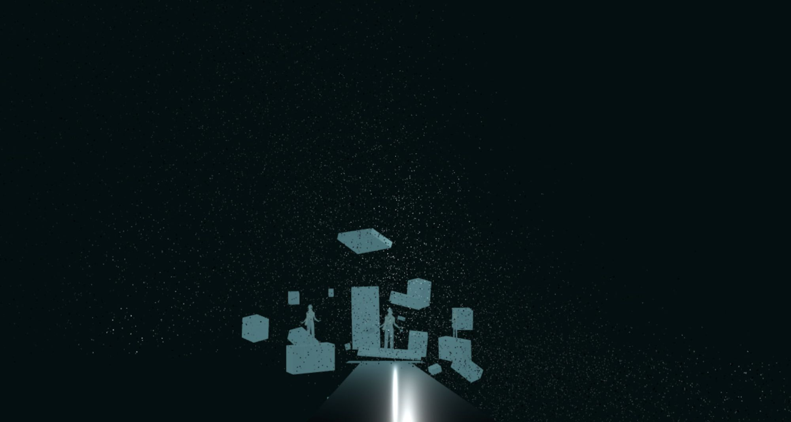
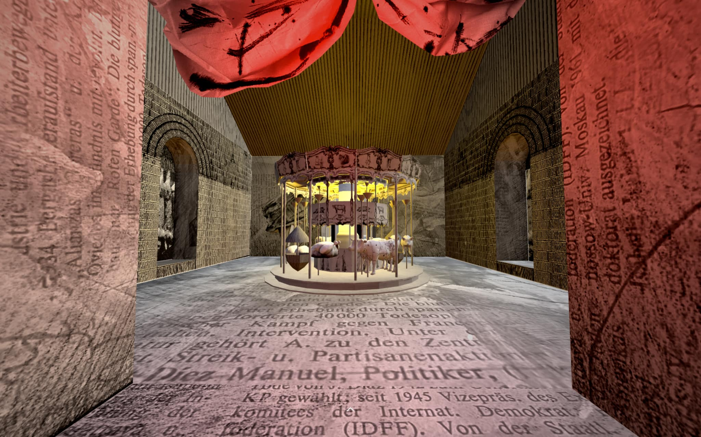
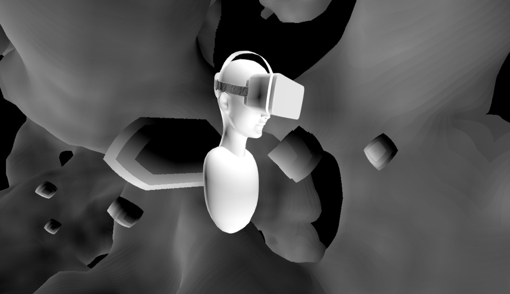
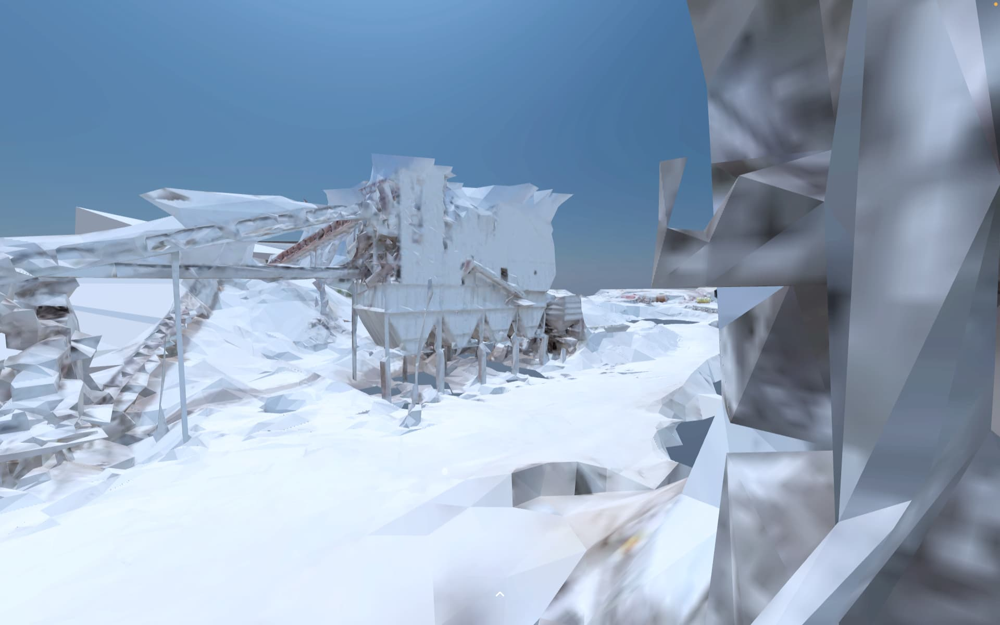

_This article is a Spotlight ✨ – part of a series of interviews with innovative Hubs creators highlighting their work. Have a creator in mind that you would like us to showcase? Let us know in the #creator-labs channel on [Discord](https://discord.gg/sBMqSjCndj)._
[

The Society for Arts and Technology | SAT

Société des arts technologiques

](https://sat.qc.ca/en/sat)
**Could we have a brief introduction to The Society for Arts and Technology (SAT)?**

> Founded in 1996, the Society for Arts and Technology [SAT] is a non-profit organization dedicated to digital culture. The Society for Arts and Technology is a place of collective learning that holds the promise of exploring technology to infuse it with more meaning, magic and humanity.
>
> Satellite, is a web XR platform, launched in 2020 to support the cultural sector in Quebec based on the Mozilla Hubs platform. Satellite hosts training sessions, virtual broadcasting and art with live museum experiences.

Satellite Virtual Office
**Could you tell us a bit more about how SAT has been using Hubs-Cloud?**

> The Satellite team has been using Hubs in a few different ways. We use Hubs as a means to broadcast digital art pieces done through residencies with SAT. Since we can have independent code from room to room, we can achieve a lot of customization on a per room basis, allowing residents to develop their own interactive functionalities. We use Hubs as live/recorded areas for true multiplayer events such as digital music, theater, and modern dance performances. Our “true dome format” multiplayer video playback projection room is a very useful and budget-sensitive solution for dome video directors to get feedback from teams in a real-time setting. Our SAT virtual space serves as a digital lab to not only test visual effects, but reflect on how location and its surroundings influence us. Using sound and visuals in Hubs based on avatar location and proximity to various things seems to fill and help diminish the gap between real-life interactions and virtual world interactions to further enhance learning experiences in museums and other similar cultural venues.

0:00
/
1&#215;

Line and particle systems in a behind the scenes tour of Satellite at the Hubs Community Meetup.

**You recently sponsored artists to build 3d spaces, could you tell us more about projects and people involved?**

> Five projects have been selected for these residencies which take the form of artistic creations in the virtual spaces of Satellite.

**Below you will find the five projects, information and some notes about the special custom features added.**

## [Presence - Antoine François-Saint-Maur](https://satellite.sat.qc.ca/4h2hvjy/presence)

> Presence: The state of being for someone, something to exist physically, materially, within a determined space. The act of participating, of playing a role somewhere. The phenomenon of experiencing one’s own existence. Présence is an experiment combining a broad spectrum of performing art disciplines: dance, music, circus, and theater. Holographic actors meet a virtual audience, spectating from their webcams. Présence proposes a dramatic reflection on our critical perception, our role in this world, and on the meaning of our existence.

> Created by Antoine Saint Maur With: Bernie: Frédéric Barbusci Duchesse Doone: Amélie Geoffroy Grand Manitou and Mario: Dominique Hamel Music: Composition: Antoine Saint Maur Saxophone: Geneviève Gauthier Creative coding: Philippe Provencher Thanks to the Satellite team for their precious help (Gwendal Creurer, Rochana Fardon, Paule Mainville, Éric Poirier @ Kursr and Audrey-Anne Whittom) In order to be “present” and for others to see you and hear you: - Activate your microphone and camera - Make sure to be in a silent environment with enough ambient lighting

**Special Features Built-in:**

> Dynamicand realtime video feed manipulations: original video is split in many parts for each character, camera angle and/or cue controls used for calling methods inside our code.
> Original video has a green screen and gets removed at runtime and replaced with a transparent background. Each split video part is then re-injected inside AFrame as individual components / assets (with the help of ThreeJS planes).

## [Cassandra Rooms - Anke Schiemann](https://satellite.sat.qc.ca/DPyCdhT/cassandra-room-1-3)

> Cassandra Rooms is a future bound fantasyland, a spatial metaphor for human existence. The interactive WebVR space consists of a series of rooms illustrating snapshots of human life, such as birth, religion, human suffering, animal suffering, and death. Just like Cassandra, who was cursed to be able to predict the future without being believed, it seems just as impossible for us humans today to react according to our own apocalyptic visions of the Anthropo/Techno/Capitalo-scene. Cassandra Rooms is a somber reflection on the human condition and its future.

0:00
/
1&#215;

Behind the scenes tour of Satellite at the Hubs Community Meetup.
**Special Features Built-in:**

> Realtime “lighthouse style” rotating ThreeJS spotlight.
> Custom bounding box based text panels integration. ( text “pop-ups” visibility toggled from collision with bounding box).    
> Custom bounding box based URL switcher ( current URL changes when avatars collide with bounding box ).

## [The Mutual Penetration of Physical and Virtual Bodies Daria Smakhtina - Vadim Smakhtin](https://satellite.sat.qc.ca/ktWzSMr/the-mutual-penetration-of-physical-and-virtual-bodies)

> An interactive environment for two users that are learning to communicate in a room using only their body’s language. The first user is presented as an avatar (Physical Body) inserted into the space which is fully controlled by the second user (Digital Body).

> Using his body language, the second user is able to control the appearance of the room, employing it as a spatial communication device. Depending on your role you can visit and experience the room in two ways: To observe the space as a Physical Body you can press Join Button and start interacting with the environment. To influence the space as a Digital Body you can open an additional link and try changing the Room’s space with your hand’s gestures that are tracked by the camera on your device. Please press Spectate Button and open the Link below in a separate browser tab. This will allow you to control the room and see changes: [https://mutual-penetration-controller.web.app/?model=mediapipe_hands](https://mutual-penetration-controller.web.app/?model=mediapipe_hands)

**Special Features Built-in:**

> The control room side of things uses a tensorflow javascript integration to grab “hand skeleton” data in realtime (from a webcam) and send it to a socketIO “side” server we are running for our specific needs. Hub’s  Room then receives data and modifies a web shader that does live “compositing” of the whole room. Simply put, the room changes depending on hand and fingers positions of the person in control.

## [Oscuterium - Michal Seta - D. Andrew Stewart - Dirk Stromberg](https://satellite.sat.qc.ca/9Jog9bG/oscuterium)

> In Oscuterium, RedSpills (Seta, Stewart, and Stromberg) perform on three Digital Musical Instruments (DMIs), sending OSC control data remotely into a HUBS scene that is equipped with embedded VR synthesizers. The tangible physical gestures required to maneuver and operate the DMIs are "transduced" into data signals that produce high-quality sound and manipulate VR objects.

**Special Features Built-in:**

> Full Faust javascript integration running inside of Hubs.
> Faust is a functional programming language for sound synthesis and audio processing  [https://faust.grame.fr/](https://faust.grame.fr/) and allows exporting into many languages and binary formats including WASM
> Faust DSPs development.
> A synchronization library was created to sync up live playback for participants (OSC - FAUST - SocketIO) . A SocketIO logic layer inside of hubs receives data sent from the library, massages it and sends it back to Faust which plays back the music.
> Sound synthesized directly in the client.

## [In this Land - Patricia Echeverria Liras](https://satellite.sat.qc.ca/vmUjifs/in-this-land-wadi-abu-hindi-1-4)

> While villages are disappearing in the real world, real estate speculation in the virtual is on the rise. Real estate prices are soaring. What will happen then to these marginalized villages & communities which are simultaneously disconnected from access to the virtual, and the real? ‘In This Land’ seeks to digitize spaces, cultures, and histories that are disappearing in the real world, as a result of modernization, colonization, and environmental threats. We are building a cultural repository for the future, one that brings fragile cultural heritage, marginalized communities, oral histories, and rituals into the metaverse. The following are the coordinates of a disappearing landscape : Wadi Abu Hindi. 31.7586° N, 35.3161° E

**Special Features Built-in:**

> High performance JS particle engine integration based on THREEJS-BAS shader engine.  
> Custom bounding box based text panels integration. ( text “pop-ups” visibility toggled from collision with bounding box).

Many thanks to the team at SAT Gwendal Creurer, Paule Mainville, Rochana Fardon, Lucas Tassaux, [kursr.ca](http://kursr.ca/), Audrey-Anne Whittom, Charlie Leroy for all their contributions and for making this post possible.

For more Mozilla Hubs updates and Creator Labs content, follow us on [Twitter](https://twitter.com/MozillaHubs) or [Discord](https://discord.gg/sBMqSjCndj)
