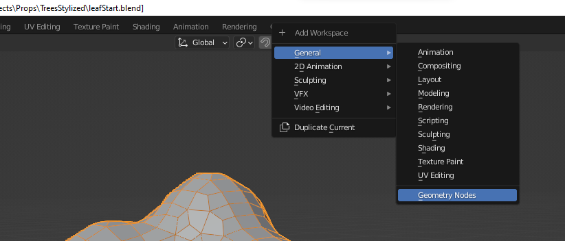
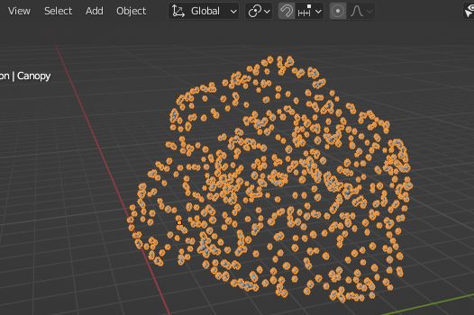
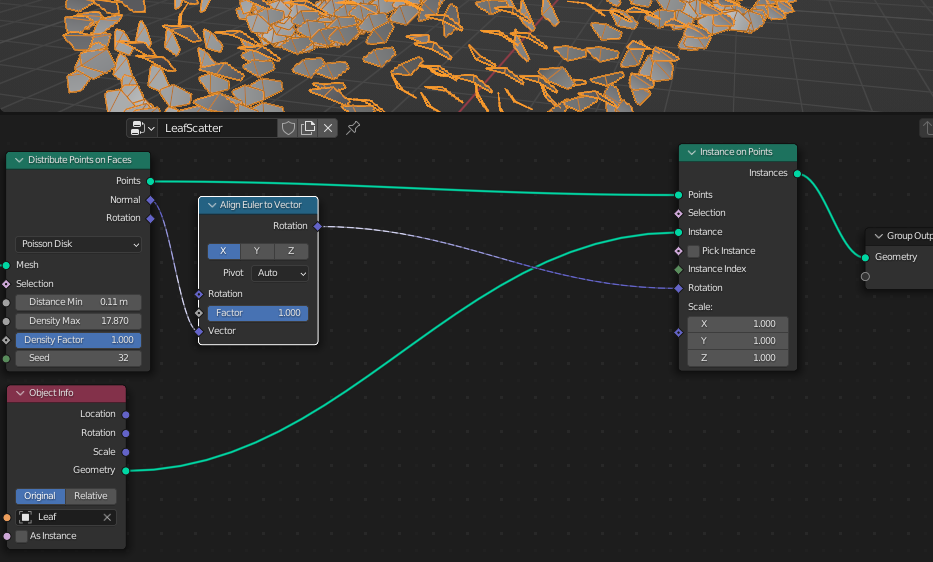
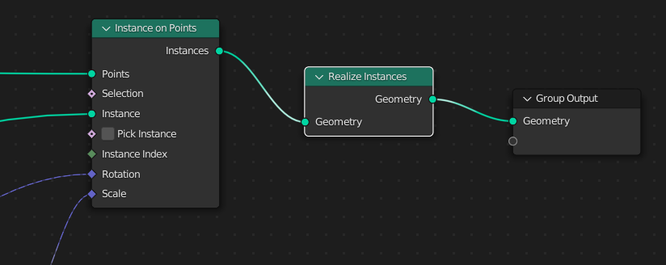
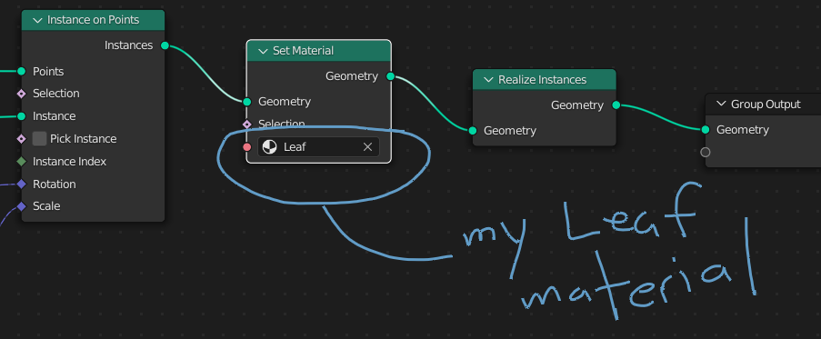
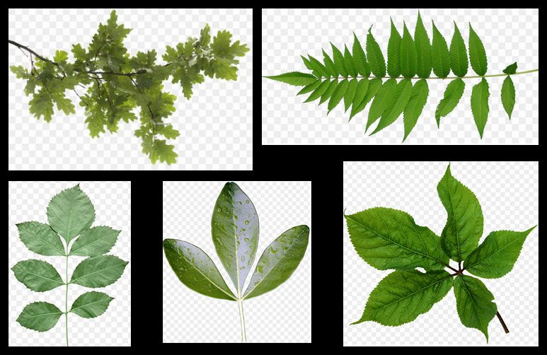
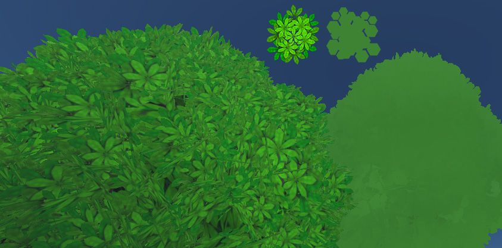

Time to dive into some leaves! This tends to be one of the more elusive parts of creating 3d trees. As I mentioned in [Part 1](__GHOST_URL__/trees-and-foliage/), since a lot of creators lean toward using 3rd-party tree solutions, they simply use whatever method the add-on does to make leaves and then… leave them alone. However, the leaves that tree add-ons usually produce are often not suitable for use in real-time applications like Hubs that have stricter limits on polygons and textures. Fortunately, with a little knowledge of Blender’s Geometry Nodes system, we can make leaves pretty easily. Not only that, we can even make our own adjustable parameters–almost like we developed our very own tree system.

### Geometry Nodes - An Overview

If you’re a Blender user, you’ve probably seen lots of videos cropping up around the topic of Blender’s Geometry Nodes. Well, if you’ve kept telling yourself that you should get around to learning about them, now is a great time. Having a goal in mind makes learning this system much easier.

Geometry nodes work similarly to the nodes you’ve probably used in places like the Shader Editor. Instead of using a flowchart of nodes to define the look of a particular material, Geometry Nodes allow you to treat the mesh of your object(s) in a similar fashion. Each node does a particular function that can be chained together with other nodes that further alter things about the object. The nodes are designed to do very specific things–often small operations like moving some vertices around randomly or duplicating a face–kind of like how modifiers work, except on a much finer level.
Blender’s Geometry Nodes system enables incredible things to be generated procedurally. Don’t worry, we won’t be making anything quite so complicated.
We’ll be using Geometry Nodes to scatter leaves across the surface of our tree canopy. We’ll add some simple controls for adjusting things like leaf rotations and scale, but you’ll be able to make your own parameters once you understand the basics.

### The Setup

First, we need to start with a mesh object–in our case, we can use [the canopy mesh we made in Part 1](__GHOST_URL__/trees-and-foliage/). Next, we’ll need to make a single leaf object. For the sake of simplicity, we can use a plane, but I like to make something with a sense of direction. In other words, I like to know where the stem of the leaf should be as well as knowing which side of the leaf I’m looking at. Of course, the type of plant or tree you’re making will ultimately determine what it should look like.

I usually start with a plane, scale its vertices down until it’s about ‘leaf-size’ relative to the canopy, then add any additional geometry I might want to shape the plane into something more leaf-like. This leaf is best created at the origin (0,0,0). We can add a texture if we want, but this entire leaf can be adjusted later–even at the end. That’s part of the beauty of a [procedural system](https://en.wikipedia.org/wiki/Procedural_generation) like Geometry Nodes.

0:00
/
1&#215;

💡

I didn’t show it in the clip above, but it’s a good idea to name your single leaf object since we’ll be using it later inside the Geometry Nodes editor.

### Geometry Nodes - Your First Graph

Now we will select our tree canopy mesh and put a ‘Geometry Nodes’ modifier on it. Because it’s a modifier, you can think of this whole graph we’ll create as the inner workings of a custom modifier designed by you.

0:00
/
1&#215;

Adding a ‘Geometry Nodes’ Modifier to our tree canopy mesh and naming the graph ‘_LeafScatter_’.

👯

I like to first duplicate my canopy object and store one in a Collection called _‘Working’_ or something like that. It acts as a backup in case something goes wrong and also because I may need a copy of the mesh for other purposes later. This _‘Working’_ Collection can simply be hidden from viewports and set to not render using the Outliner.

To begin editing the Geometry Nodes graph, we need to open up a new kind of Blender Workspace. At the top of Blender, click the small tab with the plus (+) sign and choose ‘General’-->’Geometry Nodes’. You’ll get a new view that gets you ready for editing.
Blender’s Geometry Nodes workspace doesn’t have its own tab by default. You can find it under the ‘Add Workspace’ (+) menu at the top.
By default, there’s not much to look at. Just two nodes–an input and output with nothing in between. That means the graph currently does nothing to the mesh. But just like a material graph, inserting things in the middle is what affects the object to change.

Rather than aimlessly trying out nodes (which will likely have mixed results when you don’t know how they work), we’re going to get our leaf object scattered across the surface.

First, we’ll add a node called ‘Distribute Points on Faces’. I’m not going to show every node being added, but be aware you can use ‘Shift+a’ to bring up a pop up menu to add nodes. You can also make use of the ‘Search’ function to find nodes much faster and avoid all the sub-menus.

0:00
/
1&#215;

Adding our first node: ‘Distribute Points On Faces’.
This node scatters a bunch of points all over the surface of the mesh. In doing so, the graph now sees that node as the last operation. Since that operation replaces the mesh itself, the surface geometry disappears. _(Don’t worry, it’s still there.)_
Points distributed across the faces of our tree canopy object.
When you add a new node, it’s a good idea to see what it can do. ‘Distribute Points On Faces’ has some options to explore, including the dropdown for the method for how it scatters points. ‘Random’ is just that–random. It has no concern for how close together the points get. Using ‘Poisson Disk’ gives you options for how closely the points can be placed. Refer to the [Blender manual](https://docs.blender.org/manual/en/latest/modeling/geometry_nodes/introduction.html) if you want to learn about any node in more detail.

0:00
/
1&#215;

Playing with the options inside the ‘Distribute Points on Faces’ node. You may not want your leaves to be too close together (or too far apart).

🤓

Nerd Alert: If you are curious about mathematical topics, you can read more about things like ‘[Poisson Disc](https://en.wikipedia.org/wiki/Poisson_distribution)’ distribution. Having studied French, (and having seen [The Little Mermaid](https://www.youtube.com/watch?v=UoJxBEQRLd0)), I assumed it was related to fish. Turns out, it was the mathematician’s last name. He was, in fact, French though…

Let’s get those little points turned into our actual leaf object. We need to add another node called ‘Instance on Points’. This one will go *after *the first node. When everything disappears after adding it, don’t panic, (which is generally good advice when making 3d art).
Adding an ‘Instance on Points’ node to our graph. It’s missing important nodes plugged into it so it doesn’t do anything useful yet.
‘Instance on Points’ does exactly what its name says: It takes some instance of an object and puts one on every vertex (aka point) of some other thing. (It’s worth noting here that ‘vertex’ and ‘point’ will be used interchangeably in Geometry Nodes.) But we haven’t told it which object yet so it kind of breaks things until we keep going.

Adding the leaf object is really easy. You can simply drag/drop it from the Outliner right into the Geometry Nodes graph. This will automatically produce an ‘Object Info’ node with the leaf object already listed in it. Then we connect its ‘Geometry’ output to the ‘Instance’ input of the ‘Instance on Points’ node we just made.

0:00
/
1&#215;

Dragging and dropping our leaf object from the Outliner to the Geometry Nodes graph, then hooking up its ‘Geometry’ output to the ‘Instance’ input of the ‘Instance on Points’ node.
As soon as our leaf object is hooked up to the graph, we instantly see it scattered across the canopy surface. The thing is, every leaf object is facing the same direction.

0:00
/
1&#215;

Finally! Some leaves! But they’re all facing the same way. I’ve never seen a real tree like that.
Fortunately, there’s a node that will make each leaf get its direction from the faces of the canopy. It’s called ‘Align Euler to Vector’ and it belongs in the graph like so:
‘Align Euler to Vector’ gets its ‘Vector’ input from the ‘Normal’ output of the ‘Distribute Points on Faces’ node. Its Rotation output gets hooked up to the Rotation input of ‘Instance on Points’.
What’s happening here is the ‘Align’ node is taking the [normal direction](<https://en.wikipedia.org/wiki/Normal_(geometry)>) of each face of the canopy mesh and passing that information along to the ‘Instance’ node’s ‘Rotation’. That way, when a leaf is being placed on a face of the canopy, it gets rotated based on whichever way that particular face of the canopy is oriented.
Setting up the same graph on a simpler object with arrows instead of leaves for illustration purposes. You can see how each face’s normal direction (blue sticks) tells the corresponding arrows which way to point. You’ll likely need to adjust the ‘Align Euler to Vector’ options until it looks right.

🤭

If you’re talking about ‘[Euler](https://en.wikipedia.org/wiki/Leonhard_Euler)’ angles in math or computer graphics, you should know it’s pronounced like “Oiler” ([_OY-lər_](https://en.wikipedia.org/wiki/Help:Pronunciation_respelling_key)). Saying it the right way gives you instant nerd credentials and tells any engineers you work with that you might possibly know what you’re talking about.

Now, the way your leaves are facing is partially dependent on how you modeled them. When I made my initial leaf, I had it pointed toward the positive Y (+Y) direction. So for me, I need to toggle the ‘Y’ axis on the ‘Align’ node. Another important factor is where your single leaf model’s local pivot point (origin) is located. I’m going to go back and move the leaf’s pivot so it’s right where the stem would be. This helps you start to understand why we often model things around the world origin (0, 0, 0).

0:00
/
1&#215;

Using Blender’s ‘Affect Only Origins’ operation to move the leaf’s pivot point to the stem area. **Don’t forget to turn it off afterward!**
Last, you may want to play around with the ‘Pivot’ parameter. For my model, I found that setting it to ‘Z’ gave me the best-looking results. But remember, you can always go back and mess with these things later.

0:00
/
1&#215;

To emulate the nature of gravity on leaves, it may look better to adjust the ‘Pivot’ parameter of the ‘Align Euler to Vector’ node. For mine, switching to ‘Z’ made the leaves less inclined to point straight up off the upper surfaces. If I were making grass, I might not choose this option.

### Geometry Nodes - Adding randomness

If you made it this far, you now have a graph that’s almost done. It would be nice, however, to introduce a bit of randomness to each leaf so they’re not all identical in size and relative rotation.

This is something you could go back and add later if you want, but I recommend trying it out now while you still remember what everything in your graph does.

💡

Speaking of knowing what your graph does, it’s always a good idea to add annotations or other notes to help you remember how things are set up. This can be done with ‘Frame’ nodes (‘Add’-->’Layout’-->’Frame’ or ‘Ctrl+j’) to keep your graph organized. You can immediately use your F2 key to rename the frame afterward. Sometimes I’ll even use the ‘Annotate’ tool found in the toolbar (t) inside the graph and simply scribble some arrows or other notes. You’ll thank yourself later!

#### Random Scale

An easy one to start with is the scale of each leaf. We can plug a ‘Random Value’ node into the ‘Scale’ input of the ‘Instance on Points’ node. Then we’ll set a ‘Min’ and ‘Max’ value so that each leaf gets randomly scaled slightly bigger or smaller than the default (1). Values like `0.8` and `1.2`, respectively, will make them range anywhere between 20% larger or smaller, for example.

0:00
/
1&#215;

You can mute and unmute selected nodes by pressing ‘m’. This can be a great way to see if a given node is actually doing something useful. You can see the leaf sizes randomizing up to 20% larger and smaller.

#### Random Rotation

Since we’re dealing with 3-dimensional rotation, we’ll need more than a single random value. Instead, we can change a ‘Random Value’ node to use a vector. Yes, things get a little ‘mathy’ here, but bear with me. When you switch the node to ‘Vector’, you now get 3 min/max values to work with. We’ll want to have random rotation on each leaf, but all three axes (x,y,z) should not randomize the same amounts. Using the ‘Vector’ mode saves us from needing 3 separate nodes.
Nodes like ‘Random Value’ often have options that reveal more possibilities. Being able to have 3 random values in one node saves some space in our graph and reduces the ‘spaghetti’ of connections.
We can use this ‘Random Value’ node to affect the leaf rotations as well. However, in order to not completely override their current rotation, we’ll have to connect the graph in a different way than we did the scale randomness. We need to tell each leaf to get a combination of its current orientation **and **a random value.

For this, we need a node that can bring those two things together. Since we’re dealing with rotation values (x, y, z), we’ll use a ‘Vector Math’ node. This node expects 3-value inputs like rotation values have. I’ll leave it set to ‘Add’ and plug it into my existing graph so that it’s adding up the original rotation **plus** the randomized rotation values:
The ‘Vector Math’ node doesn’t display its name on the header, but you can tell what it does by its inputs and outputs. You can always re-label these nodes using the (n) panel sidebar.
Now it’s helpful to watch your 3d view as you make adjustments to the ‘Min’ and ‘Max’ values of the ‘Random Value’ node for rotation. For my setup, the Min/Max X values affect the ‘pitch’ of each leaf (think about how your head nods up/down), whereas the Y values affect the ‘twist’ or ‘roll’ of each leaf. Last, the Min/Max Z values affect the left/right rotation. You’ll definitely want to tweak these values to your own preference for how your particular leaves should look. Don’t forget to use a reference image if it helps.

I start by setting all the values to zero…

0:00
/
1&#215;

Adding some randomness to the leaves’ initial rotation. For finer adjustments, you can hold `Shift` as you slide those values up and down. (`Ctrl` does coarser adjustments.)

### Improving Access to Our Node Graph

It’s great that we have so many parameters we can adjust, but it’s not so great that they’re scattered all over the place. There’s an easy fix for this problem.

All you have to do is click and drag from one of the node **inputs** back to one of the **outputs** of the ‘Group Input’ node. Doing so will ‘expose’ that parameter to a slot right on the ‘Geometry Nodes’ modifier itself. After all, it would get tiresome to have to keep opening the graph just to change one number. Check it out:

0:00
/
1&#215;

Exposing a parameter to show on the ‘Geometry Nodes’ modifier itself. Each input can also be renamed inside the side panel (`n`) to make it easier to remember what it does. I’d probably rename this one ‘Leaf Density’.
So you can decide exactly what parameters to expose for this graph to make future adjustments easier. Exposing ‘Seed’ values that randomize stuff is often a good idea. You can even make those exposed parameters get affected by _other_ parameters or variables, but we’ll stop here before this becomes a complete Geometry Nodes tutorial.

### Getting Ready for Export

Since ‘Geometry Nodes’ is a modifier, we would normally try to use the ‘Apply’ button to accept all the changes to our object. However, using ‘Apply’ on this particular setup doesn’t work. Go ahead and try it… I’ll wait….

Everything just disappears! Why? Well, remember how we started? This graph exists on the **canopy** object and all those instanced leaves were never turned into real geometry. There’s a node just for this operation: ‘Realize Instances’. Adding this node to the end of the graph will tell Blender that each of those leaves should get converted into regular mesh objects, then the graph output combines them into one at the end.
Adding a ‘Realize Instances’ node converts all the instanced leaf geometry into regular object meshes. If your leaves disappear when you ‘Apply’ the modifier, you probably need one of these.

### Leaf Material

Materials can be a little tricky in Geometry Nodes. Similar problems to the one above can arise when you need instances to have a material. You have a couple options here though–you can apply a material to the original single leaf model first, or you can be more explicit by adding a node called ‘Set Material’ inside this graph. Assuming you’ve already created a leaf material, you will see that material in the node’s dropdown menu. This node should go **before** your ‘Realize Instances’ node.
The ‘Set Material’ node is being used here to put a material on the leaves before they get turned into regular mesh objects. Remember, the material doesn’t go on the canopy mesh so this is how we can get each leaf to look right.

💥

Don’t forget to switch your 3d View to use ‘Material Preview’ mode. Otherwise, you won’t see the materials and textures on your objects.

### Take a Step Back

Now is a great time to exhale (and, of course, **save) **and take a look at your hard work. This single graph with its 9 or 10 nodes can do pretty amazing things. That canopy mesh can change shape and the leaves will still scatter all over it as you designed.

0:00
/
1&#215;

Moving the canopy vertices in ‘Edit Mode’ makes the ‘Geometry Nodes’ graph update dynamically. I can even extrude new faces and the leaves will scatter accordingly.
Imagine before you knew about Geometry Nodes–having to update the leaves by hand every time you wanted to make an adjustment!

In fact, you can even put this graph on a different object altogether and get leaves on it. You can even save this graph to be used in other projects!

0:00
/
1&#215;

Any object can have leaves scattered on it by adding the ‘Geometry Nodes’ modifier and choosing our graph. Just remember that if you want different adjustments, you’ll want to duplicate the graph itself first. Otherwise, you’ll affect the original tree too.
It’s also a good time to remind yourself that everything is still adjustable at this point. You can play with leaf angles, sizes, and even go back to adjust the geometry of the single leaf if you want more detail. Just remember that any additional faces or vertices will be multiplied by however many leaves you have.
Hovering your cursor over the ‘Instances’ output of the ‘Instance on Points’ node will pop-up a window showing the number of instances the graph is creating. You can always lower the density values of the ‘Distribute Points on Faces’ node if this gets too high for your scene to handle.

### Leaf Texturing

We didn’t really spend much time figuring out how the leaves themselves should look in terms of materials. We didn’t even use a texture for them. But this is an area where you will ultimately need to decide what sort of look you’re going for. Do you want the leaves to be more like fuzzy blobs that help soften the silhouette of the tree? Or perhaps you want each leaf to be more individually recognizable with details on each one. Maybe somewhere in between?

If you’re looking to add a texture to the leaves, chances are you’ll need some sort of alpha transparency. I almost always recommend sticking with the less expensive ‘alpha clip’ to help define the outline of the leaf. Using ‘alpha blend’ transparency is likely to lead to all kinds of visual glitches because of all the overlapping leaves and is best avoided. For a more complete understanding of alpha transparency, you can follow along with [this other Creative Labs article](__GHOST_URL__/sorting-out-problems-with-transparency/).
An example of a simple leaf material that has a hand-drawn texture containing alpha transparency. A leaf with a more intricate outline can greatly enhance the ‘fuzziness’ of the overall tree. Try not to have the majority of your mesh covered by transparent pixels–it’s a big waste of space and computation.

💥

In some earlier versions of Blender, there was a bug related to transparent textures and ‘Realize Instances’ causing geometry to disappear. The workaround for this is to add an ‘Attributes’ node to the Leaf’s material graph [as shown in this thread](https://developer.blender.org/T95023).

A few examples of the types of leaf textures you might try.

🍁

If your tree calls for lots of smaller leaves or compound leaf types like the examples above with multiple leaves per stem, It’s often better to choose a texture with multiple leaves as it will save you from needing so many individual pieces of leaf geometry.

If you’re going for a more stylized look, you can forgo using leaf shapes altogether in favor of something more abstract. In many cases, you can simply use a single quad plane instead of shaping the geometry into a leaf-like shape. It can be really fun to experiment with different leaf shapes, colors, and styles.
Two trees with identical geometry, but with different textures for the leaves. Notice how the right tree is made with a collage of hexagons. It’s a very ‘soft’ look since you cannot discern individual leaves. Making those hexagons different shades of green would dramatically change the tree.

### Leaves and Lighting

If there’s any part of this process that’s a bit of a ‘trick’, it’s this part. Now, it’s not completely necessary but it can be useful, especially when going for a more stylized look.

When a tree is viewed from far away, our human perception tends to ‘blur’ things and eliminate details. [Impressionist](https://en.wikipedia.org/wiki/Impressionism) painters use this to great effect, but in computer graphics, sometimes the small details become noisy from afar and can distract from the style you’re trying to recreate.

To help create the illusion that our leaves are more like big clusters, we can do an operation in Blender where we ‘steal’ the surface normal information (aka, the direction of the faces) from the canopy mesh and transfer it to the leaves. There are a few ways, but I like to use the ‘Data Transfer’ modifier.

To start, just like earlier, I like to duplicate the canopy mesh and keep a copy somewhere in case something gets messed up. Then I’ll do an ‘Apply’ to the ‘Geometry Nodes’ modifier which will effectively convert this whole bunch of leaves into a single, regular old mesh. To that, I’ll apply the ‘Data Transfer’ modifier.

0:00
/
1&#215;

Doing an ‘Apply’ on the ‘Geometry Nodes’ modifier converts all the leaves into one big mesh. We then add a ‘Data Transfer’ node to it… setup to follow…

0:00
/
1&#215;

Selecting our original canopy blob object as the source. We’re taking the blob’s surface normals and transferring them to the leaves. The magenta sticks are showing the direction light will bounce off them–a more unified shape instead of individual faces.
After increasing the density and size of the leaves, it’s a little easier to see the difference transferring the normals makes. If you zoom out further, the effect becomes even more apparent. The canopy of leaves looks more like one form instead of a noisy collection of individual elements.

0:00
/
1&#215;

At medium/far distances, the leaves tend to look better when getting their surface normals from the overall canopy shape instead of each leaf.
If we turn the old canopy blob object back on and give it a greenish material with similar roughness to the leaves, the leaf geometry will appear to blend with it much better, especially when viewed from certain angles. Sometimes I give the inner canopy blob mesh a plain color. Other times, I make a texture that looks like a mess of leaves. Every situation is different, so again, I highly encourage you to experiment.

0:00
/
1&#215;

The silhouette of the tree is so much fuzzier than before. This will look nice from greater distances. The underside of the leaves doesn’t look quite right though…
The underside of each leaf isn’t explicit geometry–it’s just the back face of the top of the leaf. As a result, the surface normal under there doesn’t exist so any light hitting the underside just passes through. Unfortunately, since we did the ‘Apply’ operation on our object, we no longer have all that easy editability. **_But wait_**–if you saved a copy of the object from an earlier step, it’s not too difficult to add some backfaces to our single leaf and repeat some of the processes afterward.

Just remember that the order of all these operations matters. So now that you have a better understanding of what each step does, you can better decide when to, for example, transfer the surface normals.

### Wrapping up

If nothing else, you hopefully have learned how powerful Blender’s Geometry Nodes system can be. Not only can it be used to make complex objects, but it can take complex operations and make them much simpler for you to work with. The best-made graphs are the ones you rarely need to revisit. Procedural systems like this can be used and reused in multiple projects. It’s as simple as using Blender’s ‘Append’ operation and pulling your graph into a new file.

I highly encourage you to discover more about Geometry Nodes by looking at videos and forums where people share their knowledge. While the system **_is _**evolving rapidly, making it difficult to create tutorial content that isn’t quickly out-of-date, there is quite a [lot of knowledge ](https://www.youtube.com/watch?v=kMDB7c0ZiKA)on the web.

And, as always, you can join us in the [Hubs Discord](https://discord.gg/dFJncWwHun) to ask questions and show your progress. I’m sure there are plenty of creators who would love to use any handy graphs you’ve made.
Created with [DALL·E](https://openai.com/dall-e-2), an AI system by OpenAI
