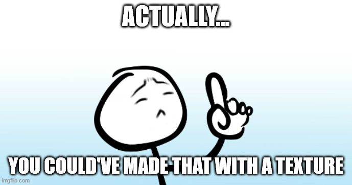
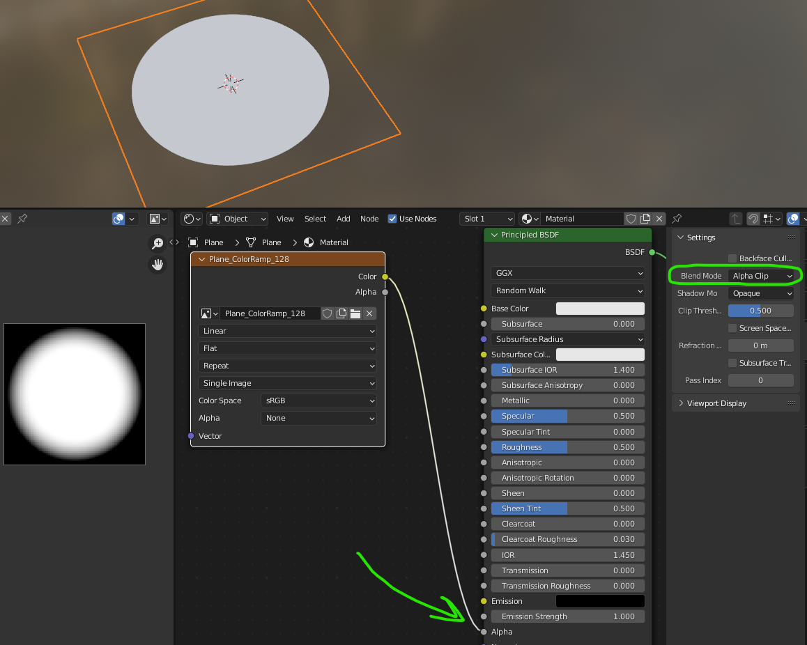
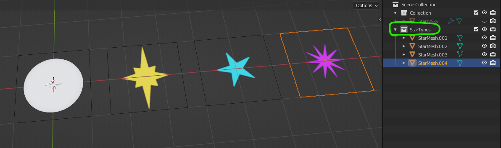
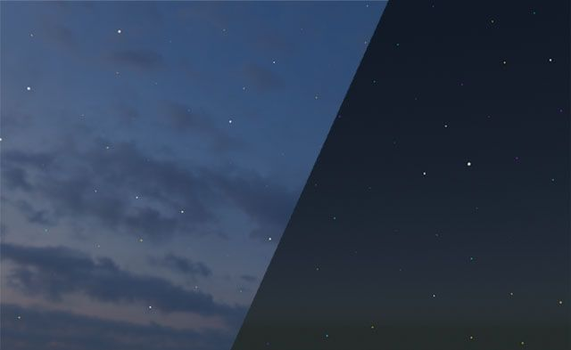

Since the inception of 3d computer graphics, people have looked for ways to reduce complexity so that hardware can perform better. This goes for rendering as well as real time graphics–getting a computer to draw stuff on screen can be surprisingly complex. When looking at a particular 3d object or rendering, a common refrain among so-called experts goes something like this: _“Hey, you know, you could’ve made that with a texture instead of all those triangles.”_
This know-it-all sentiment, while usually coming from a well-meaning place, is not always the best advice. In fact, sometimes it’s the exact opposite.
Sound familiar?
First, let’s show an example of when the old “texture-is-cheaper-than-polygons” advice makes sense. Fortunately, I’ve already written a [tutorial that covers this concept](__GHOST_URL__/sorting-out-problems-with-transparency/). The ‘texture-is-cheaper-than-polygons’ argument, while often true, is definitely not universal. Instead, it’s a more of a helpful reminder that there may be an alternative to how you might create something. In cases like the chain in the article linked previously, it’s pretty obvious that a 2-triangle object with a texture will be less taxing than an object with tens of thousands of triangles. But not every situation is as clear-cut.

### Oh, my stars!

I recently came across a challenge that made me rethink my approach to modeling and texturing. I was deciding what kind of sky I wanted in a particular scene and settled on the idea of a late-evening sky where you could start to see stars appearing in the darker areas and less so near the sunlit horizon.
This photo captures the look of the sky I wanted to create, complete with stars beginning to show in the darker parts of the sky. Photo by [David Abercrombie](https://www.flickr.com/photos/albategnius/)
The thing I soon discovered was that stars in a photograph are usually comprised of only a few pixels. And the larger the image, the smaller those stars are likely to be. So if I were to simply use a big, panoramic photo of the sky–or even just a rendering of one–the stars would barely be visible. And if those stars **do** happen to be visible, there’s a high likelihood that they’ll appear as little mushy blotches on the sky. Some of this has to do with how images are compressed, but it’s also a common side-effect when working with textures that get displayed over such a large area–and there’s no way around the fact that the sky needs to be fairly large in most scenes. And the solution of using an incredibly high-resolution image will quickly fail when you realize just how large the file size would need to be.

0:00
/
1&#215;

Even a ‘large’ equirectangular panoramic image can appear very pixelated when stretched over the area of an entire sky.
The other issue with starry backgrounds is that you’re somewhat stuck with _that_ particular arrangement of stars. In the previous clip, you’ll notice that sky has very prominent stars–almost to the point of looking like clouds. Maybe I just want a few stars here or there– or even cartoony five-pointed stars and planets. It would be nice to be able to separate the sky from whatever elements appear within it.

### Geometry Nodes to the Rescue!

If you’re brand new to Blender’s geometry nodes system, this might seem a bit daunting. There’s another [tutorial that goes over the basics (and beyond) of geometry nodes](__GHOST_URL__/trees-and-foliage-part-2/#geometry-nodesan-overview), so you may want to check that out first. But I will try to keep things simple here. Besides, this is actually a simpler use of geometry nodes and a decent place to start.

### A Star is Born

We’re eventually going to need a star to scatter across our sky so I’ll just build it now. All it consists of is a single mesh plane (2 triangles– no need for any subdivisions) with a very simple texture on it. I made a white circle with a slightly soft edge, but each star will be so far away, any detail is likely to be lost. You can see in the image below that I’m making sure I set the ‘Blend Mode’ to either ‘Alpha Blend’ or ‘Alpha Clip’ (depending on how soft the edge needs to be). My image didn’t have any built-in alpha (transparency) so I had to use the ‘Color’ output to feed the Alpha input of the Principled BSDF node.
My small 128x128 circle image has no transparency so I’m using its color to drive the material’s Alpha (transparency). Don’t forget to set the ‘Blend Mode’, or else your stars will have black backgrounds around them.
I’ll name my mesh ‘Star.001’ so I can easily find it later.

Don’t worry about the size of the star mesh. Blender likely made it 1 or 2 meters (squared) but we will be controlling the size in a different way.

💡

I left it out of the image above, but I also ended up connecting the star image’s ‘Color’ output to the Principled BSDF node’s ‘Emission’ input and turned up the ‘Emission Strength’ a bit. I’m going to want the stars to look illuminated, so this will be important once it's in Hubs.

### What about this Geometry Nodes graph thing?

We need an object to hold the Geometry Nodes modifier (and graph), but it can be anything you want– our graph will replace whatever you choose. I usually make a default cube or even a single vertex, it truly does not matter.

What the object needs is a Geometry Nodes modifier:

0:00
/
1&#215;

Any mesh object can hold a Geometry Nodes modifier. The modifier does nothing until you make a graph for it.
Open up a Geometry Nodes workspace (top tab menus) and now we can see what happens when we make a new graph for it. This can be done either on the Geometry Nodes modifier, or within the Geometry Nodes window at the top.

0:00
/
1&#215;

A default Geometry Nodes graph. Naming your graph is important, especially when you have more than one.
All the default graph does is take the existing geometry of whatever the graph is on (in my case, a cube) and pass that to the output– essentially doing nothing.

Not too exciting yet, is it?

We can delete the input node completely. Why? Well, we’re not interested in the cube–it’s simply a container for this geonodes modifier and the graph it holds. When we delete the input, there is no longer any geometry to pass on so the result is our cube disappearing.

Instead, we’re going to use this system of graphical nodes to generate our own geometry–in this case, a dome that will become our sky to hold the stars.

0:00
/
1&#215;

Deleting the default Geometry input and connecting an IcoSphere mesh primitive node in its place.

🔤

You probably will want to rename your starting object. Mine kept confusing me because it was called ‘Cube’. Something like “StarrySky” might make more sense.

You can see toward the end of the clip above that it’s very easy to make adjustments to the icosphere using the node. This non-destructive editability is the key to what makes geometry nodes so useful. As we move on, this will become more and more apparent–and you’ll understand why I didn’t just start by manually making an icosphere mesh at the very beginning.

### Scattering the Stars

This next concept is covered by just about every other geometry nodes video tutorial online, but in the interest of keeping you here, I’ll go over it anyway.

First, we must use a node called ‘Distribute Points on Faces’. This node will look at the incoming geometry (our newly generated icosphere) and randomly place points on the faces. For a better understanding, you can refer back to [the article mentioned earlier](__GHOST_URL__/trees-and-foliage-part-2/#geometry-nodesyour-first-graph).

0:00
/
1&#215;

Adjusting the Density values of a ‘Distribute Points on Faces’ node. Notice how we can still adjust the radius of the icosphere and the changes update downstream.
Next, we'll add another node to our graph:

0:00
/
1&#215;

Adding an ‘Instance on Points’ node after the ‘Distribute’ node. Here, I drag the single star mesh (‘Plane’) directly into the graph from the Outliner. It becomes the geometry that is hooked into the ‘Instance’ input of the ‘Instance on Points’ node.
In simpler terms, the graph is using the ‘Plane’ (single star) object and ‘instancing’ it upon each new point that the ‘Distribute’ node created.

The problem we’ve created now is that we’ve only specified which points to place them on– we didn’t say how we wanted them oriented so they default to however the original mesh was facing.

0:00
/
1&#215;

Relatively large planes scattered across the icosphere’s surface. Not only are they too big, but they all face the same direction as the original star plane. Might be the start of a new Death Star…
First, I need to lower the scale of the instanced star planes so I can see what’s going on. It will be easier to understand their orientation if they’re a little smaller. Here, I just type in new Scale values inside the ‘Instance on Points’ node.

0:00
/
1&#215;

There are better ways of handling scale, but sometimes you need to see things more clearly right away. The Z-scale value doesn’t do anything on these planes, but it’s good to keep things uniform when possible.
For the orientation, I need to get each instanced star plane to align with the dome itself– so each star plane is facing the center of the icosphere. For this, we need a new node called ‘Align Euler to Vector’. We will be taking the ‘Normal’ output of the ‘Distribute’ node and plugging it into the ‘Vector’ input of our new node. Then, we pipe the ‘Rotation’ output into the ‘Rotation’ input of the ‘Instance on Points’ node. (That's quite a mouthful...thank your stars for illustrations.)

0:00
/
1&#215;

‘Align Euler To Vector’ lets us take the surfaces of the dome to determine how each star mesh instance should be rotated.

💡

Depending on the orientation of your starting instance mesh, you may need to try out the various Axis settings of the ‘Align Euler To Vector’ node, just like I did at the end of the clip above.

### One last thing about orientation…

You may not see it at first, but because our starting star mesh is a plane, it only has a surface on one side (the top). However, our material setup is hiding this fact by drawing the texture on both sides. Personally, I like to know which way things are facing even when they appear to be just fine. It avoids potential problems down the line and gives you a better command of your scene.

In the star material we made earlier, I’m going to find those same settings I used to set the ‘Alpha Blend’ and check that box called ‘Backface Culling`. This makes it so the material only draws on the front faces of our star mesh–and subsequently affects all the instanced stars.

0:00
/
1&#215;

Backface Culling on a material ensures that we’re only ever drawing the front faces of the mesh it's assigned to. But it also reveals that our stars are facing outward instead of inward!
Hmm… so now we can see that the stars are actually facing outward instead of inward toward the scene. There are several ways to flip them around, but the easiest way would be to flip the faces of the icosphere they were scattered across. Guess what? There’s a node for that: ‘Flip Faces’.

0:00
/
1&#215;

A ‘Flip Faces’ node simply rotates the face normals 180 degrees. This could have also been done on the original star mesh, but since the sphere actually _should_ face inward, this method makes the most sense.

😖

If you’re starting to feel a little overwhelmed by the sheer number of geometry nodes, don’t worry. The best way to learn them is one at a time– using them as you need them. Before you know it, they will become part of your 3d vocabulary.

### Scaling the stars (a better way this time)

Our starry sky is starting to shape up, but it still looks more like a big [disco ball](https://sketchfab.com/3d-models/disco-ball-ff4fcb7af1e248c2964c18e8779f1bd7) than a planetarium. Obviously, the stars are still too big. Worse though, is that they’re all exactly the same.

Fortunately, Blender’s geometry nodes have lots of ways to introduce randomness, which is exactly what we need for our stars to look more natural.

Here, I’ll use a handy technique for making new nodes– pay attention to how I do it:

0:00
/
1&#215;

Dragging out from an input or output pops up a window that allows searching and selecting from all the nodes. This can save you from having to manually connect nodes all the time.
Once that ‘Random Value’ is connected to the ‘Scale’ of ‘Instance on Points’, you’ll likely see your stars go crazy. They’re just showing the default values–in this case, a minimum of zero and maximum of 1 on all three axes. Try changing those values so they make more sense…

It’s not easy, right? First of all, you’re trying to change 6 values (well, 4 that actually do something). Meanwhile, the starting size of the original star mesh is probably still too big. It’s a bit of a headache trying to figure out the end result.

Before you panic, notice that the ‘Random Value’ node has a dropdown menu. You can change it to read ‘Float’ instead of ‘Vector’. This will simplify the node so that it only outputs 2 random values (min/max). The side effect (and one we actually want), is that each star will always be scaled **uniformly** on all axes. Otherwise, each star would possibly be scaled differently on X & Y–a potentially cool look, but not what we’re going for here.

🔌

You might find that changing a node’s settings will sometimes disconnect its wires. Blender usually does this when the result would be invalid and to avoid compilation errors.

We can add another node to control the overall scale. This kind of operation is quite common in geometry nodes so it’s a good one to remember:

We can multiply the scale values coming from the ‘Random Value’ node with a number that will reduce them all. For this, we can use a ‘Math’ node and set it to ‘Multiply’.

0:00
/
1&#215;

Math nodes are probably the most commonly-used nodes in any geometry nodes graph. Look inside the dropdown and you’ll see just how versatile they are.
By adjusting the random min/max and overall scale, we can now achieve a better result.

0:00
/
1&#215;

Our new setup makes adjusting the min/max and overall scale much easier.

🎚️

When tweaking very small values in Blender, you can hold ‘Shift’ to make the increments finer as you slide values up and down. ‘Ctrl’ does the opposite.

### Randomizing star types

If you’re finding that all the stars look too similar, even though they have different scales, it’s pretty easy to get your graph to use different stars–you just have to make them first.

In cooking show fashion, I’ve gone ahead and pre-made a variety of stars. These are all just duplicates of the original star mesh but I’ve given them new materials with different textures.
Duplicates of the original star mesh, each with a unique texture. Here, I’ve spread them out to better illustrate them, but it’s usually best to leave them at the origin (0, 0, 0).

🧠

A smarter way of handling multiple textures would be to put all the different images of stars onto one texture sheet or ‘atlas’. Then, you could just offset their UVs to make them look different. This would have the advantage of using less texture memory and cause fewer draw calls to the GPU–in Hubs, or any real-time rendering engine.

The key here is making sure you put all these star meshes into their own Collection. (Note the circled collection in the image above.)

Just like before when we dragged and dropped the star mesh into our graph, we’ll do the same thing–only this time, we’ll drag the entire collection. The graph creates a ‘Collection Info’ node.

0:00
/
1&#215;

Collections of objects may be dragged and dropped into geometry nodes graphs just like individual objects can.
Now, we need to replace the original star mesh node with the collection node. You’ll notice that suddenly each and every star has been replaced– with ALL the stars. We don’t want to use the entire collection each time, so we need to turn on ‘Separate Children’ on the ‘Collection Info’ node. Last, we need to turn on the checkbox called ‘Pick Instance’ on the ‘Instance on Points’ node.

0:00
/
1&#215;

Using ‘Separate Children’ and ‘Pick Instance’ to make each star choose a different item from the collection.
It wasn’t shown in the clip above, but now you can see each star getting a different mesh from the collection.

0:00
/
1&#215;

If you want to make dozens of different types–planets, nebulae, etc– you just need to add them to the collection and your sky will update automatically!

### Wrapping up (our UVs)

To finalize everything we’ve done with the geometry nodes graph, we’ll need to do a couple things. First, our graph needs a specialized node called ‘Realize Instances’ at the end of it. This will take each star mesh instance and convert it into a regular mesh. However, (for reasons I’d rather not go deeply into here), adding that node will have the result of removing the UV coordinates from the stars, thus making them have no textures.

0:00
/
1&#215;

The ‘Realize Instances’ node can cause problems with UVs and textures. Keep reading to learn how to deal with it.
To avoid this problem, there’s a somewhat quirky workaround. We must first Apply the Geometry Nodes modifier. This will actually produce a new set of UVs, but they show in a different place from regular UVs you might be familiar with. There is a section in the Object Data Properties tab called ‘Attributes’. After doing the Apply of the modifier, you’ll now have a couple sets of data inside the ‘Attributes’. Select the one called ‘_UVMap_’, then use the down arrow icon and choose ‘Convert Attribute’. In the subsequent pop-up, choose 'UV Map', and hit Ok.

0:00
/
1&#215;

The ‘Attributes’ section is relatively new to Blender, but that’s where you need to go to get your textures back in place.
As soon as you convert the UVMap data, the textures reappear on the model. Whew!

🤔

You might be thinking, “_But I didn’t necessarily want to collapse everything down and lose my graph_.” But remember, that graph still exists and can simply be applied to a new object to make another starry sky. The only thing you want to keep around are your star meshes. Anytime you use that graph, it needs to reference those stars again.

### Putting It All Together

We now have this nice single mesh that’s comprised of many small meshes, each with random star textures. If you didn’t make the original sphere quite large enough for your scene, you could always go back a few steps and increase the size of the icosphere in the graph.

But you may also find it simpler to go into ‘Edit’ mode, set your 3d cursor to the origin, then scale all the stars together. This will also have the side-effect of making the stars themselves bigger. But you can switch your ‘Transform Pivot Point’ dropdown to ‘Individual Origins’, then scale all the star faces individually at the same time.

0:00
/
1&#215;

Using Blender’s Transform Pivot Point options to scale the whole sky vs. individual stars.
Finally, we can use this ball of stars on its own (plain background), or as a layer on top of whatever sky background you choose.
The stars can work on just about any background. Adjusting their Emission Strength can help get their brightness to look how you want.

### Taking it further...

The techniques you’ve seen here could be applied to all kinds of things, from clouds to background trees and buildings. Instead of scattering things across a sphere, you can experiment using simpler meshes, or using the ‘Instance on Points’ node to simply put a model at each vertex (point) of another model.

In another scene, I used this same technique to make stars, but then I added the ‘uv-scroll’ component ([as seen in this tutorial series](__GHOST_URL__/animating-textures-with-the-uv-scroll-component-pt1/)) to make some of the stars appear to ‘twinkle’ slightly if you happen to look at them long enough to notice.

If this was your first foray into using Geometry Nodes, I think congratulations are in order. The concepts aren’t always easy to grasp right away, but the more you use them, the easier it becomes. I’m still learning them myself, so come [drop by the Hubs Discord](https://discord.gg/dFJncWwHun) and maybe you could share your tricks with the community as your skills improve.

0:00
/
1&#215;

It’s suuuper subtle, but the stars are twinkling (uv-scroll). More importantly, the stars are nice and crisp, instead of looking mushy and pixelated.
