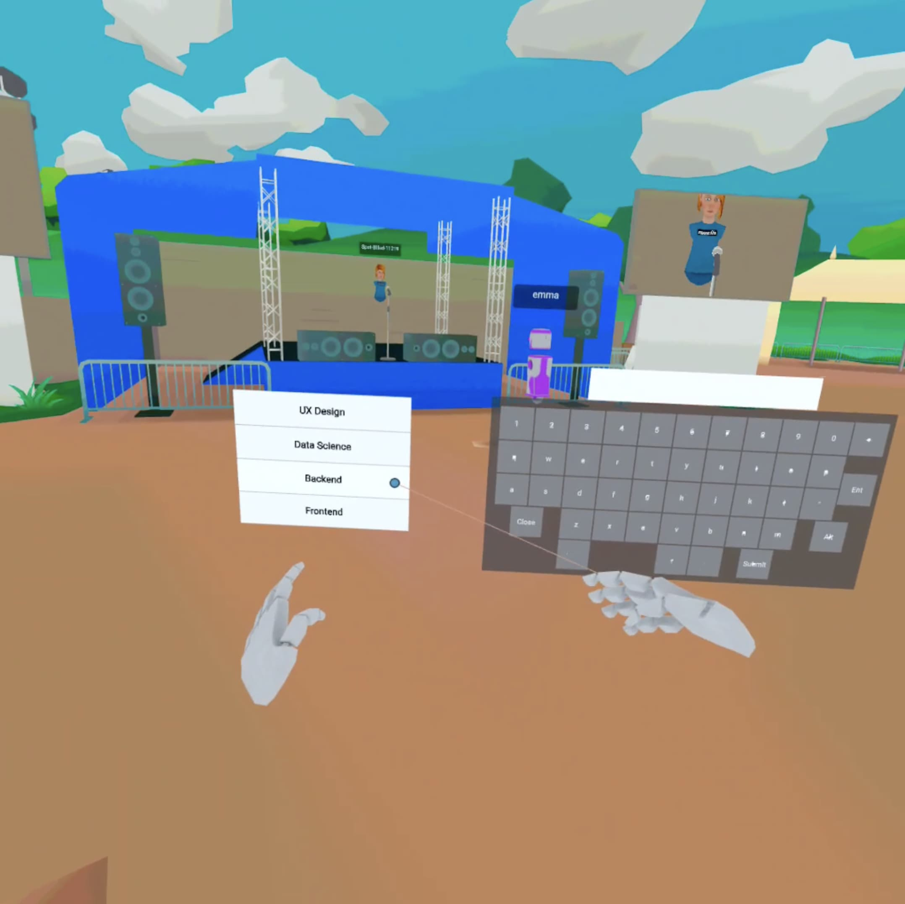
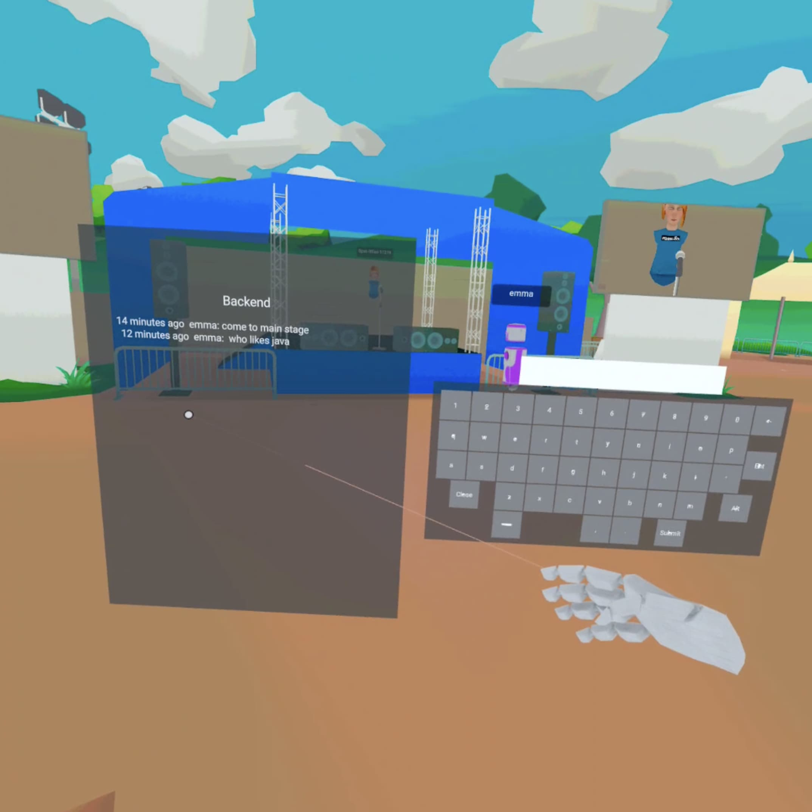
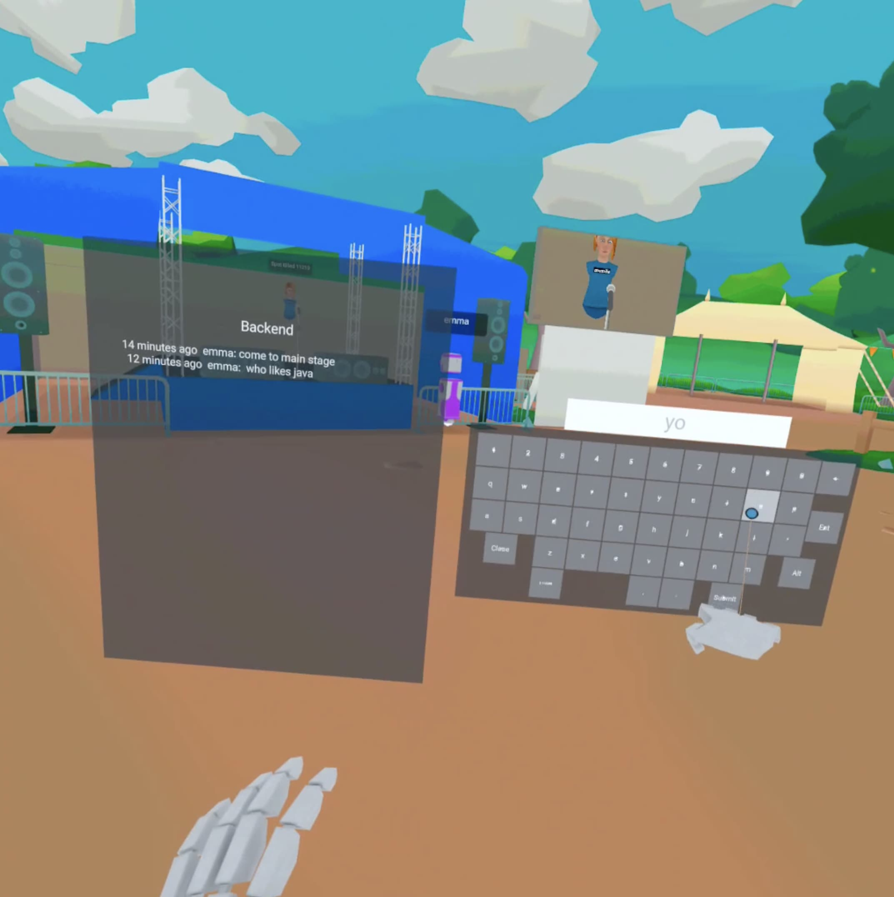
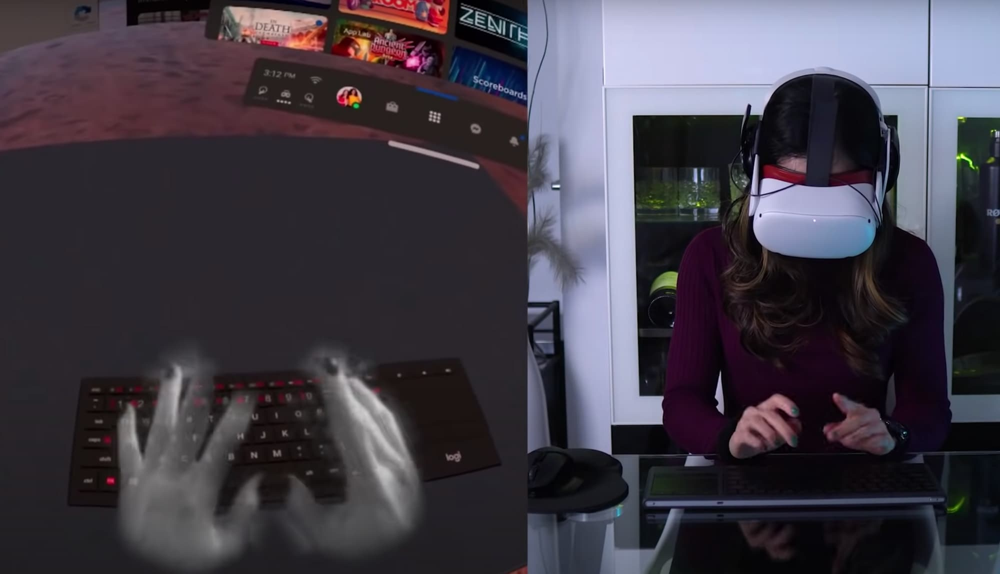

When Pokemon Go, the hugely successful mobile augmented-reality game, launched in 2016 it had no in-game chat communication. Jonathan Zarra saw a chance to make a fun side project. Zarra, despite having never developed a production-ready application, launched an accompanying chat app that integrated with the Pokemon Go world. The app's killer feature was a map of where to find Pokemon and a group chat for each location where users could connect and discuss game tactics. Despite the rudimentary code that crashed (a lot) the app was downloaded over 10,000 times on the day it was released. The app shot to the top of the App Store and the server costs alone very nearly bankrupt Zarra. In the process of losing most of his savings, Jonathan Zarra had proved one thing, in immersive digital worlds, deeply integrated text chat is a must-have feature.

## Text Chat in VR Today

In the current crop of VR experiences, text chat is either a second-tier bolt-on or does not exist at all. VRchat, currently one of the "killer apps" for Oculus, only supports voice-based communication. The experience when joining a vast world in VRchat can be overwhelming. Questions like "how do I start up a conversation and with who?" and "where does everybody hang out in this large virtual space?" quickly arise. The social norms that exist in the real world tend to disappear meaning even naturally extraverted people can struggle to strike up conversations and make meaningful connections in VR. The real world and the 2D internet already has a solution for sparking up a conversation between total strangers in a relax and awkward-free way. Text-based chat.

## What We're Going to Build

This article is going to cover building a tech conference running on Mozilla Hubs where attendees have a fully featured 3D chat through which they can connect, converse and congregate. The chat will exist right within the virtual world. No jumping out to Slack or WhatsApp. Each conference topic e.g. Frontend, Backend, UX design, etc will have their own group for like-minded individuals to chat in. Participants will even be able to teleport to the location of other people straight from a chat conversation. Overall, it will be easy to find a friend and attend a talk together.

## Extending Hubs

Mozilla Hubs is a great foundation for building easily distributed VR experiences. Hubs is also relatively easy to customize and extend. It's straight-forward to pull a local fork of the Hubs client and start hacking on some JavaScript. We are going to build an extended version of Hubs to make the VR tech conference possible. The custom Hubs experience will have the following additions:

- 3D Compatible keyboard - We need a way to input text. There is some prior art for adding 3D JavaScript keyboards to VR so we can build on that. The keyboard is a Hubs port of [this](https://github.com/WandererOU/aframe-keyboard) project. If Hubs requires a generic 3D keyboard component in the future this [code](https://github.com/sendbird/hubs/blob/sendbird-chat/src/components/keyboard.js) is a great starting point.
- 3D UI for displaying messages - we need a nice way to render messages in 3D. Crucially we need a way to hide messages when we are not chatting.
- Group chat - Hubs currently comes with a 2D chat that allows all users to message via an input in a web browser. For this demo to work we need fine-grained chat channels. One for each track at the conference. We are going to use Sendbird, a chat API and SDK. This means we can avoid building the nuts and bolts of a chat system. _Disclaimer I am a developer advocate at Sendbird._ Other chat APIs exist and extending the Hubs backend to support additional chat features could be another way to achieve this.
- Chat moderation -  With potentially a lot of user chatting we will need a way to moderate conversations and prevent toxicity. Sendbird has an admin dashboard with features like block a user built in so we get this for free.
- A  chat bot that allows teleportation through a simple text command.

[https://github.com/WandererOU/aframe-keyboard](https://github.com/WandererOU/aframe-keyboard)

## Demo

See some images and videos below from an event we ran internally at my company. Feel free to explore the live demo [here](https://sendbird-hub.com). For the best experience, I recommend a VR headset like Oculus.

All the imagery below was take using the Share feature on my Oculus Quest 2.

### Finding a group chat

### Seeing what others are chatting about

### Typing out a message

### Chatbot Teleportation

0:00
/
1&#215;

Using the meet $username to fly directly to users who you're chatting with. Recorded on Oculus Quest 2.

## Tips for Devs Extending Hubs

For those of you looking to get your hands dirty and build your own extended version of Hubs, here are my top tips:

- The hubs developer community is extremely active in Discord. Make sure you get access to the internal dev channels. These are a gold mine for helpful information. I was unblock multiple times by doing a quick search. The Hubs devs are also very responsive to questions.
- The Hubs 3D interface wraps around the a-frame library.\* If you are new to VR or 3D development in general I would highly recommend getting a good handle on a-frame first. The a-frame docs are fantastic. After attempting to learn a-frame as I went, I eventually sat down and followed the docs from beginning to end. It was a game changer when I returned to developing Hubs.

💡

Hubs is in the process of sliming down its entity component system and moving away from a-frame. A-frame remains a great open source project to learn and work with but note it will not no longer be a dependency for Hubs in the future.

- If you are building a new 3D component then take a look at a similar existing component in the code base. For example, when trying to build a key for the 3D keyboard I found that the existing "mute mic button" had basically the same interaction functionality I needed so I took that as a starting point. I would recommend checking src/components before you start developing. There's a-lot in there. You might even find the exact 3D component you need has already been built.
- Coming from building traditional 2D web apps, building for the 3D world is hard. Expect to spend a lot of time calculating where to position elements from scratch. Hubs is built with JavaScript so many devs will know the language but still expect a reasonably steep learning curve. It's all totally worth it though when you put on your VR headset and interact with a giant cat in a banana that you coded yourself.

## Looking to the Future

### Physical Keyboards in VR

Virtual reality is looking to be the place where work will happen in the future. To make that possible there is massive innovation in virtual workspaces. One great product coming to the market is physical keyboards that sync to VR headsets and appear in virtual form in VR. It's easy to see how this would play well with 3D chat text inputs.
Cas and Chary keyboard in VR [https://www.youtube.com/c/CasChary](https://www.youtube.com/c/CasChary)

### Chat Apps in VR

Chat apps are a core feature of modern chat platforms. Think Slack apps and Twitch commands. We have added a simple text-based chat command that allows users too teleport to each other's location. This enables users to connect via chat and then seamlessly meet up in the virtual world. It would be interesting to explore what other chat apps work well in virtual reality. For example, chat-based polls are common. It would be cool to see a poll where the outcome then changes the 3D environment. Should all avatars have the power of flight for the next 30 minutes? Vote YES or NO.

### Safe and Friendly Communities

To maximize online communities, often some moderation is required. Some users who break the chat rules may need to be temporarily or permanently banned from conversations. In 3D chat environments we have more user parameters that we can moderate. For example, if a user sends toxic messages they could be teleported to an isolated part of the 3D world and temporarily loose their power of movement.

I created a fun demonstration of advanced moderation. Users banned via the Sendbird moderation tools would appear to other members of a Hubs room to be a (bad) apple. See below for demo 👇

> Break the rules in the metaverse… turn into a giant apple. [pic.twitter.com/554KcFakv8](https://t.co/554KcFakv8) > &mdash; James Robertson (@james_a_rob) [May 25, 2022](https://twitter.com/james_a_rob/status/1529486334297006081?ref_src=twsrc%5Etfw)

---

The code for the full demo is [here](https://github.com/sendbird/hubs/tree/sendbird-chat). If anyone is looking to build an enhanced 3D chat experience in Hubs then it's a great place to start.

##
