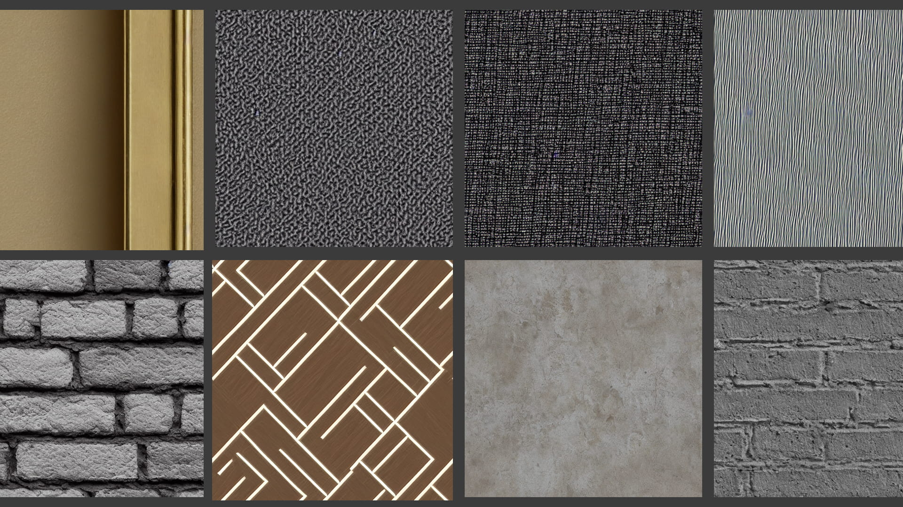
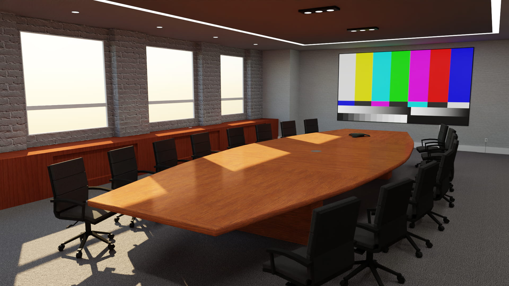
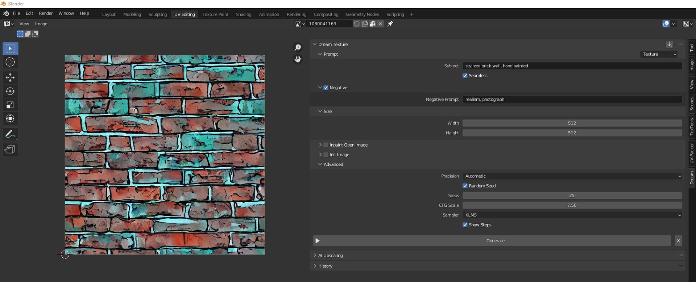

Congratulations!  If you're reading this then it means that you are alive in a time in which AI-generated art hasn't yet _completely_ replaced human artists. Don't worry, it's just around the corner, but for NOW, we can leverage this powerful new tool to help us make high-quality content for our 3D Hubs scenes quickly and easily - without even lifting a stylus!

I'm sure by now you have seen the buzz on the internets about [AI-generated human faces](https://thispersondoesnotexist.com/), [fantastical AI-generated landscapes](https://www.popphoto.com/news/stability-ai-generated-landscapes/) and concept art, and maybe even [wacky and weird AI-created character designs](https://twitter.com/DallE_2_Gallery).  But can AI be used to generate a tiling texture for a real-time application such as a video game or a Hubs scene?  Turns out the answer is YES!  And it's already pretty good at it!

Traditional texture generation methods can be slow, ranging from finding something from the real world, photographing it, and editing it on a PC (super slow), to generating one yourself using a node-based texture editor (also slow). Even finding the right texture online can be time-consuming, and good luck finding a decent free one...
_The early days of photography as seen by an AI. Yes, even this "photo" was AI-generated._
But now with AI-powered routines that are [becoming more and more widely available](https://www.theverge.com/2022/9/28/23376328/ai-art-image-generator-dall-e-access-waitlist-scrapped), it's possible to generate seamless tiling textures of pretty much anything in seconds! With the right combination of keywords (called a “prompt”), a bit of patience, and a fair amount of luck, anyone can generate dozens of professional-quality textures, easily and relatively quickly.
_An assortment of AI-generated textures._
So you'll never need to hand-create or purchase another texture ever again, right? Well no, not exactly - at least not yet. Currently available AI is somewhat limited in what it can produce, and getting exactly what you want, despite your best efforts at describing it in perfect detail, doesn't always generate the results you are after.

For example, for a conference room Hubs scene I recently made, try as I might I just could _not_ get the AI to produce an image of a regular interior wall texture (like most of us have on the walls of our homes), so I ended up having to settle for other wall treatments.  In the end, it probably made my scene more visually interesting, but it wasn't quite what I had envisioned.

For other uses, however, AI proves to be quite good.  Finding a good tiling wood texture can be a real pain.  Wood patterns don't tile seamlessly in the real world, and modifying photos of wood textures so that they can repeat forever edge-to-edge is difficult and painstakingly slow. But with AI you can generate a half dozen or more in just minutes! (The time it actually will take depends on your GPU, so results will vary.) Things like brick walls, carpets, and tiling fabrics are also a breeze.
_I made these using very few words in just a few minutes. Two of them ended up making it into my scene!_
To challenge myself I decided to try to texture an entire Hubs scene using only AI-generated images and the results are actually pretty good!  When combined with nice lighting, normal maps, and reflection probes, the "exists in the real world" effect is really quite convincing.  Feel free to poke around the Hubs scene link below to see for yourself. (The TV test pattern is not AI-generated, but everything else is.)
_Hubs "Conference Room SB22", created entirely_ with AI-generated textures.\*
To create the textures in the scene shown above I used a [plugin for Blender called 'Dream Textures'](https://github.com/carson-katri/dream-textures) which runs on the backbone of 'Stable Diffusion', a popular AI for generating all sorts of images.  It wasn't the most straightforward plugin I have ever installed (scroll down on the GitHub page for instructions), but the effort it took was absolutely worth it in the end.  Now at any time in any project, I can open the 'Dream Textures' panel, type a few words, and generate endless textures to my heart's content!

⚠️

_Disclaimer: This AI was "trained" with ALL sorts of imagery, and it is possible to generate NSFW content, some of which can only be described as "nightmare fuel". To read about Mozilla's vision of the future of "trustworthy AI", [click here](https://foundation.mozilla.org/en/internet-health/trustworthy-artificial-intelligence/)._

_'Dream Textures' in Blender. Yes, it's really that easy._
And things are only going to get better from here!  Advancements in AI-generated content are happening at breakneck speed and seem to be getting faster every day.  At the rate things have been going, by the time I publish this article, it's likely to have gotten even better than when I started writing it.  So go, be fruitful and multiply your available texture catalog!  And hurry - the robot artists are coming for you!
[

Conference Room SB22 | Hubs by Mozilla

Join others in Conference Room SB22, right in your browser.

Hubs by Mozilla

](https://hubs.mozilla.com/scenes/is67Y4x/conference-room-sb22)

Update:  For advanced DreamTextures tips, [see our latest article here](__GHOST_URL__/dreamtextures-advanced-tips/).

Questions? Comments? Let us know on [Twitter](https://twitter.com/MozillaHubs) or join the Hubs community [Discord](https://discord.gg/sBMqSjCndj).
