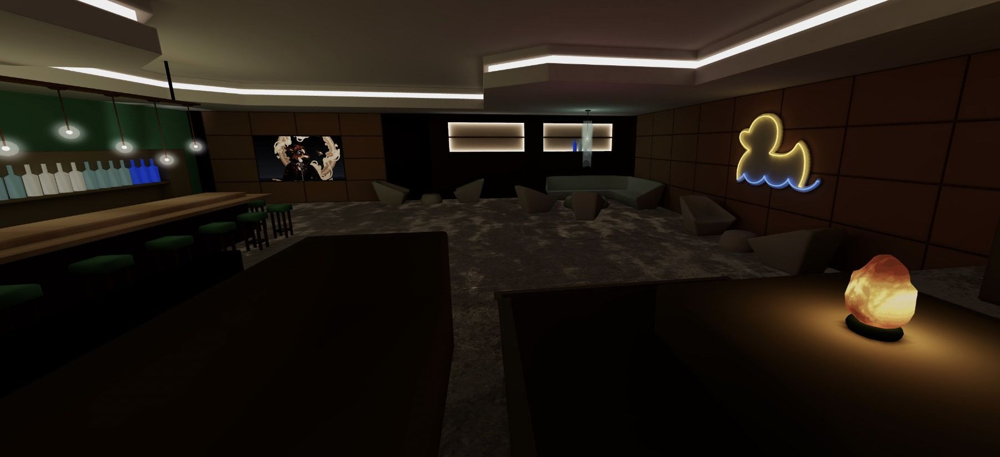
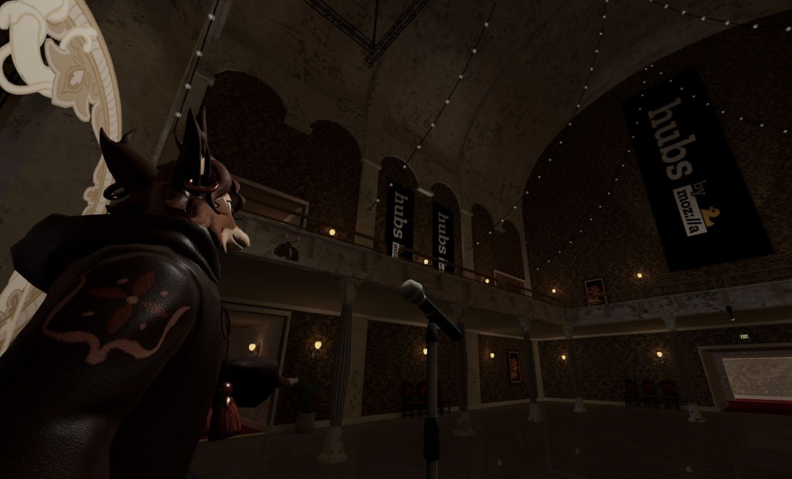
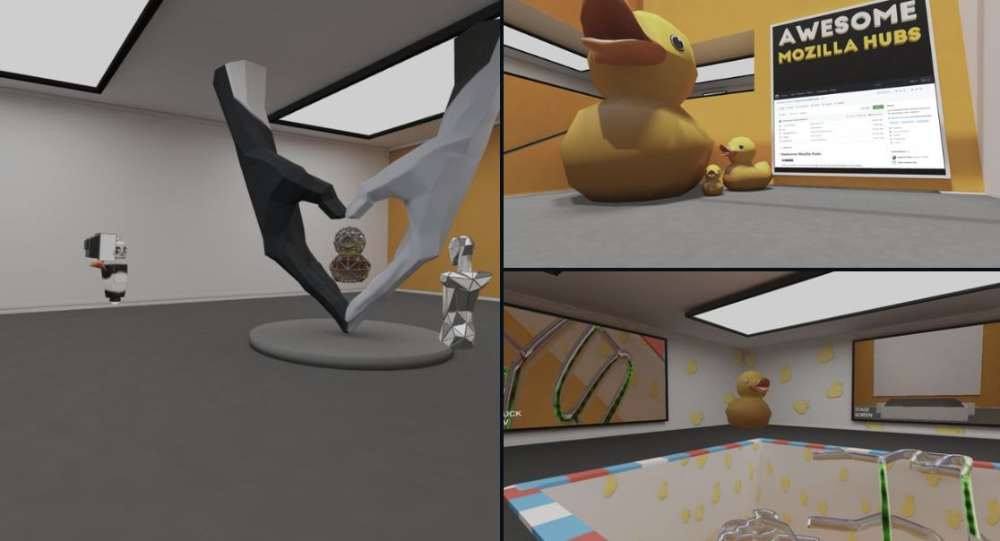
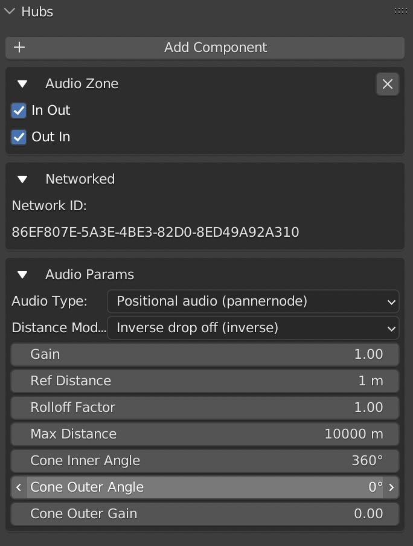
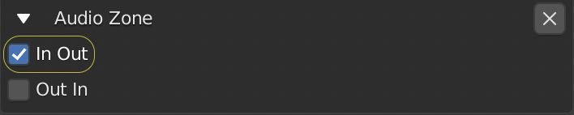
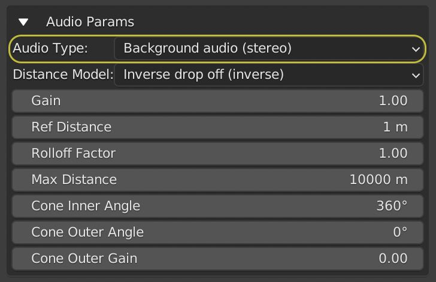
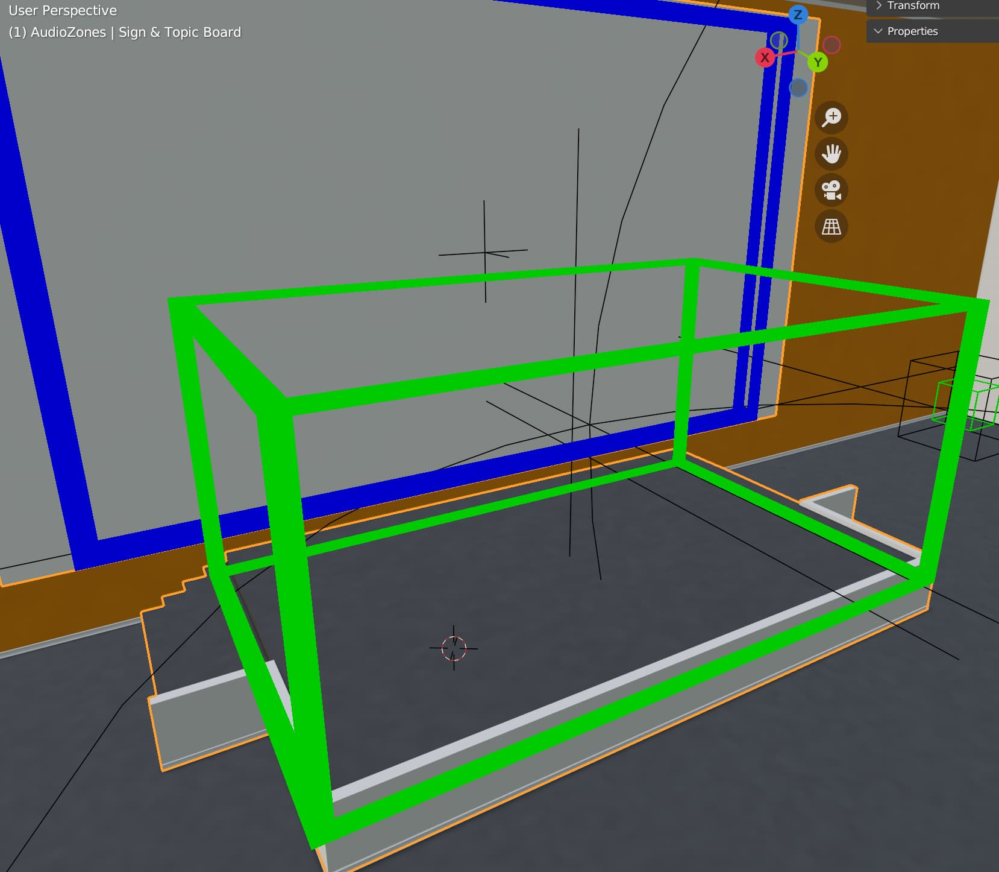
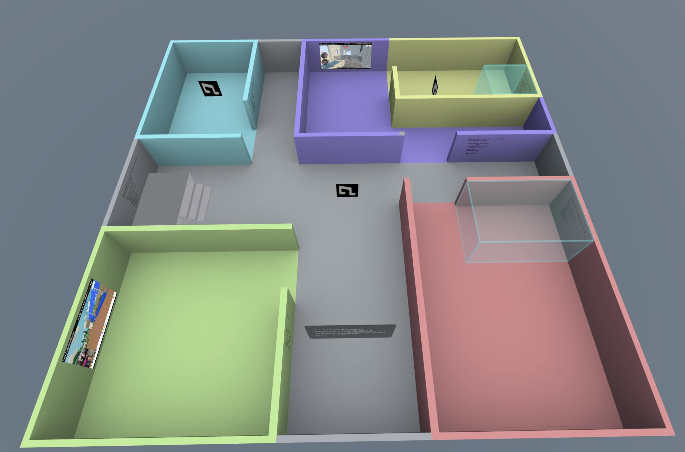

The ability to have finite control over the audio properties in a space unlocks all kinds of design superpowers. Areas that amplify voices when participants stand on them, places for private conversations, spaces for media viewing without interrupting others, and many other applications. In Mozilla Hubs, we can use [Audio Zones](https://hubs.mozilla.com/docs/spoke-adding-scene-content.html#audio-zones) to customize some sound properties to achieve different results.

Hubs released Audio Zones in 2021 to give designers more control over sound properties by location.  One experiment I tried early on was to recreate the popular [Telephone Game](https://www.tapinto.net/articles/the-telephone-game-can-it-be-this-easy-to-improve-listening-and-communication-skills) by surrounding phone booths with Audio Zones that prevent sound from leaking out into the rest of the space. Two participants can enter the phone booths and communicate their secret word/phrase without other participants in the room being able to hear them.        
Audio Zone outlined in blue. Participants can walk into the telephone booths on either side and communicate with people outside the zone who are unable to hear their conversation. Credit: [Phone Booth Models](https://sketchfab.com/3d-models/phone-booth-63ed81a563604a9a887ac51ae0514305)
Another [use case for Audio Zones from Professor Gary Burnett](__GHOST_URL__/immersive-web-spaces-in-higher-ed/) of the University of Nottingham, UK who created a translucent cylinder space to have private discussions with students so that others can see they are in a conversation but not hear them.
Prof Gary demonstrates how students can have private conversations in Nottopia, a virtual teaching island for Engineering students at the University of Nottingham.
Similarly, this dark backstage area leads into a VIP lounge that allows for private conversation so as not to interrupt anyone on stage or in the audience. Guests of the VIP area can watch the stage through in-room cameras speaking freely and making noise without worrying about bothering people outside. Great to use as a [green room](https://en.wikipedia.org/wiki/Green_room) where speakers and guests can hang out during the event.

0:00
/
1&#215;

The VIP room uses an audio zone so people can talk without disrupting the event outside A rehearsal? They won't be able to hear the VIP room out here. Model Credit: [**Camille Leclercq**](https://sketchfab.com/CamilleLeclercq)
We have taken a look at a few ways to keep audio contained, but Audio Zones can also be used to bring audio out of space. Let's look at examples of stages where anyone standing on the stage can be heard throughout the space and learn how to set those up.

In the video below, notice what happens when the tree resembling members of a great American blues rock band moves to the stage.  The green area represents the sound's distance traveled in space. The blue box above the stage is an audio zone with specific properties.
Using the audio debugger to demonstrate a stage Audio Zone. 'TreeZ Top' avatar by Imaginer.

## Creating an Audio Zone for a Speaker Stage

Let's take a quick look at how to create this using the 'Awesome Mozilla Hubs' space built by [Cris K B](https://twitter.com/cris_k_b) with community contributors.
The 'Awesome Mozilla Hubs' space for the Hubs [Awesome List on github](https://github.com/hubs-creators/awesome-mozilla-hubs). Build sponsored by [TVbit](https://tvbit.co/en/index.html). The Awesome List is not maintained by Mozilla but is managed by Hubs community members.
I'll quickly demonstrate how to use the [Hubs Blender add-on](__GHOST_URL__/what-is-the-blender-add-on/) to add an Audio Zone to the stage area in the Awesome Hubs Space that allows speakers to be heard all over the space regardless of a participant's position.

0:00
/
1&#215;

add an empty then attach an audio zone component with the [Hubs Blender Exporter](https://github.com/MozillaReality/hubs-blender-exporter/releases)
Next, we will need to edit some properties in the Hubs audio zone component. These properties come from the Web Audio API [pannernode](https://developer.mozilla.org/en-US/docs/Web/API/PannerNode) interface, an audio-processing object that represents the location, direction, and behavior of an audio source signal in a simulated physical space. You won't need to understand every property to set up a stage. Check out this [helpful space](https://hubs.mozilla.com/scenes/hitpNgs) if you would like more understanding of what these properties do. I think you'll find experiencing it in real-time is _never gonna let you down_!

This is the default setup for an Audio Zone component.
Default Audio Zone, notice Audio Zone in out/out in. Networked is reference only and audio params come from the [PannerNode](https://developer.mozilla.org/en-US/docs/Web/API/PannerNode) interface.
We make some edits for our stage setup
Stage setup. I want to affect the sound coming from inside this zone to the outsideSet the Audio Type to background audio (stereo). For our stage setup, we want everyone to hear the sound regardless of their position.
Next, we want to scale up the size of our Audio Zone, outlined in green, so the volume covers the whole stage.
Scaling the empty to increase the size of the AudioZone. Remember the green outline is just to help us visualize in Blender and won't show up in your scene.
To test your work, you may find it useful to use the audio debug panel in Hubs which will visualize your audio zones and help you to make tweaks to settings to test in real-time. You can find these options in the preferences 'Audio' section.
More -> Preferences -> Audio

⚠️

The Audio Debug Panel can negatively impact performance on lower-end devices and relies on nav mesh for ground visuals.

Finally, be sure to check out this [test scene](https://hubs.mozilla.com/scenes/PXxP3be) which gives you examples of different audio zones with properties courtesy of Senior Software Engineer [Manuel Martin](__GHOST_URL__/author/manuel/).
In this audio zones test scene, you can experience different set ups and view their properties. [Create a space and try it out here](https://hubs.mozilla.com/scenes/PXxP3be).
I hope you found this post useful. Do you have any interesting audio zone examples to share or questions? Let us know on [Twitter](https://twitter.com/MozillaHubs) or [Discord](https://discord.gg/sBMqSjCndj).
