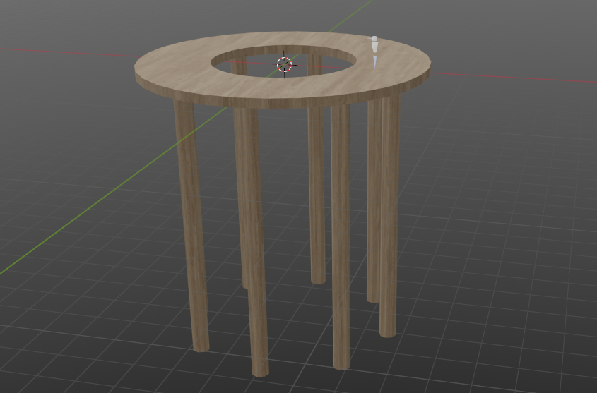
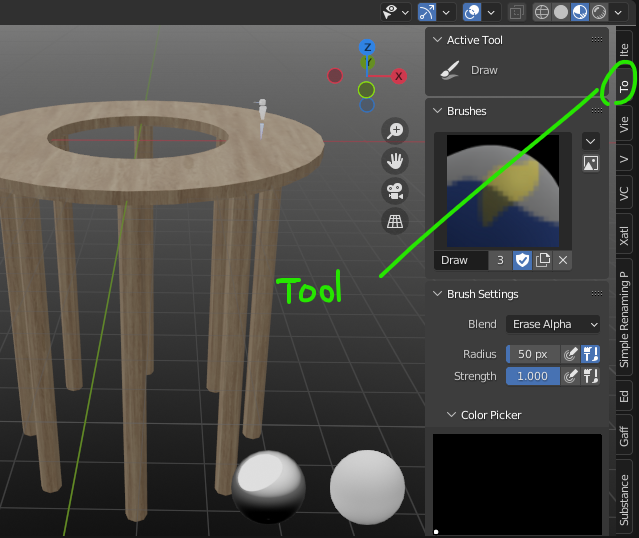
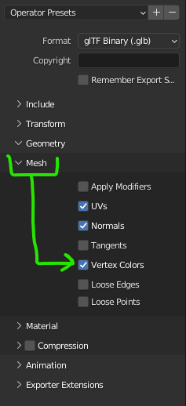

Every once in a while, someone in the Hubs community asks a question about how they can make something look like it fades away at the edges. This is usually an attempt to avoid having objects in their scene that abruptly end or otherwise appear unfinished at the edges. At first, this seems like a relatively easy thing to accomplish. But because this effect is something you usually want happening across the entirety of an object–not just part of a texture–it can be a little tricky to wrap your mind around.

Fortunately, all of the ingredients for this effect are readily available and already supported by Hubs. For a while, there was a missing ingredient in Blender: support for vertex alpha (transparency). Fortunately, this was added several Blender versions ago, but getting it to work is still a little bit of a hidden trick.

### The Scenario

For this example, I’ve set up a common scenario. I have a platform with some supporting columns below it. I would like those supporting columns to fade away to nothing as they descend into the empty space below.
Nothing too fancy; Just a basic platform with legs that are all one mesh. The spawn point on top is there to help visualize the scale. The hole in the platform will help us see the supporting legs below us while we’re standing on it.
Usually, the first thing to try is adding some sort of transparency to the material itself. However, this is somewhat inefficient since I’d like the entire mesh to fade away. So if, for example, my support legs had multiple textures on them like algae or barnacles, I would also want those parts to fade away. So that would require a lot of material editing and custom work for each material. I don’t have that kind of time for something that’s mostly a cosmetic effect. Besides, I’ll likely have to iterate on this quite a bit–testing different transparency amounts and distances–so having to edit multiple materials and textures would get very annoying very quickly. Last, this model isn't set up to have a texture stretch across the entire height since it's using a simple tiling wood texture. So what's the best way to deal with this situation?

### Vertex Color: What’s Old is New Again

In addition to storing material and texture parameters, the [glTF (and .glb) file format](https://registry.khronos.org/glTF/specs/2.0/glTF-2.0.html) supports vertex colors. If you’re not familiar with this concept, the basic idea is that the vertices of the mesh itself can store color values that will be multiplied on top of any texture(s) you may be using.

Vertex colors are a somewhat old construct, used a lot in older video games where texture memory was extremely limited. But don't let that fool you-- there are actually quite a few clever things you can use them for. If you want to see how older games used vertex colors and other ingenious tricks to make level art, I highly recommend visiting [noclip.website](https://noclip.website) to see some incredible examples. It’s not always immediately obvious how things work but you can dissect them pretty well.

0:00
/
1&#215;

An example of vertex color being used to darken the room as it ascends far above your head. When the textures are turned off, you can even see vertex color being used to tint the underlying surfaces. [Direct link to that level.](https://noclip.website/#zss/F010r;ShareData=AUSIYUk*pZUSToHUj/ViWJGIX5m*2CUezYd9w?yKV!b[,92;ByUA8wHUqW=yV[)
The above example is pretty close to what we’re trying to achieve. Except we’ll be using alpha (transparency) of the vertices to do it.

### Let’s Paint those Verts

To paint vertex color information, we first need to have our model selected. Then we’ll change modes using the dropdown menu at the top of a 3d View.

0:00
/
1&#215;

Switching to 'Vertex Paint' mode in the 3d View. You can also use the radial pop-up menu by typing CTRL + TAB, then 8.
You’ll also want to open up the side (n) panel so you can see the ‘Tool’ tab. Depending on your resolution and text scaling in Blender, the tab’s text may be partially obscured.
Here’s where you’ll find the tools/settings when you’re in Vertex Paint mode. It can easily get lost if you have a bunch of tabs like I do in this image. _Remember, it will only show these tools while in Vertex Paint mode!_
The last thing to make sure of is that your Viewport Shading is set to Solid mode. Without this toggled, you will not be able to see the colors you’re painting. With this set, upon selecting a color and painting on the model, you’ll see it working.

0:00
/
1&#215;

Choosing a bright, bold color to test vertex painting. Notice how it paints the vertices of the model and the color fades as it approaches unpainted vertices. This built-in gradient behavior will help save us lots of time.

🎨

If you ever need to clear all the painting you’ve done, you can ‘set’ or fill all of the vertices with white. To be extra sure, you can also completely remove the vertex color data in the Object Data Properties panel→ Color Attributes→ minus button.

If our plan was to have a plain color background, like black, we could simply color the bottom-most vertices black. This would give a very similar effect to the Noclip game example shown earlier. However, since we may want to use a skybox or other background image, it would be better to have some flexibility.

### Vertex ALPHA: The lesser-known part of vertex color

Each vertex can store 4 channels of information, just like many image formats do. These channels are **R**ed, **G**reen, **B**lue, and **A**lpha. When you paint normally, the Alpha channel is mostly ignored and stays fully white (opaque).

But by switching the ‘Blend’ mode in the painting tool to ‘Erase Alpha’, we are able to paint that alpha information directly.

**BUT WAIT! We won’t be able to see it properly without adjusting the material first!!!**

Let’s take a small detour here to open up the object’s material in the Shader Editor.

In order to actually see the transparency as we paint, we need to add a node called ‘Color Attribute’. In its dropdown, we’ll select the item called ‘Col’ (the default vertex color channel that gets created when you paint.). Then, we plug that node’s ‘Alpha’ output into the ‘Alpha’ input of the ‘Principled BSDF’ node.

0:00
/
1&#215;

A **Color Attributes** node is needed if you want to preview vertex colors and transparency within Blender. NOTE: Vertex colors will be exported even without any nodes hooked up in the material– or even without a material assigned at all!

🔌

If you’re also using specific colors (not just alpha), you’ll also need to plug that Color Attributes’s Color output into the BaseColor of the material.

The last step, (and the one I almost always forget–_including while writing this_), is to set the material to use ‘Alpha Blend’ transparency. Without it, the object will only show your changes as plain color.

0:00
/
1&#215;

Setting a material to use **Alpha Blend** transparency. This is key when using vertex alpha.
Since this is part of the material now, we need to switch our 3d View to use ‘Material Preview’ mode. Otherwise, you won’t see your paint strokes at all.
Back to **Material Preview** mode. This is actually a nicer way to see vertex color since it will also show any textures you have on the object.
Switch the Blend mode to ‘Erase Alpha’, then paint over the vertices that should be transparent. Remember, you don’t have to use just black (invisible) or white (opaque)-- you can use any value in between for partial transparency.

0:00
/
1&#215;

Painting with ‘**Erase Alpha**’ in order to create transparent vertices.
This works great in my example because my support columns only have vertices at the very top and very bottom. So the color fades from top to bottom smoothly. If you are dealing with mesh that has more vertices, you’ll have to compensate for that extra resolution.

💡

There are some nice gradient tools that come with the ‘[Vertex Color Master](https://github.com/andyp123/blender_vertex_color_master)’ add-on that can really help in situations where you have lots of vertices to paint.

0:00
/
1&#215;

Too many verts to paint one by one? Check out the ‘[**Vertex Color Master’ add-on by Andrew Palmer**](https://github.com/andyp123/blender_vertex_color_master). It’s got nice linear and circular gradient tools to help you paint smooth gradients across many vertices at once.
When you are ready to export, you need to have ‘Vertex Colors’ checked in the glTF/glb export settings. This is on by default, so that makes things simple.
Blender’s glTF export settings. ‘**Vertex Colors**’ is listed under ‘Mesh’ and is toggled by default. Nice to know you can easily export _without_ vertex colors without having to delete them first.

### Check it Out in Hubs

Once our scene is loaded up in Hubs, we can check to see if it’s working as expected. I chose a plain blue background to make the transparency more obvious.

0:00
/
1&#215;

Uh oh… this looks like a classic example of how Alpha Blend transparency can cause sorting issues. The renderer doesn’t understand that only the legs should have transparency data.

😖

Transparency woes got you down? Check out this [Creator Labs article](__GHOST_URL__/sorting-out-problems-with-transparency/) that explains everything you need to know to fix things up.

We quickly see that although the support columns are, in fact, fading out as they descend, they are also being drawn on top of the platform, depending on our viewing angle. In this case, it’s happening because the renderer doesn’t understand that only the support columns should have actual transparency. This will require having two materials: one with--_and_ one without--Alpha Blend transparency.

Fortunately in Blender, it’s very easy to assign a different material to the top platform.

0:00
/
1&#215;

Duplicating the existing material, renaming it, and setting it to have **Opaque** alpha.
I just need to assign this new material to the platform part of the object...

0:00
/
1&#215;

Selecting just the platform faces and assigning our **_non-alpha_** material.
After re-exporting and uploading to Hubs, we can finally see everything working–even when we use a 360-panorama image as a background:

0:00
/
1&#215;

Our supports fade into the clouds, making the scene feel more cohesive.

### Final Thoughts

If you’re wondering if you can use environmental fog as a way to achieve similar results, you’d be correct. However, fog is made to become opaque with distance from the camera, nothing else. So trying to achieve this sort of ‘height fog’ look isn’t quite as easy to do without tricks like using vertex alpha.

If your scene already contains lots of alpha blend transparency, you may find you have to make more adjustments to materials and what they’re assigned to in order to avoid [sorting problems](__GHOST_URL__/sorting-out-problems-with-transparency/). Not impossible, but definitely something to factor into your workflow.

I’ve seen this technique used to add additional dark areas to simulate contact shadows to great effect. I’ve also seen multiple textures blended together using vertex alpha. I’m sure someone reading this will come up with something cool to demonstrate. As always, please visit our _#show-and-tell_ channel on the [Hubs Discord](https://discord.gg/dFJncWwHun) and share your wizardry with the community.
