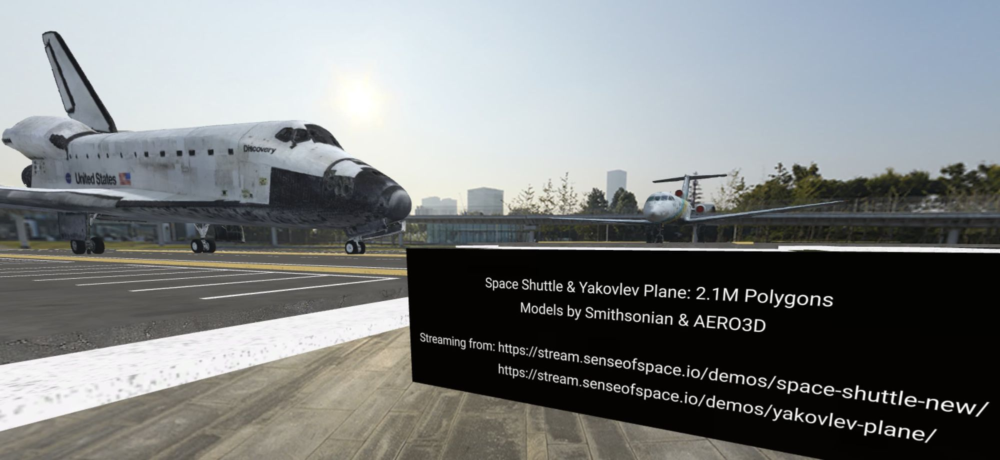

Photogrammetry lets us take anything from our real world and create virtual objects or spaces from it. It works by taking measurements from photographs and using those measurements to guess and arrive at some conclusions about the geometry of the space.

The applications of technologies like photogrammetry are still being explored and realized. Visual Effects artists Corridor Digital used this technique along with a drone to bring abandoned ghost towns into Mozilla Hubs as seen on their popular youtube channel [Corridor Crew](https://www.youtube.com/watch?v=k1uXppV6TeA&t=1457s).

0:00
/
1&#215;

[Corridor Digital](https://www.corridordigital.com/) using a drone with [PolyCam](https://poly.cam/) to create Hubs spaces. "[We 3D Scanned a Ghost Town to Preserve it Forever](https://youtu.be/k1uXppV6TeA?t=1457)" Corridor Crew
[ZeuxisVR](zeuxisvr.com), a digital initiative at Lafayette College, is exploring how photogrammetric environments can be used to enhance the study and teaching of art history. Students travel with [Prof. Eric Hupe](__GHOST_URL__/author/profhupe) to photograph sites and then work to create and optimize models that are shared through an [Open Education Resource](https://en.wikipedia.org/wiki/Open_educational_resources) with more examples featured below.

In this post, we will take a look at photogrammetry, what it is, and how it's been used to create social, immersive web experiences.

## How it works

Photogrammetry is a technique for creating 3D models of real-life objects and environments.  The process involves capturing multiple photographs from varying viewpoints and feeding them through photogrammetry software that reconstructs the geometry of the physical object. Those same photos can then be used to texture the model. The results are highly accurate photorealistic models of objects, architecture, or environments.

[ Arc de Triomphe - photogrammetry ](https://sketchfab.com/3d-models/arc-de-triomphe-photogrammetry-65937fd27de647c0a8ac99ce8275c03e?utm_medium=embed&utm_campaign=share-popup&utm_content=65937fd27de647c0a8ac99ce8275c03e) by [ Nicolas Diolez ](https://sketchfab.com/nicolasdiolez?utm_medium=embed&utm_campaign=share-popup&utm_content=65937fd27de647c0a8ac99ce8275c03e) on [Sketchfab](https://sketchfab.com?utm_medium=embed&utm_campaign=share-popup&utm_content=65937fd27de647c0a8ac99ce8275c03e)

### Some Basic Rules of Photogrammetry

• The quality of your model is directly related to the quality of your photos. Poor-quality photos will result in poor-quality models.

• When capturing photos be sure you have enough light to properly expose the image.

• Make sure the photos are as sharp as possible and have a deep depth of field (i.e. higher aperture). No portrait mode.

• Make sure your photos overlap by at least 60%. The more photos the better!

• When photographing move the camera between shots. Do not pivot on one point. The software needs to recognize vertical or horizontal movement between photos.
Credit: ShotKit: [Beginners Guide to Depth of Field in Photography](https://shotkit.com/depth-of-field/)

## Photogrammetry in Hubs

These photogrammetry scans of the real world can be brought into the immersive social web and shared with a link. Here are a few examples in Mozilla Hubs:

#### Bedroom of Agostino Chigi

0:00
/
1&#215;

Sodoma's frescoes in the Villa Farnesina created with 66 photos using [RealityCapture](https://twitter.com/RealityCapture_).

#### Vestibule, Laurentian Library

0:00
/
1&#215;

Vestibule, Laurentian Library, San Lorenzo - Michelangelo Buonarrotti begun in 1525
Created from 543 photographs captured during the summer of 2021 by the [Zeuxis VR](https://www.zeuxisvr.com/about-us) team. [More information can be found here](https://www.zeuxisvr.com/properties/vestibule-of-laurentian-library) along with the scene which includes an audio description and slideshow.

#### Pub Sirdie

0:00
/
1&#215;

Pub Sirdie, Helsinki Finland. Optimized scan with a mirror component built by [Mikko](__GHOST_URL__/author/mikkoh)
You can create your own virtual Pub Sirdie using [this link](https://hubs.mozilla.com/scenes/uJ4zmye).

⚠️

Adding mirror components will have a significant performance impact on the space. The video above is a screen capture from a Quest 2.

#### Nightclub Mural

0:00
/
1&#215;

"Sukupolvien saatto" by Tapio Tapiovaara, scene composed and scanned by [Mikko](__GHOST_URL__/author/mikkoh)
Uncovering, photographing and photoscanning a mural located inside a nightclub, two days before the whole building and the painting along with it was torn down. Painting by Tapio Tapiovaara ("Sukupolvien saatto", 1964). A timelapse video showing the process is embedded on the wall.

#### Sand Castle in Spain

0:00
/
1&#215;

Sand Castle Scene composed by [@RupertRawnsley](https://twitter.com/RupertRawnsley). ScreenCap and Scan by: [@MaxFunkner](https://twitter.com/MaxFunkner) Sand Castle Artist Unkown

> "Mindblowing🤯 Do you want to create your own metaverse without 3D design skills?  Build your own sand castle, scan it with @[Polycam3D](https://twitter.com/Polycam3D) and upload it to @[MozillaHubs](https://twitter.com/MozillaHubs), share the link. Sand is very scan-friendly and will put your guests in a 🏖 holiday mood"
>
> - [MaxFunkner](https://twitter.com/MaxFunkner/status/1573967042050506752) via Twitter

#### Karaoke Bar

0:00
/
1&#215;

Karaoke Bar using 1533 images by [Mikko](__GHOST_URL__/author/mikkoh)

## Try for yourself

Looking to get started creating your own photogrammetry scans and bringing them to the web? Check out these resources and applications.

#### Optimizing Your Scan for the Web and Mozilla Hubs

Here are some general tips and suggestions to keep in mind for optimizing scans for Mozilla Hubs.

1) **Decimate**, decimate, decimate. Photogrammetry software often produces models that have millions of polygons. You will need to reduce that poly count by decimating the geometry. This can be done in the native photogrammetry software or in a 3D editing tool like Blender. For a model to run smoothly in Hubs look to decimate to 50,000 or 100,000 polys.

2) **Textures** can drain the processing power of your scene. As a general rule of thumb, keep your texture counts low and between 2 and 4k resolution. Ideally, you will want to produce 2k textures to run even more smoothly, but you can lose some definition. In most scenarios, this is totally fine. You can also resize textures after model creation by converting the .glb file into a .gltf. This [video](https://www.youtube.com/watch?v=hC9RxhVmrGM) is immensely helpful. Lastly, in the process of decimating models, or because you could not capture the entire environment, you may be left with some holes in your texture. In these cases, the [clone tool](https://www.youtube.com/watch?v=aHuf5p1VuRk) in blender is your best friend.

3. There are **Hubs-specific components** you can add to your scene using Blender. [Navigation mesh](__GHOST_URL__/what-is-a-nav-mesh/), waypoints, lighting, and environment maps are all extra components that can enhance the user experience for people in your space. Read more about the Hubs Blender add-on here: [What is the Blender Add-on](__GHOST_URL__/what-is-the-blender-add-on/). Be mindful, however, if you are viewing your scenes with a VR headset like the Quest 2, not all components (eg. lighting) will work.

#### Level of Detail

Since scans are often times so heavy, this is where a concept like [Level of Detail](<https://en.wikipedia.org/wiki/Level_of_detail_(computer_graphics)>)(LOD) shines. At a high level, we can think of it as a technique to render what we need to based on the player's viewport, proximity, or the importance of the object.  We can see this concept illustrated nicely with textures below by Hubs team Senior Software Engineer Takahiro Aoyagi. Notice how the fidelity of the object changes as the player moves through the space.

0:00
/
1&#215;

> Mozilla Hubs + Textured glb + LOD. LODs are made with gltf-transform. UVs + resized textures in lower levels look fine.
> [@superhoge](https://twitter.com/superhoge/status/1573434117282320389)

Cloud-based solutions like [Sense of Space](https://www.senseofspace.io) automatically create LODs and stream large 3D models into Mozilla Hubs without any manual decimation or optimization. That way, you can seamlessly scale models with millions of polygons and heavy textures while maintaining a good experience.

[Sense of Space](https://www.senseofspace.io) provides a cloud-based solution to create and stream LODs anywhere automatically.

## Conclusion

Photogrammetry and technologies like it provide a lot of interesting avenues for design and bring our real world into our digital world in interesting ways. Preserving great works of art, ghost towns, or even sand castles so they can be appreciated long into the future and enjoyed by a wider audience.  Have anything you scanned for the immersive web? Experimenting with [NeRF](<https://golden.com/wiki/Neural_Radiance_Field_(NeRF)-REYZW83>)s? Let us know on [Twitter](https://twitter.com/MozillaHubs) or [Discord](https://discord.gg/sBMqSjCndj).

#### Appendix: Tools for 3d Scanning and Photogrammetry

[

AliceVision | Photogrammetric Computer Vision Framework

AliceVision is a Photogrammetric Computer Vision framework for 3D Reconstruction and Camera Tracking.

Photogrammetric Computer Vision Framework

](https://alicevision.org/#meshroom)PhotoScanning with Meshroom, DarkTable and Blender from [Gleb Alexandrov](https://www.youtube.com/c/GlebAlexandrov)[

Polycam - LiDAR & 3D Scanner for iPhone & Android

Capture reality with Polycam’s LiDAR scanner & photogrammetry. Make 3D scans and download 3D models. Available on iPhone, iPad, Android and Web.

Polycam

](https://poly.cam/)
