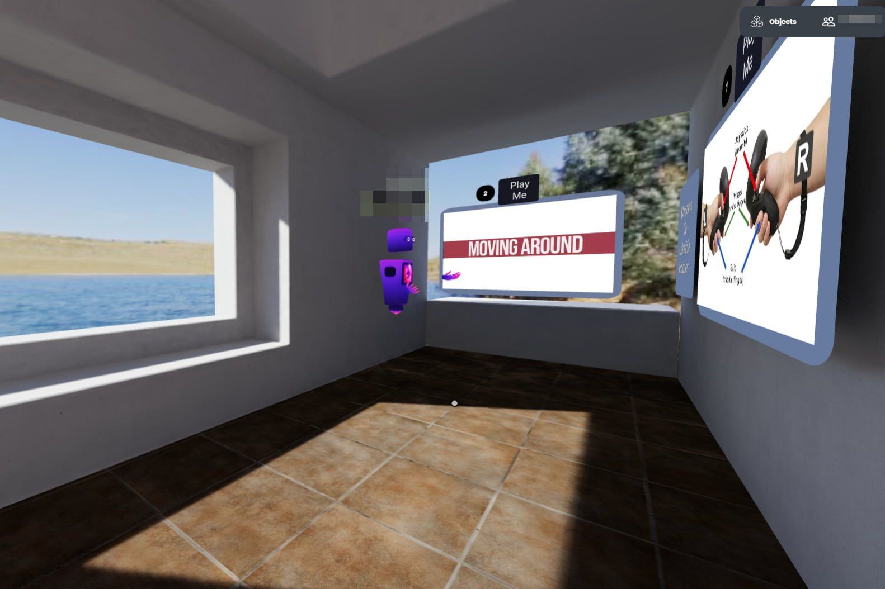
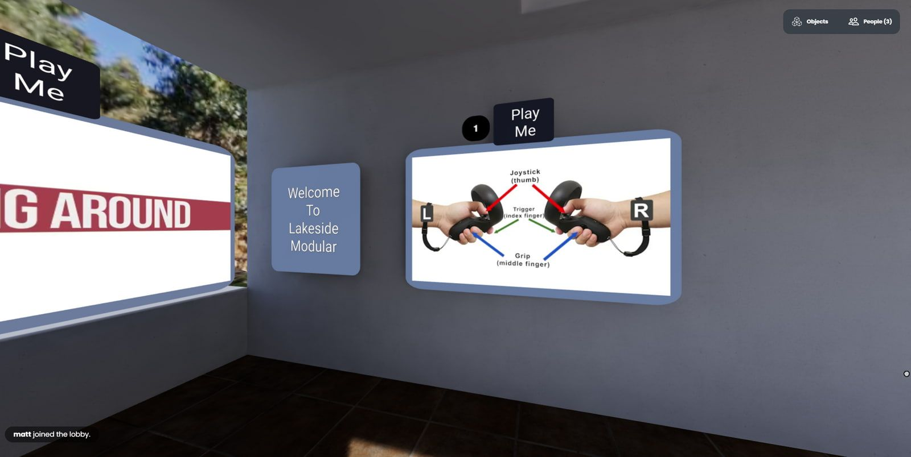
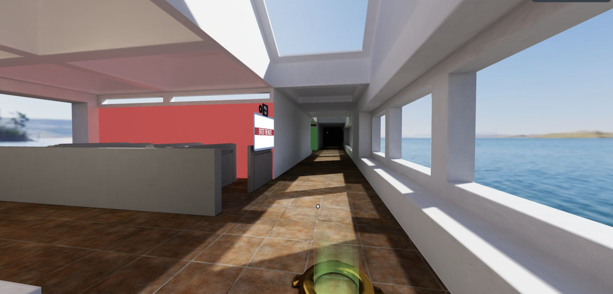
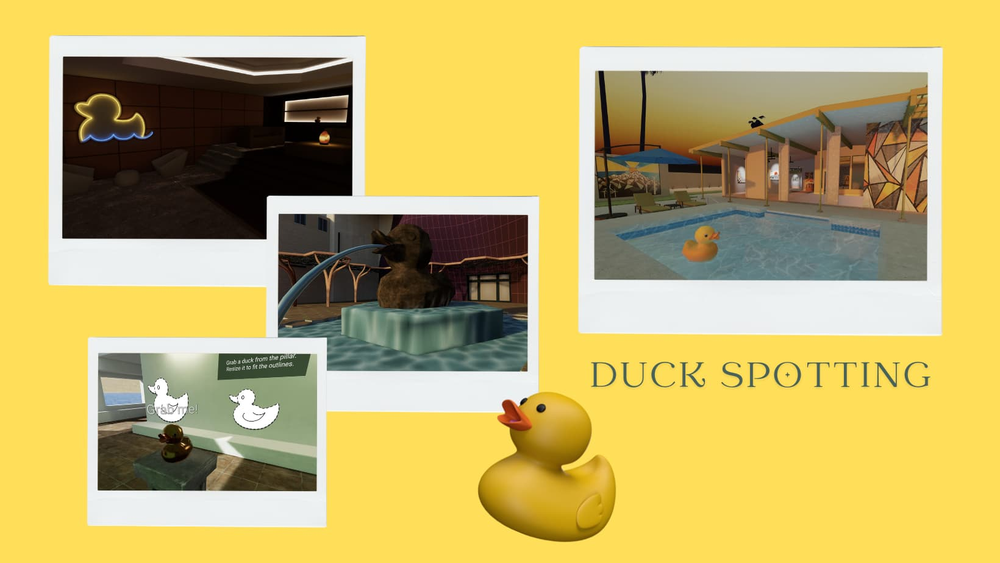
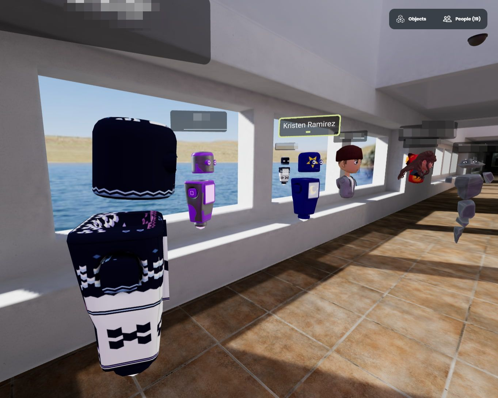
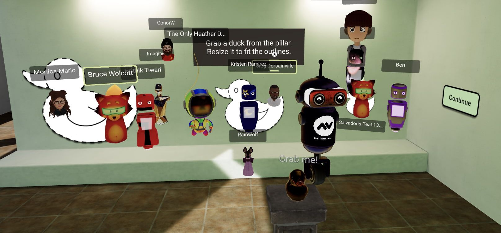

On September 30, a small group gathered for the Friday Hubs Community Meetup. We were heading to a VR orientation show-and-tell guided by New York University's (NYU) Senior Multimedia Developer Greg Dorsainville and Research Anatomy and Physiology (A&P) Instructor Kristen Ramirez. We arrived at the end of the hallway and stayed within sound range of our guides while looking around the space. Greg started with an explanation of what happens to new learners just like us when they arrive and why they are there.
New learners arrive in a slightly confined space so they cannot wander away.

### Now arriving - you!

A new learner arrives at the end of a hallway with 3 walls around them. This is a good way to start new learners because the concept of floors, walls, and hallways is familiar to students at NYU. Additionally, new learners often replicate real-world behaviors in virtual reality (VR). So if they try to walk in the wrong direction, the walls hem them in. Thus, they look around at the walls and watch the videos.

Alternative poor ideas for an arrival space for these same users might be arriving in outer space or underwater. In those examples, new users _might not_ have an orientation of what to expect or how to move and might become disoriented.

0:00
/
1&#215;

New learners watch how to use controllers and move.

### Minimal technical support

Greg explained that the NYU learners were accessing VR from within a physical room on the NYU campus and that it would often be just one learner at a time visiting the space with one technical support person standing by. Tech support helped the learner with putting on a VR headset, adjusting it for the best view, and holding the controllers properly. One downside to this solo approach is that during the few rare times when other learners would be in the same VR space, learners might be startled seeing another avatar in the same space.
Instructions & videos are on the walls about VR controller buttons and basic movement.
There were posters on the VR walls explaining to a learner which buttons they would need to complete the experience. The idea is that learners would arrive, look around, read & follow the instructions on posters & videos with the clever 'Play Me' _Alice In Wonderland_-like instructions. In this way, learners were free to explore at their own pace but someone was nearby. Once the learners feel comfortable, they can head down the hallway to the first room.

## A&P simulations exist, so why VR?

Greg shared this 2017 [study](https://pubmed.ncbi.nlm.nih.gov/27273896/) that had first-year learners in A&P courses. Greg explained that simulations for A&P courses already exist. However, he was intrigued that this study's results predicted that VR adds an element that simulations cannot; that is

💡

VR might increase a user's ability to think spatially, to think in 3D.

> From the abstract, “The results indicated that all students who were exposed to the stereoscopic 3D vascular models in 3D learning sessions increased their ability to correctly identify the head and neck vascular anatomy. Most importantly, for students with low-spatial ability, 3D learning sessions **improved** post session knowledge scores to a level comparable to that demonstrated by students with high-spatial ability indicating that **the use of 3D stereoscopic models may be particularly valuable to these students with low-spatial ability.**”

These means that VR provides these affordances for A&P instruction:

- Three-dimensional objects,
- Learners can move their own avatars,
- Learners can grab objects and expand and contract the object size,
- Learners can navigate through layers or systems (see the example video [here](https://nyulangone-immersive-classroom.glitch.me/experiences/ptpfossa/) noting how the arteries and nerves can be shown separately),
- and due to these affordances, learners can see A&P structures in ways they might not have seen before (for example, putting one's smaller head inside a larger skull)

All of these affordances, therefore, show up in this Hubs space.

Kristen and Greg felt that it was important that learners be able to experience a 3D object in VR and be able to manipulate it and change the object's size. VR objects for A&P also reduce the need for real-world lab supplies. Body parts can be replicated and reset in VR. In real life, a cadaver cannot be dissected more than once.

### Color-coded rooms

There were four rooms, each color-coded so that the colored light spilled out into the hallway. This helps learners move towards specific rooms if they were directed to meet up with technical support in “the green room”, for example.
You start near the pink room on the left and the green room is ahead down the hallway.

## Move forward and turn

The first room helped learners learn how to move. It included a maze that looked like cubicle walls.

0:00
/
1&#215;

New learners move forward and turn left and right in a maze.
To ease stress, since this was a learner's first task, there was an easy option to walk directly to the back of the room.

On the back of each room was a teleport button that would take the user to the next room. The idea is that if a learning task is finished, the learner should proceed to the next task.

0:00
/
1&#215;

When successfully finishing a task, the learner is teleported to the next room.

## Grab an object and resize

In the second room, learners practice how to grab, move, and enlarge and object.

0:00
/
1&#215;

Bonus points: many Hubs builds seem to include a duck somewhere as a nod to their Mozilla Hubs hosts.

💡

Placing a duck somewhere in a build is a trend I’d love to see continue as it is cute! It introduces an Easter egg-like hunt for more experienced users.

Easter-egg hunts in Hubs involve duck spotting.

## Expand and look inside

0:00
/
1&#215;

Learners up their game watching how to look inside a skull.
In the third room, learners are asked to grab an A&P object, a skull, and then look inside. There is a little quiz on what they see inside a human skull and then they are off to the next space.

## Draw to learn

In the fourth room, learners use the Hubs pen tool to complete a connect-the-dots puzzle.

0:00
/
1&#215;

Learners use the pen tool and connect numbered dots.

### You’re done!

The final space is the end of the hallway where the learner is specifically told that they are done with the experience.

0:00
/
1&#215;

You are done! Time to celebrate!

💡

Greg explained that he found adding this 'you are done' announcement was vital. If learners were not told that this was the end, they would wait for more.

It is important in new experiences to direct learners to what they should be doing at all times. It is a safety and courtesy item to be a good host all the way through an experience.

### Prep for Anatomy and Physiology

Kristen said she is interested in future custom designs in VR for A&P classes. She’d like to foster interest with other faculty and the students. Ideally, a learner cohort could begin NYU with early VR experiences like this one in Hubs and then could experience VR throughout the program. This is a reasonable approach because it does not insist upon VR for VR’s sake, but instead encourages a thoughtful and planned incorporation of VR. For example, Kristen explained that NYU currently has a few different types of VR headsets. Mozilla Hubs can be run on any of them. This is an early advantage because some existing A&P assets only run on specific gated or costly VR platforms. **By starting with low-cost assets that are highly accessible, both the faculty and students are set up for future success in VR.**

## Final Questions

After our tour was done, Kristen and Greg took any questions we had. We asked about headsets and how they were implementing other VR experiences. Read about their Journey through the Heart experience [here](__GHOST_URL__/exhibitions-that-educate/).

Find out more about how NYU is implementing VR into it’s A&P courses here: [https://nyulangone-immersive-classroom.glitch.me/experiences/ptpfossa/](https://nyulangone-immersive-classroom.glitch.me/experiences/ptpfossa/)  I recommend that you visit this page to see how Kristen and Greg have combined a traditional A&P lab space with protective clothing, masks, and gloves with VR headsets and computers. Bravo for combining VR into a traditional space so that learners will get used to the normalcy of VR into their everyday lives.

The link also provides a video tour of the learning and explains how learners are expected to quiz themselves both in the headset and later at home via WebXR.

💡

Another bonus point for Hubs - VR spaces are NOT restricted to headsets.

In conclusion, Kristen explained how VR would give her as an instructor more ability to show & take her learners directly into and around body spaces that she had been heretofore restricted to simply teaching by verbal explanation. She said, regarding orienting learners in Hubs and then designing spaces for A&P, "that's a specific use when VR was perfect!”
End of our tour at the far end of the hallway

## Lessons Learned

If you are designing VR spaces for new users, here are some tips:

**Have tech support available.** Learners come in all shapes, sizes, and abilities.

**Set up basic tasks for new learners.** Remember there is a first day in VR for everyone.

**Start with predictable environments.** Floors, walls, and rooms are very familiar. Save outer space for a party.

**Have a compelling reason to use VR.** Greg knew that he could find A&P simulations but he wanted to explore the spatial ability challenge. Kristen sees using Hubs as the start of using VR experiences all through a degree program. So VR is not one-time choice; this is the beginning of a new way of learning.

## Wrap Up

We asked if there were any bugs in the build or parts of it not working. We ended up talking about some sound conflict problems and two wall surfaces that did not align.

In an unplanned but increasingly common moment for us VR professionals, Greg’s child entered his room in real life, saw Hubs on the screen, and asked what his Dad was playing. Greg said, “I’m not playing, I'm talking to people.” We all shifted to saying hello in our different voices and validated that we were,* indeed, *real people.

Yes, Hubs looks like a game. We get it. Those who gather for these Friday Meetups are developers, designers, and instructors all with an interest in the best use of Hubs.

But it will be a little while longer before we let on what that kid saw; Hubs is also _a ton of fun_.
Group photo by the duck!
Cui, D., Wilson, T. D., Rockhold, R. W., Lehman, M. N., & Lynch, J. C. (2017). Evaluation of the effectiveness of 3D vascular stereoscopic models in anatomy instruction for first-year medical students. Anatomical sciences education, 10(1), 34–45. [https://doi.org/10.1002/ase.1626](https://doi.org/10.1002/ase.1626)
