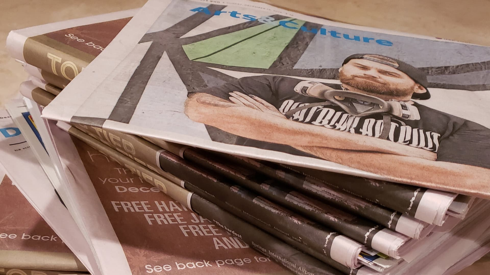
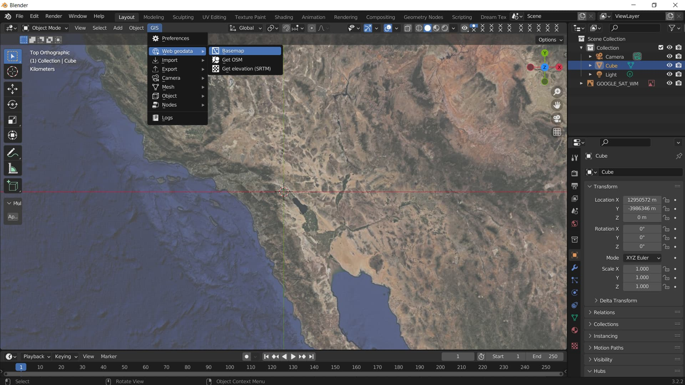
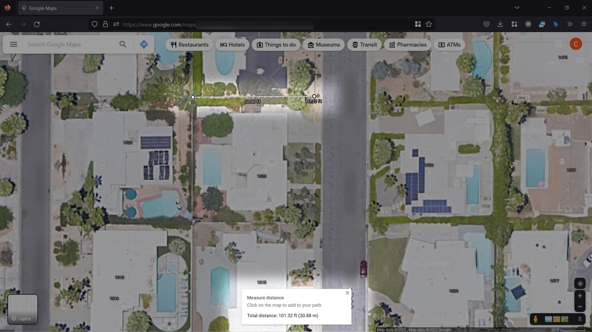
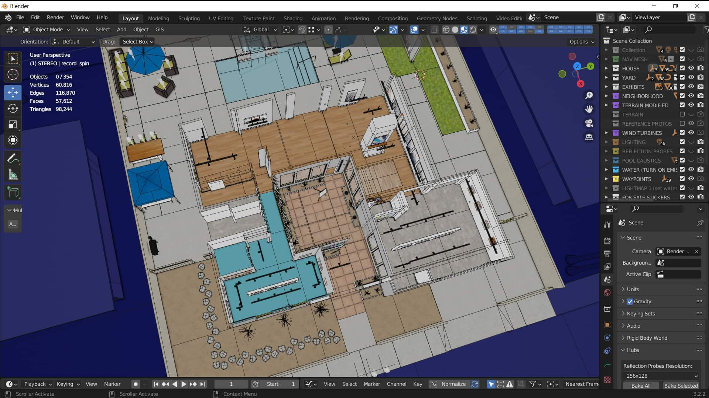
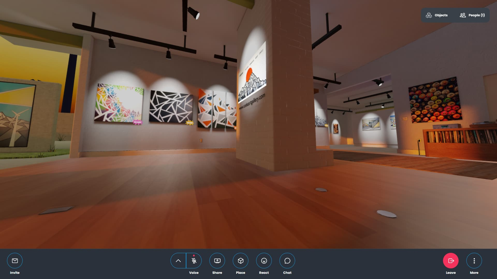
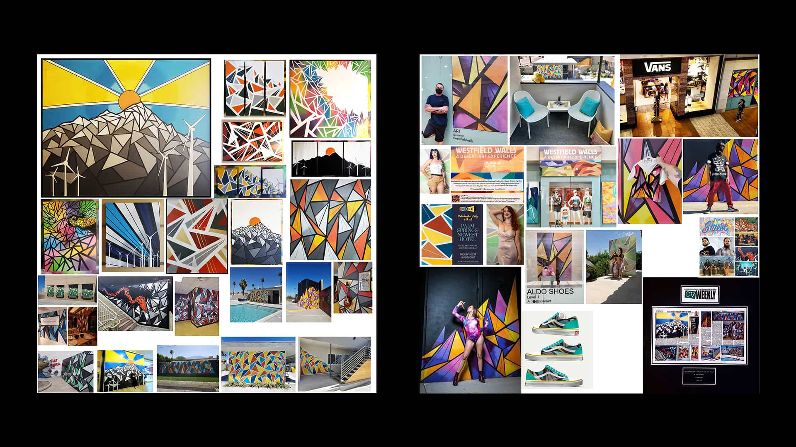
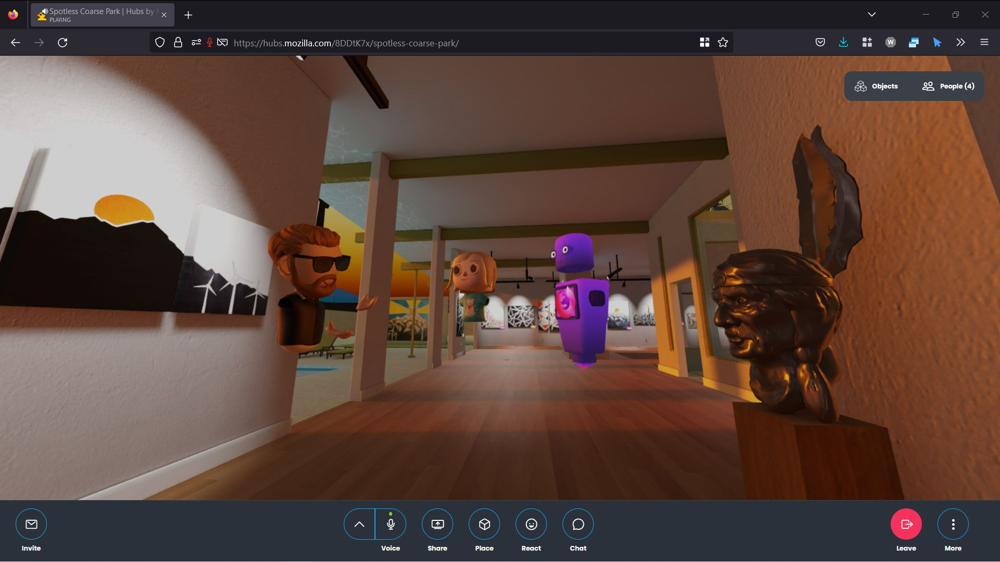

Artistic talent, as they say, runs in the family.  My grandfather was a successful commercial photographer; my brother is a successful digital artist; I myself have made a career working as an artist in video games and tech...  And my cousin Cody Silva (aka [Codezart](https://www.codezartgallery.com/)) has had his share of success in recent years as a graffiti artist making and selling beautiful murals and abstract canvases.  Ever since I came on board with the Hubs team 2 ½ years ago, I have had a vision of creating a virtual online gallery in Hubs to showcase both his amazing works as well as the features and potential of Hubs, and recently that vision finally became a reality.
Codezart in the Desert Sun newspaper.
Cody resides in and sells his artworks in the greater Palm Springs area in Southern California, and a lot of his canvases end up hanging in the area's famous mid-century modern homes.  I had the idea to create a Hubs virtual gallery inside a renovated mid-century modern home so that visitors and prospective buyers might be able to get an idea of what his artwork might look like in context, hanging in their own homes.

I really wanted this Hubs scene to feel like it was nestled in Palm Springs, with the goal of having the sun setting behind the mountains with windmills in the background, just like in some of his iconic paintings.  I found a really great Blender add-on called [BlenderGIS](https://github.com/domlysz/BlenderGIS) which allowed me to bring up a map of the entire planet right in Blender, draw a window around the Coachella Valley, and bring that 3D terrain data straight into my scene with just a few clicks.
Defining the background of the scene with the BlenderGIS add-on.
Using [Google Maps](https://www.google.com/maps), I found a neighborhood in Palm Springs that featured these types of houses. I was able to measure the width of the lots, the width of the streets, and get an idea of how far back the homes were set from the sidewalk. Once I brought that image into Blender at the correct scale, it was time to start modeling the home.
Measuring home lots via Google Maps.
I found several floorplans of mid-century modern homes online and chose my favorite.  I brought the image into my Blender scene as a reference image, and once properly sized, all that I really had to do was make a cube and then trace the walls using the extrude tool.

I knew I wanted the main part of the home's living space to be the primary gallery displaying Codezart's canvas works, so I ripped out the kitchen.  I decided to tear down a common wall in the front bedroom area (where there were once two bedrooms) and make one larger room to use as another gallery to show his commercial art successes.  I ripped out some walls and widened some doors in the garage area making the third gallery to display his murals.
Overview of home-turned-gallery in Blender. I just love that interior courtyard.
It was important for me to really capture the feeling of this gallery being in a once lived-in but now renovated house, so I ended up leaving portions of walls that I felt had structural importance and could not be removed - including the chimney itself!  I also added little details like capped-off pipes and electrical conduits at the floor where the kitchen used to be, with light switches and electrical outlets on the walls and a wrinkle in the carpet so it felt more home-like and realistic.
Plates on the floor - watch your step!
Placing dozens of images into a Hubs gallery the wrong way can have disastrous consequences for scene performance.  I have seen a lot of Hubs galleries over the past couple of years with dozens of individual images of varying sizes, and these can really start to bog down your device.  I had over 50 images I wanted to display in this scene, so I leveraged [texture atlases](https://en.wikipedia.org/wiki/Texture_atlas) to keep things speedy and performant.
Sample texture atlases from the Codezart Hubs scene.
I used a total of 4 texture atlases to hold all of the works I wanted to display, 1 of which is 4096x4096 in size, with the others at 2048x2048.  It's generally frowned upon to use 4K textures in a Hubs scene, but it's _much_ better on performance when compared to having 50+ separate images and materials, and being a gallery showcasing some high-quality art, it was important to have resolutions high enough to display it.

The rest of the textures and images used in the scene were run through online image compression routines such as [TinyPNG](https://tinypng.com/) and [Squoosh](https://squoosh.app/), often saving 75% or more in texture file sizes and without any noticeable visual loss in quality. Doing this allowed me to reduce my total Hubs scene size - with all of its textures, lightmaps, baked reflections, geometry, and animations from 140+MB to _less than 70MB_ in the final published scene!

The Codezart Hubs gallery is quite performant, even on older devices.  I was able to use Hubs' “high quality” mode (located in the Hubs preferences) on my 4-year-old Samsung phone and still get a speedy 60fps in some browsers. Plus it runs well in VR on Quest 2, so there's virtually no audience the gallery cannot reach (pun intended of course)!
Codezart demoing his art next to a replica of a bronze statue that belonged to our grandpa.
The end result is a unique gallery displaying dozens of exhibits in an attractive 3D space, themed to match the artist's works that anyone can experience on pretty much any modern device with a web browser - and you can check it out yourself at the link below!  
[

Codezart Gallery | Hubs by Mozilla

Join others in Codezart Gallery, right in your browser.

Hubs by Mozilla

](https://hubs.mozilla.com/scenes/D8PNKw9/codezart-gallery)Click here to view the Codezart Hubs scene for yourself!
It wasn't all that long ago back in 2014 when I was spending months and months trying to learn Unreal Engine in order to make a VR showcase of my own personal 3D artwork.  And the result was a _huge_ file with specific technical instructions that few people could run and very few probably saw at all.  Now, thanks to Hubs, a skilled 3D artist can create a stunning virtual gallery that anyone can view, using only a hyperlink and reaching potentially millions of people!

Thanks for reading!  We can't wait to see what you make with Hubs.  <3
