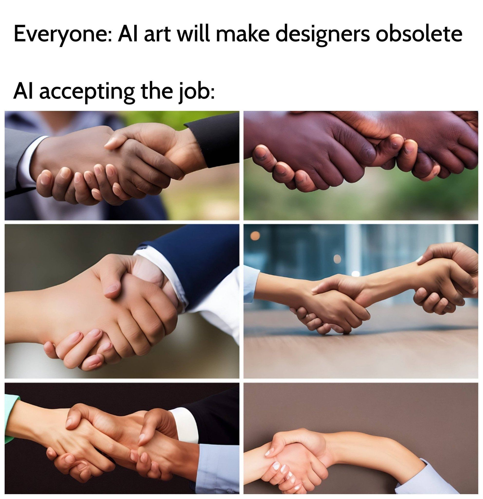
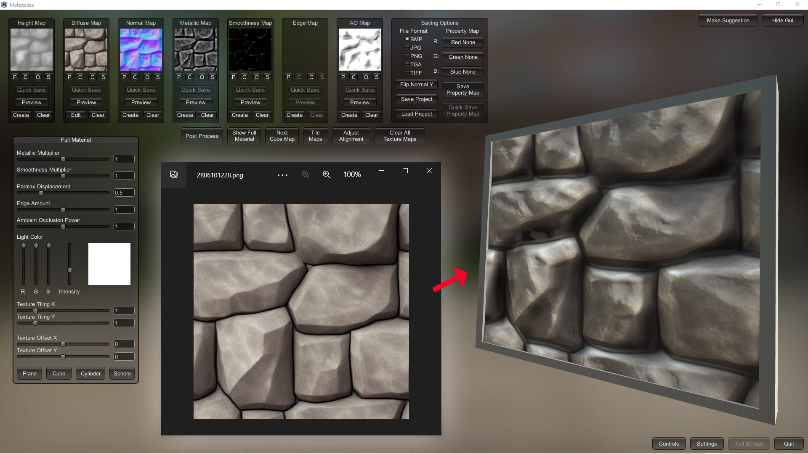

Alright, so you've had some time with the amazing '[DreamTextures](https://www.blendermarket.com/products/dream-textures)' Blender add-on and you're struggling to get the results you are looking for (and if you don't know what I'm referring to, [please read this post](__GHOST_URL__/using-ai-textures-to-enhance-your-hubs-scene/) for context).

It's true – while AI-generated images are an incredibly powerful and approachable new technology that puts the power of the world's best artists at your fingertips, it's not totally foolproof (yet). Like anything, it takes some practice to get good at it.
A funny AI art meme found posted on a Stable Diffusion Discord server.
The following are 10 tips I have learned in the past month tinkering with DreamTextures and Stable Diffusion.

**1. Be very specific and use lots of keywords**

Use as many descriptive words as you can think of to describe what you are trying to generate. If you are trying to create something in a  particular artist's style, use their name in the prompt (such as “by John Doe”), or the name of a studio (such as “by Game Studio X”).

For help with prompts, try a site [such as this one](https://publicprompts.art/).

**2.\*\***Use negative prompts\*\*

Always.  No exceptions.  The negative prompt tells DreamTextures specifically what NOT to draw, so if you're trying to generate an orange car, for example, and you keep getting the food “orange” in your scene, you might try adding the words “fruit” or “food” (or both) to your negative prompt. This is really crucial to generating good AI images.
Comparing a texture generated with a simple prompt versus one generated with a lengthy prompt and negative prompt.
**3.\*\***Use a "Source Image"\*\*

Also known as "init image" or “image to image”, this is an image file that you provide to DreamTextures that it uses as the basis for generating new image(s).  You will not get as much variety this way, but if you are struggling to get a specific look or composition, give it a try – you might be surprised how much it can help.

**4.\*\***Size matters\*\*

Always use a resolution of 512x512 for textures.  The AI models were trained with 512x512 images, and anything it tries to generate outside of those dimensions can contain weird artifacts and unexpected surprises.  Larger sizes will also dramatically increase the time it takes to generate an image, and not in a linear way – larger images take exponentially longer to generate than the default size does.
A comparison of the same prompt used with three different samplers.
**5. Try different samplers**

Different samplers will produce different-looking results.  Some samplers can produce really stunning results at low steps, while others require more steps to refine the image.  Experiment and see what happens!

**6. Disable “show steps” to speed things up**

Turning off the “show steps” option dramatically speeds up image generation time (faster than double the speed in my tests), so you can make more images faster. (This is off by default as of DreamTextures version 0.0.8.)
One of the above-generated textures given the PBR treatment in Materialize.
**7.\*\***PBR-ify your textures\*\*

Using a utility such as [Materialize](http://boundingboxsoftware.com/materialize/), you can easily create PBR maps and materials from your DreamTextures generations.  Be sure to check their 'Tutorials' page if you need help.

**8**. **Fine tune**

If you get something really close but not quite what you were looking for, try running the same seed again with a different number of steps.  After generating an image you kinda like, under 'Advanced', un-check “Random Seed”.  The seed of the last generated image will auto-populate into the “Seed” field.  Then just change the number of steps by 1 and run it again. Change steps and run it again! And again!  (The same can be done with CFG scales for even smaller refinements.) You can compare your results from the images dropdown – your new iterations will have the same seed number ending in .001, .002, etc.  Try this a number of times before giving up on a seed entirely.  (This seems to work best with sampler type “KEULER_A”)

**9. Keep a prompt journal**

Take your best prompts and store them somewhere in a text file on your computer.  Study them and see if you can identify patterns or keywords that could be useful in the future.  Record the settings you used too, and save the image – the default file name of a DreamTextures image is the seed number.
Actual photo of my laptop after generating a series of AI images. (No, not really, but it does get quite warm!)
**10. Monitor system resources**

Generating AI images locally can take up quite a bit of system resources.  When generating DreamTextures images, I tend to keep my Windows Task Manager open so I can keep an eye on system resources,  especially RAM.  It's probably not a bad idea to keep an eye on GPU temps, too.

I could go on and on but those are the top 10 tips I came up with after spending a considerable amount of time playing with Dream Textures.  Happy prompting!

For more Mozilla Hubs updates and Creator Labs content, follow us on [Twitter](https://twitter.com/MozillaHubs) or in [Discord](https://discord.gg/sBMqSjCndj).

_Ready to get started with your own hub? Visit _[https://hubs.mozilla.com/#subscribe](https://hubs.mozilla.com/#subscribe)_today_!
