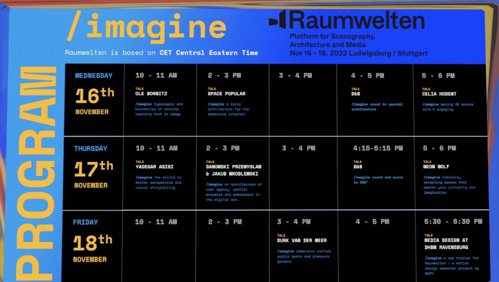
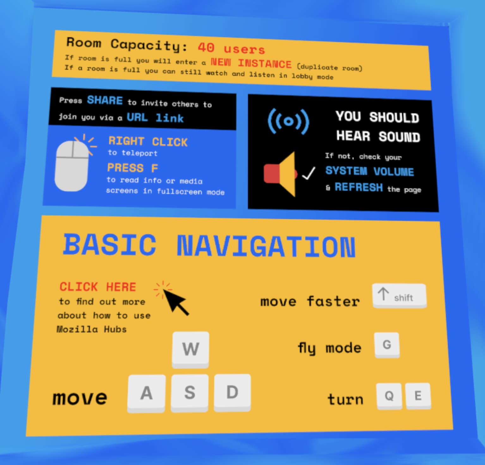
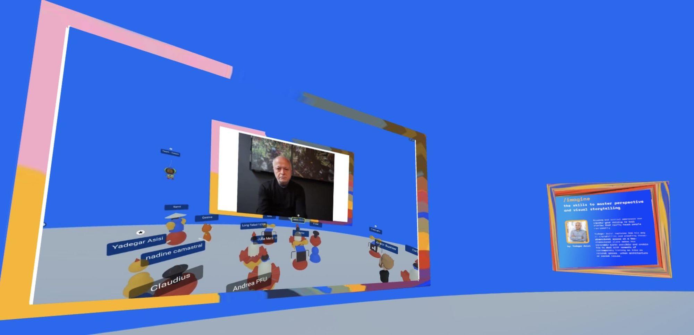
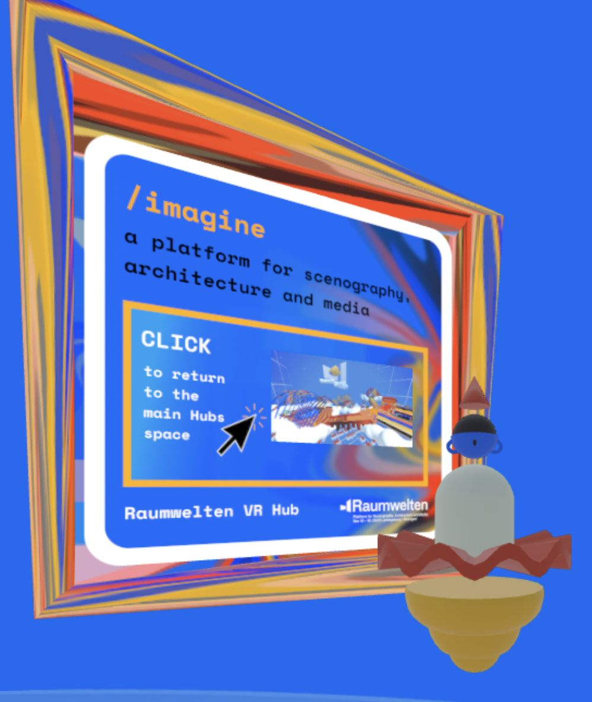
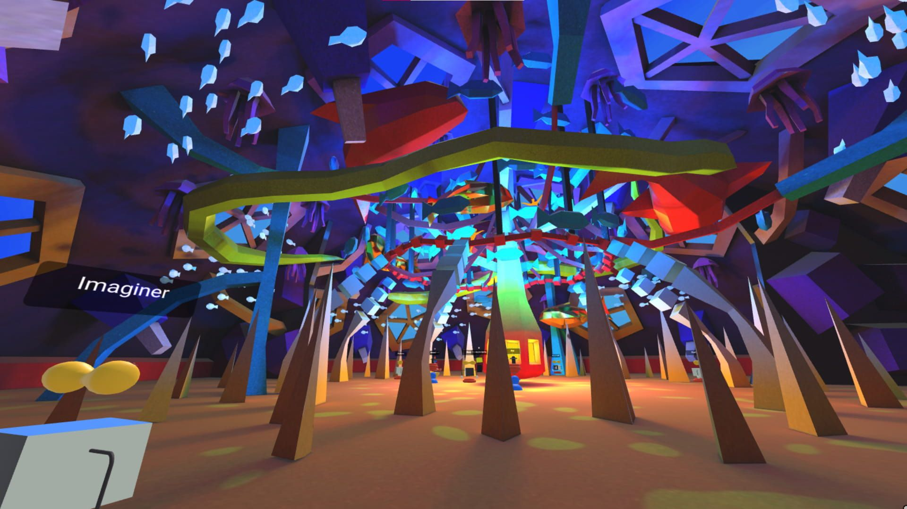

_This article is a Spotlight ✨ – part of a series of interviews with innovative Hubs creators highlighting their work. Have a creator in mind that you would like us to showcase? Let us know in the #creator-labs channel on [Discord](https://discord.gg/sBMqSjCndj)._

**What is the Raumwelten Festival? **
Raumwelten, a conference for scenography, architecture, and media, took place for the first time exclusively in the Hubs-based Raumwelten VR Hub. From November 16th to 18th students, professionals and VR fans could participate from anywhere in the world free of charge.

0:00
/
1&#215;

Festival attendees were invited to explore concepts from a different perspective this year. Raumwelten's renowned speakers didn't offer presentations in passive zoom formats, but brought users into 360 images of real space and walk-through 3D models.  Attendees could join live presentations or hang out in the main hub space where the talks were live streamed and use portals to explore the presentation spaces at their own pace. Participants were able to choose their "/imagine" avatar (a Midjourney version of the Triadic Ballet figurines) to speak with other festival attendees.

0:00
/
1&#215;

The 2022 iteration of Raumwelten received support that allowed it to be free of change for the first time in it’s over 11-year history.  The "ITFS & Raumwelten VR Hub" project received support through the "Programme for Digital Interactions" of the Kulturstiftung des Bundes (German Federal Cultural Foundation) with funding by the Federal Government Commissioner for Culture and the Media (BKM) through the 'NEUSTART KULTUR programme'.

0:00
/
1&#215;

The three-day Raumwelten Festival had over 700 visitors crossing it's bridges and exploring the various spaces and talks.
Raumwelten VR Hub also included a physical pop-up exhibition at the Ludwigsburg Museum, which allowed participants to experience virtual reality onsite at the museum.

0:00
/
1&#215;

[Full tour of Space Popular's space](https://www.youtube.com/watch?v=5VBAsPe-CrU&t=394s&ab_channel=MozillaHubs) with the Hubs Creator Meetup.

**Speakers**
Each of this year’s speakers (below) presented in a virtual space specifically designed to illustrate their presentation topic.

●       **Durk van der Meer**, Freelance Digital Artist, Curaçao

●       **[Space Popular](https://www.instagram.com/spacepopular/?hl=en)**, Architecture, Design, and Media Studio, London

●       **[Celia Hodent](https://twitter.com/CeliaHodent)**, PhD in Psychology and Game UX Strategist

●       **[Yadegar Asisi](https://www.asisi.de/en/yadegar-asisi/biography)**, Architect and Panorama Artist, Berlin

●       **[Meow Wolf](https://meowwolf.com/)**, Arts & Entertainment Company, Santa Fe

●       **Ole Bornitz**, Motion Designer, Stuttgart

●       **Jakub Wróblewski**, Artist, Director, Camera Operator, Warsaw

●       **Przemysław Danowski**, Audio Director, Composer, Metamusician, Warsaw

●       **Daniel Meyer & Lukas Baumgartner**, CEO, 2M Audio GmbH & Technical Director, Kultur- und Kongresszentrum Lucerne

●       **Ralf Zuleeg**, Sales Services and Application Engineering, d&b audiotechnik, Backend

●       **MdRV** – Media Design at DHBW Ravensburg

●       **[Allison Crank](https://allisoncrank.com/)**, Host, UX Designer and Researcher, Lucerne

0:00
/
1&#215;

\***\*1.) How many people worked on the festival and what were some of the main challenges you had to address from an events, design and technical perspective?\*\***

> Two designers (Allison Crank & Christophe Merkle), one hosting-server specialist (Raoul Postel), around 8 moderators and two festival organisers (Isabel and Hasan). We found it was important to welcome new users to the hubs space with real persons talking to them as avatars. Unfortunately text or video tutorials don't work that well. Moderator rights were really helpful, especially to manage disruptive noises during the talks. Distributing these rights to the speakers and staff greatly helped with organisation of the keynotes.

**2**.) What was some of the feedback you received from event participants?\*\*\*\*

> It was very positive. They liked the new formats and stayed for quite some time for the presentations.

"Imaginer in a Wonder World" captured by Ksenia. Credit: Raumwelter Festival 2022 \***\*4.) What were some of the technical customizations you made to Hubs** and why did you choose Hubs to **meet your objectives?\*\***

> We chose Hubs because it's accessible, no login and its open source. Easy to use and create custom spaces and for it's community support!
>
> – We used a self hosted Hubs-Cloud in The Netherlands, which allowed us to achieve better page loads and performance with our participates geographic locations.
>
> – Our own web server gives control over user and moderator e-mail, so we can guarantee safe registration, only for those who needed access (moderation and building).
>
> – We built a custom feature to let visitors know when a room is full and what to do. In the room-settings you can also put text, image and url in your markdown-language.
>
> – We streamed presentations via Vimeo, Dropbox and own webserver into the rooms.
>
> – The first two editions we made microphone/megaphone ourselves to speak publicly but then we learned we could also [do this with audio-zones](__GHOST_URL__/creating-speaker-stages-and-manipulating-audio-in-hubs/).
>
> – The last two editions we made our own custom avatars.

\***\*5.) Anything else you would like to tell us about?\*\***

> We had a total of 30 spaces for the festival (1 Entrance / Onboarding Space 1 / main space connecting everything 7 speaker spaces the rest student made spaces).
>
> Over 700 users visited the VR Hub and viewed presentations and exhibitions or strolled through the virtual world.  Since October, our website has been accessed a over 9,300 times by users from different countries, with Germany, the USA, Switzerland, Austria, the Netherlands, France, and the United Kingdom leading the way. But Raumwelten also continues to be strongly anchored in the region. Raumwelten Public with a pop-up exhibition at the Ludwigsburg Museum attracted 150 visitors in three days who immersed themselves in various virtual worlds.

For more Mozilla Hubs updates and Creator Labs content, follow us on [Twitter](https://twitter.com/MozillaHubs) or [Discord](https://discord.gg/sBMqSjCndj)
