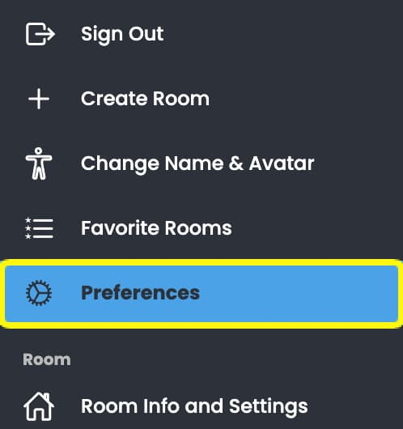
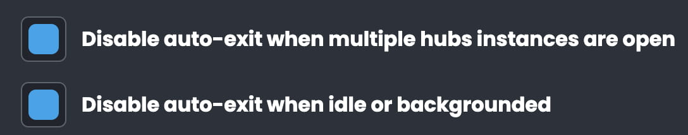
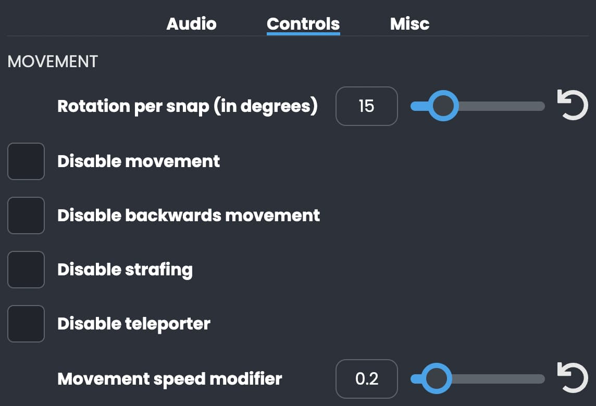
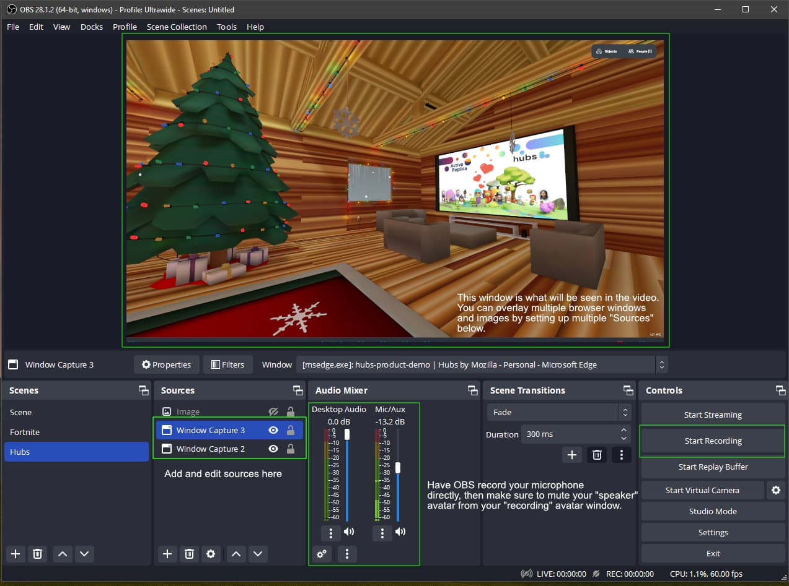

How can you get the best screen captures in Mozilla Hubs on desktop? Maybe you would like to livestream your event, capture a clip of your latest creations to share, or demo a new feature you are working on.

Read on to learn how to dramatically improve your screen captures in Hubs. 🌆

##

Screen Capture Mode

Use the new screen capture mode feature built by Hubs Community Developers. A small group of developers worked together to contribute this feature specifically to make screen captures more accessible and convenient - yay open source!

You may want to hide UI elements to better frame the content and eliminate distracting chat or debug menus.  You can press the B key to conveniently hide all the UI.

If you would like to include the cursor but still hide the UI, you can press the ~ key.

0:00
/
1&#215;

Press 'B' to hide the ui, cursor, and debug menus. You can also hide the ui with the tilde ~ key if you would still like to see the cursor. Credit: https://skfb.ly/ovoBo

❤️

_Special thanks to the Hubs Client Hack Community group for making [this PR](https://github.com/mozilla/hubs/pull/5718) led by [David Ballowe](https://www.linkedin.com/in/david-ballowe-90a164178/) with the help of Imaginer, Ravindra, Ben, Qi, JT, Hrithik and FreeCodeCamp Sacramento._

## Know Your Preferences

Nametags, auto pixel adjustment, auto-exit, dynamic shadows, high-quality mode, post-processing, movement, resolution....
Preferences are accessible through the more menu (...).
Understanding the options available to you will be a huge help to getting the best-quality screenshots and recordings. Here are a few to look out for:

**Nametags**
There are several options for displaying name tags, you can hide them when your camera is in close proximity, completely turn them off or have them on only when the object menus are open.

0:00
/
1&#215;

Name tags have several options. Pictured here Amber, Elgin, Matt, Cris, Dom, Pellinore, Alex, Sage, Imaginer and Conor.
**Auto Exit**
Some settings here you will want to check to ensure smooth recordings with multiple cameras or when you're backgrounding a tab.
Be in multiple places at once across the same Hubs, if you are backgrounding a tab or idle you will want to have this one checked!
**High Quality Mode / Dynamic Shadows / Post-Processing Effects / Resolution**
These are all preferences you will want to consider when recording with your best hardware to get the best looking shots possible.

0:00
/
1&#215;

Bloom effects demo at a Hubs Community meetup featuring Mikko, Heather, Gary, Dom, Sandeep, Paula, Jim, and Matt.
**Movement**
You may want to slow your cameras speed down to reduce the motion. Don't forget you can also right-click to teleport to a location.
Various options for modifying movement controls in Mozilla Hubs

0:00
/
1&#215;

💡

**Using the `i` Key to Inspect your Avatar**
You may want to try changing your perspective so you can get a third person view with your avatar. You can achieve this with the `i` key and use the arrow keys to move.

**Using OBS**
[Open Broadcast Studio](https://obsproject.com/) is free and open source software for video recording and live streaming. This software is available for mac, windows and linix and allows you to capture different windows, tabs and even control transitions and mix audio. Combine OBS with the above tips to get some high quality production value out of your recorded events.

🎇

You can record high-quality, high resolution video with OBS but you will likely need to adjust some settings and understand the limitations of your computer. Here is a [great tutorial video](https://youtu.be/oObQ2blbCG8) related to this topic from youtuber Michael Feyrer Jr.

OBS setup courtesy of [Liv E](__GHOST_URL__/author/liv/)
You can even set up multiple cameras and use OBS scene transitions to toggle between them. You can add elements like overlays, logos, and [captions](https://webcaptioner.com/) via the sources tab.

⚠️

If you want to include your own voice in the recording, you'll need to set up a separate audio source for your microphone. In OBS, go to the "Sources" menu and select "Add > Audio Input Capture." Then, select your microphone from the drop-down menu and adjust the other settings as needed.

The key to recording good audio from a web browser is to experiment with different settings and find what works best for your specific setup and recording environment. It's also important to make sure that the web page you're recording has audio enabled, and that you have the necessary permissions to record it.

## Event Best Practices

**Let people know you are recording. **
Avatars can help communicate to others in the room where your camera feed is coming from. Pasting a message in chat and making an announcement in the room (maybe even one you broadcast with an audio-zone) is also a great practice.

0:00
/
1&#215;

A camera avatar may help some participants understand your event is live and being recorded and allows them to potentially position themselves better so they don't block the view.
**Moderation Tools**
Be familiar with the moderation tools. You can hide, kick, mute, and control individual volumes of people in the space with you. Make sure you are aware of all these tools. See '[Hosting Events in Hubs](https://hubs.mozilla.com/docs/intro-events.html#moderation--event-controls)' in the Hubs docs.

0:00
/
1&#215;

One way to mute a participant via the people menu.
**Spatial Audio**
If recording audio with OBS, be aware of [spatial audio and the audio set up](__GHOST_URL__/creating-speaker-stages-and-manipulating-audio-in-hubs/). Be cognizant of what camera source/tab you are getting audio from and their proximity to the action.

Feel ready to record your event and get some great-looking screen captures? I hope so! For more Mozilla Hubs updates Creator Labs content, follow us on [Twitter](https://twitter.com/MozillaHubs), [LinkedIn](https://www.linkedin.com/showcase/mozilla-hubs/) or [Discord](https://discord.gg/sBMqSjCndj). Thanks for reading!

_Ready to get started with your own hub? Visit _[https://hubs.mozilla.com/#subscribe](https://hubs.mozilla.com/#subscribe)_today_!
