As the year comes to a close, we wanted to take a moment to reflect on the most popular Hubs Creator Labs posts of the year. In this year-end review, we'll highlight the top posts of 2022 and share some insights on what made them so popular. Whether you're new to Hubs Creator Labs or have been following us for a while, we hope this retrospective will give you a chance to catch up on some of the most viewed content we've published in the past year.

## Top 5 Tutorials

[Jim](__GHOST_URL__/author/jco/) and [Jordan](__GHOST_URL__/author/jordan/) led us in 2022 with the most viewed tutorials. Unsurprisingly, the top tutorials by page view have to do with light baking, a notoriously complicated process in 2022.  At number three, the multi-part tutorials around UV scrolling textures made for much better performance and gave more life and energy to our Hubs spaces. We received a lot of good feedback in the [Hubs discord](https://discord.gg/hubs-498741086295031808) and tutorials have been a great driver to help improve experiences in Hubs.

**1. [Baked Lighting for Better-Looking Hubs Scenes](__GHOST_URL__/baked-lighting-for-better-looking-hubs-scenes/)
**By: [Jim](__GHOST_URL__/author/jco/)

0:00
/
1&#215;

**2.  [EZ Bake Lightmapping](__GHOST_URL__/ez-bake-lightmapping/)
**By: [Jordan Elevons](__GHOST_URL__/author/jordan/)

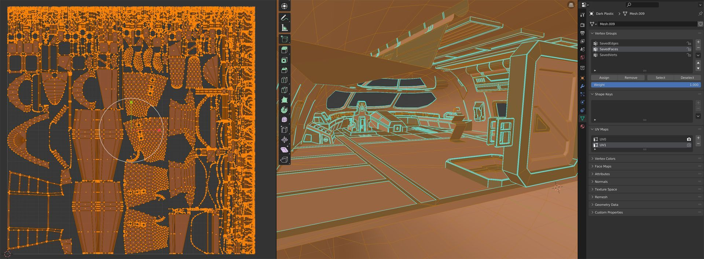

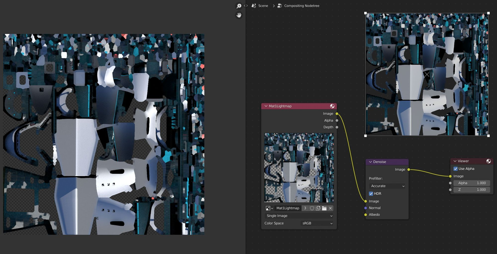

**3. [Animating Textures with UV Scroll Series](__GHOST_URL__/animating-textures-with-the-uv-scroll-component-pt1/)
**By: [Jim](__GHOST_URL__/author/jco/)

0:00
/
1&#215;

**4. [How to Optimize a Scene](__GHOST_URL__/how-to-optimize-your-scenes/)
**By: [Jordan Elevons](__GHOST_URL__/author/jordan/)

**5. [Sorting out Problems with Transparency](__GHOST_URL__/sorting-out-problems-with-transparency/)**
By: [Jim](__GHOST_URL__/author/jco/)

0:00
/
1&#215;

## Top 5 Inspirational

Inspirational posts have a broad appeal and help provide context for how people are using Hubs and explore the possibilities afforded to us on the immersive web. As an open-source project, one of Mozilla Hubs biggest strengths is the ability to customize it to your needs and people from all over the world have been tinkering with Hubs. Our top inspirational posts largely document this strength. Here are the top five by page views:

**1. [10 Amazing Examples of Hubs Extensibility](__GHOST_URL__/extending-hubs-with-hubs-cloud/)**
By: [Matt Cool](__GHOST_URL__/author/mattcool/)
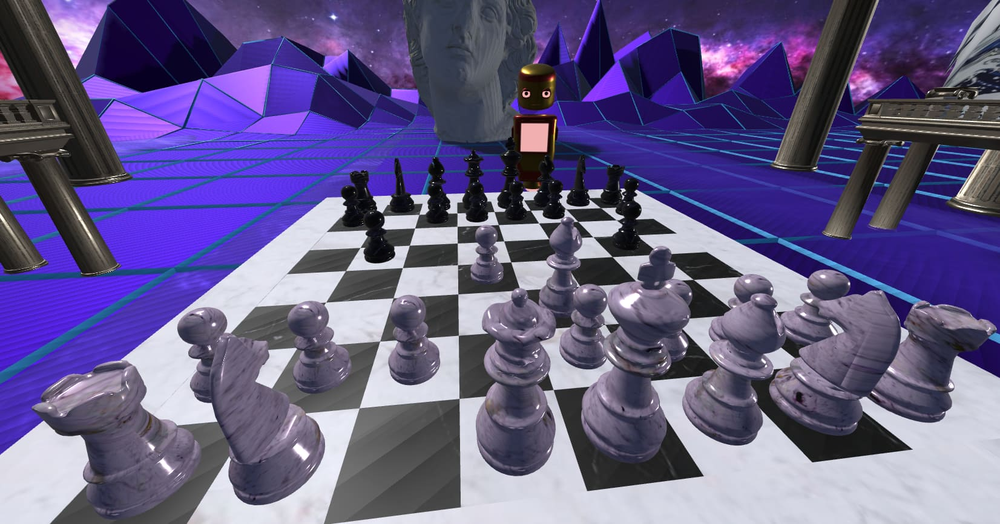[Virtual Reign](https://hub.vreign.space/) allows you to play free live, chess matches with spectators across devices in this customized hubs-cloud by [Immers Space](https://web.immers.space/).
**2. [Brands Pioneering the Metaverse Consider Mozilla Hubs](__GHOST_URL__/brands-pioneering-the-metaverse-consider-mozilla-hubs/)**
By: [James C. Kane](__GHOST_URL__/author/james-c-kane/)

> Building "spatial analytics" for the (_gulp_) metaverse (read: the 3D open web) to help understand user behavior in immersive 3D worlds where Google Analytics can&#39;t go. Integrating w/ [@MozillaHubs](https://twitter.com/MozillaHubs?ref_src=twsrc%5Etfw) & [@aframevr](https://twitter.com/aframevr?ref_src=twsrc%5Etfw) first. Apart data playback at "Flight of 🐝" speed, s/o @colinfizgig! [pic.twitter.com/JDxJcq7Kwr](https://t.co/JDxJcq7Kwr) > &mdash; jamesckane (@jamesckane) [February 1, 2022](https://twitter.com/jamesckane/status/1488540903434297345?ref_src=twsrc%5Etfw)

**3. [5 Incredible Art Galleries](__GHOST_URL__/5-incredible-art-galleries/)**
By: [Matt Cool](__GHOST_URL__/author/mattcool/)
Credit: Space Popular. [Royal Institute of British Architects](https://www.architecture.com/knowledge-and-resources/)
**4. [Building the Metaverse with Open Source](__GHOST_URL__/building-the-metaverse-with-open-source/)**
By: [Liv E.](__GHOST_URL__/author/liv/)

**5. [Exhibitions that Educate](__GHOST_URL__/exhibitions-that-educate/)**
By: [Matt Cool](__GHOST_URL__/author/mattcool/)
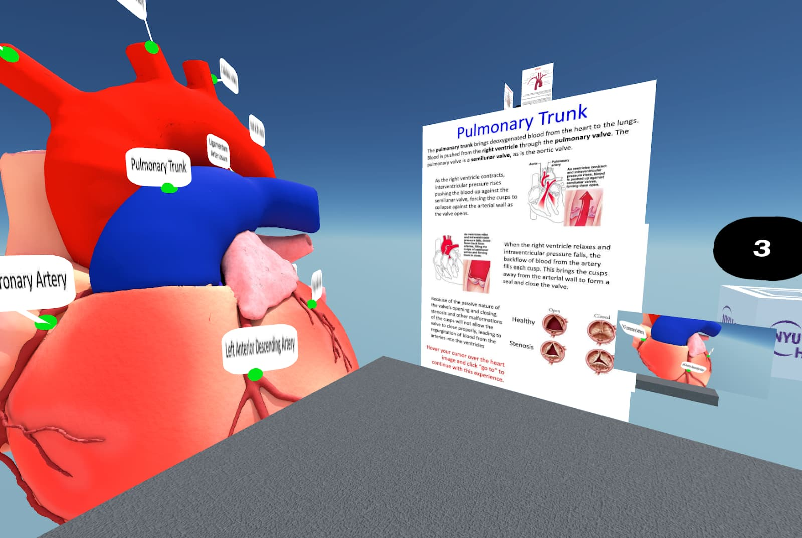Credit: NYU Langone. Learn more about their work [here](__GHOST_URL__/bringing-learners-into-the-immersive-web-how-to-begin/)

## Top 5 Tools

Tools posts refer creators to helpful applications, workflows, add-ons and websites. [Manuel's](__GHOST_URL__/author/manuel/) Blender Add-On explainer served as a powerful entry point for folks getting started in exploring the Blender workflow in Hubs in 2022. Event hosts commonly referred to the web-based avatar creation tools found in number two, and posts from this Fall about AI textures and LOD quickly became popular with our readers.

**1. [What is the Blender Add-On](__GHOST_URL__/what-is-the-blender-add-on/)**
By: [Manuel Martin](__GHOST_URL__/author/manuel/)

0:00
/
1&#215;

**2. [Quick Customized Avatars in Hubs](__GHOST_URL__/quick-customized-avatars-in-hubs/)**
By: [Matt Cool](__GHOST_URL__/author/mattcool/) and [Elgin-Skye McLaren](__GHOST_URL__/author/elgin/)
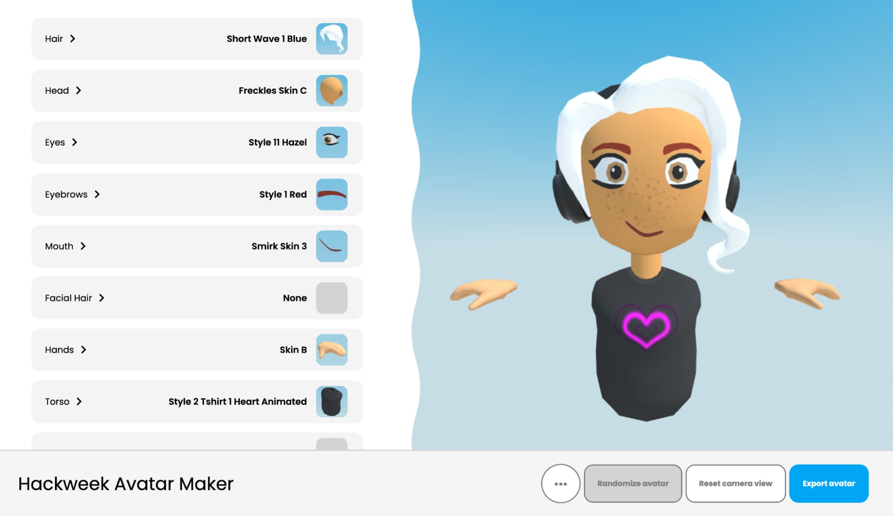
**3. [Hubs Friendly Tools](__GHOST_URL__/hubs-friendly-tools/)**
By: [Matt Cool](__GHOST_URL__/author/mattcool/)
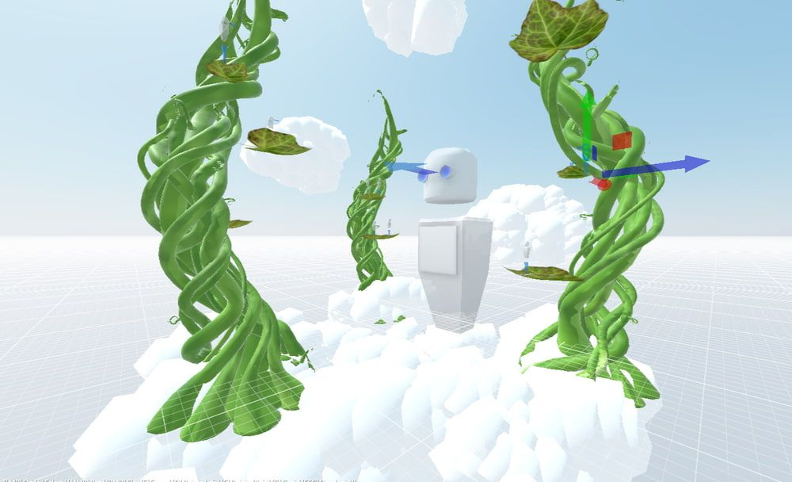
**4. [Using AI Textures to Enhance Your Hubs Scenes](__GHOST_URL__/using-ai-textures-to-enhance-your-hubs-scene/)**
By: [Christian Van Meurs](__GHOST_URL__/author/christian/)

**5. [Hubs LOD Support](__GHOST_URL__/hubs-lod-support/)**
By: [Takahiro Aoyagi](__GHOST_URL__/author/takahiro/)
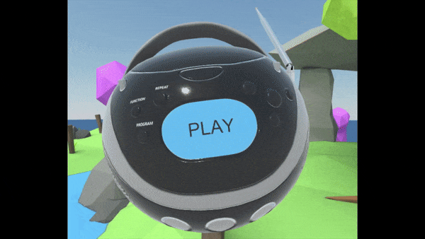

##

Top 5 Announcements

Hub's announcement of its new subscription service, offering easy creation of your own 3d space on the web, was our most viewed announcement of the year with other big announcements like Active Replica and the Hubs Artist in Residence program rounding out our top five.

**1. [The Next Generation of Mozilla Hubs is Here](__GHOST_URL__/mozilla-hubs-early-access-release/)**
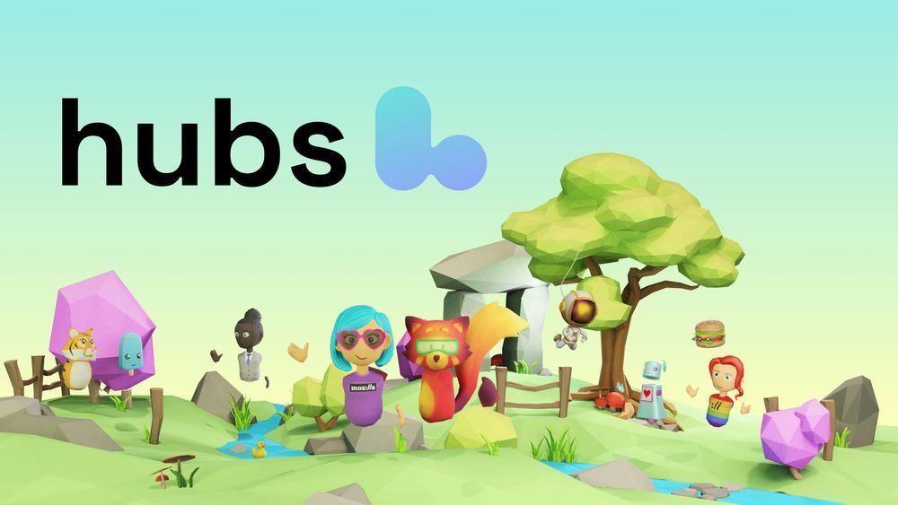
**2. [Invitation to Join the Closed Early Access Beta](__GHOST_URL__/youre-invited-to-join-a-closed-beta/)**

**3. [Hubs Artist in Residence Program Announcement](__GHOST_URL__/mozilla-hubs-artist-in-residence-program/)**

**4. [Welcome Active Replica](__GHOST_URL__/welcome-active-replica/)**
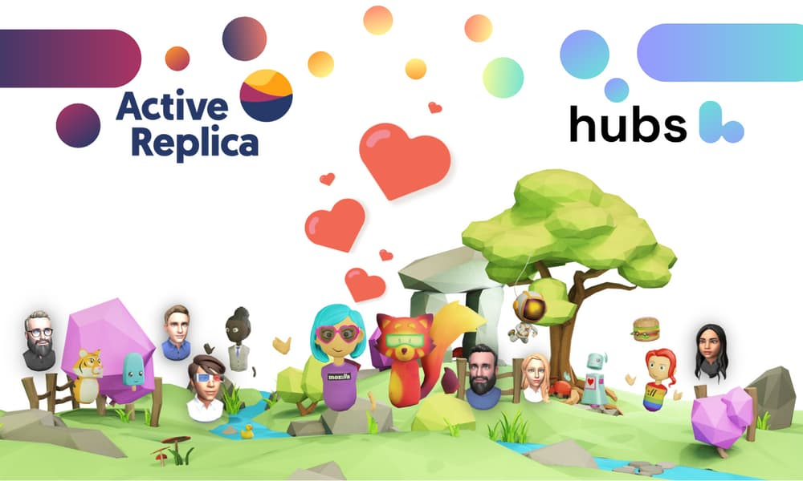
**5. [Welcome Our First Artist In Residence Cohort](__GHOST_URL__/welcoming-new-hubs-artist-in-residence/)**

##

Top 5 Community-Contributed Posts

Hubs Creator Labs launched in April of 2022 and allows community members to make proposals and [contribute their own articles](__GHOST_URL__/how-to-contribute-to-labs/). We had eight community authors this year.  Here are the top five posts from community contributors by views that were not already listed above.

**1. [Photogrammetry in Hubs](__GHOST_URL__/photogrametry-in-hubs/)**
By: [Eric Hupe](__GHOST_URL__/author/profhupe/), [Mikko Huovinen](__GHOST_URL__/author/mikkoh/) and Matt Cool

0:00
/
1&#215;

**2. [Building an Enhanced Chat Experience for Hubs](__GHOST_URL__/building-an-enhanced-chat-experience-for-hubs/)**
By: [James Robinson](__GHOST_URL__/author/james-robertson/)
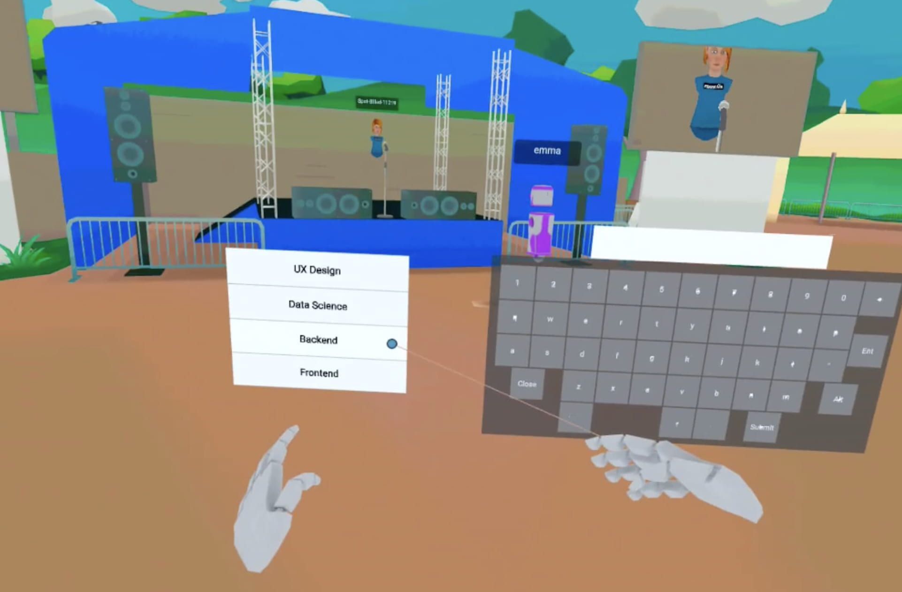
**3. [Iterating Your Scenes Faster with Local Debug Scene](__GHOST_URL__/iterating-your-scenes-faster/)**
By: [Conor Woodard](__GHOST_URL__/author/conor-w/)

**4. [Bringing Learners Into the Immersive Web](__GHOST_URL__/bringing-learners-into-the-immersive-web-how-to-begin/)**
By: [Heather Elizabeth Dodds](__GHOST_URL__/author/heather/)
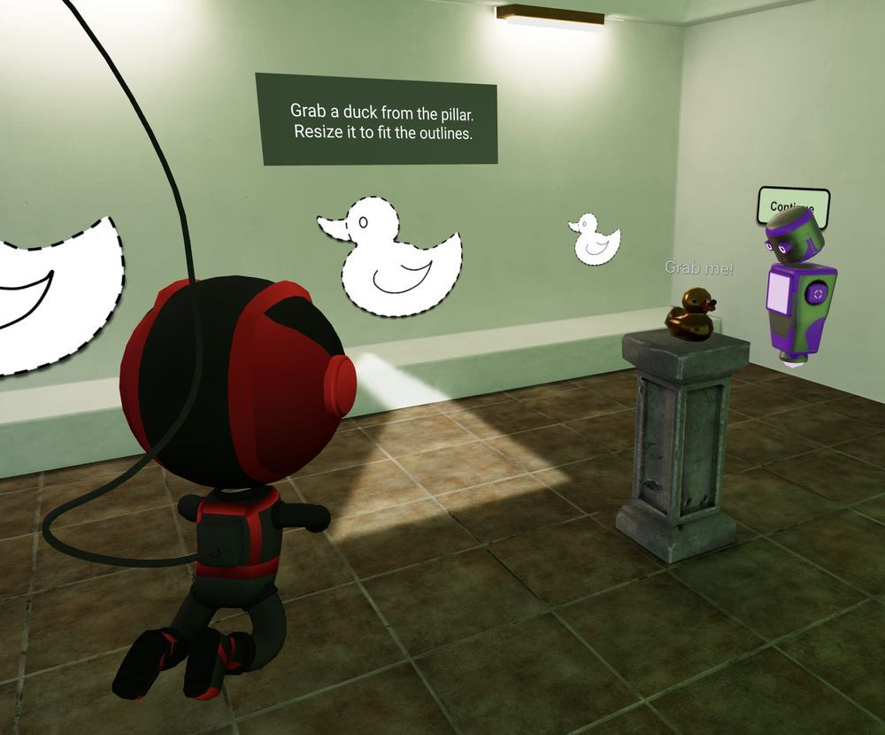
** 5. [Creating 2D Sprite-Based Retro Worlds](__GHOST_URL__/creating-retro-worlds/)**
By: [Pedro Valencia](__GHOST_URL__/author/theanine3d/)
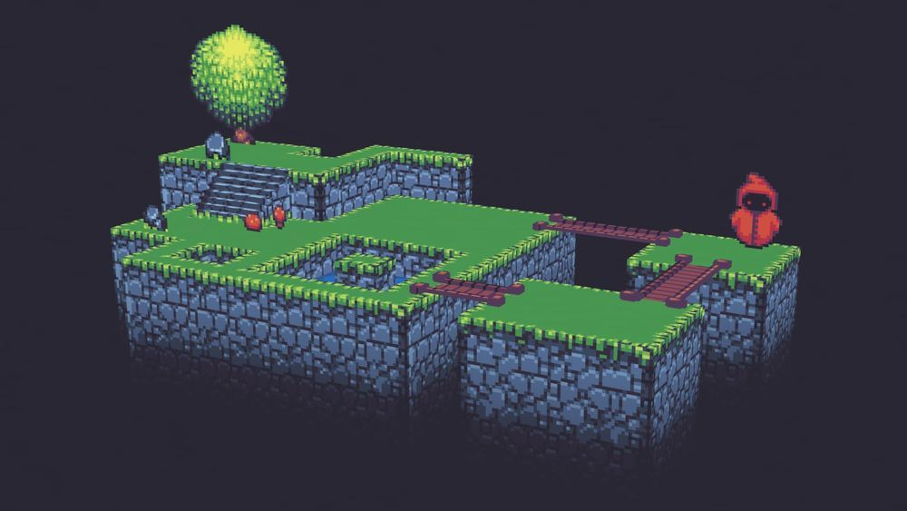

## Most Viewed Spotlight Post

Spotlights are a series of interviews with innovative Hubs creators highlighting their work. This year's most viewed post is the Society for Arts and Technology covering their artist and developer programs where they created customized exhibits that extended Hub's capabilities and showcased the creativity of artists leveraging 3d spaces. For a list of all the spotlight posts [check here](__GHOST_URL__/tag/spotlight/).

[**Society for Arts and Technology**](__GHOST_URL__/society-for-arts-and-technology/)
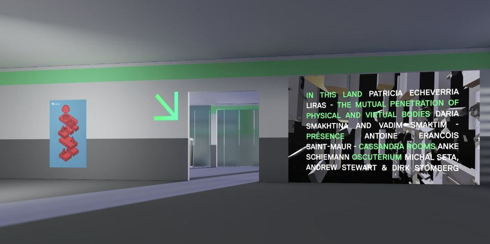

That's it for this year's Hubs Creator Labs wrap-up!
For more Mozilla Hubs updates, Creator Labs content follow us on [Twitter](https://twitter.com/MozillaHubs), [LinkedIn](https://www.linkedin.com/showcase/mozilla-hubs/), or [Discord](https://discord.gg/sBMqSjCndj).

_Ready to get started with your own hub? Visit _[https://hubs.mozilla.com/#subscribe](https://hubs.mozilla.com/#subscribe)_today_!
