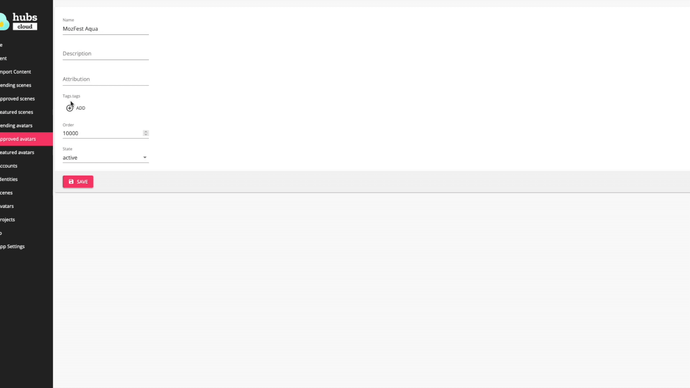
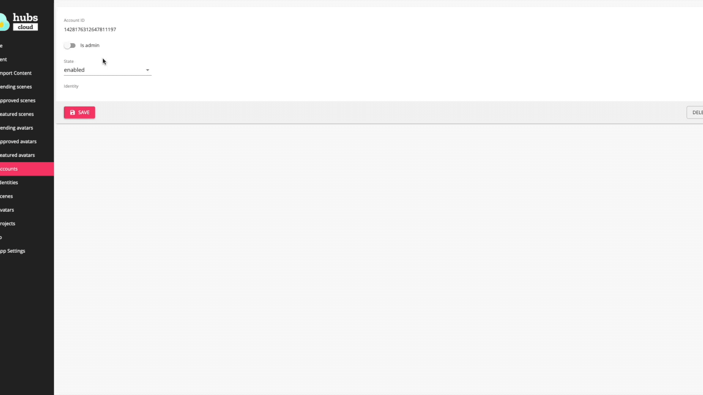
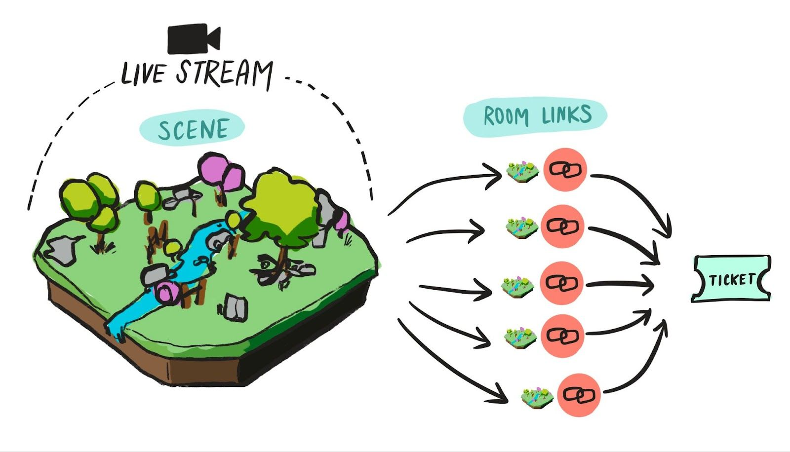
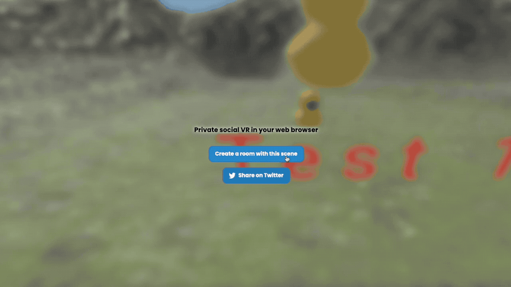

**_As immersive technologies and tools continue to advance, it is becoming easier and easier to connect large numbers of users for synchronous events online. Mozilla Hubs is a customizable platform that makes it easy for event hosts to connect their communities across virtual worlds. This post covers the basics and best practices of facilitating large scale events on Hubs. Treat it as a living case study, of sorts; using examples from a real Hubs event, the Mozilla Foundation’s 2023 MozFest, this post goes through the process of configuring a Hubs server and its content for your event. Check back regularly for updates and new tools that you can add to your event hosting tool-belt and please share your experience hosting large events with the Hubs community!_**

---

### MozFest 2023 Initial Briefing

For MozFest 2023, I need to configure server settings and event rooms to support a peak audience of 300 participants who will mainly be joining on desktop computers. The server should be branded to include the MozFest logo, colors, and avatars, and enable features which inform users on the values of Hubs, especially as they relate to data privacy and security.

## **SERVER CUSTOMIZATION**

_Whether you have a Hubs Cloud server or are working with a managed subscription (more info on setting up [Hubs Cloud ](https://hubs.mozilla.com/cloud)or [Managed Subscription](__GHOST_URL__/mozilla-hubs-early-access-release/)), the main tool for event hosts to customize the server settings of their Hubs instance is the [Admin Panel](https://hubs.mozilla.com/docs/hubs-cloud-getting-started.html#setting-up-your-hub). With this tool, you can change the experience of every user joining your server, no matter what scene or room URL they join at._

### APP SETTINGS

I have just finished setting up the MozFest 2023 server instance at the subdomain `mozfest.myhubs.net` through the managed Hubs subscription (set up your own managed subscription [here](https://hubs.mozilla.com/)). Now we want to customize the server instance, starting with picking features to enable from the server’s “App Settings”. There are a number of tabs and options for these customizations, however I looked through [this documentation](https://hubs.mozilla.com/docs/hubs-cloud-getting-started.html#setting-up-your-hub) to know which ones to use…

### Translations

- **App Name and Company Name** | I want the app to attribute MozFest as the creator of this server instance.
- **Company Name **| I want the app to attribute MozFest as the creator of this server instance.
- **Contact Email** | I want participants to know how to contact me with questions.
- **Community Prompt** | I want to customize the prompt for getting users to connect with the hubs community.

_Translations under App Settings._

_Features under App Settings._

### Features

- **Show Terms** | I want the MozFest community to have access to the Mozilla terms I specify in Links.
- **Show Privacy** | I want the MozFest community to have access to the Hubs privacy policy I specify in Links.
- **Show Docs** | I want the MozFest community to have access to the Hubs documentation I specify in Links.
- **Show Community Links** | I want the MozFest community to have access to the Hubs community urls I will specify in the Links section.
- **Show Company Logo** | I want the MozFest logo to be enabled in place of the Hubs default logo.
- **Lobby Ghosts** | I want spectators to be able to fly around the space instead of floating in a locked position.

### Rooms

- **Default Room Size** | I want to ensure all created rooms will default to the recommended 25 participants so that I do not have to go back through each room to change its capacity from the default.
- **Max Room Size **| I want to be sure that no one can allow more participants to join than the recommended 25.

_Rooms under App Settings._

_Images under App Settings._

### Images

- **App Logo + Dark** | Dropping in the .png file of MozFest
- **Favicon** | Dropping in the MozFest favicon file
- **App Icon** | Dropping in the link to the .png file of MozFest
- **App Thumbnail** | Dropping in the link to the .png file of MozFest
- **Company Logo** | Dropping in the .png file of Mozilla.

### Themes

- **Theme JSON** | I referenced [this document](https://hubs.mozilla.com/docs/hubs-cloud-customizing-themes.html) and dropped a JSON file to make sure the MozFest colors are part of the platform.

_Themes under App Settings._

_Links under App Settings._

### Links

- **Terms** | Link to the Mozilla Terms.
- **Privacy** | Link to MozFest privacy policy.
- **Features** | Link to Hubs features list.
- **Community Links** | Link to Hubs Discord.
- **Docs** | Link to Hubs Documentation

Taking a peek in a default scene, I can see some of the initial branding, which I will continue to hone as we get closer to the event…
_Basic customizations from App Settings._

---

### DEFAULT AVATARS

Now that I have finished setting my server’s features, I want to pick which of my avatars should be the default for attendees. So far, I have loaded all of my avatars in the space manually (how to [manually upload avatars](https://youtu.be/6QH-gMCfvbw?t=680)). Now, I am going to go to the Pending Avatars tab on the left hand side and click “UPDATE” for any avatars that have yet to be approved. Once complete, I am going to go to the Approved Avatars tab on the left hand side and click “EDIT” on the avatars I want to set to default. In the pop-up, I will make sure the status of the avatar is “active” and add two individual tags, “featured” and “default”, before clicking save. I will repeat the process for all avatars I wish to set as default and then try joining the room on private/incognito versions of my browser. I should see myself randomly assigned as one of the default avatars the first time I join the space.
_Setting avatars to default._

---

### ADDING ADMINS

The last item I will configure at the server level is to add other admins who can edit this content in case I need additional support. I will navigate to the Accounts tab on the left hand side and use the Find Account input to search for the email address my fellow admin used to sign in to the platform (how to [sign in](https://youtu.be/hI_KcT9KhDc?t=183)). Once I have found their account by email, I will make sure “is admin” is turned on before pressing save. Other admins will have full access to the admin panel controls, but not the subscription dashboard or AWS dashboard, if using the managed subscription or hubs-cloud, respectively.
_Adding admins by email._

## ROOM SIZE LIMITATIONS AND SOLUTIONS

_Due to the current limitations of the Hubs engine and the processing power of most internet connected devices, it is not recommended for more than 25 avatars and 75 spectators to be in a Hubs room at once. This number is not a hard and fast rule, however it is the point at which we have noticed many desktop computers begin to show signs of instability. Here are a number of factors which may increase or decrease the number of participants (both avatars and spectators) the platform can support in one room…_

- **\***Device Type** | Mobile and VR Headset users typically experience latency and instability at a lower room capacity than desktop computers. On the other hand, high powered PC computers have been known to support 30+ avatars in a room at once.\***

- **\***Scene Optimization** | Scenes that are significantly larger than the optimization recommendations made in Spoke will quickly limit the number of users who can be supported in a room at once. The 25-75 recommendation is based around a room optimized to the Spoke recommendations.\***

- **\***Bandwidth** | Audience’s connecting from great distances from the server or with low bandwidth can experience increased latency, which may worsen when more users are in a room at once.\***

- **\***Objects and Media Streams** | Even if your scene is heavily optimized, participants who spawn a large number of items into the space can significantly increase the processing power needed to render the world. The same goes for media or screen sharing, which add additional levels of complexity to the world renderer.\***

_These limitations pose an obvious challenge to event hosts looking to host gatherings with hundreds of participants. HOWEVER, **these kinds of events can still be accomplished**. It will take additional planning, organization, and flexibility on the part of the event host. Here are a couple of suggested methods for how to manage these large audiences across multiple rooms…_

**_If all participants should experience the same environment:_**
_Spread your audience across multiple copies of the same room. Many event hosts will duplicate room URLs from the same scene (_[_How is a scene different from a room?_](__GHOST_URL__/what-is-a-scene/)_) and use their ticketing platform to divide their audiences between their room links. For example, you can either have your audience sign up for the same event slot and manually email the link to groups of 25 registrants or create multiple, simultaneous registration slots with limits of 25 registrants (_[_more on how to use Meetup.com for your event)_](__GHOST_URL__/using-meetup-com-with-hubs/)_. One downside of this method is that presenters cannot broadcast their avatar to multiple room URLs; their avatar can only be present in one room at a time.** However, **you can use a livestream set in your Spoke scene to broadcast a presentation to all rooms copied from the same scene._
_Room Link management for multiple copies of the same room._
**_If your experience is spread across multiple worlds where participants can travel fluidly:_**
_Have your audience enter the event across many of your event’s rooms so they do not all try to enter the same room at once and get locked out. Just as the previous example, you can split your registrants up and send out the links for the room they should land in when they initially join the event. To allow them to transport fluidly between your event’s rooms, you should use link components to create clickable access points between rooms. With your event’s participants landing in different rooms at the start of the event and moving fluidly between rooms thereafter, it is less likely that one room will be overloaded with participants. For this method, organization is key to map out the different ways participants should be able to travel between rooms, including identifying potential bottlenecks._

## **MOZFEST ROOM CONFIGURATION**

For MozFest 2023, I am taking a mixed approach to the examples above. For most of the event, the spaces will be open for self-guided exploration. I have used this document to organize all of our event links and visualize how participants should be able travel between spaces.
_MozFest portaling organization._
I am anticipating two times where we will need to host up to 300 participants at once. All participants need to enter through the Main Room before navigating through the larger ecosystem. Because of this, we are only going to duplicate the Main Room and not the rooms connected to it. This is because we have enough connected rooms to trust that participants will disperse between them without overfilling a single room. I am going to go to the Spoke project for the main room and create 12 room links to accommodate all 300 potential participants. These room links will then be divided at a ticketing level between MozFest registrants through the MozFest ticketing system.
_Creating copies of a room from scene link._

## INDIVIDUAL ROOM SETTINGS

_Once you have set up your server and room links, you should spend some time making sure that your individual rooms are configured correctly before the event begins. You should always consider the individual context of your event and _[_review the possibilities_](https://www.youtube.com/watch?v=hI_KcT9KhDc)_ for moderating your room. In general, you can use the _[_Room Info and Settings_](https://hubs.mozilla.com/docs/hubs-room-settings.html)_ to customize each room before the event._

### MOZFEST ROOM INFO AND SETTINGS

For MozFest 2023, we will want each room to properly accommodate peak participant numbers while allowing active attendees to interact in the space. I’ll use Room Info and Settings to customize the Room Name and Description to give general information about the space audience members are in. I will then make sure the links are set to public and shared, since room urls are only being distributed to registrants; I am not worried about these links being openly broadcast. Next I will configure the member permissions, allowing attendees to create objects, drawings, emojis, and to fly. This will allow session leaders to interact with attendees and collaborate in the virtual space.
_Editing Room Info and Settings._

## ADVANCED SOLUTIONS AND INSPIRATION

_Many community members have had success implementing custom features to help manage large numbers of attendees. While not available on Hubs by default, the Hubs team loves to share these examples of extending the codebase for event hosting teams who are capable of implementing custom features._

### LOAD BALANCING

A number of agencies building on top of Hubs have implemented load balancing mechanisms to help sort participants between multiple rooms, accommodating for the room capacity limitations while avoiding having to juggle so many links for ticketing. This kind of load balancing was a recent focus of the Hubs team during [our annual Quack Week](__GHOST_URL__/quhack-week-2022/) hackathon!

### PORTALING

A number of community members have implemented portaling systems to allow event participants to travel between connected rooms more easily by removing the need to click on links. The UX improvement from a feature like this is noticeable, as many first time participants struggle with the basics of interacting with objects in the space. This feature was another recent focus of Quack Week, where team member Manuel put together [a functional demo](https://www.youtube.com/watch?v=0wQCnFY6dUk) of what this system could feel like. More on this feature soon!

_Ready to get started with your own hub? Visit _[https://hubs.mozilla.com/#subscribe](https://hubs.mozilla.com/#subscribe)_today_!
