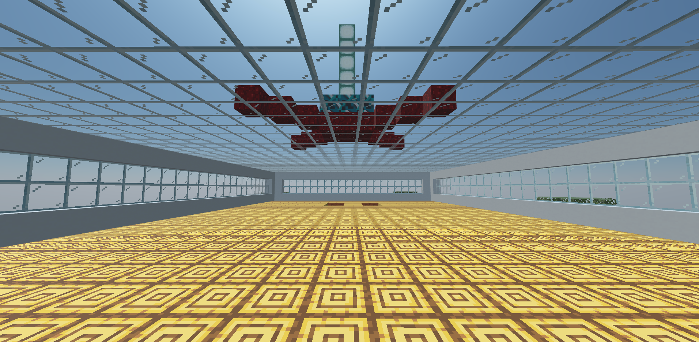
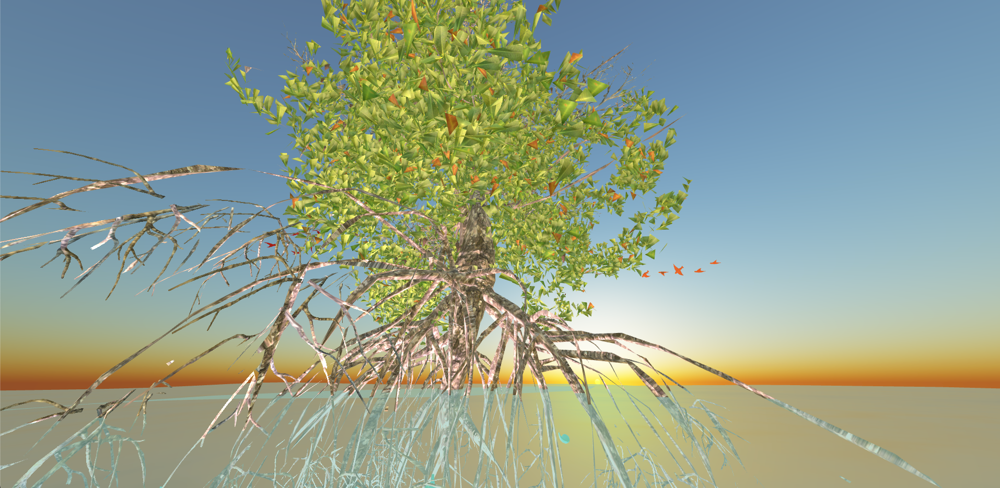
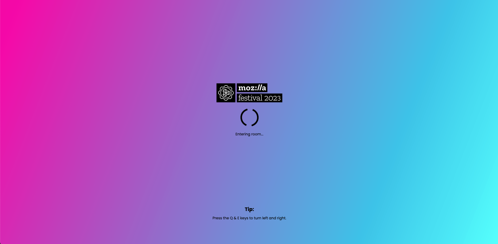
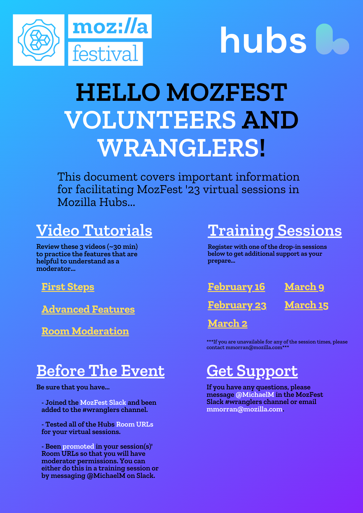
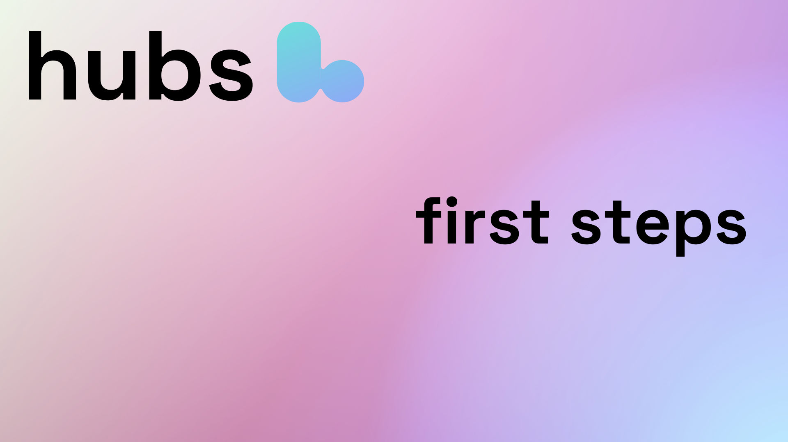
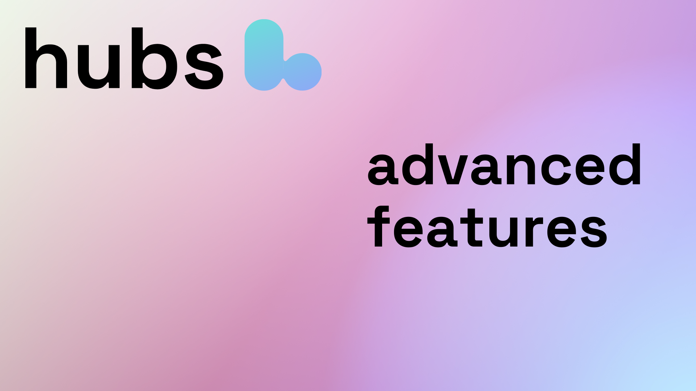

_This year we are pleased to be supporting MozFest 2023, Mozilla’s largest and longest running public event. This post explores our shared values with the Mozilla Festival and showcases some of the incredible festival artists building spaces in Hubs._

---

## Overlapping Values

Advancements in technology have enabled new forms of connecting. Increased access to computing resources have accelerated the pace at which new innovations are developed, and 64.4% of the global population - over 5 billion people - now have access to the internet. Over the past decades, we’ve seen the opportunities and challenges that come from bringing communities and coalition-builders online, and the ways that systems can perpetuate systems of power or dismantle them.

With Hubs, we believe in the power of making the web more immersive, so that we can bring the best parts of face-to-face interaction online. For the past three years, Hubs has been one of the platforms of choice for the Mozilla Festival’s virtual sessions, and this year we’re proud to be working closer than ever with a project that shares so much of our core DNA and goals. MozFest’s commitment to movement building mirrors our team’s own guiding principles of stewardship, not ownership, and differentiating our platform for others by centering our community at its core.

Through our work with MozFest, we aim to support and showcase change-makers of all backgrounds who are truly at the cutting-edge of what it means to be deeply innovative in a global community. Working to change deeply inset systems and assumptions about what it means to build a technological future is a mission only achievable through transparent, vulnerable, and consistent connection, and MozFest 2023 brings a beacon of hopeful change through its ongoing sessions and spaces.

🎟️

Check out all of the festival's [immersive sessions](https://schedule.mozillafestival.org/schedule?theme=609) powered by Hubs!

## Supporting Artistry

One of the most exciting parts of this collaboration has been the opportunity to support artists bringing their practice into Hubs for the first time. MozFest 2023 has 6 artists/agencies building gathering spaces for the festival’s immersive sessions and for the past 6 weeks we have been mentoring them on their journey to build these environments. They hail from a wide range of backgrounds and familiarity with Hubs, but all have worked very diligently to prepare MozFest’s ecosystem of spaces…

**Picha Images**
_From Nairobi, Kenya, Picha is a design agency building many key parts of the MozFest ecosystem, including the main gathering space, MozFest Science Fair wing, portaling assets, and festival avatars._
MozFest Main Hall designed by [Picha Images](https://pichaimages.com/)
**Octavia E Butler’s Parable of the Sower: An opera by Toshi Reagon and Bernice Johnson Reagon**
_Building on the success of last year’s installation and dialogues, the Parable of the Sower Opera team returns to MozFest with new conversations straddling Zoom and Hubs, with new spaces ambitiously ported from existing Unity projects._
[The Parable of the Sower](https://www.parableopera.com/) Virtual Auditorium
**Disco Tehran**
_Disco Tehran will be ambitiously porting their Minecraft World into Hubs (A BIG FIRST!) and hosting the Festival’s Closing Party with a live virtual performance._
[Disco Tehran's](https://www.discotehran.nyc/) minecraft world ported into Hubs.
**AI-Musement Park**
_Created by Cambridge University educators, the AI-Musement park will host an exciting array of talks, workshops and live performances, pushing the boundaries of how a single Hubs room can be re-invented for multiple gatherings._
The AI-Musement Park hosting [workshops, performances and more!](https://schedule.mozillafestival.org/schedule?query=Ariel&query=Eleanor&theme=609)
**Rhizome of Babel**
_Another returning MozFest collaborator, Rhizome of Babel will build on its accomplished spatial design, utilizing the cutting edge tools Hubs has introduced for the blender-add-on._
[Rhizome of Babel](http://rhizomeofbabel.com/) Main Room
**Algorithms Fear Context**
_Building on past work with other webxr platforms,  we are excited to welcome designer and curator Adele Jarrar to the Hubs platform for her exciting exploration of artificial intelligence in immersive spaces._
Algorithms Fear Context gallery designed and curated by [Adele Jarrar](https://adelejarrar.com/)

## Supporting Connection

In addition to artist mentorship, we have also configured MozFest’s server instance on an Early Access Tier of the managed Hubs subscription. The server’s branding was a key focus, using the admin panel to translate the preexisting festival style guide into the MozFest Hub’s branding themes. This has been a fantastic opportunity for us to learn more about the UX pain points and opportunities for improving our tools for branding and customizing a user’s Hub.

On top of configuring their server, we are also helping MozFest manage the coordination and logistics of many of their live, participatory sessions. One of the most unique parts of MozFest is the inclusion of trusted community volunteers in the organization and moderation of sessions. These collaborators are called Wranglers and our goal has been to quickly train them to feel comfortable with Hubs’ features and moderation tools so that they can assist their session leaders, troubleshoot with participants, and manage room settings to ensure the safety and stability of each session. Our solution has been the generation of new tutorial videos to get first time users up to speed with using Hubs.

✍️

_Learn more about how we used the Hubs tools and best practices to facilitate MozFest 2023 in [this Creator Labs post](__GHOST_URL__/large-scale-events-in-hubs-a-case-study/)._
