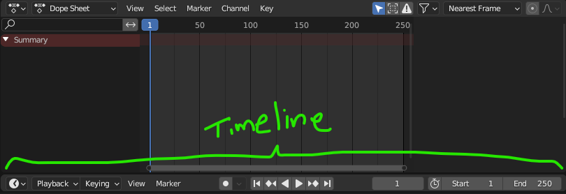
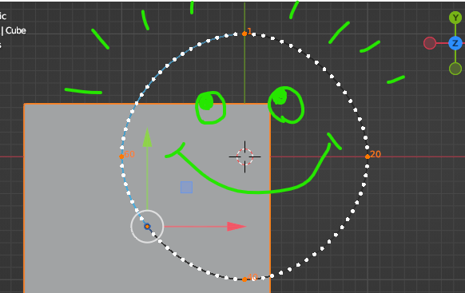

Of all the parts of creating 3d content, animation seems to be the subject that frightens people away more than any other. If 2d is considered easier, and 3d more difficult with its additional dimension, perhaps it's the inclusion of time that makes animation seem daunting. But if you’ve ever tried animating something–in 2d or 3d software, or even just drawing something frame-by-frame like a flipbook–your trepidation is more likely caused by just how time consuming it can be to make animation look good.

So for this tutorial series, I’m going to show several different ways to achieve the same outcome, all in Blender, so that you can try out different approaches and see which one(s) make the most sense to you. Unlike some journeys, it’s not really _how_ you get there, but more the end result that matters. Better yet, even if you find a method you like, you’ll always have alternative methods to fall back on when things don’t work quite the way you had hoped.

For all of these methods, I like using Blender’s built-in Animation workspace. You can enter this workspace by clicking the ‘Animation’ tab at the top of the app. This sets up a few windows to help you work more smoothly, namely the Dope Sheet (more on this later) and the Timeline controls at the very bottom.
Blender’s Animation workspace sets you up with the windows and controls you’ll need.Blender’s Timeline window, complete with playback controls. I’d refer to them as ‘VCR controls’, but that would reveal that I’m old…so…maybe… ‘Like video app controls’.

### Method 1: Keyframing

This concept is the same no matter what software you use. In traditional hand-drawn animation, a keyframe is a single drawing that defines a ‘key’ moment in a particular action. Think of a character pose such as the back swing of a golf club. That key moment helps define what the next action should look like. The next keyframe might be the pose where the club finishes swinging to hit the ball. Traditionally, an artist would draw these keyframes and someone else might go fill in the moments between those keyframes, known as drawing ‘in-betweens’ or ‘tweening’ for short. With digital animation, the computer does all the tweening for you, but not without some tweaking on your part. Let’s try it out:

I’m starting with the default cube to make things simple. Let’s first make note that the cube sits at the origin (0, 0, 0). We’ll be moving it around precisely so that we can better control the outcome, so I want to make sure I’m snapping to the grid. I always turn on the ‘Absolute Grid Snap’ option so that things always snap exactly on the world’s grid intersections. Without this option, if your object somehow gets ‘off grid’, it will then snap relative to where it started and can cause headaches later.
Blender’s ‘Snap To’ settings has a lot of options. The ‘Absolute Grid Snap’ option is key to staying locked to grid intersections and we’ll need this ON for the rest of this tutorial.
Since we’re working with the grid, it can be helpful to change your view so that you’re looking at the cube from a top-down point of view. To do this, we’ll click the little ‘Z’ handle on the gizmo in the corner of your 3d view.

0:00
/
1&#215;

Switching to a top-down view by pressing the Z button on the view cube. If you accidentally rotate your view, you can always just press this button again.
My plan is to have this cube move in a circular path around the origin (0, 0, 0). I’ll start by moving the cube exactly 1 meter along the positive Y direction. You can do this any number of ways–the move tool, just with hotkeys, etc. etc.
If you’re like me and you like efficiency, you can simply type ‘g’, then ‘y’, then ‘1’, followed by ‘enter’. The illustration below shows the move tool method.

0:00
/
1&#215;

Moving the box exactly 1 meter along the Y axis. Notice the status in the top corner that’s showing how far it’s moving. If your toolbar isn’t showing, you can press ‘t’ to toggle it.
This position is going to be where we make our first keyframe. Again, like most things in Blender, there are many ways to do this and over time, you’ll likely discover which way you like best. I like to see feedback so I’m going to use the side panel (toggled with ‘n’). While the cube is selected, the ‘Item’ tab in the side panel will display its transform information.

0:00
/
1&#215;

Opening the side panel by pressing ‘n’, then right-clicking one of the Location fields and choosing ‘Insert Keyframes’.
You have now created a keyframe at frame 1. How do you know? Well, a couple things. First, the Location fields all turned yellow. Also, if you look down at the Dope Sheet window, you will now see a keyframe marker on the first frame.
The Dope Sheet tells you what is changing and on which frame it’s happening. Don’t get confused by seeing that vertical stack of keyframes– it’s just a way of seeing where the keyframes are even when all those nested object arrows are closed up on the far left.
We’re now ready to move our object and set our next keyframe. But before we touch the cube again, we need to move ahead in time. For this, we’ll need a flux capacitor and we’ll have to get up to 88 miles per hour.

Just kidding. It’s much easier: just slide that blue thing with the long vertical line called the Playhead. Let’s slide it to frame 20.

Then, like before, we’ll move the cube in our top-down view. This time, let’s move it to 1 meter along X, but also back down to 0 on the Y axis. Last, we’ll right-click the Location fields and choose ‘Insert Keyframes’ again. This now gives us our first actual animation.

0:00
/
1&#215;

Animating can be a lot of small steps to remember, but one of the most important is making sure you’re on the right frame before doing anything. Notice how scrubbing the Playhead shows the animation.
You can probably guess how the rest of this animation will get made. Move the Playhead, move the cube, set a keyframe, repeat.

If you’re getting tired of all the steps, you can try some shortcuts like pressing ‘i’ and choosing ‘Location’ instead of using the side panel to set keyframes. I’ll show that method below for the last few keyframes. The plan, in case you didn’t realize, is to make sure the final keyframe matches the starting keyframe so it moves in a loop.

🏃

If your first and last keyframes don’t match, you will see a noticeable ‘hitch’ or stutter in the animation when it returns to frame 1.

0:00
/
1&#215;

Making the last few keyframes using the ‘Insert Keyframes’ pop-up menu (i). Notice how the cube’s path automatically becomes smoothed out as keyframes are added.
You can use the Timeline controls at the very bottom of the Animation Workspace to see it play back. But after it plays, you’ll notice it just sits there for a while until the timeline loops back to the start again. To avoid this, you can adjust the Start and End frames in the Timeline window.
Unless you like waiting for the Playhead to start over, you can type in your own End frame number in the Timeline window. (Yes, it’s considered a ‘window’ even though it’s more like a bar.)
Is the movement what you expected? I’m guessing you probably were surprised by the beginning and end of the loop. You can see that it’s not moving in a perfectly circular path. This gives us another thing we need to adjust.

0:00
/
1&#215;

That slowdown you see at the start and end keyframes is a behavior called ‘easing’ that apps often do by default for more natural motion. When trying to make seamless loops, easing can be infuriating.
To get a better view of what’s happening, we can use a feature called ‘Motion Paths’ that will show us the actual path that the object is taking as it moves. The Motion Paths menu is located in the Object tab of the Properties panel. From there, you can set a start/end frame and have it calculate the motion path. **_You’ll have to update it if you change the keyframes or timing at all._**
Motion Paths can take away a lot of the guesswork of figuring out how your object is moving over time. Just remember to click ‘Update All Paths’ any time you change the animation in any way.
So now, we can see what’s actually happening:

0:00
/
1&#215;

Turning on the cube’s Motion Path reveals not only the shape of the path, but the timing between frames. Each white dot is an in-between frame and the ones at the start and end are closer together than the rest, indicating a slowdown.
Once again, there are numerous ways to fix this path to be smooth, but I’m going for quick and easy. Remember how the path automatically smoothed as we kept adding keyframes? Well, a quick fix is to add more keyframes before and after our 80-frame area as if the object continued.

This can be done manually as before, but I’m going to copy some of our existing keyframes and paste them into new frames.

I’m going to copy (ctrl + c) the keyframe at frame 20, and paste it (ctrl + v) at frame 100. Then I’ll copy the keyframe at frame 60, and paste it at frame -20. (Yes, the timeline exists in the negative direction too.)

When you’re done, your Dope Sheet should look like this:
Copying some existing keys to new ones outside the start/end range.

⬇️

Pro-tip: The Playhead doesn’t have to be on any particular frame to copy keyframes, it only matters where it is when you paste.

Now, if we use that ‘Update All Paths’ button under the Motion Paths menu, you should see the cube’s path look like this:
Well, it won’t have the derpy face, but you’ll be happy to see the Motion Path has become a perfect circle. Plus, all the frames (white dots) are equally spaced which means the timing is smooth all around.

🎥

You can turn on the display of all the frames in the Motion Paths menu for times when you really need to tweak timing and motion.

If you play back the animation now (assuming it’s still set to only show 80 frames), it’s almost impossible to tell where the animation begins or ends. I say ‘almost’ because if you watch carefully, you’ll see that frame 1 and frame 80 are identical, which means there is one moment where the object doesn’t move. We can change our timeline to end at frame 79 to fix this problem.

😣

We won’t obsess over making the loop perfectly seamless. Truth be told, [Blender’s glTF exporter](https://github.com/KhronosGroup/glTF-Blender-IO#blender-gltf-20-importer-and-exporter) continues to have improvements from the Khronos team that works on it (thanks, Khronos team!). I try to get things as close as possible knowing that the translation from Blender might mess things up a bit as the kinks get smoothed out.

Let’s go ahead and test this object out by exporting it first.

### Exporting to .glb

You’ve probably exported as a .glb before, but this time, we need to pay attention to some options you may have ignored in the past.

In the glTF (glb) export options, there is a whole section dedicated to animation. Most of the time, you won’t need to do much other than making sure ‘Animation’ is checked.
Blender’s Export glTF dialog. At the very least, make sure ‘Animation’ is checked.
Some of the options are more relevant to this tutorial than others, so let’s focus on those.

- **‘Limit to Playback Range’** allows you to use the Start/End of the timeline as a way to only export the relevant part of your animation. So in our example, we have additional keyframes before frame zero, and some keyframes after frame 80– but we only care about 1-80. This option will ensure it only exports the keys we care about.\*

😣

- ‘Limit to Playback Range’ has been broken for quite a while in several versions of Blender's glTF exporter. As of this writing, it looks like it may be fixed in newer versions–like maybe 3.5 and beyond, but those are currently not official releases and should be avoided for this tutorial.

* **‘Always Sample Animations’** is somewhat strange to most beginners. With this on, Blender will create new keyframes on every frame to ensure that the animation gets exported the way it looks visually in Blender. This is usually ok to be on by default. But there are a few cases where this can mess up the exported animation, especially for things like avatars that may have hand poses defined, or other special keyframes. So if your animation appears ‘broken’ when you load it into Hubs, this checkbox would be the first one to try turning OFF. Also, because each added keyframe makes the exported file size slightly larger, having this on can quickly balloon your .glb’s size more than you probably want. Bottom line: use this option with caution.
* **‘Group by NLA Track’** is an option I’d rather not discuss in this tutorial since we haven’t gone over trying to export multiple animations. For now, leaving this option to the default is just fine.
* **‘Optimize Animation Size’** attempts to remove any duplicate keyframes that might be making the file size too big. Imagine if you put a keyframe on every frame, but they were all identical so the box didn’t move at all. This option would help get rid of redundant keyframes that can get made accidentally.

The remaining options are irrelevant since we’re not using skeletal animation yet, but we'll cover them in upcoming tutorials.

➕

**There may be additional options not mentioned here. If that’s the case, consider leaving them at their defaults.**

### Test it out in Hubs

Once the object is exported as a .glb, we can drag/drop it right into a Hubs room to test it out.

0:00
/
1&#215;

Exported .glb files can be dragged/dropped right into your Hubs room. The animation should play immediately.
So, like I mentioned before, the loop isn’t perfect but it’s close enough for our purposes.

This animation plays automatically because it’s the only one on that object. But what if we have an object with multiple animations? Or the same animation on multiple objects? Fortunately, the Hubs engineers have come up with some useful tools.

### The Loop Animation component

Prior to export, you can put a ‘Loop Animation’ component on your object.
The Loop Animation component for Hubs needs to access stored animation tracks to work properly.
**However, you won’t be able to make it work until you store your animation(s) properly.** So first, we’ll have to dive into parts of Blender’s interface that may likely be new to you: The Action Editor and the NLA Editor.

### Action Editor

It’s tricky explaining all of Blender’s animation functions without this turning into a copy/paste of Blender’s manual, but I’ll try to focus on only the parts you’ll need.

We need to take the animation we’ve already made and turn it into an ‘action’. In the Dope Sheet editor we used before, you can change the dropdown where it says ‘Dope Sheet’ and change it to read ‘Action Editor’.

0:00
/
1&#215;

Some of Blender’s editors are nested inside other editors. The Action Editor can be selected while inside the Dope Sheet window via the dropdown menu.
From the Action Editor, we can still edit the keyframes, but we’re ready to turn this into an Action. To do this, it’s simply a matter of pressing the ‘Push Down’ button.

0:00
/
1&#215;

‘Push Down’ converts the keyframed animation into a Blender ‘Action’. Storing actions allows you to use them later, and even on different objects.
WHOA! What happened to our animation!? WTH is even that!?

Daddy, chill[.](https://www.youtube.com/watch?v=h0-WO6xRbAo)

The animation is not gone, despite what the Action Editor might have you believe. What actually happened is that the animation is now stored as an Action. To see it, you’ll need to open (or switch one of your windows to) an ‘NLA Editor’.

### The NLA Editor

The NLA Editor (or ‘Non-linear Animation Editor’) is the tool used to mix and blend animations together–like transitioning from a walk to a run, for example. But for our purposes, we’re going to use the NLA Editor in a more limited way. Besides, exporting to .glb will only allow us to use the more basic features of the NLA Editor so we don’t need to dive too deeply into it.

Opening up the NLA Editor will show that animation you thought was gone:

0:00
/
1&#215;

The Non-linear Animation editor, chosen via the ‘Editor Type’ dropdown menu.
Probably one of the most confusing parts of Blender’s animation workflow is the whole range of names used–tracks, clips, strips, actions, etc.. It’s a lot to learn and understand. Fortunately, we’ll mostly be using these functions for very basic control.

That process of making an animation, then turning it into an Action that we push down into an NLA Track is a very powerful thing. It means your object could store potentially dozens of different animations. By default, the ‘Push Down’ operation puts them into a big stack where they all contribute to the final animated result. Checking and unchecking the various tracks will let you see them all together or one at a time in isolation. Since we only have one track, there’s not much to see.

🤷

What's the difference between 'Push Down' and 'Stash'?
Not much. The main difference is that 'Stash' also creates a new track, except that it disables this new track in the NLA so you don't see the animation play in Blender. No big deal if you pressed the wrong one.

Now that we have an animation stored as a ‘pushed down’ track, we are able to point to it inside the ‘Loop Animation’ component. But before we do that, it’s usually a good idea to rename the Track in the NLA Editor. All you have to do is double-click the leftmost item (the one with a star next to it), in our case, the one called ‘NLATrack’.

0:00
/
1&#215;

Renaming an NLA Track is done by double-clicking on the Track name.

🔤

We’re renaming the NLA TRACK–not to be confused with the NLA STRIP, which is the long yellow bar. I told you the names get confusing…

So now, when we add a `Loop Animation` component to the object, we’ll be able to see the NLA Track we just renamed.

0:00
/
1&#215;

Our renamed NLA Track shows up nicely in the Loop Animation component when we add a new animation to be played. If the object contained multiple tracks, they would also show up in the list.

### The Power of the Loop Animation component

You may have noticed some of the options inside the Loop Animation component. These are what make it more useful to us inside Hubs. Without having to edit the existing animation, we can use ‘Time Scale’ to speed up or slow down the animation. So, for example, setting the Time Scale to 0.5 will make it play twice as slow, whereas setting it to 2.0 will make it play twice as fast.

This means we can set the cube to have a different animation Time Scale and export different versions of it. Let’s compare how they play in Hubs.

I got tired of the cube example, so I made one with gears.

0:00
/
1&#215;

These three gears are identical except for their Time Scale, set in each one’s Loop Animation component. Note: the framerate looks much smoother in Hubs than in this video capture.

⬅️

Callout: You can use negative numbers to play the animation in reverse. Of course, in the gear example above, it’d be just as easy to rotate a gear to face the other way…

The other parameter you can try out is the Start Offset value. This allows you to make the object start at a different point within the animation. This can be really useful when trying to make things look more randomized, like these wind turbines in another Hubs scene made by Hubs team member, [Christian](__GHOST_URL__/author/christian/).

0:00
/
1&#215;

The Loop Animation component’s Start Offset allowed the artist to have multiple wind turbines, each rotating slightly offset from one another. This avoids the look of your whole scene being synchronized (and boring).
Here, we can use a really basic animation that consists of just 3 keyframes. The default interpolation (in-betweening) works nicely here because it mimics the natural slowdown of the pendulum that would normally happen from gravity.

0:00
/
1&#215;

This is a single mesh whose pivot point (origin) is located at the top of the mesh. Moving the pivot point around can help you animate rotations more easily.
But things get interesting when we use the Loop Animation’s `Time Scale` and set each duplicate to be just a little bit slower than the previous one…

0:00
/
1&#215;

This [famous physics experiment](https://www.youtube.com/watch?v=YhMiuzyU1ag) is much easier to achieve when you don’t have to worry about pesky things like mass and gravity.
In real life, we would have to make all the objects have different lengths but Time Scale makes this easy.

What else can you do with Loop Animation? Maybe you could come up with something new to share with the Hubs community. Come check out the [#show-and-tell](https://discord.com/channels/498741086295031808/1063489773072830609) channel–there’s always something cool to see.

In the next part of this series, we’ll apply what we’ve learned here and go through some other ways of animating your Hubs scenes.
