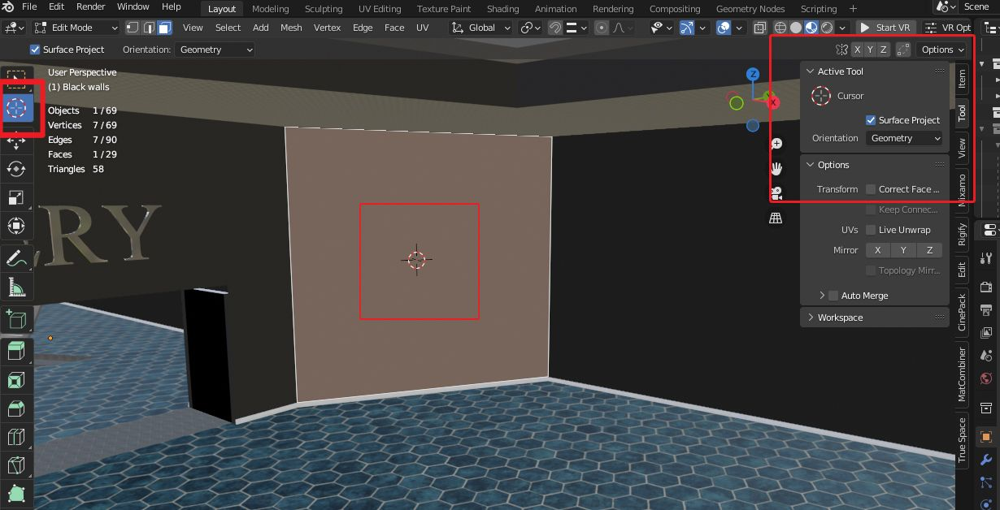
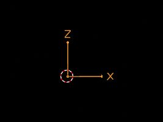
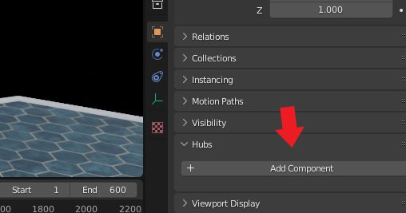
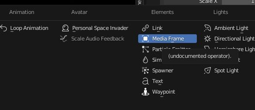
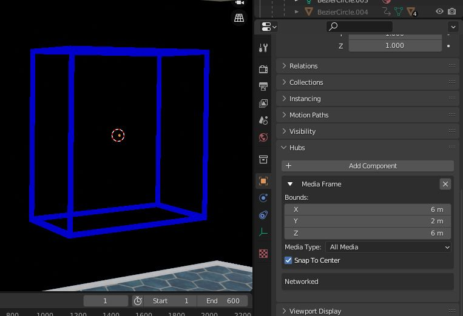
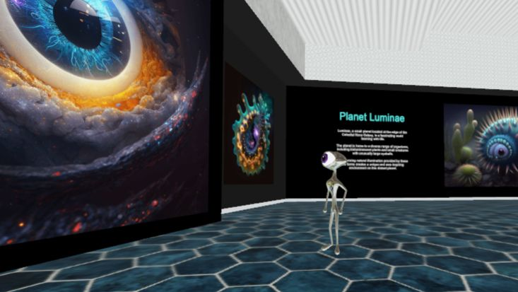

Media frames are essentially placeholders or containers within a Hubs space that are designed to hold different types of media such as images, videos, or 3D models. By using the media frame component in the Hubs Blender Add-On, you can set up designated areas within the scene where users can simply drag and drop their own media content, which is a much more intuitive and user-friendly experience than if they had to create or modify the environment itself.

In addition, using media frames can also help ensure that the overall design and layout of the Hubs space remains consistent and cohesive, even as users add their own content. Using pre-defined frames can ensure that the media content added by users fits seamlessly into the environment without disrupting the overall aesthetic or design of the space.

### Creating an Art Gallery Using Media Frames

For this example, we will add media frames to an art gallery space. This will enable the artist to easily drag and drop new art into the spaces for different events.

**STEP 1: Adding and Aligning an empty object**

The easiest way to add a media frame component is to attach it to an empty object. Before you add your empty, it helps to set it up so that when you attach the media frame it will come in correctly aligned with your wall.

In Object mode, select the wall or other object that you want to add a media frame to. You can focus in on it by using the . key on your numpad. Next, go into edit mode, turn on face select, and select the face you want the media frame to be attached to.

Click the 3d cursor from the toolbar menu. Use **N **to bring up the settings menus on the right and open the **_tool_** menu. Mark the checkbox next to **_surface project_**, and choose **_geometry_** under the dropdown menu that says **_orientation_**. If you want your media frame to appear in an off-centered spot, click on whatever part of the face you want the center of the media frame to be to position the cursor there. If you want your media frame to be centered on the face, select the face, then use **shift S**, and choose **_cursor to selected_**. If the cursor doesn’t look like it is facing in the right direction, you may need to click on that spot again with the 3d cursor tool selected from the toolbar. You want it to look like the cursor shown in the example below.
Use the 3D cursor tool set to _Surface Project / Geometry_ to orient your cursor correctly on the face of the wall where you want your media frame to appear.
Next, you need to add an empty to that spot. Return to object mode. Use **Shift A**, **_add empty_**. It is easiest if you use the **_arrows empty_** so you can make sure your media frame will be facing in the right direction.

💡

**_DO NOT try to scale your empty!_**Even if you apply the scale your size will be off when you bring it into Hubs. Leave the empty at the original scale. You will be able to adjust the size of the media frame later.

You may need to rotate the empty to orient it correctly. For some reason it often seems to come in with the arrows facing  in the wrong direction. I have found that rotating it on the local X axis by -90 degrees usually fixes it (**R, X,  X, -90**).  You want it to end up looking like the example below, with the Z axis pointing up, X axis pointing out to the right, and Y axis pointing backwards into the wall.
Correct orientation of Arrows Empty
Once you have your empty oriented correctly, move it slightly out from the wall on the local Y axis (**G, Y, Y, -.08**). Otherwise later when you add your image it may end up partially obscured by the wall.

**Step 2: Adding the Media Frame Component**

Now it’s time to add your media frame. With your arrows empty selected in object mode, go to the object properties menu (orange square). Scroll down to **_Hubs_** and expand that section. Click **_Add Component_**, and select **_Media Frame_**. Your media frame will appear at the location of your empty.
Select the empty, then choose "Hubs/Add Component" from the object properties menu.Add the Media Frame component
Select the desired "media type" from the dropdown menu...2D, 3D, videos, all media, etc.
Choose the media type, and adjust the size (bounds) to fit your space.
Under “bounds”, you can adjust the size until it looks right on your wall. For most 2D images, I just adjusted the X and Z numbers and left the Y number at 1 or 2.

💡

_If you are going to be using your media frame for a 3D model, keep the XYZ dimensions uniform so the model does not get distorted. For example, set X, Y, and Z all to 4 m. _

**A few tips:**

If you are going to have a lot of media frames in your scene, I find it helps to put all your media frame empties into their own collection so you can hide the collection if you need to work on other things because they can be distracting and difficult to work around if you are doing other editing.

If you have a straight flat wall that is going to have multiple frames on it, you can use hotkeys** shift D, G, X** to duplicate them horizontally, then just edit the dimensions or move them up/down a bit if you want them in different places on the wall. Otherwise, repeat the previous instructions to place media frames on your other walls.

**Final Steps**

Upload your scene to Hubs and your media frames will be ready to fill with your images, videos, or 3D models! Simply place your media into the scene, then drag it and move forward  towards the wall until you see the media frame bounds box appear. Keep moving the image towards the box until it snaps into the media frame.  Then you will want to pin it into place to make sure it doesn't accidentally get moved.

0:00
/
1&#215;

Simple place an image, then drag it into your media frame and pin it in position.
Now you are ready to start making your own space with media frames! If you are going to have a lot of media frames I recommend compressing the images you are going to put in them with [Squoosh](https://squoosh.app/), which will make them smaller and keep your space performing well.

Here are some scenes from my Hubs Artist in Residence project, the "Cosmic Canvas Space Gallery" for inspiration!
"Cosmic Canvas" space gallery by WillowmoonArt - uses many media frames!
