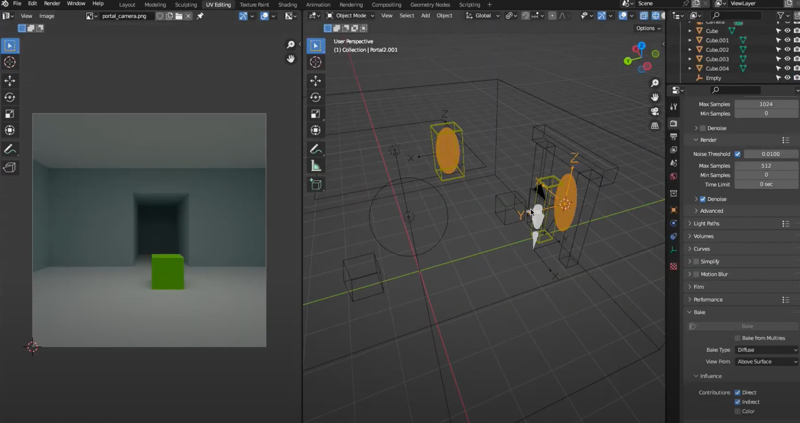
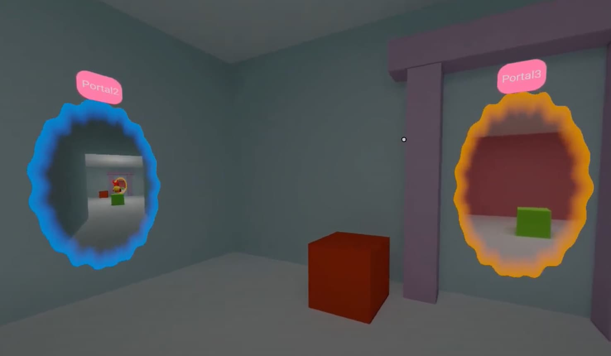

Hello, Hubs community!

We’ve all been there - had a great idea for an improvement to Hubs, and wanted to tell the team to make it a reality. But then the questions arise: do I post this in Discord? GitHub? Send an email to the Hubs team email alias and hope for the best?

Starting today, feedback for Hubs has a new home: Mozilla Connect! By visiting [connect.mozilla.org](https://connect.mozilla.org), you can submit ideas to be commented on and upvoted by the wider community, helping develop our thoughts and roadmap for the future of Hubs.

Example Idea for Hubs: Portals! [More from Hubs Hackweek](__GHOST_URL__/quhack-week-2022/).
To get started:

1. Visit [connect.mozilla.org](https://connect.mozilla.org)
2. Sign in with a Mozilla account
3. Click “Ideas”
4. Search for your idea!

If you find someone else has already posted an idea, add your support by clicking the “thumbs up” button or adding a comment. If you don’t see anything that matches, click ‘Submit an Idea’ and make sure to add the ‘Hubs’ tag so we see it!

0:00
/
1&#215;

Or how about real-time networked body tracking in Hubs? See more feature ideas and prototypes from [Hubs Hackweek](__GHOST_URL__/quhack-week-2022/).
Don’t worry - we’re keeping our Discord and GitHub. We’ll be using Mozilla Connect for suggestions related to new features and our subscription service, while  GitHub will continue to be used for the open source community and code base.

We’re looking forward to hearing from you on [Connect](https://connect.mozilla.org/)!
