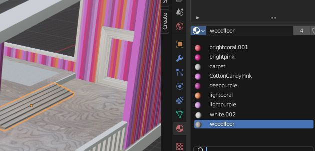
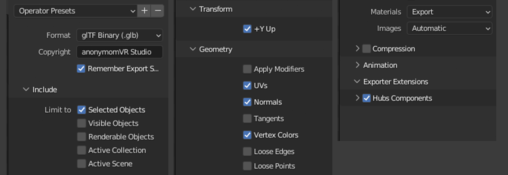
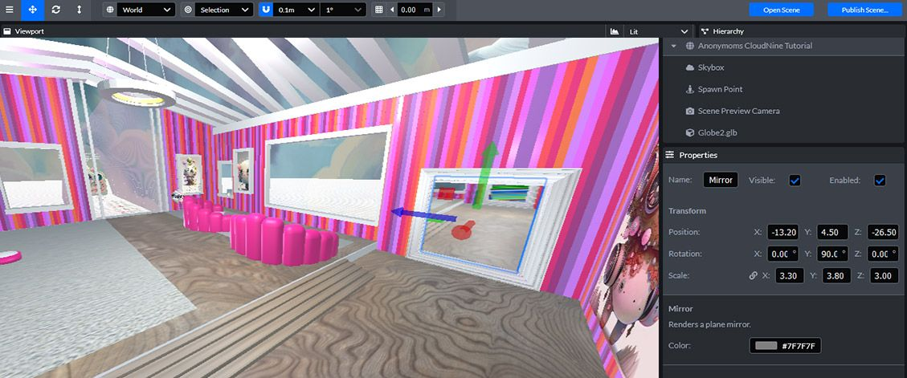
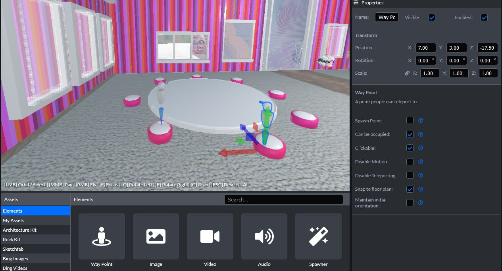
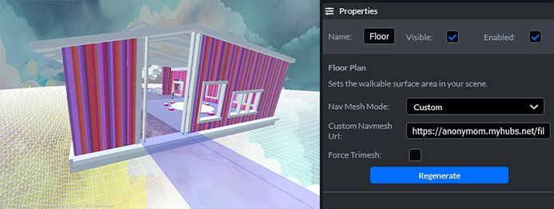
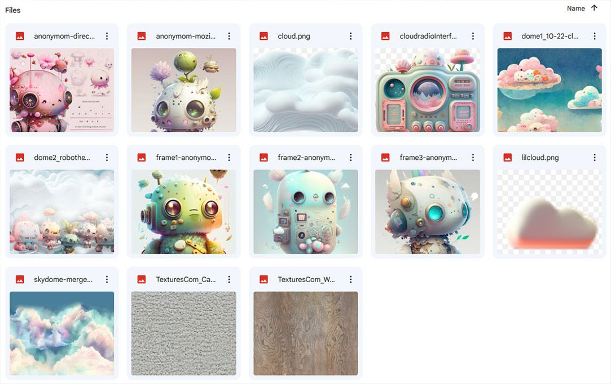
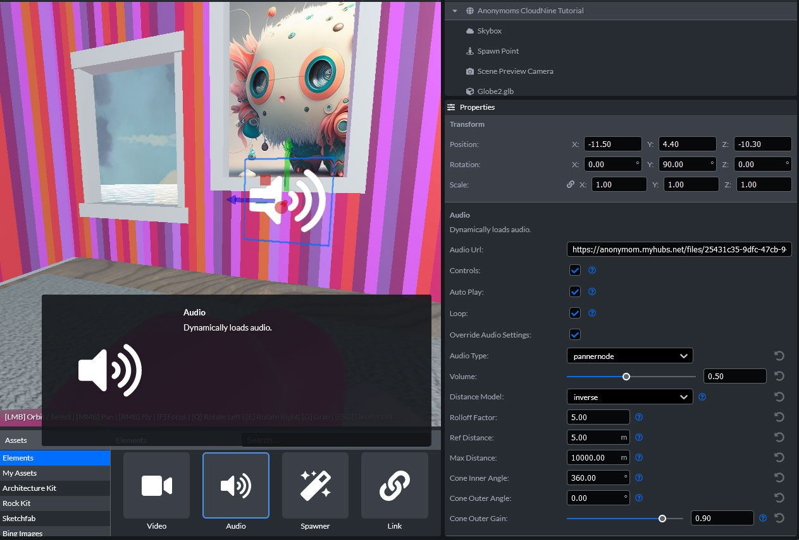
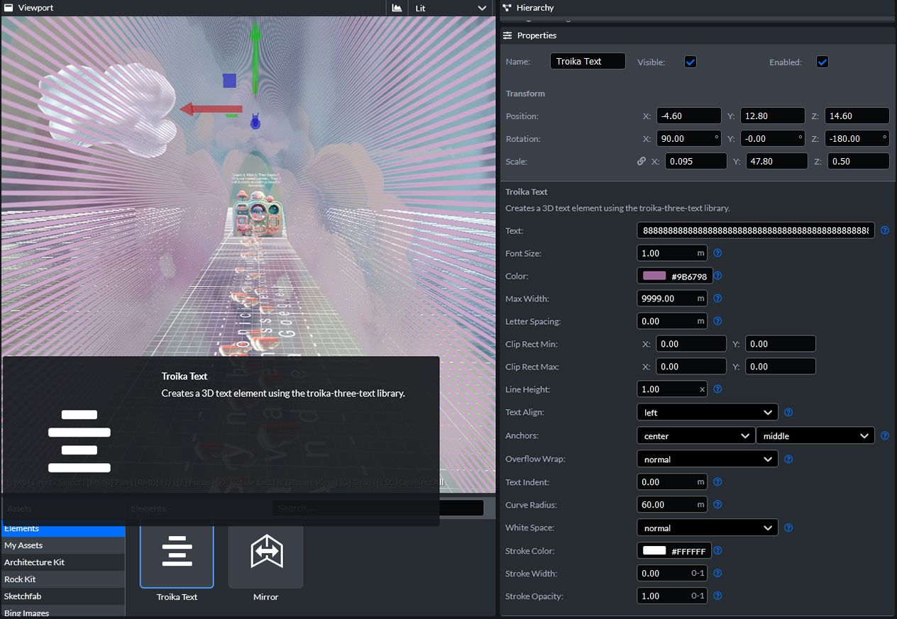

So you want to build a world in Mozilla Hubs but don’t know where to start? When I discovered Mozilla Hubs, I fell in love with it. It's perfect for artists to showcase their work, educators to teach & of course... storytellers to create immersive experiences. Mozilla Hubs has plenty of amazing worlds that you can customize, but in this tutorial, I am going to walk you through the creation of Cloud Nine, a world built in Blender and imported into Spoke. I’ve only been building in Mozilla Hubs for a short while, so this beginners guide is written for those just getting started in the space with little to no experience with Blender. Give yourself some time & grace during this process. To be completely honest, adjusting to the tools might take some time. There could be moments when you feel frustrated, but don't give up, keep pushing through! I can honestly say I feel so much more confident now than when I first started & you will get there too!

[Click Here](https://github.com/mozilla/hubs-blender-files/tree/main/HAIR/Anonymom) to download the creation files from Github you will need for this project. Click the green 'get code' button and download the zip file. The zip file will include: all the blender files, a textures folder and an export folder.

💡

If you don't already have a Firefox account, start one by visiting the main hubs site here: [https://hubs.mozilla.com](https://hubs.mozilla.com) and registering your email address. Once you verify your account you can visit the Spoke site and start a new project! [https://hubs.mozilla.com/spoke/](https://hubs.mozilla.com/spoke/)

Spoke has a great tutorial that goes over the basics so I'm not going to dive into that but I will leave you with [this link to the Hubs official cheatsheet of controls!](https://hubs.mozilla.com/docs/hubs-controls.html)

As we jump into the programs and tools used remind yourself that is ok to be a beginner at something! It's the only way we grow, so... let's get started!

First things first, you're going to need Blender.
You can download that [here](https://www.blender.org/download).
This tutorial was created using Blender 3.0.

Then make sure you download the Blender add-on from Mozilla Hubs [GitHub](https://github.com/MozillaReality/hubs-blender-exporter/releases)

Once in blender navigate to the 'Edit' menu > 'Preferences', in the popup, click 'Install', find the .zip file and select it, enable the add-on by checking it. Autosave Preferences should be enabled by default, but if it is not, click the menu button at the bottom left of the Preferences menu and choose 'Save Preferences'.

## Planning and References

Deciding what type of space you want to build up front is key to staying on task IMO! I knew I wanted to create a hangout space and since this was my first build in Hubs, I wanted to keep it small.

**Reference Photos & Color Palettes**
Having photos in Blender will help you improve the accuracy, creativity, and efficiency of your modeling process! For this build I will be bringing in reference photos from a world I built in Horizon Worlds ( reference files can be found in the textures/references folder you downloaded). Now let's create a color palette from that reference photo!

Using [Adobe Color](https://color.adobe.com/), a free tool for creating color palettes, I'll be able to import an image, adjust my palette, then save and export to easily reference HEX colors in my build.

💡

AI-powered text-to-image tools like [Midjourney](https://www.midjourney.com/app/) can help you create mood boards, concept art, and streamline your process as an artist.

## New Blender Scene

When you open Blender, you'll have a default scene with a cube, light, and camera. Let's go ahead and remove those items by selecting them and pressing 'x', then save this file in a new project folder. I highly suggest organizing your files from the beginning,  In my project folder I have 3 other folders:

1. **exports** - where you'll save glb files for importing into Spoke.
2. **textures** - where you'll save any textures you want to bring into Blender or spoke from external sources.
3. **references** - inside of the textures folder, where you'll save any color palettes & reference photos you want to import into your blender file.

**It's time to add reference photos to your scene! **
I like to make sure I am bringing in my photos from the front orthographic view. Your numeric pad is how you change your view.  To view from the front click '1' . Then 'Shift A' will be a shortcut you use all the time! It's basically how you add anything to your scene. To add the photos:
'Shift A' > 'Image' > 'Reference' > then choose the image and upload.

Once the image is in the scene, you can select it and click 'G' which allows you to move it off to the side, and click with your left-mouse to lock into a new position.

Repeat this till all your images are in the scene.
At this point, I also like to create a New Collection in the Outliner so I can easily turn on and off the reference photos. Just right-click at an empty point inside the Outliner and select 'New Collection'.

## Helpful Shortcuts

Below are some of the shortcuts that I used daily while working in Blender. It takes a little time to get used to, but here is how to move around in Blender:
Moving around in blender is a combination of using the mouse keys, Shift & Alt KeyWhile in Object Mode, Grab and Move an object along an axis

💡

Tab: Switch between object and edit mode (In edit mode you can choose to edit 3 different ways: vertices/edges/faces: see diagram below)
G: Grab/Move Freely
S: Scale Proportionally
R: Rotate
E: Extrude
Shift + D: Duplicate
Ctrl + R: Add loop cuts
Ctrl+ Z: Undo The Last Move

While In Edit Mode, an example of scaling by selecting vertices, edges or faces

## From the Ground Up

Let's start by selecting the cube, and typing 'n' to reveal the 3d view's side panel. In the 'Item' tab, we'll start by changing the Scale X field to 15 and the Scale Y field to 15. After the transformations, make sure to apply transformations by hitting 'Ctrl A' > 'Apply All Transformations'.

⚖️

Applying scale keeps the look of the cube but makes the Scale values read 1, 1, 1 like they did when you first created it. Making sure your scale is reset like this avoids problems later.

---

**Creating the Front Wall**
Starting with a cube, we are going to create a section of beams, or wooden panels that will be colorized, offset, then duplicated to create the entire frame of the house.

---

**Adding Materials to Colorize the Beams**
Now that your beams are set up, you can create your repeating color pattern for the walls. By using the materials tab, eyedropper tool, and the color palette reference image you imported earlier.  Select a beam, navigate to the materials tab on the right, click 'New', scroll down to 'Base Color' and click the color swatch beside it, click the eyedropper tool, then use the eyedropper to select the color palette.

Repeat until you have the complete section colorized.

---

Duplicating and rotating your walls around on just the Z axis can be done by Clicking 'R' then 'Z' and rotating the selection to its desired location. Once you have all 4 walls connected, we'll move on to creating the beams for the roof of the house.

💡

Sometimes when you go to rotate, the origin of your object will not be set correctly. Meaning it won't rotate from the center of your selection. To fix this, make sure all your beams are selected, then right-click and 'Set Geometry to Origin'.

How to slant the vertical beams to match the roof:

Creating space for windows and doors. This is where you can take some creative freedom and add windows on the other walls of the house. To create a window frame you can start by clicking 'Shift+A' to open the 'Add Mesh' menu, and choose 'Cube' from the list. Using the shortcuts we discussed above, resize the cube by scaling the x/y/z. This is also the method I used to create picture frames, you can also find assets for free personal use in the [Sketchfab](https://sketchfab.com) library which is directly accessible to search while in Spoke.

## Adding Materials

**Floor Textures for the Main Room**
First, we are going to add a Plane by clicking 'Shift A' > 'Mesh' > 'Plane'. That will be the carpet in the main area.
Select the plane by right-clicking on the object in the 3D View.

Navigate over to the Shading Tab along the top of Blender. Below your 3d View section for nodes will show up. Click ' + New ' and 2 new nodes will appear. They will be connected on the right BSDF to Surface. These nodes are the basic building blocks of a material.
Find the folder you downloaded with 'textures', and drag and drop the texture into the nodes area. Connect 'Color' to 'Base Color'.

💡

If you are working alongside the template blender file and the ground looks pink – you'll have to relink the material by going to the Shading Tab, and clicking the folder icon on the texture node then relinking the image.

Adding a material by dragging and dropping it into the nodes section of 'shading'. Then Connecting Color to Base Color.an alternate way to add material to an item if it already exists in the file.
**Creating a 360 Image Background and Bringing it into Spoke**
So there are a few ways you can create image backgrounds! If you want your background images to show up in the mirrors and photos/videos you take, you'll need to map the image to a sphere in Blender.

In the 'textures' folder you downloaded in the beginning of the tutorial you will find a _skydome.jpg_ that can be used as the 1st dome for this next part. ( There are 3 total globes to create for the world)

In a new Blender document let's add a sphere by clicking 'Shift A' > 'Mesh' > 'UV Sphere'. Follow the same method of adding a new image as a material as we did for the carpet in the previous step.

💡

**Texture/Image Resources**
**[textures.com](https://www.textures.com/library)** has a great Free section as well as a pro plan for purchase.
**[withpoly](https://withpoly.com/)** is a great source of assets, Free for educational or personal use.
**[Midjourney](https://www.midjourney.com/home/)** has been doing its thing for a while now and is on V5. I have a paid subscription, but you are able to test it for free. Just a reminder, without a paid subscription you get Creative Commons Noncommercial 4.0 Attribution International License vs. owning it.

---

## Exporting From Blender To Hubs

With the shell of our hangout spot complete, this is where I like to test and export a glTF for viewing in Spoke. This can be done by selecting all the items in your scene, going to File > Export as GLTF 2.0. These are the settings I used.
Include: Selected Objects, Transform: +Y Up, Geometry: UVs Normals Vertex Colors, Exporter extensions: Hubs Components

---

## Importing into Mozilla Hubs Spoke

When you start a new empty project in Spoke, by default you will have a skybox, directional light, spawn point, terrain .glb file and a floor plan. Go ahead and delete the terrain and floor plan. Next, you'll navigate over to 'My Assets' and upload all the files we've created so far together (or you can upload the files from the 'export' & 'textures' folders you downloaded in the beginning of this tutorial).

💡

If you notice items from your build are showing up completely black, that means you are missing its material. Go back to Blender and click on that item that is black, navigate to the materials properties and check that the drop-down is not blank.

0:00
/
1&#215;

---

## Adding the finishing Touches in Spoke

In this section I'm going to go over the tools in Spoke I use to help elevate my space. Using Images with a _billboard component_ rather than another 3D mapped image in Blender can be done by using the **Add Media Tool**.

To enable billboard, select the checkbox on an Image, Video, or Model element to have the media face the user at all times.

0:00
/
1&#215;

---

Adding a **Mirror **to your scene is a perfect way to test all the avatars that are available to you! In the Elements section of Spoke navigate down to the last item. Drag it into your scene, and switch between the 'translate' and 'rotate' icons to place your mirror in the mirror frame. You'll know the mirror is facing the correct way when you can see the reflection.

💡

Top Menu Bar:

- the Magnet icon used to turn on/off snapping I always keep on
- .5m is the default measurement unit - I always switch it to .1m
- 90° is the default rotation - I always switch it to 15°

**Waypoints** can be added to place your avatar in a certain position, facing a certain direction like sitting at the round table. Waypoints become visible by pressing the space bar while in Hubs. Below are the settings I used.
In Spoke, these are the settings used for Cloud Nine Way Points.

Adding a nav mesh or **floor plan** can be complicated if you have multiple layers of flooring. Instead of using 'Automatic', I created a nav mesh from a plane by moving edges around to outline the entire floor of the house. I used the knife tool ('k') while in edit mode to cut out the shape of the table.

In your 'exports' folder, is the nav mesh. This needs to be imported into hubs so you can copy the URL. From your 'Elements' menu, add 'Floor Plan', and paste the URL in the empty field. You may need to adjust the position of the Y-axis of your cloudnine .glb file in the properties panel to -1.30.

In the 'textures' folder, You'll find all the images to recreate Cloud Nine. Then in the 'exports' folder you will find all the .glb files to import into Spoke.

In the Cloud Nine World Gallery, you'll notice there are sound bath areas. These can be added to your project by uploading an .mp4 to your library then adding an **audio file** from the Elements tab. I adjusted the max distance in the 2 smaller domes to only reach 5,000m vs the default 10,000m. Here are the settings I used:

Experimenting with the** Troika Text **element can give you some interesting and unexpected results. Check out the settings I used to create a text tunnel in Cloud Nine.

##

So let's talk world testing!

Testing that your space works well on each available device is important. Make sure to test on your phone or desktop, and a VR headset there as well. Over the course of creating Cloud Nine, I made sure to test with multiple audiences. I invited fellow artists and VR enthusiasts to check it out, as well as some of my family members who aren't as tech-savvy. Seeing how people enjoy the space and where they naturally gravitate helps you decide how to change your layout, or leave additional instructions depending on the reactions you get. It is also the best way to squash any bugs you run into early.

If you complete this tutorial and need feedback, or just want to show off your creation please add it to the [Hubs discord](https://discord.gg/hubs-498741086295031808) #show-and-tell channel!

Experience Cloud Nine Here: [https://anonymom.myhubs.net/d4TrznH/cloud-nine-beta](https://anonymom.myhubs.net/d4TrznH/cloud-nine-beta)
