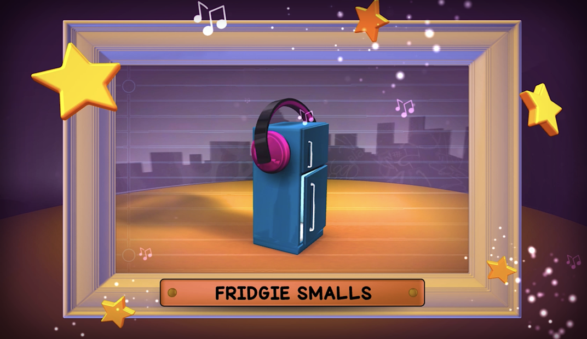
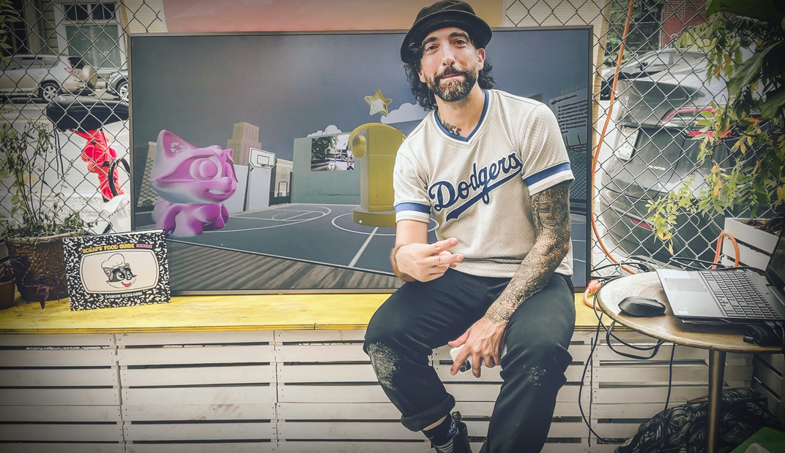
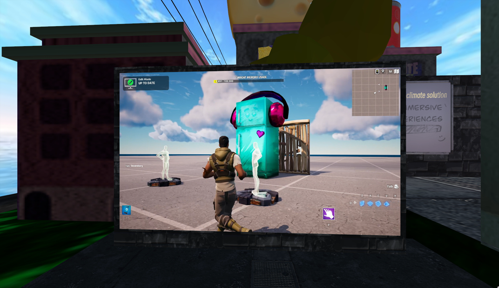

## **Pivoting in reality, virtually...**

_"The Scraps in the Back!"_ project was born out of necessity, and quickly grew into a successful and innovative approach to culinary education in the metaverse.

After COVID-19 cancelled Damon Versaggi's, *"Scraps' Food Guide from A to Z" *book tourand all of Scrappy Meals cooking events, there was a need to create a virtual platform that focused on culinary experiences.

And so, the idea for _"The Scraps in the Back | Food Rap Almanac!"_ was born.
Scrappy Meals Founder, Damon Versaggi, talks about Scrappy Meals and his upcoming book tour for "Scraps' Food Guide from A to Z". PIX 11 News, January 22, 2020.

## **From Fridgie Smalls to Food on the Blockchain**

_Fridgie Smalls_ and *The Scraps in the Back | Food Rap Almanac! *were created on the flight back from Sweden to New York City during the worst of the COVID-19 pandemic.

The idea behind the project was to bring food education to the metaverse, and to do so in an engaging and innovative way.

Versaggi quickly realized the potential for immersive technology, as a chance to revolutionize the food industry, and began exploring ways to easily onboard chefs and farms to the next iteration of the internet (Web and Web XR).

_"Fridgie Smalls and Food on the Blockchain"_ was later presented at an United Nations event during Climate Week in September 2021, where it informed a sustainably conscious audience about the value and potential for web + technology in regards to the way we handle food waste.
The idea for “Fridgie Smalls" and "The Scraps in the Back!” was born during Damon's flight back from overseas, following the cancellation of the London Book Fair and the debut of the “Scraps' Food Guide from A to Z” due to the COVID-19 pandemic. Fridgie Smalls, portrayed as the coolest fridge on the block, aims to help build confidence and improve skills in the kitchen.

## **Why Mozilla Hubs was the Clear Choice**

At the heart of _The Scraps in the Back!_ is the use of virtual spaces to bring culinary education and food efficiency to the forefront. To achieve this, we needed a platform that was both user-friendly and provided a seamless virtual experience. That's why we chose Mozilla Hubs.

The choice to use Mozilla Hubs was simple - it's the fastest and best way to interact in a Web XR platform. Our first live virtual event, _"Food Tech and the Metacheese with Scrappy Meals XR & Friends,"_ was held at a solar-powered plant shop in Brooklyn called Pollyn NYC. The event consisted of live-streaming a chef from the space and a chef from Sweden. The two chefs collaborated on the dish virtually and were able to take a few questions from the 20 or so virtual guests from all around the world.

This event showed the power of knowledge sharing in a virtual space and was the inspiration for the evolution of the project. From then on, the Scrappy Meals XR space really began to take shape. We were able to leverage the amazing development from the Mozilla Hubs team, as well as the wonderful and encouraging community of users they have been able to build.
August 1, 2021: The debut of "Food Tech & the Metacheese, with Scrappy Meals XR and Friends". This virtual cooking demo took place in Brooklyn, New York and even had a chef, from both Brooklyn and Sweden, virtual collaborating on a dish. This would set the stage for The Scraps in the Back! project.

## **Scrappy Meals XR, “The transition from Web 2.0 to Web 3.0, a case study and example of a multi-chain culinary future”**

_The Scraps in the Back!_ Cranfield University Program launched in June 2022. The program was entirely virtual, and focused on bringing food to the metaverse and the early stages of a multi-chain culinary future.

The internship was one of the most popular ones to apply to, and concluded with a Master's Thesis Showcase on October 26, 2022. The show was held in Mozilla Hubs and had over 25 virtual guests in attendance from all over the world.

_The students presented their thesis study as a 3-5 minute virtual presentation._

_•  "How is the food industry reacting to the Metaverse" _

- •  "Business Strategy amid a Web 3 setting: Exploratory research on the potential of a Web+ Food-Technology Business (Scrappy Meals XR Case Study)"\*

- •  "How can immersive technology be used to increase operational efficiency in FMCG industry"\*
  The Scraps in the Back | Food Rap Almanac! Cranfield University Master's Thesis Showcase took place on October 26th, 2022. The students presented their projects for close to 25 virtual guests.

## **Providing a creative climate solution, “The Art of Immersive Culinary Experiences (within Gaming, Extended Reality and Immersive Technologies)”**

In year 2, _The Scraps in the Back! project_ is taking things to the next level. Not only are we continuing to develop smart food contracts and virtual workshops in Mozilla Hubs, but we're also branching out into the world of gaming by developing in Epic Game's "_Fortnite_".

The focus for this year is on presenting the gamification of culinary practices as a new age climate solution. By making food education fun and engaging, *The Scraps in the Back! project *hopes to inspire a new generation of chefs and food industry professionals to take climate change seriously and to think creatively about solutions.
Year 2 of The Scraps in the Back | Food Rap Almanac! Cranfield University Master's Thesis Program starts June 2023.

## **The Future of Food Education in the Metaverse**

*The Scraps in the Back! project *is just the beginning of what's possible when it comes to food education in the metaverse. As the project and Scrappy Meals XR continues to grow and evolve, it will continue to inspire others to think creatively about how to look at food in a new way.
We are cooking not only for a virtual world, but for the real one as well. With multi-chain technology, immersive experiences, and gaming, the potential for high-level food education has no limits.
This year we will dive into other gaming platforms, such as "Fornite", and discuss how important gamification of culinary knowledge is in fighting food negligence.
