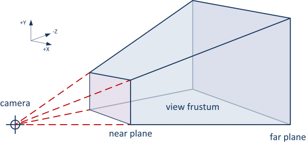
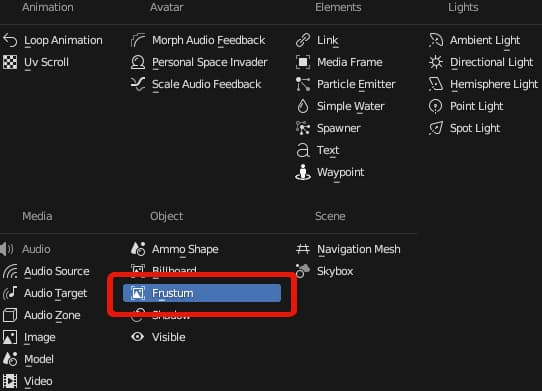
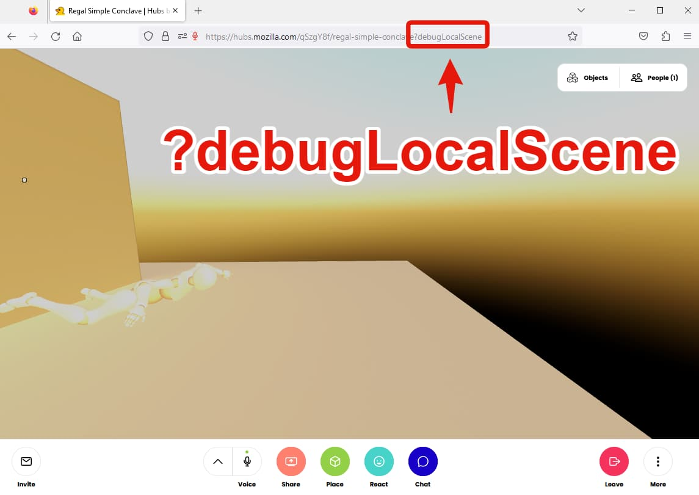

Have you ever had an animated model mysteriously disappear when viewed from different angles in Hubs? Take the famous star whale from the 2021 exhibit 'Road Gallery' below as an example.  Notice how looking in a different direction causes the whale to vanish.

0:00
/
1&#215;

The community favorite 'Star Whale' by [Roger Kenny](https://linktr.ee/kingotho) sadly suffered from this affliction, disappearing at different viewing angles.
Back when Roger Kenny created this awesome space, we didn't have an easy way for creators to address this problem in Hubs but now we do! This post will help you understand why we have this problem and how to fix it.

**What is Frustum Culling?**

Frustum culling is a technique used in 3D graphics to improve performance by only rendering objects that are visible on the screen. This is important for maintaining a smooth experience when there are many objects in the space.

Imagine you are looking through a camera lens. The visible area captured by the camera is shaped like a pyramid with the top chopped off. This shape is called the "view frustum."
Image Credit: [LearnOpengl.com](https://learnopengl.com/Guest-Articles/2021/Scene/Frustum-Culling)
Frustum culling works by checking if an object in the 3D scene is inside this view frustum. If it's inside, the object is visible and gets rendered. If it's outside, the object is not visible and doesn't get rendered. This saves computing resources and makes the rendering process faster.

In [Three.js](https://threejs.org/), the  3D graphics library for the web Hubs is built with, frustum culling is automatically handled to improve performance. The library takes care of determining which objects in a 3D scene are visible on the screen and only renders those visible objects. There are some specific cases in Hubs where we disable this feature but sometimes this can produce results we may not be looking for, like in some animated objects.

⚠️

This whole issue may eventually be [solved in three.js thanks to the help of its contributors](https://github.com/mrdoob/three.js/pull/25937). For now, the recommendation below is still valid as Hubs will have to update to newer versions of three before we can see if it fixes the issue outright. Thank to [vis_prime](https://twitter.com/vis_prime) for helping with research on skinned meshes and [pointing to some nice explainations](https://github.com/mrdoob/three.js/issues/14499#issuecomment-406008316) in the three.js community.

**How to Fix This in Hubs?**

Thanks to the efforts of Hubs community resident hero [rawnsley](https://github.com/MozillaReality/hubs-blender-exporter/pull/58) (AKA: Pellinore), we have a way to manually make adjustments to this performance optimization to fit our needs. Regardless of how many 'r's exist in the word 'frustum', the Hubs Blender add-on provides us a simple and effective way to disable this feature on select objects. You can [download the add-on here](https://github.com/MozillaReality/hubs-blender-exporter/releases) and install it [following the directions provided](https://github.com/MozillaReality/hubs-blender-exporter#to-install).

**Let's Fix it by Disabling Frustum Culling**

With the Hubs Blender Add-on installed, let's create a new scene using Christian's [Blender Starter Scene](__GHOST_URL__/hubs-starter-file-for-blender/) and add in a armature with skin from [Adobe's Maximo](https://www.mixamo.com/#/).

0:00
/
1&#215;

The model from [Maximo ](https://www.mixamo.com/#/?page=1&query=swimming)swims in an endless loop.

After dropping the model, [exporting to .glb](https://en.wikipedia.org/wiki/GlTF) and deploying it with Hubs, we notice right away that things are not going swimmingly.

0:00
/
1&#215;

Notice the model is disappearing as the camera moves

We need to disable frustum culling on the object by adding the frustum component. As you do this, reflect on the fact this component was contributed by community member Pellinore, and remind yourself to say a kind word to your favorite open-source maintainer. 😊

❗

Disabling frustum culling will have performance costs. Be wary dear reader and be sure to test in target devices.

0:00
/
1&#215;

Add the frustum culling component and disable culling
After adding our frustum culling component and exporting the glb, we reload our space using `?debugLocalScene` (Read more about this [time-saving method here](__GHOST_URL__/iterating-your-scenes-faster/)) and quickly preview the results.

With the query parameter set up, I can drop in the .glb file for a quick reload of the scene to test my changes.

0:00
/
1&#215;

WAIT A MINUTE! What happened? We still have parts disappearing.
You can see we only removed culling on the surface mesh and not the joints! Back to Blender to add the component to the joints as well!

0:00
/
1&#215;

Drag and drop the new .glb onto the scene with both parts no longer using frustum culling.
Little elbow grease on the joints and there we have it. No more disappearing models.

For more Mozilla Hubs updates Creator Labs content and announcements follow us on [Twitter](https://twitter.com/MozillaHubs), [LinkedIn](https://www.linkedin.com/showcase/mozilla-hubs/), or [Discord](https://discord.gg/sBMqSjCndj)
