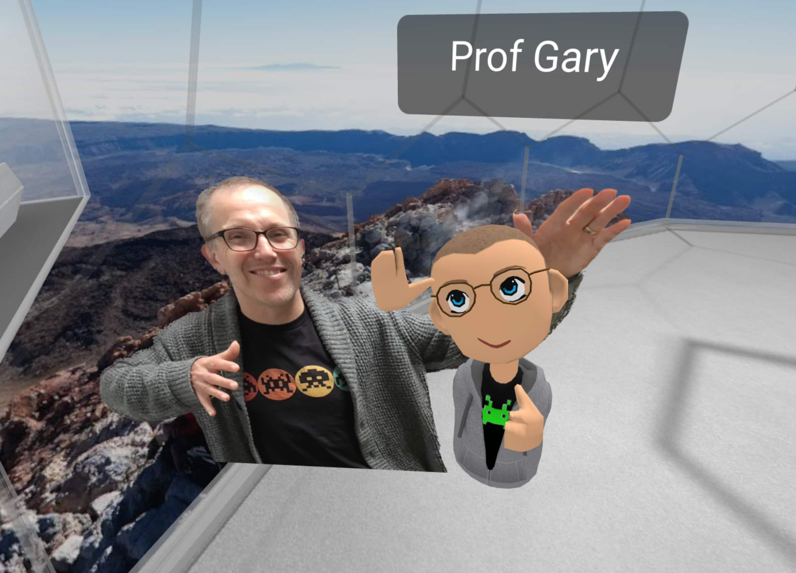
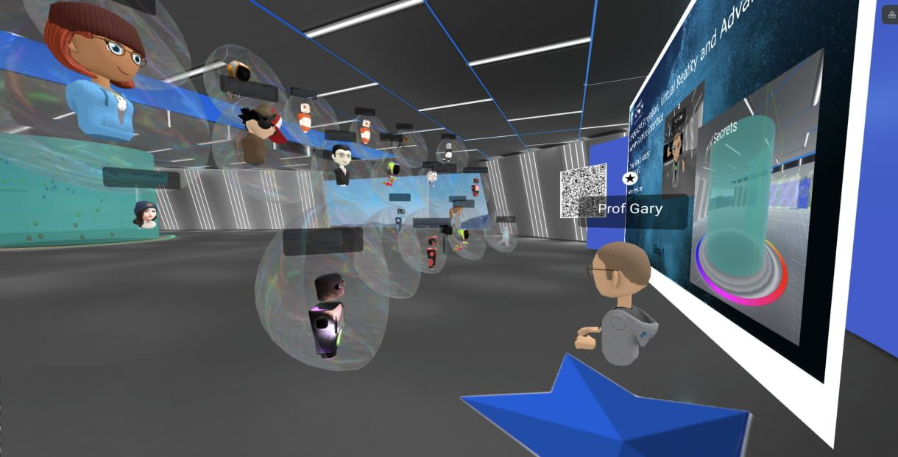
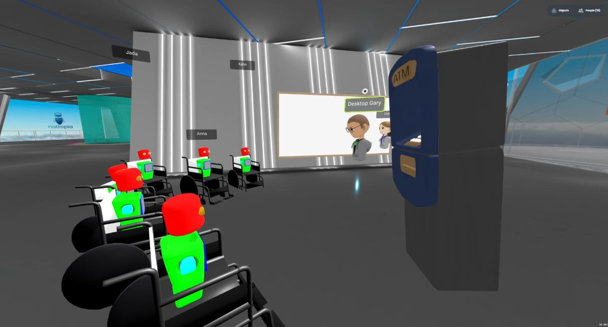
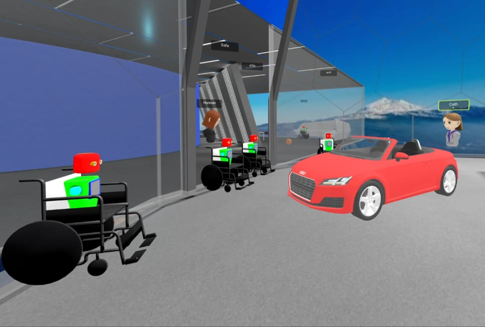
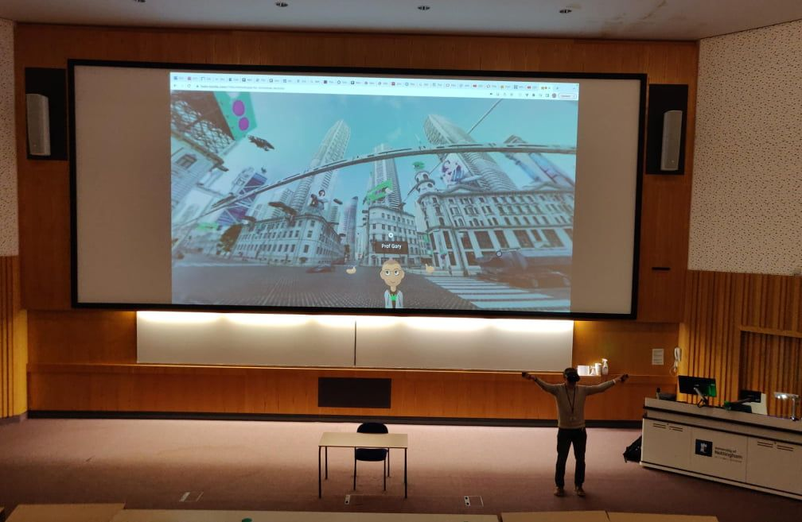

_This article is a Spotlight ✨ – part of a series of interviews with innovative Hubs creators highlighting their work. _

> Tell us about your project, the people involved and some of the people you have worked with.

I’m an academic in the Faculty of Engineering at the University of Nottingham, UK and am proud to say I have a lecture theatre like no other! In my teaching, I offer my students the opportunity to immerse themselves in the computer-generated worlds that they are studying - and explore/understand them from the inside out.

Over the last three years, around 300 undergraduate and postgraduate students have visited my virtual teaching island Nottopia throughout the semester, for interactive lectures, tutorials, and seminars exploring the human-centered design issues for VR and AR in engineering contexts.

The majority access the virtual world on the desktop, but increasing numbers routinely use headsets for the full immersive experience (around a quarter of the 123 students registered on last year’s course used headsets in class).

Unlike a conventional teaching setting, my students can also explore technology otherwise off-limits in the real world, for example, climbing inside a giant jet engine to examine its mechanisms or crowding into a driverless ‘robo-taxi’ to study advanced in-car interfaces and solve design problems.

Most importantly, my students are developing a deep understanding of what it means to design, build and then be immersed and interact in a virtual environment – new forms of digital literacy which are highly likely to be critical for their future careers.

> How did you leverage Hubs to achieve your goals?

Nottopia runs on Mozilla Hubs and has been the central virtual world (room) for student engagement. I have recorded lectures for my students from within Nottopia to cover core content, and have recently explored giving live lectures to students as avatars in the room but also watching as ‘ghosts’ via the lobby.

More interestingly though, I have leveraged the power of a social VR platform like Mozilla Hubs to engage my students in new and magical ways within weekly seminars, undertaking highly interactive and social activities such as treasure hunts, show-and-tells, ‘meet the expert’ discussions, design and empathy workshops, and virtual field trips.

In the above image, I'm giving a short lecture live in Nottopia in November 2022. In this lecture around 25 students were avatars in the room with me (several wearing headsets) and a further 70 or so watched the lecture as a livestream from the lobby (and could contribute via chat). The blue star on the ground represented a spot where sound permeated the whole space at an equal volume, regardless of where avatars were positioned (created using [Hubs audio zones](__GHOST_URL__/creating-speaker-stages-and-manipulating-audio-in-hubs/)). As such, my students and I used the star as a magical alternative to a microphone within a real space.

The image above shows a seminar I ran about the power of VR to provide empathy in which all my students adopted wheelchair avatars to change their perspective within a world (e.g. considering accessibility issues of reach and vision for an ATM).
How humans perceive space and depth within a virtual environment.
In the video above, I’m giving a pre-recorded lecture about how humans perceive space and depth within a virtual environment. Below I’m talking about the human-centered design issues for advanced human-machine interfaces in future vehicles.
Human-machine interfaces in future vehicles.
Together they demonstrate a couple of interesting things for conventional lectures given in the unconventional settings afforded by virtual worlds. Firstly, it is much easier to convey to your students some of the complex issues involved with immersive VR – e.g. what cues in a virtual world allow people to comprehend the space around them. Secondly, being a teacher immersed in VR can make the experience more interesting and engaging for you personally (I’m ‘living the dream’ teaching in the Bladerunner 2049 car!).

Note these two lectures were recorded back in 2020 when I preferred an avatar that looked a bit more like the real me!
Students taking on wise Jedi personas in the [Jedi Council](https://sketchfab.com/3d-models/jedi-council-baked-a0dcc01e19b24903a7a7fb00684eed8f)
In this seminar from 2022, we ‘visited’ the Jedi temple room (above) from Star Wars I built in Hubs - to discuss issues of fidelity and validity for VR simulations. Students were encouraged to take on the personas of ‘wise Jedi masters’ when discussing the nuanced relationships between these complex constructs. In contrast, for this seminar in 2020, students worked on the design of a future robo-taxi, considering how a user of a vehicle could interact with it without a human driver.
Designing future robot taxis on the immersive web.
In both cases, it has been evident from surveys/interviews, as well as observations that students can feel much more comfortable actively engaging in class as an avatar in these kinds of fantastical virtual worlds. As is clear in the Jedi temple clip, they also had a lot of fun – after all who doesn’t want to be a Jedi in class?!

> What are some unique features you have built in Hubs?

There have been several over the last three years, but I’m particularly proud of these three which I feel are novel and have considerable potential to enhance the experiences of my students:

- **Wheelchair avatars** - I found it really satisfying to create an avatar that could be used either on desktop or in VR and positioned the user closer to ground level.

- **Nottopia bubble** - Within my main virtual world was a door into a 360 image/video which I could change from week to contextualise learning, e.g. showing the student avatars (as the ultimate ‘class photo’) or a futuristic city when talking about future transport systems.

- **Tutor tent/Cylinder of Secrets** - It’s common practice to have ‘office hours’ for academics when students can ‘pop in’ and ask any questions/concerns they might have about course content, coursework, etc. What’s definitely not common is for that space to be a virtual one, so students can visit you from wherever they happen to be for a private conversation. In 2021, I utilised Mozilla’s audio zone capability to create a ‘tutor tent’ where sound would not leave or enter the tent space even if you could see avatars present. This was a very popular feature, as I would commonly have 20 students or so visiting me there between 4 and 6 on a Friday afternoon (unheard of for any of my real office open hours!). In 2022 this feature was developed further as the ‘cylinder of secrets’ concept, where students could use ‘fly’ mode to enter the cylinder and talk in confidence, not only with me, but also with each other.

My 360 bubble and the cylinder of secrets can both be seen within this short demo below of Nottopia used predominately in the teaching of 2022.

> How did you go about building features like these?

A mixture of approaches really. I use some models from [Sketchfab](https://sketchfab.com/), develop some assets in [Blender,](https://www.blender.org/) and use [Spoke ](https://hubs.mozilla.com/spoke)to bring it all together. I suspect I will use Blender more going forward to exploit the added functionality that the [Blender add-on provides now with Hubs](https://github.com/MozillaReality/hubs-blender-exporter/releases). The [Hubs discord channel](https://discord.gg/hubs-498741086295031808) is great for picking up tips and advice from others with way more expertise than I have. Moreover, there are some very useful videos on the [Hubs YouTube channel](https://www.youtube.com/@MozillaHubs) and, more recently tutorials on the [Hubs Creator Labs](__GHOST_URL__/tag/tutorials/) that I’ve followed successfully.

> What are some things you wish you knew before working with Hubs?

When I first started working with Hubs in the summer of 2020, I was largely unaware of the range of design factors for a virtual world that can impact performance. As a result, various media (3D assets, videos, images) might be brought into the world, either by me or students, and suddenly negative things would happen (audio problems, poor frame rate, crashing etc.).

Since then, largely through watching Hubs videos and reading posts on the Discord channel I’ve developed considerably more understanding on the importance of scene optimisation, accounting for polygon counts, texture sizes, file size, etc. – [writing an article for the Conversation](https://theconversation.com/bringing-the-metaverse-to-life-how-i-built-a-virtual-reality-for-my-students-and-what-ive-learnt-along-the-way-171760) about these issues.

> What would you love to see in Hubs that would enable you to better support your students?

From an educator's perspective, five enhancements that would really help me (especially as I seek to take my use of Metaverse teaching beyond just my module to impact on whole programmes/degrees):

- Improve room capacity (many modules in universities have 100+ students and splitting them up to run lots of sessions or live streaming to lobby isn't ideal (actually a deal breaker for many of my colleagues)

- An enhanced/magical whiteboard app with sticky notes you can bring into worlds would be really REALLY useful for many sessions!

- Access to a keyboard in VR without having to leave the room! Typing is just so useful/natural for students but in a headset isn't really an option. In fact, many of my headset users told me their biggest negative for the use of Hubs when immersed was an inability to take notes during classes.

- Avatar facial tracking - I've noticed communication is definitely more efficient between headset users c.f. desktop users, but there are still a range of missing cues which can limit students' learning. New headsets will increasingly have these sensors so a range of avatars that exploit this would be very useful.

- Integrated avatar creation into preferences (e.g. for the Hackweek avatar creator which many of my students really love) would also help a lot. At the moment, asking students to go to a separate 3rd party app/website often means many end up choosing from defaults rather than actively designing).

> Any quantitative data can you share with the community?

As this is clearly a novel use of VR in the Higher Education sector, I’ve treated these last three years as a research project and have collected considerable data now from my students (over 100 students have completed questionnaires; 20 have been interviewed in-depth; and there are over 60 hours of video data from observed seminars). Academic papers in conferences and journals are emerging all the time and this short presentation below summarises some of the key early learning on the student experience.

> Anything else you would like to tell us about or share with the Hubs community?

If you want to find out more you can reach me on [Linkedin ](https://www.linkedin.com/in/gary-burnett-53146399/)- where I post commonly about the research I’m doing on the use of social VR in Higher Education.

> Thank you so much Gary for your work pioneering on the immersive web and answering all of our questions!

For more Mozilla Hubs updates Creator Labs content and announcements follow us on [Twitter](https://twitter.com/MozillaHubs), [LinkedIn](https://www.linkedin.com/showcase/mozilla-hubs/), or in [Discord](https://discord.gg/sBMqSjCndj)
