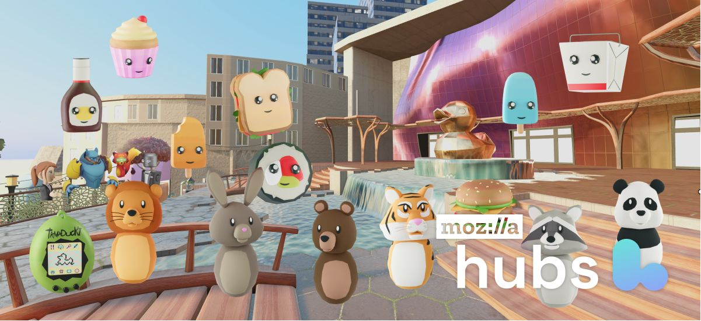

We're excited to announce the launch of our new 'Starter Plan'!

'Starter' is a new free tier of our managed subscription service, designed to give you more control, agency, and ownership over your immersive web experiences. Our mission has always been to make immersive web technology accessible to everyone and champion the open web. The introduction of the Starter Plan is a monumental milestone on this journey, granting free access and control over our innovative, open-source platform to users worldwide.

Last November, [we launched our Early Access subscription service](__GHOST_URL__/mozilla-hubs-early-access-release/), a robust solution that was simpler and more cost-effective than a Hubs Cloud instance. This was a huge leap forward, but we knew we could do more to extend the benefits of 3d web social spaces to a broader audience.

Here's what you get with the Starter Plan:

- **No Geographic Restrictions: **Break free from limitations and connect with users worldwide.
- **Cost:** Free! Experience the power of Hubs without breaking the bank.
- **CCU:** Accommodate up to 10 concurrent users for seamless collaboration.
- **Total Storage:** Enjoy 500 MB of storage to house your[ spaces and avatars](https://hubs.mozilla.com/docs/setup-configuring-content.html).
- **Spoke Access:** Take the reins and create your own immersive spaces.
- **Avatar Management:** Customize and control your virtual identity, reflecting your unique style.
- **Scene Management:** Unleash your creativity by creating, storing, and managing immersive environments.
- **Account Management:** Safely manage your user identity and credentials through our secure admin panel.

💡

What Happens to Early Access Subscriptions?
If you're currently subscribed to our Early Access plan, now is the perfect time to hold onto it or consider purchasing one for greater capacity. We're preparing to roll out more advanced paid plans with enhanced functionality and expanded capacity. As a token of appreciation for being early adopters, those with Early Access subscriptions will enjoy the same price regardless of any pricing changes.

We invite each and every one of you to embark on this exciting journey with the Starter Plan, where you'll experience the freedom and potential of immersive technology made accessible by Mozilla Hubs. We can't wait to witness how you leverage these powerful tools to create, collaborate, and connect with others in ways you've never imagined.

[Try the Starter Plan today](https://hubs.mozilla.com/#subscribe) and unlock a world of [possibilities](__GHOST_URL__/tag/inspiration-2/). Welcome to the future of virtual collaboration with Mozilla Hubs!
