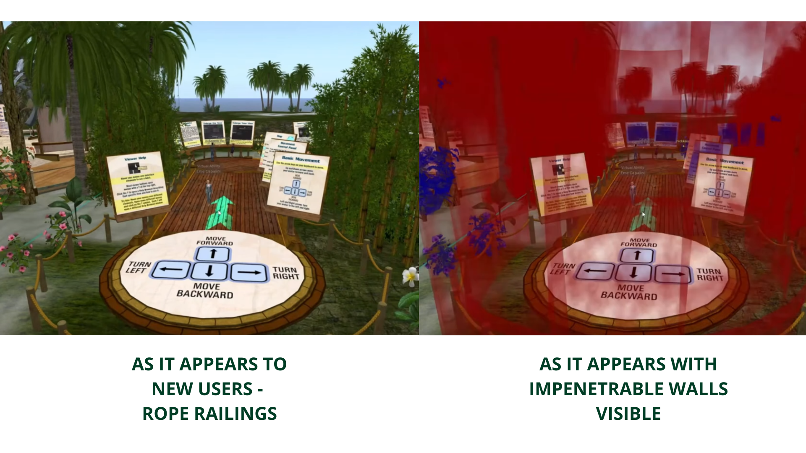
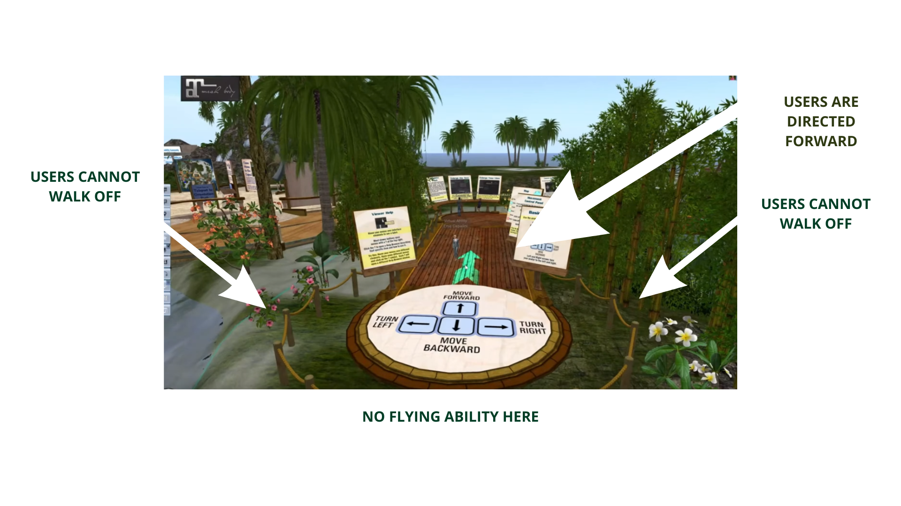
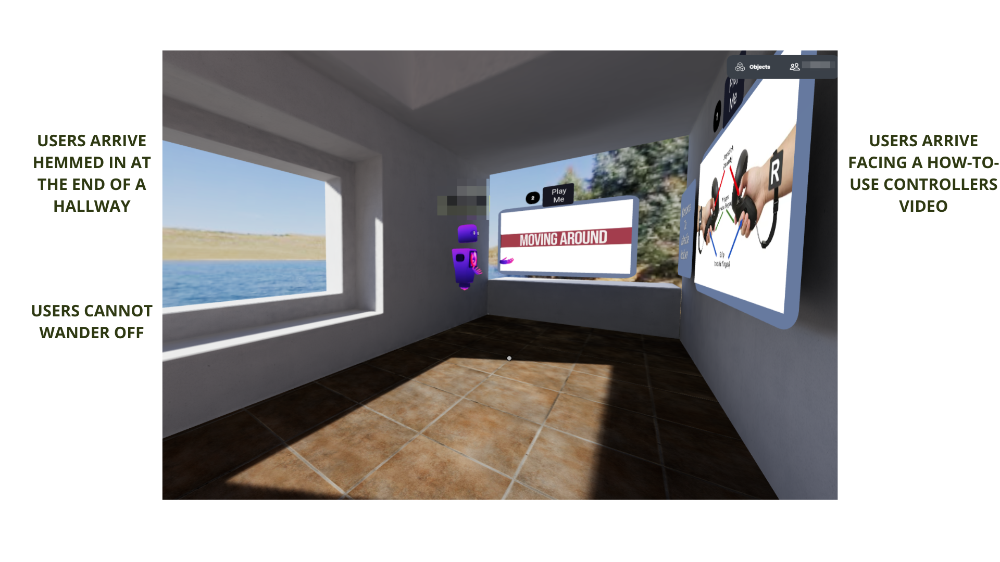
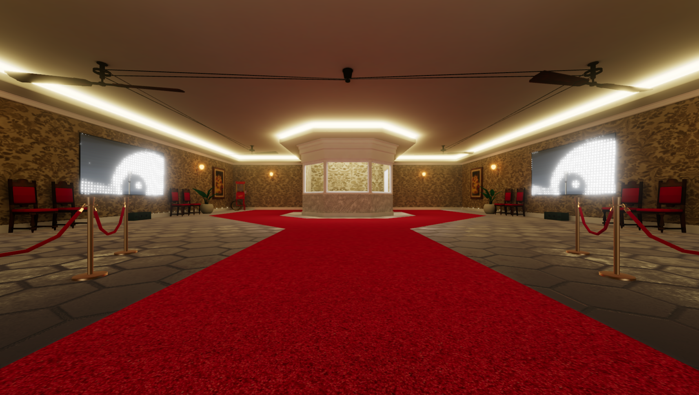
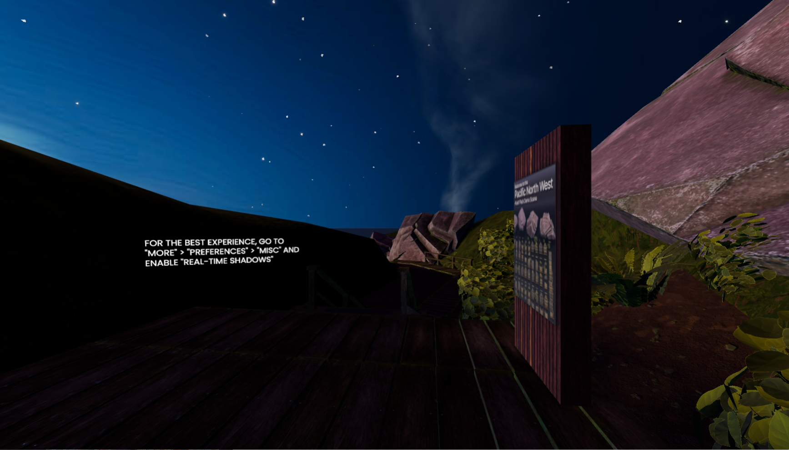

You've invited your friend to visit your immersive web space. They say yes but they’ve never been into the immersive web before. They arrive at your world and by accident press and hold the W key until they’ve walked right past you. They walk right off the platform. You are stunned! In the next few minutes, you try to explain that _that_ wasn’t the first experience you had planned for them.

When designing immersive web experiences, arrival at a welcome space is part of your first impression. This could last as little as a few seconds to a few minutes. It is where the lights come up on the scene and the user is invited to begin defining who they are and what role they will play in the space. This article will illustrate how the purposeful design of that first space sets the scene for your users.

## Story time!

### Settle down. Have a s'more.

Let's begin with a story because humans love stories. Stories have a beginning, a middle, and an end. The traditional narrative storytelling arc describes a story's flow starting with the introduction, setting the scene, then a dilemma occurs, then a crisis demands action, the action creates change, and the change ripples out to a larger resolution.

Here is the storytelling arc of Cinderella, from [Kurt Vonnegut](https://youtu.be/1rMnzNZkIX0) :

Introduction - Awful life. Evil sisters.

Set the scene - Gets ball invite. Makes clothes.

Dilemma - Goes to ball and dances with prince.

Crisis - Oh no, she has to go!

Change - Back to same awful life. Not as sad as before.

Resolution - Prince finds her. They live happily ever after.

This article focuses on Introduction and Set the scene which are the first impressions in immersive web experiences.

The Introduction often starts when your user has their first glimpse of your space. Think of it as the outside of the game box or the advertisement in the store. In Hubs, your introduction starts with **the scene preview**. Alternatively, you might describe your space to others before they arrive.
Your story starts here before your users enter. In Spoke, these are project template images are previews of the space.
Usually visitors have some idea of where they are going into the experience, because they made the choice to! So typically, the Introduction step is complete* before* the user arrives at lights up...err...browser loading up on your scene.

## Setting the Scene

### You've been invited. Now, what to wear...

I can hear you telling me: "The point in virtual reality is _to NOT recreate reality_." Yet, this article advocates that welcome spaces should start users where they are comfortable and where the user can figure out who they are meant to be. For example, rooms have floors and walls. Most humans have experienced rooms, so they know how to walk about and look around. Outside spaces have dirt and sky. Same idea; humans have experienced the outdoors before, so they know what to expect. Few users have floated in outer space so arriving in a zero-gravity situation could be disorienting and difficult.

The space should act like how our brains would predict. Users in welcome or Set the Scene spaces will learn to walk around, communicate, and perhaps change their avatar.

❓

Wait, if we have all of the resources of the immersive web available, why should we replicate reality? That sounds boring.

I understand your point. I'm focusing on the first 30 seconds to 3 minutes for **brand new users**. If you make them feel comfortable for this brief time, they will soon be comfortable flying. Bonus points: In a highly accessible platform like Hubs, a new user tends to be a new user _for only a brief time_.

You will want to make a space that gives the user **the emotions** that you want the user to have. [Omer Perry](https://uxplanet.org/physical-spaces-in-virtual-realities-cf11e9205f20) explains, “Respecting the user’s physical space is an integral part of keeping experiences authentic and immersive in augmented reality.”

When you are thinking of making an immersive web space, you probably already have exciting ideas for what your users will do in the space or how you want the space to make them feel. That's great! But what if you don't?

🗝️

Think about what emotions you want your users to have.

Emotions?? What?

Yes, emotions are the center of the design. Emotions transcend language and can be communicated very well in immersive web spaces via **colors** (bright versus dark), **line**, **form, volume**, & **motion **(material properties), **spaces** (open versus closed), **audio**, **touch** (**haptics), **and**[proprioception](https://youtu.be/4o__z7aPlMw?t=179)** (sense of body awareness). I'll leave smell and taste for another time. Further emotions can be communicated by expected behaviors (walk, talk, change avatar). So by focusing on emotions, your welcome space can foster the emotion you want out of your user even if their sound doesn't work or they don't read your text.

I'll pause there for emphasis.

❗

Designing for emotion first overcomes sound and text problems.

Ever had sound and text problems in the immersive web? Yeah, me too...1000 times, actually. So putting emotion first helps your space overcome those hurdles. Additionally, it helps welcome your users even when you are not there– so the right emotional design welcomes solo users and users that arrive at unplanned times. Are you catching the theme here? We keep designing for more and more different but possible users, which means more people enjoying your build; that's the point.

## A failed story, rebuilt

### I hope you know the movie Monsters, Inc.

Mini-story here. [Pete Docter, the director of Inside Out, explains](https://www.khanacademy.org/humanities/hass-storytelling/storytelling-pixar-in-a-box/ah-piab-we-are-all-storytellers/v/storytelling-introb) the art of deciding on what experience or emotion that you want your user to have. When he was working on the plot of the movie Monsters, Inc., he initially pitched an idea of monsters going to work in a factory and having normal lives. It was funny to Pete because it was monsters...who are scary...having boring lives. Get the twist? But this idea wasn't attractive to the audience. His initial storytelling arc failed.

He went back to a beginner piece of advice and looked deeper at the emotions within the story of Monsters, Inc.

“One of the things you hear all of the time is write what you know. Now as a kid, I was like, I don’t want to write about suburban Minnesota, that’s boring. I want to write about explosions and monsters and car chases. Well, what that actually means is, go ahead and write about monsters and explosions and car chases, but put something into it that talks about your own life, **how you feel…. Something from your own life will make that story come alive** and not just be a boring car chase… Why write about what you know? Well it’s because probably what happened made you feel some particular way and **what you are trying to do** when you tell a story,** is to get the audience to have the same feeling.**"

🎥

Pete rewrote Monsters, Inc. as the story of a man becoming a father.

That is the story that resonated with the audience; goofy adolescents can grow into great parents. The audience loved it because it was about themselves.

The Monsters, Inc. story is analogous to immersive web designs because with all of the possible creativity of the immersive web (and I have seen some very technical builds), it is possible that your first thought about the experience for your users will not resonate with them. You may have missed the emotion in your design. As such, it will not matter what the space does or looks like, your user will not resonate with it and they will not come back.

🗝️

Users can detect when an experience is **not authentic**, even if it is virtual.

Your welcome spaces should contain a design that supports the emotions you want your user to have at the start of the experience. Is it scary? Is it happy? Sad, explorative, relaxed, excited, curious...?

What if you have not yet determined what emotional feeling that you want your users to have? What if you are more interested in designing _the space_ than focusing on the user experience (UX)? What if you feel that the welcome space is…obvious?

It’s fine to begin with world-building as your focus rather than with a user focus. But when you have a prototype ready, you should have a user visit your immersive web space and ask them to “talk out loud” every thought they are having. If they arrive and are confused…and _you did not mean for them to be_…then you have designed some confusion into the welcome space.  Are they lost? Do they know what to do? If they do not do the first actions _you thought they would_, you have not designed a good welcome space.

## A word about edges

### Hang on to something. Virtually.

There are some technical guidelines for welcome spaces that I'm advocating for, particularly when it comes to edges. I advocate for railings.

😠

Not this "reality" railing things again! Users cannot fall off!

**Users do not know that they cannot fall off. They just got there.** They don't even know if they have feet or hands. Most of them want to know what their hair looks like before they want to walk.

In the welcome space, take care that your users know what is expected of them. If they are elevated or floating in the air, **add a railing.** If they are outdoors, **add a trail.** It's a little extra step to let your newbies know that they cannot inadvertently walk off a platform.

Virtual Ability is an organization that has welcomed and on-boarded users that use their feet, or use one finger, or use an on-screen keyboard, use eye-control, use Braille, and totally blind users. They have met a lot of new users that have a reason to walk off platforms. And yet, they took design steps to prevent it from happening. Alice Krueger, the President of Virtual Ability, gives tips about the design of virtual welcome spaces:

"To make the path safer for newcomers, because honestly, newcomers often have trouble controlling the movement of their avatars, Eme added invisible, impenetrable walls outside the rope borders. You can't wander off-course. And she's now made those invisible walls red, so that you can see them. Most of the time, they're not visible at all. So you feel like you're just walking along the ropes. And although you can fly in this world, you can't fly on this part, the beginning part of the path. Newcomers, we found, tend to get lost when they fly. So we just don't allow them to fly on the learning path, until they've received instructions on how to do so safely." (Quote at 7:10 used by permission. [Accessibility in a Virtual World](https://youtu.be/pdZm9S1EdJA?t=429). [Full transcript](https://www.youtube.com/redirect?event=video_description&redir_token=QUFFLUhqay1vRnZVbm5zWjV6TGdsWG9yTGJkYk9ENGpPUXxBQ3Jtc0tuNlNURU5DQjNJeFR1ZDVDd21nWWlYYllPMUxjcDZPTENkTGhEQ1FnZ0pxbnB3QVB4Q2xWYXp4WGtxLW9iVGZvVHFkNFpUc0Jxc2JUQTh2ZEk0N2sxY1NDR241Yk9GQkpLUTY5TWZYb183TW9FbEEzSQ&q=https%3A%2F%2Farchive.org%2Fdownload%2Fa11yvr27%2Fa11yvr27_TRANSCRIPT.pdf&v=pdZm9S1EdJA).)

If you truly want your space to be welcoming to as many users as possible, there seems to be little harm in utilizing edges in your welcome space.

## Examples! Or is it Samples?

### Take two, they're small.

As we look at these examples, we'll ask ourselves two Alice In Wonderland type of questions about our first impression of the scene: where to go and who are you. Follow the white rabbit and here we go!

## Virtual Ability Island in Second Life

Virtual Ability started in 2007 with the mission to enable people with a wide range of disabilities by providing a supporting environment for them to enter and thrive in online virtual worlds. This is their new user first impression; a circular space with a rope railing.
Invisible walls keep new users in a confined space.Users cannot walk off the welcome space except in one direction, forward.
**Where to go?** Only one direction, forward.

**Who are you?** A new resident of Second Life, learning about how to move forward, backward, and to turn left and right.

**Conclusion: **Very little room for confusion. Users have their introduction and the scene is set.

## NYU VR Orientation Space

New users arriving in VR headsets inside [the university laboratory space](__GHOST_URL__/bringing-learners-into-the-immersive-web-how-to-begin/) arrive at the end of a hallway, confined by 3 walls. They also arrive facing a how-to-use their VR controllers video.
Users are in headsets so learning the controls to walk must happen before they walk.
**Where to go? **Watching the videos seems first to do as those appear to give instructions how to move out of the end of this hallway.

**Who are you?** A cared-for newbie because what I need is placed right in front of me.

**Conclusion:** Little room for confusion. Main emotion is feeling supported.

## Classic Theater

User arrives at an entry way (behind us is just blank white space). Red carpet directs users up the stairs.
Really only one way to go, up the stairs!
**Where to go?** Up the stairs, I see a ticket booth up ahead!

**Who are you?** By the name "Theater" and the red carpet...I think I'm a theatergoer.

**Conclusion: **Very little room for confusion. Feels movie star-ish.

Bonus: The space uses red velvet ropes further on as another way of cordoning users.
Spot the red velvet cordones to the left and right, keeping the user moving straight ahead.

## Pacific Northwest (PNW) Demo Scene

Users arrive on a boardwalk in a dark outdoors scene. They are facing smoke lazily rising from a campfire in the distance. There are relevant instructions facing the user. The display on the right is of secondary importance, so it is not initially facing the user.
First impression: Pacific Northwest
Bonus: the scene contains a "sprite" that appears as a small streak of light that goes down the boardwalk as if to say "It's OK, walk out here."

**Where to go?** Down the boardwalk.

**Who are you?** I'm visiting a beach campfire at night.

**Conclusion:** Little room for confusion and wandering off, even if the scene is a little hard to see.

Now, let's look at some spaces that have _less_ guidance or direction.

## River Island

This is one of Hubs original scenes.
Everything here is recognizable. But the ground is bumpy.
This one is definitely more tricky. While it is a simple space, there is almost no guidance where to go and who you are. After some bumper car-style purposeful crashing, a user can figure out that the fences cannot be crossed but the water can.

Bonus: This is one of the scenes currently available to any Hubs builder in Spoke. And taking a peek under the hood shows us the possible Way Points where you can decide where you user arrives in the scene and what direction they are looking.

0:00
/
1&#215;

Extra bonus point: this scene is the same one you see in Hubs friendly advertising!
A chipper bunch of floaty avatars in a low poly country scene.
**Where to go? **Hmm...nothing is specifically beckoning.

**Who are you? **I guess I'm an explorer.

**Conclusion:** Beginners can use this space, but they will mostly be bumbling around. It might leave a user with the emotion "confused" but overall the confusion might not inflict much immersive web experience damage.

## [Apart Gallery](https://apartposters.com/)

Gasp! This is one of my favorite spaces to bring new Hubs users! How is going to fare under my first impression scrutiny?
Apart Gallery, June 2023
If a new user has never visited before, the "New wing this way" notification probably wouldn't direct them much. Users are at the end of a gallery and there appears to be a directory or map on the right side wall.

However, true disclosure: When I've conducted impromptu tours of the gallery, I've never known if there is a map space #1 to go to. I just get users to turn right and follow me through a small door.

0:00
/
1&#215;

**Where to go?** I guess free roaming is OK and technically the gallery I'm in has only 3 exit points if I play bumper cars trying to figure out where to go.
**Who are you?** While there is no avatar customization fun here, the space is giving the "art gallery" vibe very strongly, so no matter who I am, I am an art aficionado.

**Conclusion:** Possible confusion but with only 3 exits and the place is somewhat circular in pathway, users cannot really get lost. Still, I prefer this space for guided tours rather than free roaming. Non-new users could do free roaming, no problem.

##

Cloud Nine Beta

This scene was launched during the Hubs Artist-in-Residence (HAIR) Party which you can read more about [here](__GHOST_URL__/building-a-vr-world-from-scratch-a-beginners-journey-into-hubs/).
First impression: Cloud Nine Beta
This scene is [described](https://www.youtube.com/live/WmPWMTlxjog?feature=share&t=2939) as "a space for busy robots to come and hang out and relax from their busy lives" by partaking in sound baths. So the initial emotion that the scene is designed for is relaxation, which could be thought of as time when the user is not directed to do something specific.  Indeed, other than some patterns on the floor, there is no direction where to go first or what to do.

Here is an example of a space where the lack of guidance is actually the point. Completing this no-mission mission in XR is hard because, circling back to my first point, **humans love stories.** Stories have a beginning, middle, and an end. Users do like to be told what to do. The Cloud Nine Beta space has no obvious set beginning, middle or end and _that freedom to roam_ is just what the creator was hoping for.

However, think about that mission again: "for busy robots to come and hang out and relax." Look, we found the storytelling arc. Users are expected to be "busy robots" who are stressed (beginning), they can partake of the sound baths to hang out (middle), and they should finish or leave the experience not stressed (end). So even spaces that don't tell the user directly what to do can imply it by using tone (slipping into a robot avatar) & and sound.

**Where to go? **Anywhere, because this space allows for that.

**Who are you?** A robot seeking a sound bath.

**Conclusion:** Trickier to design - total freedom - but as long as it matches the emotion (be free) - it can work.

##

FAQs - beginner/designer technical questions

Bonus: When crafting this article, I asked Jim Conrad for the most frequent beginner **technical** questions.  So let's get some answers!

#### How big can the space be?

In theory, there's no limit. But from a design perspective, usually you don't want visitors to get lost or not be able to find one another.
Also, from a technical perspective, in 3d worlds, things get less and less accurate as you move farther away from the origin (0,0,0). If you're finding that you're moving things far away in order to mitigate sound, visuals, or some other element, you should probably consider putting some content in a linked room.

#### How many triangles can I use?

Triangle count is much less of an issue that too many/too large textures. Having said that, you're likely going to see performance drop when you start exceeding 250k triangles or so. But of course, this varies greatly with how things are laid out in the scene. Can you see all the triangles at once? That could be bad.

#### How many textures/materials can I use?

Spoke has some guidelines here. But every unique texture is an added draw call, so being efficient with textures sharing the same sheet (atlas) can be very helpful for performance. The largest scene I made has roughly 50-60 materials in it. Some of those materials contain multiple textures. But I tried to keep all the textures under 1024x1024--potentially a bigger deal than the number of textures.

#### What units should I use? (meters vs. imperial)

Use the metric system like the rest of the smart nations that adopted it years ago.

#### How big is an avatar?

Roughly 1.6 meters tall. But we don't limit you in this regard. Usually you want avatars to feel more equal in stature.
I believe the camera POV sits right at 1.6m off the ground.
FYI, an avatar's point of view camera gets created automatically between wherever the left and right eye bones are.

#### What are the maximum recommended design specs?

Polygon Count: 50,000 for mobile devices.

Unique Materials: No more than 25 to reduce draw calls on mobile devices

Textures: No more than 256MB of video RAM for mobile devices. Also, no textures larger than 2048 x 2048.

Lights: No more than 3, excluding ambient and hemisphere light for low end PCs.
File size: No more than 16MB for low bandwidth connections.

## Conclusion

So let's go back to the beginning. Humans love stories and stories have a beginning, middle, and an end.  Do your plans for your an immersive web space take your users through a story? Do they know where to go within 3 minutes of arriving? Do they know who they are in your space when embodied in an avatar? When you design for an emotion in your welcome space, there is much higher chance that your user will enjoy their experience and return.

Easter egg: There is one space on the Tour available from the Demo space that has railings galore!  Go out there and find it!

So. Many. Railings.

_For more Mozilla Hubs updates, Creator Labs content follow us on [Twitter](https://twitter.com/MozillaHubs), [LinkedIn](https://www.linkedin.com/showcase/mozilla-hubs/), or [Discord](https://discord.gg/sBMqSjCndj)._
