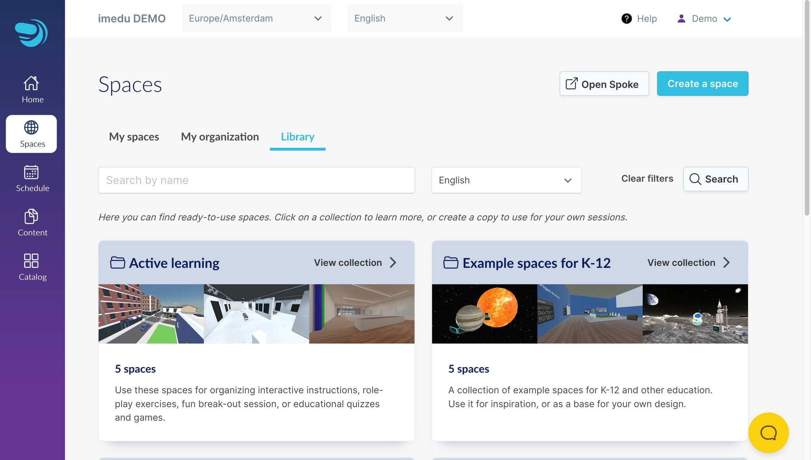
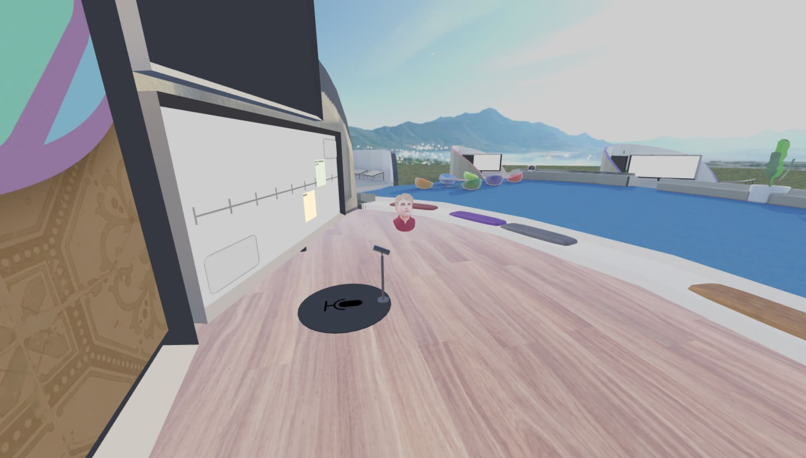
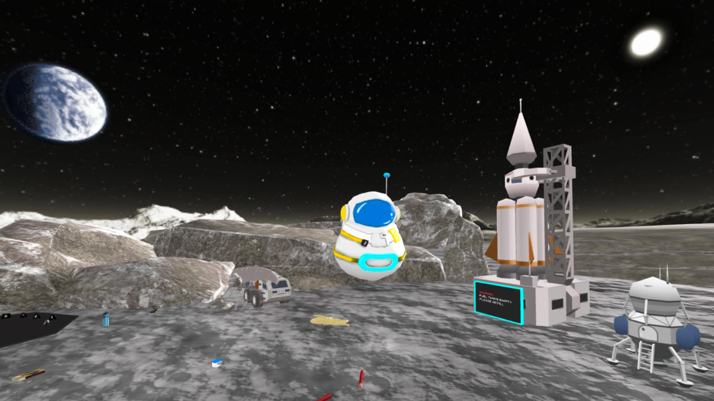
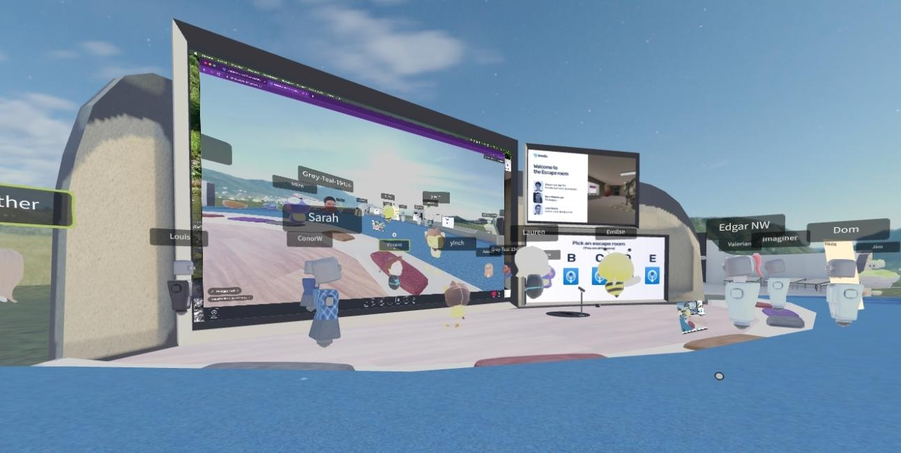

_This article is a Spotlight ✨ – part of a series of interviews with innovative Hubs creators highlighting their work. _

- We got to chat with [imedu.io](https://imedu.io/) founder _Vincent van den Tol_ about how he and his team have built a platform for educators on Hubs.\*

> Could you tell us about imedu?   What led to its creation and how does it help educators?

With imedu, we provide accessible and effective education and training in VR and virtual spaces. Our online platform offers schools, universities, and training organizations the ability to organize virtual soft-skills training, excursions, and online meetups in a privacy-respecting, 100% web-based environment.

Educators can create, organize, and share their virtual learning activities using our Virtual Learning Management system. Students can participate by invitation through a protected link that works on both VR headsets and laptops, making it easy for as many students as possible to join.
Create a space by coping a template from colleagues in your organization, or the shared library. You can also upload your own projects using Spoke.
We began during the coronavirus pandemic, seeking better ways to support remote learning and help organizations move past the early adoption phase. Although the urgency for remote learning has decreased, we see VR and virtual worlds are here to stay, and educators now have a much better idea of how to use them.
Our new outdoor training room with adjustable brainstorm templates on the white-board, post-it notes, presentation area, break-out spaces, and configurable text-cards for team activities.
The great thing about Hubs was that we could immediately start experimenting with teachers and schools. We were able to train educators and build missing parts in parallel, while being able to run everything in the browser and customize our own features. This was a game-changer for us and for schools. It allowed us to rapidly respond to educators' feedback without the need to work through IT departments or deal with VR headsets during the testing phase.

An earlier experience for K-12 where students needed to collaborate and discuss. by finding and ranking items to survice on the moon.

> What are some unique features you have built for imedu? How did you go about building them?

The most exciting feature we have developed is our recent game engine, which is connected to our own backend. This allows us to quickly set up simulations with interactive puzzles and timed events, such as animations and sounds. Educators can easily copy a "blueprint activity" in the backend application and only need to change the questions, scenarios, and solutions via a simple form.
Changing a puzzle’s solution in the backend. Here we set a new exit code for the door.
One of our first implementations is an escape room that can be solved in teams. In this room, you need to solve four puzzles by interacting with animated objects and screens. Each puzzle provides you with a code to open the door. The experience is completely synchronized, including animations and sounds so that you can work together seamlessly. The initial response has been great, and we are continuing to improve this and set up more examples, spaces, and scenarios.

0:00
/
1&#215;

Yinch, Imaginer, and Mira work together to solve a puzzle.
To help move virtual education beyond the early adopters: we integrated Hubs with our own Virtual Learning Management System. This backend application is built for teams & organizations and provides an environment to create, manage, and share spaces with colleagues. You can easily duplicate spaces, including all the settings and content that you might have added later, so you can create variations or copy spaces from colleagues. Finally, we allow you to set up more complex scenarios that consist of multiple rooms to spread students or support different "stages" in your activity.
Demo at the Hubs Community Meetup
We also added several smaller features in the UI, to help educators work more easily with content and students. These include pinning items directly to a media frame, a "virtual tablet" that guides students and transports them between rooms, cursor locking for trackpad users, using avatars from Ready Player Me, creating post-it notes, drag-and-drop CMS articles and quizzes, gathering all avatars in one location, and more.

> What would you love to see in Hubs that would enable you to better support your users?

**Controls Update**: The application's keyboard and mouse controls, particularly for rotating and handling objects, need an update. They are not intuitive for non-gamers or beginners, often leading to frustration and dropouts. A simplified control system, such as point-and-click and an inventory system for object handling, could make the interface more user-friendly.

**SSO Solution Integration**: Larger organizations require seamless integration with a backend or Single Sign-On (SSO) solution. The existing 'magic link email' option is not very flexible especially for K-12 students. Implementing a robust SSO solution could significantly expand Hubs' usage scenarios.

**Physics Realism**: The physics of the application could be improved for realism. For instance, objects should not be able to move through walls or disappear. This enhancement will add a level of believability that users expect from such applications, making the experience more engaging and immersive.

> Anything else you would like to tell us about or share with the Hubs community?

First of all: let’s spread the word! It may be a bit hard to realize for us as insiders, but a lot of people still don’t know about web-based VR and all it’s benefits. Most still think VR comes with expansive headsets, device management, software installations, and other headaches, and are really surprised when they learn about a platform like Hubs.

And finally: if you are interested in helping us and work with Hubs and VR in education or training, let me know via [Discord ](https://discord.gg/hubs-498741086295031808)(Vince#1123) or [follow our LinkedIn page](https://www.linkedin.com/company/imedu).

\*_✨ Thank you so much to_ Vincent* and the team at* imedu for sharing your work with us with this post. For more examples of Hubs in education see [Immersive Web Spaces for Higher Ed](__GHOST_URL__/immersive-web-spaces-in-higher-ed/).\*
