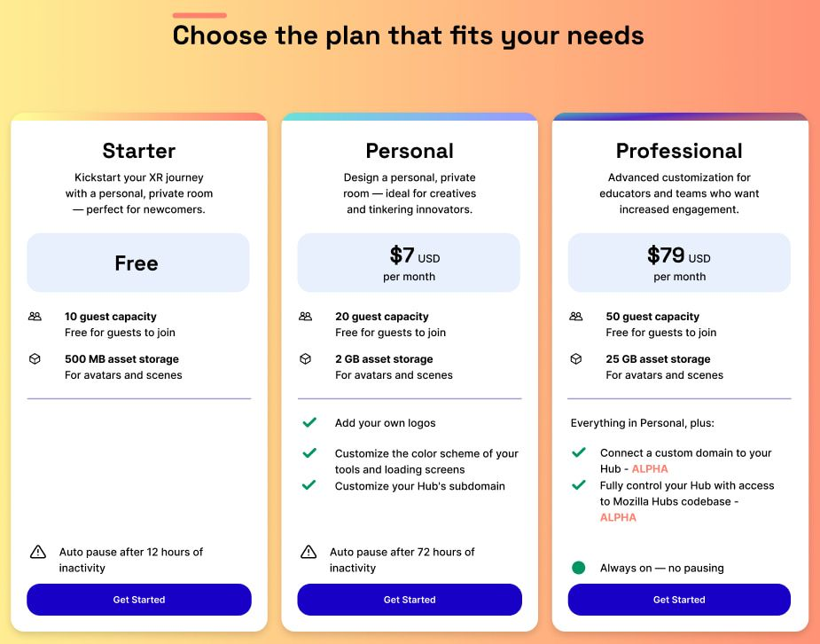

Today, we’re announcing some important and exciting updates about Mozilla Hubs and the options that educators and teams will have for building their own customized, private, and immersive experiences on the platform. Since the very beginning of the Hubs project, being able to provide options and flexibility for how the community uses Hubs has been a key priority for us, and over the past several months we’ve been working on a plan to make running Hubs on your own infrastructure easier. In parallel, we’ve also heard feedback about how we can make our subscription plans more tailored to the ways that you want to use Hubs, and we’re excited to share more about our newest offering with you today.

## Improving the Self-Hosted Hubs Experience

When we first started working on Hubs Cloud back in 2019, we wanted to make sure that there was a route forward for organizations who were looking to run Hubs on their own cloud infrastructure accounts. This made it possible for teams to stand up their own Hub on AWS, but there were limitations to the extent of customization that could happen in order to keep the product compatible with what we were running on hubs.mozilla.com. Since we launched Hubs Cloud over three years ago, we’ve made significant updates to the way that we build and deploy Hubs, but Hubs Cloud on AWS was not able to take advantage of these improvements.

With that in mind, we're transitioning away from our support of Hubs Cloud on AWS to something greater — a new version of the open-source Hubs codebase we're calling Community Edition! One of the significant advantages of this update is that we are no longer dependent on AWS as a cloud provider. Our updated Hubs stack can be built and run on any major cloud provider, and is no longer tied to AWS services. As a result, this allows developers to better customize Hubs to their needs, so you can run Hubs on your own hardware or bring Hubs to the cloud service of your choosing.

Many components of the Hubs platform on both the client and server-side have been open-sourced under the Mozilla Public License 2.0 since launch, but Hubs Cloud on AWS required us to keep some of our infrastructure orchestration private. With Hubs Community Edition, the full stack for Hubs will be available, which will offer far more control, customization, and autonomy for projects that are building on top of Hubs. In addition to providing a better developer experience, we see this an important step to democratizing Hubs as an open source project, and we’ll be better able to support contributions to the underlying infrastructure as an organization.

As a next step, we'll launch Hubs Community Edition by the end of summer and extend support for Hubs Cloud until January 2024. We’ll be releasing data migration tools over the coming months, so stay tuned.

Update: Community Edition is scheduled for release on October 16th, 2023.

## New Hubs Professional Plan and Region Expansion

Another key learning that we’ve had since launching Hubs Cloud is that not everyone wants to manage their own infrastructure for their virtual worlds. And, we get it, there’s a lot already to think about with room content, community growth and management, and setting up events! It was with this feedback in mind that we created a turn-key subscription service. Our Hubs subscription makes it easy for organizations and teams who want to focus on the content - and don’t need to make major changes to the platform - to get up and running in a matter of minutes.

Since launching our [Hubs subscription back in November](__GHOST_URL__/mozilla-hubs-early-access-release/), we’ve seen hundreds of new Hubs come online. Hubs continues to be one of the fastest ways for teams to get started with immersive worlds, but our first two subscriptions - our early access and free tiers - were limited in their ability to support larger organizations and full customization of the Hubs client. Today, we’re excited to announce our newest offering: [Hubs Professional Plan](https://hubs.mozilla.com/#subscribe).

The Hubs Professional Plan will provide more storage space and user capacity for those looking to create bigger virtual worlds, and also gives the ability to deploy Hub instances to custom domains. Additionally, users will have access to the underlying Hubs client code base and the ability to customize these clients. With this new subscription option, we’re aiming to enable a wider range of use cases for Hubs and better support the variety of ways that people are using the platform.
Supported Regions in Hubs

## Looking Ahead

We continue to see immense potential in building and delivering immersive virtual worlds through the browser. By giving our users a choice between full access to the Hubs platform, which will allow developers to fully run Hubs on any server or service, we see an opportunity to collaborate more extensively with our open source community. With our subscription service, we want to continue to iterate on the ways that we can make it easy to get the benefit of Hubs, regardless of the level of experience in developing and running online services. We see these changes as a step toward a future where virtual worlds are as diverse, creative, and user-driven as the people who inhabit them, and look forward to seeing what you create!

Questions? Please see our [live FAQ page](https://docs.google.com/document/u/1/d/e/2PACX-1vRvgCcyfFN4H8yBuW_FH-V8YumjGXoSfLQLZikMuiNZByz0oXpSLKvGrNDeEOpH0WHfx_BzmKwG7Yjb/pub).

[Try Professional](https://hubs.mozilla.com/#subscribe) and deploy your custom client to your own domain today.
